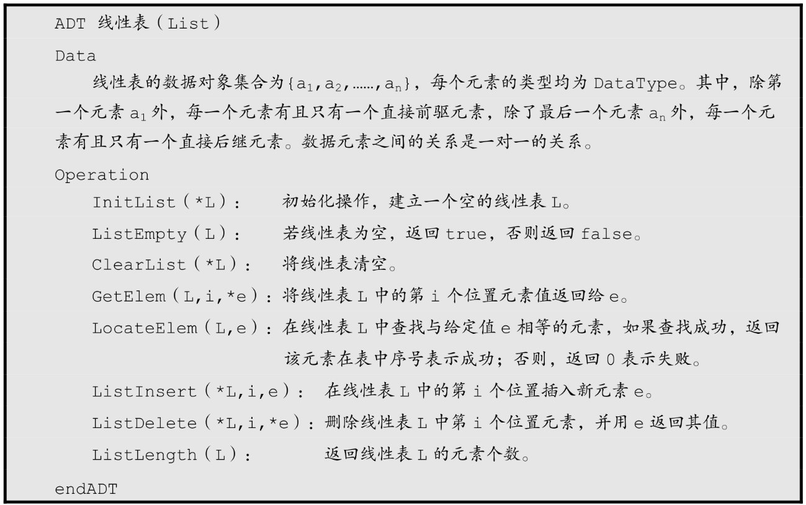
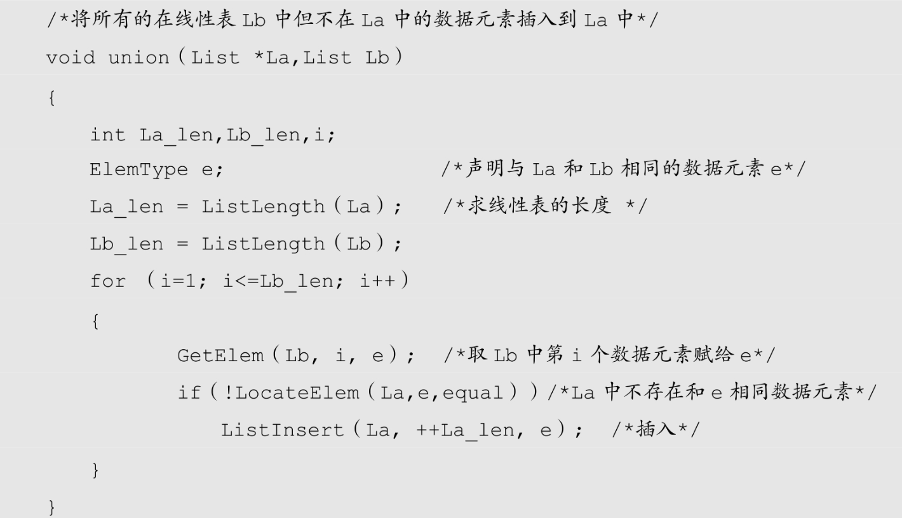

前面我们已经给了线性表的定义，现在我们来分析一下，线性表应该有一些什么样的操作呢？

还是回到刚才幼儿园小朋友的例子，老师为了让小朋友有秩序地出入，所以就考虑给他们排一个队，并且是长期使用的顺序，这个考虑和安排的过程其实就是一个线性表的创建和初始化过程。

一开始没经验，把小朋友排好队后，发现有的高有的矮，队伍很难看，于是就让小朋友解散重新排——这是一个线性表重置为空表的操作。

排好了队，我们随时可以叫出队伍某一位置的小朋友名字及他的具体情况。比如有家长问，队伍里第五个孩子，怎么这么调皮，他叫什么名字呀，老师可以很快告诉这位家长，这就是封清扬的儿子，叫封云卞。我在旁就非常扭捏，看来是我给儿子的名字没取好，儿子让班级“风云突变”了。这种可以根据位序得到数据元素也是一种很重要的线性表操作。

还有什么呢，有时我们想知道，某个小朋友，比如麦兜是否是班里的小朋友，老师会告诉我说，不是，麦兜在春田花花幼儿园里，不在我们幼儿园。这种查找某个元素是否存在的操作很常用。

而后有家长问老师，班里现在到底有多少个小朋友呀，这种获得线性表长度的问题也很普遍。

显然，对于一个幼儿园来说，加入一个新的小朋友到队列中，或因某个小朋友生病，需要移除某个位置，都是很正常的情况。对于一个线性表来说，插入数据和删除数据都是必须的操作。

所以，线性表的抽象数据类型定义如下：

对于不同的应用，线性表的基本操作是不同的，上述操作是最基本的，对于实际问题中涉及的关于线性表的更复杂操作，完全可以用这些基本操作的组合来实现。

比如，要实现两个线性表集合A和B的并集操作。即要使得集合A=A∪B。说白了，就是把存在集合B中但并不存在A中的数据元素插入到A中即可。

仔细分析一下这个操作，发现我们只要循环集合B中的每个元素，判断当前元素是否存在A中，若不存在，则插入到A中即可。思路应该是很容易想到的。

我们假设La表示集合A，Lb表示集合B，则实现的代码如下：

这里，我们对于union操作，用到了前面线性表基本操作 ListLength、GetElem、LocateElem、ListInsert等，可见，对于复杂的个性化的操作，其实就是把基本操作组合起来实现的。
