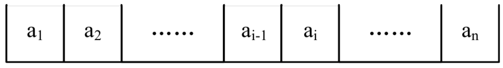
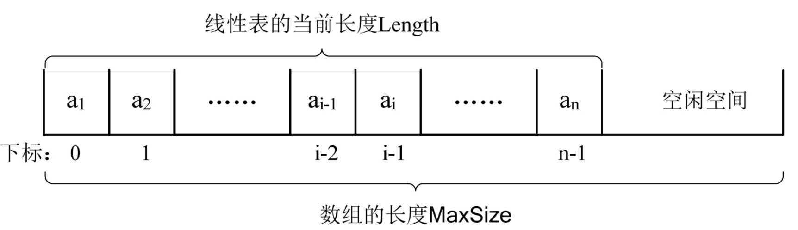
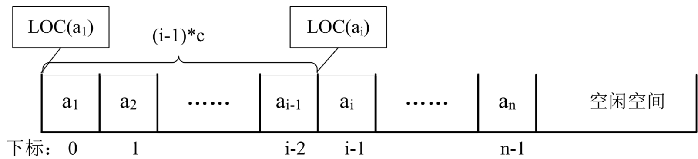

## 3.4.1　顺序存储定义

说这么多的线性表，我们来看看线性表的两种物理结构的第一种——顺序存储结构。

线性表的顺序存储结构，指的是用一段地址连续的存储单元依次存储线性表的数据元素。

线性表（a1,a2,……,an）的顺序存储示意图如下：



我们在第一课时已经讲过顺序存储结构。今天我再举一个例子。

记得大学时，我们同宿舍有一个同学，人特别老实、热心，我们时常会让他帮我们去图书馆占座，他总是答应，你想想，我们一个宿舍连他共有九个人，这其实明摆着是欺负人的事。他每次一吃完早饭就冲去图书馆，挑一个好地儿，把他书包里的书，一本一本地按座位放好，若书包里的书不够，他会把他的饭盒、水杯、水笔都用上，长长一排，九个座硬是被他占了，后来有一次因占座的事弄得差点都要打架。


## 3.4.2　顺序存储方式

线性表的顺序存储结构，说白了，和刚才的例子一样，就是在内存中找了块地儿，通过占位的形式，把一定内存空间给占了，然后把相同数据类型的数据元素依次存放在这块空地中。既然线性表的每个数据元素的类型都相同，所以可以用C语言（其他语言也相同）的一维数组来实现顺序存储结构，即把第一个数据元素存到数组下标为0的位置中，接着把线性表相邻的元素存储在数组中相邻的位置。

我那同学占座时，如果图书馆里空座很多，他当然不必一定要选择第一排第一个位子，而是可以选择风水不错、美女较多的地儿。找到后，放一个书包在第一个位置，就表示从这开始，这地方暂时归我了。为了建立一个线性表，要在内存中找一块地，于是这块地的第一个位置就非常关键，它是存储空间的起始位置。

接着，因为我们一共九个人，所以他需要占九个座。线性表中，我们估算这个线性表的最大存储容量，建立一个数组，数组的长度就是这个最大存储容量。

可现实中，我们宿舍总有那么几个不是很好学的人，为了游戏，为了恋爱，就不去图书馆自习了。假设我们九个人，去了六个，真正被使用的座位也就只是六个，另三个是空的。同样的，我们已经有了起始的位置，也有了最大的容量，于是我们可以在里面增加数据了。随着数据的插入，我们线性表的长度开始变大，不过线性表的当前长度不能超过存储容量，即数组的长度。想想也是，如果我们有十个人，只占了九个座，自然是坐不下的。

来看线性表的顺序存储的结构代码。

```c++
    #define MAXSIZE 20          /*存储空间初始分配量*/
    typedef int ElemType;       /*ElemType类型根据实际情况而定，这里假设为int*/
    typedef struct
    {
        ElemType data[MAXSIZE];       /*数组存储数据元素，最大值为MAXSIZE*/
        int length;                   /*线性表当前长度*/
    }SqList;
```

这里，我们就发现描述顺序存储结构需要三个属性：

- 存储空间的起始位置：数组data，它的存储位置就是存储空间的存储位置。
- 线性表的最大存储容量：数组长度MaxSize。
- 线性表的当前长度：length。

## 3.4.3　数组长度与线性表长度区别

注意哦，这里有两个概念“数组的长度”和“线性表的长度”需要区分一下。

数组的长度是存放线性表的存储空间的长度，存储分配后这个量是一般是不变的。有个别同学可能会问，数组的大小一定不可以变吗？我怎么看到有书中谈到可以动态分配的一维数组。是的，一般高级语言，比如C、VB、C++都可以用编程手段实现动态分配数组，不过这会带来性能上的损耗。

线性表的长度是线性表中数据元素的个数，随着线性表插入和删除操作的进行，这个量是变化的。

在任意时刻，线性表的长度应该小于等于数组的长度。

## 3.4.4　地址计算方法

由于我们数数都是从1开始数的，线性表的定义也不能免俗，起始也是1，可C语言中的数组却是从0开始第一个下标的，于是线性表的第i个元素是要存储在数组下标为i-1的位置，即数据元素的序号和存放它的数组下标之间存在对应关系（如图3-4-3所示）。



用数组存储顺序表意味着要分配固定长度的数组空间，由于线性表中可以进行插入和删除操作，因此分配的数组空间要大于等于当前线性表的长度。

其实，内存中的地址，就和图书馆或电影院里的座位一样，都是有编号的。存储器中的每个存储单元都有自己的编号，这个编号称为地址。当我们占座后，占座的第一个位置确定后，后面的位置都是可以计算的。试想一下，我是班级成绩第五名，我后面的10名同学成绩名次是多少呢？当然是6，7，…、15，因为5+1，5+2，…，5+10。由于每个数据元素，不管它是整型、实型还是字符型，它都是需要占用一定的存储单元空间的。假设占用的是c个存储单元，那么线性表中第i+1个数据元素的存储位置和第i个数据元素的存储位置满足下列关系（LOC表示获得存储位置的函数）。

```
LOC(ai+1)=LOC(ai)+c
```

所以对于第i个数据元素ai的存储位置可以由a1推算得出：

```
LOC(ai)=LOC(a1)+(i-1)*c
```

从图3-4-4来理解：



通过这个公式，你可以随时算出线性表中任意位置的地址，不管它是第一个还是最后一个，都是相同的时间。那么我们对每个线性表位置的存入或者取出数据，对于计算机来说都是相等的时间，也就是一个常数，因此用我们算法中学到的时间复杂度的概念来说，它的存取时间性能为O(1)。我们通常把具有这一特点的存储结构称为随机存取结构。
