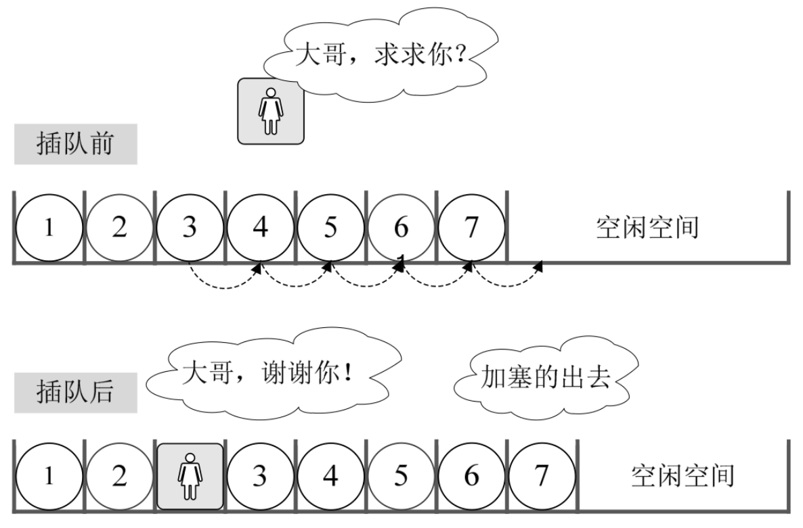
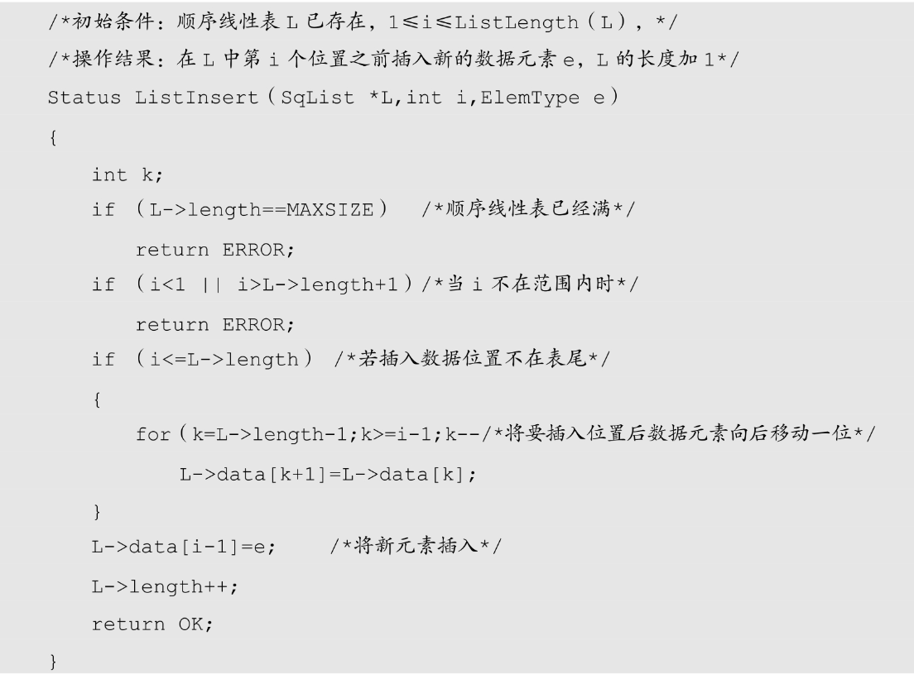
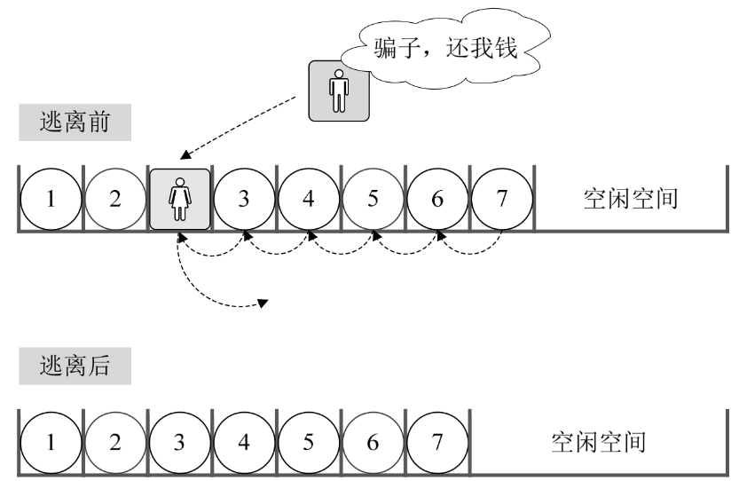
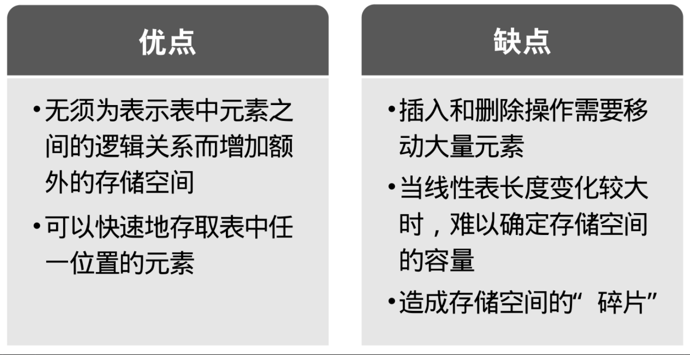

## 3.5.1　获得元素操作

对于线性表的顺序存储结构来说，如果我们要实现GetElem操作，即将线性表L中的第i个位置元素值返回，其实是非常简单的。就程序而言，只要i的数值在数组下标范围内，就是把数组第i－1下标的值返回即可。来看代码：

```c++
    #define OK 1
    #define ERROR 0
    #define TRUE 1
    #define FALSE 0
    typedef int Status;
    /*Status是函数的类型，其值是函数结果状态代码，如OK等*/
    /*初始条件：顺序线性表L已存在，1≤i≤ListLength（L）*/
    /*操作结果：用e返回L中第i个数据元素的值*/
    Status GetElem（SqList L,int i,ElemType *e）
    {
         if（L.length==0 || i<1 || i>L.length）
             return ERROR;
        *e=L.data[i-1];
        return OK;
    }
```

注意这里返回值类型Status是一个整型，返回OK代表1，ERROR代表0。之后代码中出现就不再详述。

## 3.5.2　插入操作

刚才我们也谈到，这里的时间复杂度为O(1)。我们现在来考虑，如果我们要实现ListInsert（*L,i,e），即在线性表L中的第i个位置插入新元素e，应该如何操作？

举个例子，本来我们在春运时去买火车票，大家都排队排的好好的。这时来了一个美女，对着队伍中排在第三位的你说，“大哥，求求你帮帮忙，我家母亲有病，我得急着回去看她，这队伍这么长，你可否让我排在你的前面？”你心一软，就同意了。这时，你必须得退后一步，否则她是没法进到队伍来的。这可不得了，后面的人像蠕虫一样，全部都得退一步。骂起四声。但后面的人也不清楚这加塞是怎么回事，没什么办法。



插入算法的思路：

- 如果插入位置不合理，抛出异常；
- 如果线性表长度大于等于数组长度，则抛出异常或动态增加容量；
- 从最后一个元素开始向前遍历到第i个位置，分别将它们都向后移动一个位置；
- 将要插入元素填入位置i处；
- 表长加1。

实现代码如下：



应该说这代码不难理解。如果是以前学习其他语言的同学，可以考虑把它转换成你熟悉的语言再实现一遍，只要思路相同就可以了。

## 3.5.3　删除操作

接着刚才的例子。此时后面排队的人群意见都很大，都说怎么可以这样，不管什么原因，插队就是不行，有本事，找火车站开后门去。就在这时，远处跑来一胖子，对着这美女喊，可找到你了，你这骗子，还我钱。只见这女子二话不说，突然就冲出了队伍，胖子追在其后，消失在人群中。哦，原来她是倒卖火车票的黄牛，刚才还装可怜。于是排队的人群，又像蠕虫一样，均向前移动了一步，骂声渐息，队伍又恢复了平静。

这就是线性表的顺序存储结构删除元素的过程（如图3-5-2所示）。



删除算法的思路：

- 如果删除位置不合理，抛出异常；
- 取出删除元素；
- 从删除元素位置开始遍历到最后一个元素位置，分别将它们都向前移动一个位置；
- 表长减1。

```c++
    /*初始条件：顺序线性表L已存在，1≤i≤ListLength（L）*/
    /*操作结果：删除L的第i个数据元素，并用e返回其值，L的长度减1*/
    Status ListDelete（SqList *L,int i,ElemType *e）
    {
        int k;
        if （L->length==0）                /*线性表为空*/
           return ERROR;
        if （i<1 || i>L->length）          /*删除位置不正确*/
            return ERROR;
        *e=L->data[i-1];
        if （i<L->length）                 /*如果删除不是最后位置*/
        {
            for（k=i;k<L->length;k++）     /*将删除位置后继元素前移*/
               L->data[k-1]=L->data[k];
        }
        L->length--;
        return OK;
    }
```

现在我们来分析一下，插入和删除的时间复杂度。

先来看最好的情况，如果元素要插入到最后一个位置，或者删除最后一个元素，此时时间复杂度为O(1)，因为不需要移动元素的，就如同来了一个新人要正常排队，当然是排在最后，如果此时他又不想排了，那么他一个人离开就好了，不影响任何人。

最坏的情况呢，如果元素要插入到第一个位置或者删除第一个元素，此时时间复杂度是多少呢？那就意味着要移动所有的元素向后或者向前，所以这个时间复杂度为O(n)。

至于平均的情况，由于元素插入到第i个位置，或删除第i个元素，需要移动n－i个元素。根据概率原理，每个位置插入或删除元素的可能性是相同的，也就说位置靠前，移动元素多，位置靠后，移动元素少。最终平均移动次数和最中间的那个元素的移动次数相等，为 (n-1)/2。

我们前面讨论过时间复杂度的推导，可以得出，平均时间复杂度还是O(n)。

这说明什么？线性表的顺序存储结构，在存、读数据时，不管是哪个位置，时间复杂度都是O(1)；而插入或删除时，时间复杂度都是O(n)。这就说明，它比较适合元素个数不太变化，而更多是存取数据的应用。当然，它的优缺点还不只这些……

## 3.5.4　线性表顺序存储结构的优缺点



好了，大家休息一下，我们等会儿接着讲另一个存储结构。
