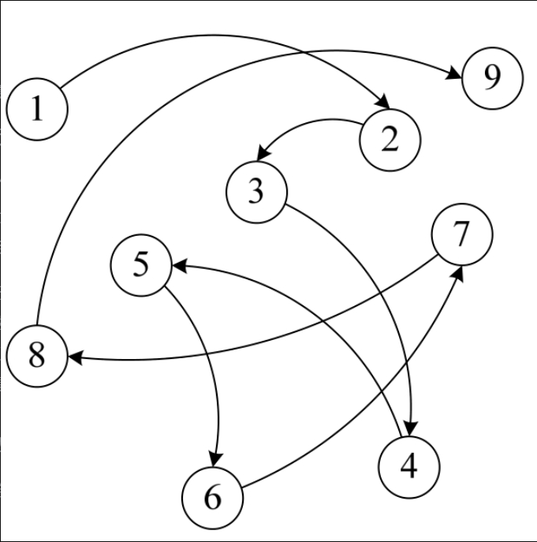
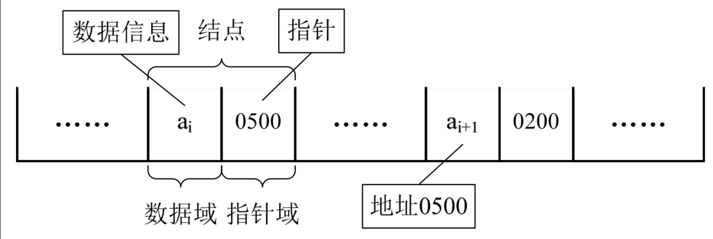
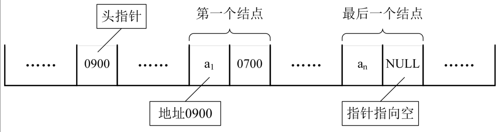
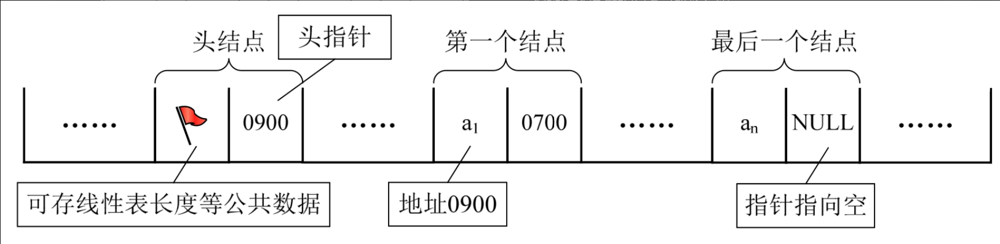
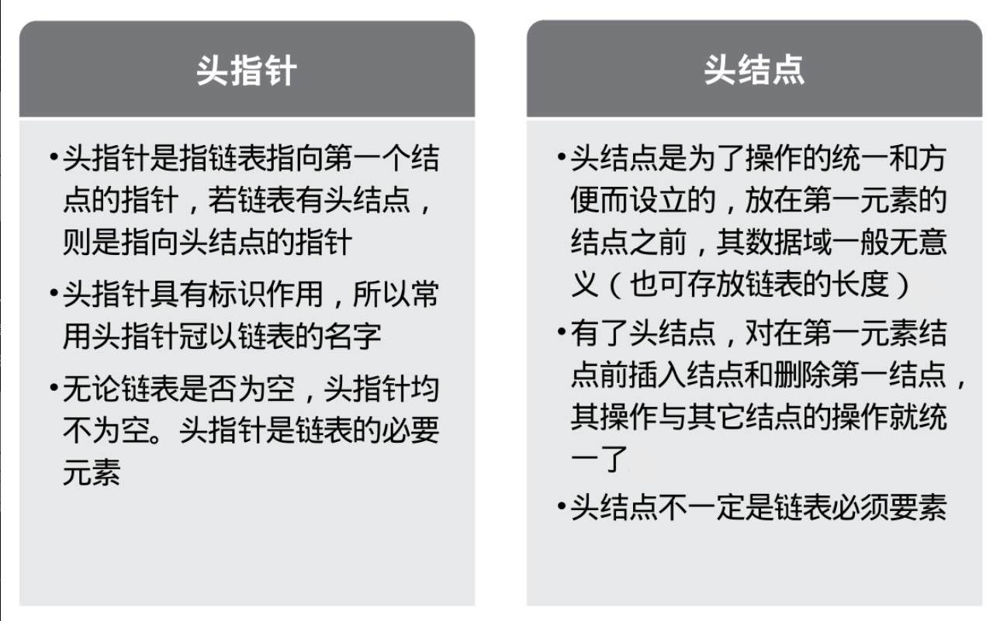
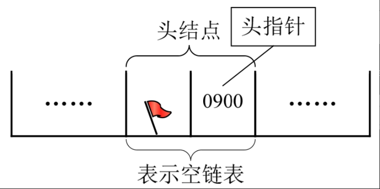
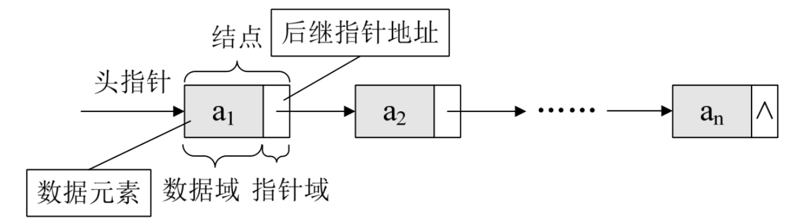
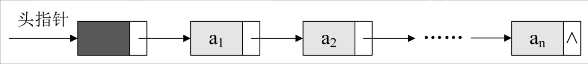
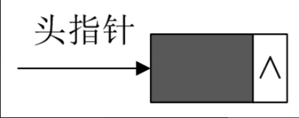
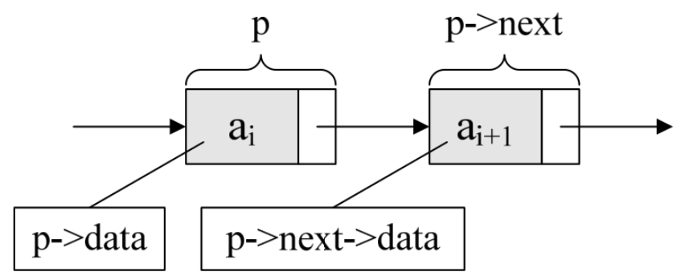

## 3.6.1　顺序存储结构不足的解决办法

前面我们讲的线性表的顺序存储结构。它是有缺点的，最大的缺点就是插入和删除时需要移动大量元素，这显然就需要耗费时间。能不能想办法解决呢？

要解决这个问题，我们就得考虑一下导致这个问题的原因。

为什么当插入和删除时，就要移动大量元素，仔细分析后，发现原因就在于相邻两元素的存储位置也具有邻居关系。它们编号是1，2，3，…，n，它们在内存中的位置也是挨着的，中间没有空隙，当然就无法快速介入，而删除后，当中就会留出空隙，自然需要弥补。问题就出在这里。

A同学思路：让当中每个元素之间都留有一个空位置，这样要插入时，就不至于移动。可一个空位置如何解决多个相同位置插入数据的问题呢？所以这个想法显然不行。

B同学思路：那就让当中每个元素之间都留足够多的位置，根据实际情况制定空隙大小，比如10个，这样插入时，就不需要移动了。万一10个空位用完了，再考虑移动使得每个位置之间都有10个空位置。如果删除，就直接删掉，把位置留空即可。这样似乎暂时解决了插入和删除的移动数据问题。可这对于超过10个同位置数据的插入，效率上还是存在问题。对于数据的遍历，也会因为空位置太多而造成判断时间上的浪费。而且显然这里空间复杂度还增加了，因为每个元素之间都有若干个空位置。

C同学思路：我们反正也是要让相邻元素间留有足够余地，那干脆所有的元素都不要考虑相邻位置了，哪有空位就到哪里，而只是让每个元素知道它下一个元素的位置在哪里，这样，我们可以在第一个元素时，就知道第二个元素的位置（内存地址），而找到它；在第二个元素时，再找到第三个元素的位置（内存地址）。这样所有的元素我们就都可以通过遍历而找到。

好！太棒了，这个想法非常好！C同学，你可惜生晚了几十年，不然，你的想法对于数据结构来讲就是划时代的意义。我们要的就是这个思路。

## 3.6.2　线性表链式存储结构定义

在解释这个思路之前，我们先来谈另一个话题。前几年，有一本书风靡了全世界，它叫《达·芬奇密码》，成为世界上最畅销的小说之一，书的内容集合了侦探、惊悚和阴谋论等多种风格，很好看。

我由于看的时间太过于久远，情节都忘记得差不多了，不过这本书和绝大部分侦探小说一样，都是同一种处理办法。那就是，作者不会让你事先知道整个过程的全部，而是在一步一步地到达某个环节，才根据现场的信息，获得或推断出下一步是什么，也就是说，每一步除了对侦破的信息进一步确认外（之前信息也不一定都是对的，有时就是证明某个信息不正确），还有就是对下一步如何操作或行动的指引。

不过，这个例子也不完全与线性表相符合。因为案件侦破的线索可能是错综复杂的，有点像我们之后要讲到的树和图的数据结构。今天我们要谈的是单线索，无分支的情况。即线性表的链式存储结构。

线性表的链式存储结构的特点是用一组任意的存储单元存储线性表的数据元素，这组存储单元可以是连续的，也可以是不连续的。这就意味着，这些数据元素可以存在内存未被占用的任意位置（如图3-6-1所示）。



以前在顺序结构中，每个数据元素只需要存数据元素信息就可以了。现在链式结构中，除了要存数据元素信息外，还要存储它的后继元素的存储地址。

因此，为了表示每个数据元素ai与其直接后继数据元素ai+1之间的逻辑关系，对数据元素ai来说，除了存储其本身的信息之外，还需存储一个指示其直接后继的信息（即直接后继的存储位置）。我们把存储数据元素信息的域称为数据域，把存储直接后继位置的域称为指针域。指针域中存储的信息称做指针或链。这两部分信息组成数据元素ai的存储映像，称为结点（Node）。

n个结点（ai的存储映像）链结成一个链表，即为线性表（a1，a2，…，an）的链式存储结构，因为此链表的每个结点中只包含一个指针域，所以叫做单链表。单链表正是通过每个结点的指针域将线性表的数据元素按其逻辑次序链接在一起，如图3-6-2所示。



对于线性表来说，总得有个头有个尾，链表也不例外。我们把链表中第一个结点的存储位置叫做头指针，那么整个链表的存取就必须是从头指针开始进行了。之后的每一个结点，其实就是上一个的后继指针指向的位置。想象一下，最后一个结点，它的指针指向哪里？

最后一个，当然就意味着直接后继不存在了，所以我们规定，线性链表的最后一个结点指针为“空”（通常用NULL或“^”符号表示，如图3-6-3所示）。



有时，我们为了更加方便地对链表进行操作，会在单链表的第一个结点前附设一个结点，称为头结点。头结点的数据域可以不存储任何信息，谁叫它是第一个呢，有这个特权。也可以存储如线性表的长度等附加信息，头结点的指针域存储指向第一个结点的指针，如图3-6-4所示。



## 3.6.3　头指针与头结点的异同

头指针与头结点的异同点，如图3-6-5所示。



## 3.6.4　线性表链式存储结构代码描述

若线性表为空表，则头结点的指针域为“空”，如图3-6-6所示。



这里我们大概地用图示表达了内存中单链表的存储状态。看着满图的省略号“……”，你就知道是多么不方便。而我们真正关心的：它是在内存中的实际位置吗？不是的，这只是它所表示的线性表中的数据元素及数据元素之间的逻辑关系。所以我们改用更方便的存储示意图来表示单链表，如图3-6-7所示。



若带有头结点的单链表，则如图3-6-8所示。



空链表如图3-6-9所示。



单链表中，我们在C语言中可用结构指针来描述。

```c++
    /*线性表的单链表存储结构*/
    typedef struct Node
    {
        ElemType data;
        struct Node *next;
    } Node;
    typedef struct Node *LinkList;  /*定义LinkList*/
```

从这个结构定义中，我们也就知道，结点由存放数据元素的数据域和存放后继结点地址的指针域组成。假设p是指向线性表第i个元素的指针，则该结点ai的数据域我们可以用p->data来表示，p->data的值是一个数据元素，结点ai的指针域可以用p->next来表示，p->next的值是一个指针。p->next指向谁呢？当然是指向第i+1个元素，即指向ai+1的指针。也就是说，如果p->data=ai，那么p->next->data=ai+1（如图3-6-10所示）。


