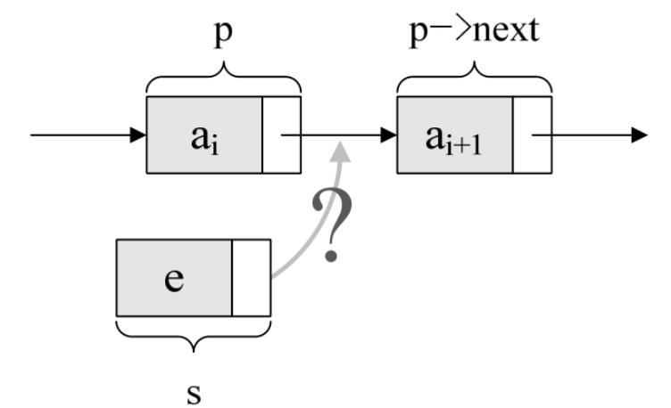
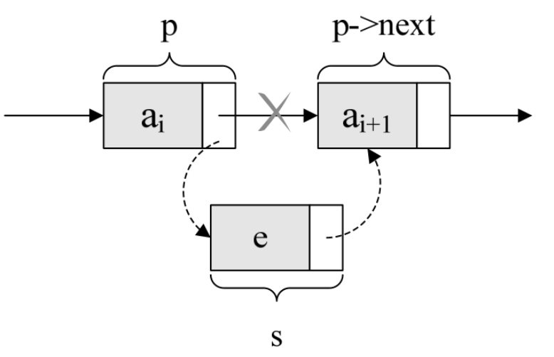
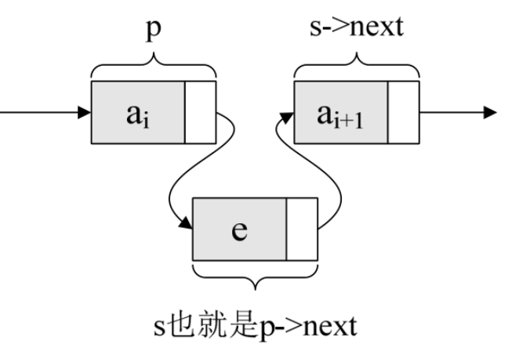
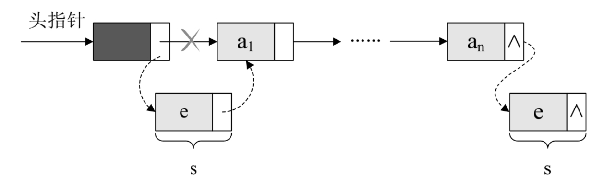
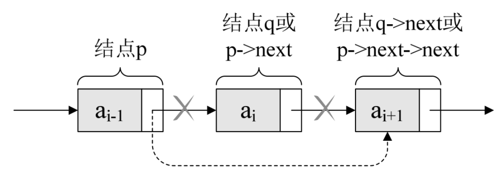
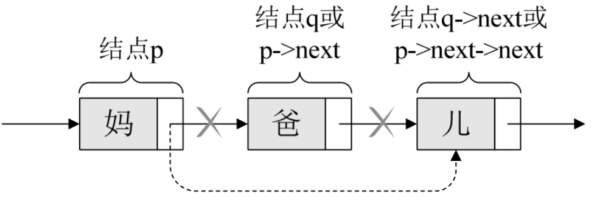

## 3.8.1　单链表的插入

先来看单链表的插入。假设存储元素e的结点为s，要实现结点p、p->next和s之间逻辑关系的变化，只需将结点s插入到结点p和p->next之间即可。可如何插入呢（如图3-8-1所示）？



根本用不着惊动其他结点，只需要让s->next和p->next的指针做一点改变即可。

```c++
    s->next=p->next; 
    p->next=s;
```

解读这两句代码，也就是说让p的后继结点改成s的后继结点，再把结点s变成p的后继结点（如图3-8-2所示）。



考虑一下，这两句的顺序可不可以交换？

如果先p->next=s；再s->next=p->next；会怎么样？哈哈，因为此时第一句会使得将p->next给覆盖成s的地址了。那么s->next=p->next，其实就等于s->next=s，这样真正的拥有ai+1数据元素的结点就没了上级。这样的插入操作就是失败的，造成了临场掉链子的尴尬局面。所以这两句是无论如何不能反的，这点初学者一定要注意。

插入结点s后，链表如图3-8-3所示。



对于单链表的表头和表尾的特殊情况，操作是相同的，如图3-8-4所示。



单链表第i个数据插入结点的算法思路：

1. 声明一结点p指向链表第一个结点，初始化j从1开始；
2. 当j<i时，就遍历链表，让p的指针向后移动，不断指向下一结点，j累加1；
3. 若到链表末尾p为空，则说明第i个元素不存在；
4. 否则查找成功，在系统中生成一个空结点s；
5. 将数据元素e赋值给s->data；
6. 单链表的插入标准语句s->next=p->next; p->next=s；
7. 返回成功。

实现代码算法如下：

```c++
    /*初始条件：顺序线性表L已存在，1≤i≤ListLength（L），*/
    /*操作结果：在L中第i个位置之前插入新的数据元素e，L的长度加1*/
    Status ListInsert（LinkList *L,int i,ElemType e）
    {
        int j;
        LinkList p,s;
        p = *L;
        j = 1;
        while （p && j < i）     /* 寻找第i个结点 */
        {
            p = p->next;
            ++j;
        }
        if （!p || j > i）
            return ERROR;        /*第i个元素不存在*/
        s = （LinkList）malloc（sizeof（Node））;/*生成新结点（C标准函数）*/
        s->data = e;
        s->next = p->next;      /*将p的后继结点赋值给s的后继*/
        p->next = s;            /*将s赋值给p的后继*/
        return OK;
    }
```

在这段算法代码中，我们用到了C语言的malloc标准函数，它的作用就是生成一个新的结点，其类型与Node是一样的，其实质就是在内存中找了一小块空地，准备用来存放e数据s结点。

## 3.8.2　单链表的删除

现在我们再来看单链表的删除。设存储元素ai的结点为q，要实现将结点q删除单链表的操作，其实就是将它的前继结点的指针绕过，指向它的后继结点即可，如图3-8-5所示。



我们所要做的，实际上就是一步，p->next=p->next->next，用q来取代p->next，即是

```c++
    q=p->next; p->next=q->next;
```

解读这两句代码，也就是说让p的后继的后继结点改成p的后继结点。有点拗口呀，那我再打个形象的比方。本来是爸爸左手牵着妈妈的手，右手牵着宝宝的手在马路边散步。突然迎面走来一美女，爸爸一下子看呆了，此情景被妈妈逮个正着，于是她生气地甩开牵着的爸爸的手，绕过他，扯开父子俩，拉起宝宝的左手就快步朝前走去。此时妈妈是p结点，妈妈的后继是爸爸p->next，也可以叫q结点，妈妈的后继的后继是儿子p->next->next，即q->next。当妈妈去牵儿子的手时，这个爸爸就已经与母子俩没有牵手联系了，如图3-8-6所示。



单链表第i个数据删除结点的算法思路：

1. 声明一结点p指向链表第一个结点，初始化j从1开始；
2. 当j<i时，就遍历链表，让p的指针向后移动，不断指向下一个结点，j累加1；
3. 若到链表末尾p为空，则说明第i个元素不存在；
4. 否则查找成功，将欲删除的结点p->next赋值给q；
5. 单链表的删除标准语句p->next=q->next；
6. 将q结点中的数据赋值给e，作为返回；
7. 释放q结点；
8. 返回成功。

实现代码算法如下：

```c++
    /*初始条件：顺序线性表L已存在，1≤i≤ListLength（L） */
    /*操作结果：删除L的第i个数据元素，并用e返回其值，L的长度减1*/
    Status ListDelete（LinkList *L, int i, ElemType *e）
    {
        int j;
        LinkList p, q;
        p = *L;
        j = 1;
        while （p->next && j < i）    /*遍历寻找第i个元素*/
        {
             p = p->next;
             ++j;
        }
        if （!（p->next） || j > i）
             return ERROR;        /*第i个元素不存在*/
        q = p->next;
        p->next = q->next;        /*将q的后继赋值给p的后继*/
        *e = q->data;             /*将q结点中的数据给e*/
        free（q）;                /*让系统回收此结点，释放内存*/
        return OK;
    }
```

这段算法代码里，我们又用到了另一个C语言的标准函数free。它的作用就是让系统回收一个Node结点，释放内存。

分析一下刚才我们讲解的单链表插入和删除算法，我们发现，它们其实都是由两部分组成：第一部分就是遍历查找第i个元素；第二部分就是插入和删除元素。

从整个算法来说，我们很容易推导出：它们的时间复杂度都是O(n)。如果在我们不知道第i个元素的指针位置，单链表数据结构在插入和删除操作上，与线性表的顺序存储结构是没有太大优势的。但如果，我们希望从第i个位置，插入10个元素，对于顺序存储结构意味着，每一次插入都需要移动n－i个元素，每次都是O(n)。而单链表，我们只需要在第一次时，找到第i个位置的指针，此时为O(n)，接下来只是简单地通过赋值移动指针而已，时间复杂度都是O(1)。显然，对于插入或删除数据越频繁的操作，单链表的效率优势就越是明显。
