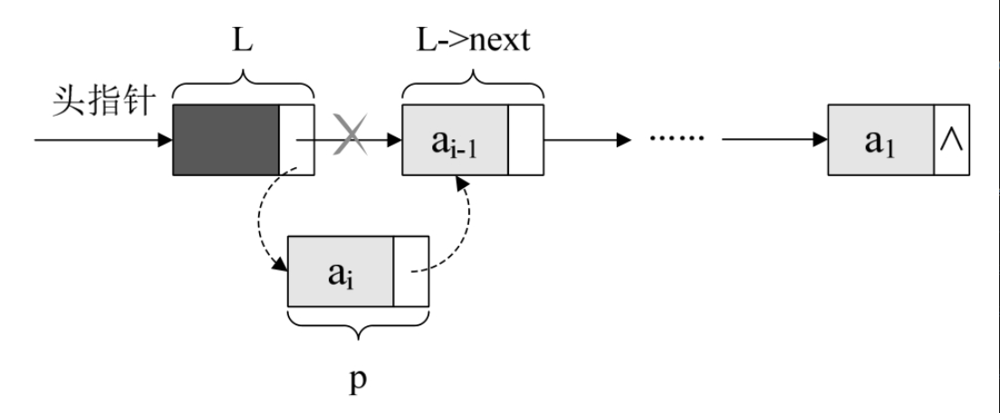
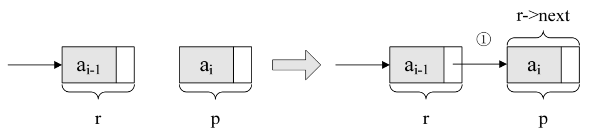
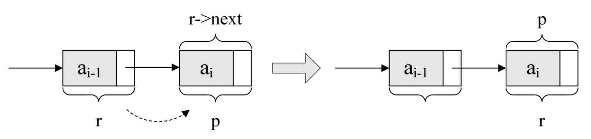

回顾一下，顺序存储结构的创建，其实就是一个数组的初始化，即声明一个类型和大小的数组并赋值的过程。而单链表和顺序存储结构就不一样，它不像顺序存储结构这么集中，它可以很散，是一种动态结构。对于每个链表来说，它所占用空间的大小和位置是不需要预先分配划定的，可以根据系统的情况和实际的需求即时生成。

所以创建单链表的过程就是一个动态生成链表的过程。即从“空表”的初始状态起，依次建立各元素结点，并逐个插入链表。

单链表整表创建的算法思路：

1. 声明一结点p和计数器变量i；
2. 初始化一空链表L；
3. 让L的头结点的指针指向NULL，即建立一个带头结点的单链表；
4. 循环：
   - 生成一新结点赋值给p；
   - 随机生成一数字赋值给p的数据域p->data；
   - 将p插入到头结点与前一新结点之间。

实现代码算法如下：

```c++
    /* 随机产生n个元素的值，建立带表头结点的单链线性表L（头插法）*/
    void CreateListHead（LinkList *L, int n）
    {
        LinkList p;
        int i;
        srand（time（0））;                     /*初始化随机数种子*/
        *L = （LinkList）malloc（sizeof（Node））;
        （*L）->next = NULL;                    /*先建立一个带头结点的单链表*/
        for （i=0; i<n; i++）
        {
            p = （LinkList）malloc（sizeof（Node））;/*生成新结点*/
            p->data = rand（）%100+1;          /*随机生成100以内的数字*/
            p->next = （*L）->next;
            （*L）->next = p;                  /*插入到表头*/
        }
    }
```

这段算法代码里，我们其实用的是插队的办法，就是始终让新结点在第一的位置。我也可以把这种算法简称为头插法，如图3-9-1所示。



可事实上，我们还是可以不这样干，为什么不把新结点都放到最后呢，这才是排队时的正常思维，所谓的先来后到。我们把每次新结点都插在终端结点的后面，这种算法称之为尾插法。

```c++
    /* 随机产生n个元素的值，建立带表头结点的单链线性表L（尾插法）*/
    void CreateListTail（LinkList *L, int n）
    {
        LinkList p,r;
        int i;
        srand（time（0））;                       /*初始化随机数种子*/
        *L = （LinkList）malloc（sizeof（Node））;/*为整个线性表*/
        r=*L;                                    /*r为指向尾部的结点*/
        for （i=0; i<n; i++）
        {
            p = （Node *）malloc（sizeof（Node））; /*生成新结点*/
            p->data = rand（）%100+1;        /*随机生成100以内的数字*/
            r->next=p;                       /*将表尾终端结点的指针指向新结点*/
            r = p;                           /*将当前的新结点定义为表尾终端结点*/
        }
        r->next = NULL;                      /*表示当前链表结束*/
    }
```

注意L与r的关系，L是指整个单链表，而r是指向尾结点的变量，r会随着循环不断地变化结点，而L则是随着循环增长为一个多结点的链表。

这里需解释一下，r->next=p;的意思，其实就是将刚才的表尾终端结点r的指针指向新结点p，如图3-9-2所示，当中①位置的连线就是表示这个意思。



r->next=p;这一句应该还好理解，我以前很多学生不理解的就是后面这一句r=p;是什么意思？请看图3-9-3。



它的意思，就是本来r是在ai-1元素的结点，可现在它已经不是最后的结点了，现在最后的结点是ai，所以应该要让将p结点这个最后的结点赋值给r。此时r又是最终的尾结点了。

循环结束后，那么应该让这个链表的指针域置空，因此有了“r->next=NULL;”，以便以后遍历时可以确认其是尾部。
