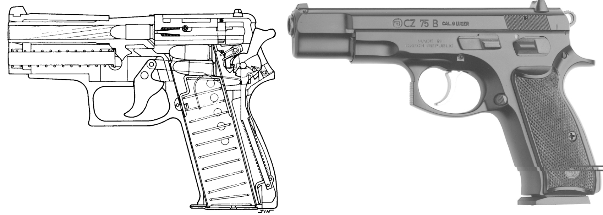

同学们，大家好！我们又见面了。

不知道大家有没有玩过手枪，估计都没有。现在和平年代，上哪去玩这种危险的真东西，就是仿真玩具也大都被限制了。我小时候在军训时，也算是一次机会，几个老兵和我们学生聊天，让我们学习了一下关于枪的知识。

当时那个老兵告诉我们，早先军官们都爱用左轮手枪，而非弹夹式手枪，问我们为什么，我们谁也说不上来。现在我要问问你们，知道为什么吗？​（下面一脸茫然）

哈，我听到下面有同学说是因为左轮手枪好看，酷呀。嘿，当然不是这个原因。算了，估计你们也很难猜得到。他那时告诉我们说，因为子弹质量不过关，有个别可能是臭弹——也就是有问题的、打不出来的子弹。弹夹式手枪（如图 4-1-1 所示）​，如果当中有一颗是卡住了的臭弹，那么后面的子弹就都打不了了。想想看，在你准备用枪的时候，那基本到了不是你死就是我亡的时刻，突然这手枪明明有子弹却打不出来，这不是要命吗？而左轮手枪就不存在这问题，这一颗不行，转到下一颗就可以了，人总不会倒霉到六颗全是臭弹。当然，后来子弹质量基本过关了，由于弹夹可以放 8 颗甚至 20 颗子弹，比左轮手枪的只能放 6 颗子弹要多，所以后来普及率更高的还是弹夹式的手枪。

哦，原来如此。我当时自认为聪明的说道：那很好办呀，这弹夹不是先放进去的子弹，最后才可以打出来吗？你可以把臭弹最先放进去，好子弹留在后面，这样就不会影响了呀。

他笑骂道，笨蛋，如果真的知道哪一颗是臭弹，还放进去干吗，早就扔了。​（大家大笑）

哎，我其实一直都是有点笨笨的。
