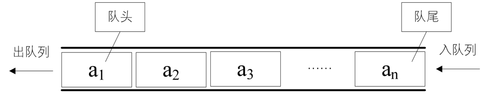

你们在用电脑时有没有经历过，机器有时会处于疑似死机的状态，鼠标点什么似乎都没用，双击任何快捷方式都不动弹。就当你失去耐心，打算 reset 时。突然它像酒醒了一样，把你刚才点击的所有操作全部都按顺序执行了一遍。这其实是因为操作系统中的多个程序因需要通过一个通道输出，而按先后次序排队等待造成的。

再比如像移动、联通、电信等客服电话，客服人员与客户相比总是少数，在所有的客服人员都占线的情况下，客户会被要求等待，直到有某个客服人员空下来，才能让最先等待的客户接通电话。这里也是将所有当前拨打客服电话的客户进行了排队处理。

操作系统和客服系统中，都是应用了一种数据结构来实现刚才提到的先进先出的排队功能，这就是队列。

```
队列（queue）是只允许在一端进行插入操作，而在另一端进行删除操作的线性表。
```

队列是一种先进先出（First In First Out）的线性表，简称 FIFO。允许插入的一端称为队尾，允许删除的一端称为队头。假设队列是 q=（ a1，a2，……，an）​，那么 a1 就是队头元素，而 an 是队尾元素。这样我们就可以删除时，总是从 a1 开始，而插入时，列在最后。这也比较符合我们通常生活中的习惯，排在第一个的优先出列，最后来的当然排在队伍最后，如图 4-10-1 所示。



队列在程序设计中用得非常频繁。前面我们已经举了两个例子，再比如用键盘进行各种字母或数字的输入，到显示器上如记事本软件上的输出，其实就是队列的典型应用，假如你本来和女友聊天，想表达你是我的上帝，输入的是 god，而屏幕上却显示出了 dog 发了出去，这真是要气死人了。
