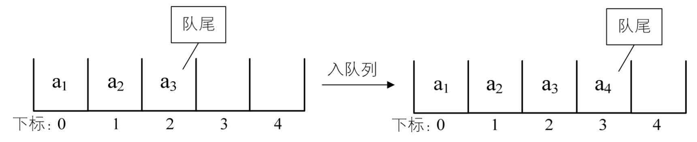
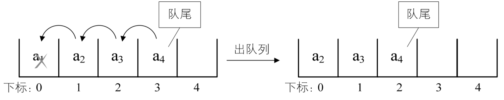
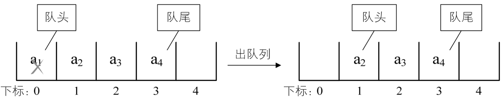
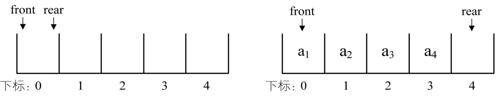
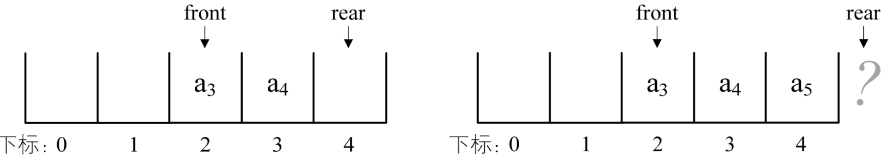
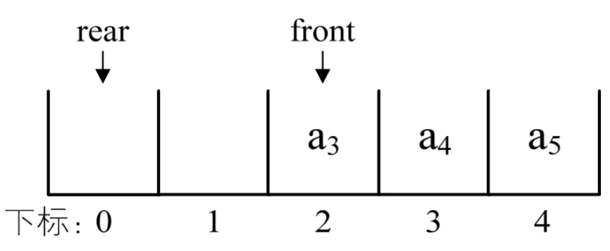
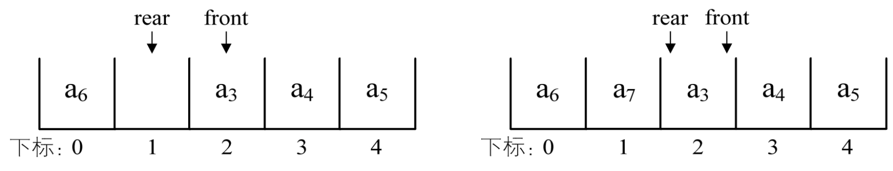
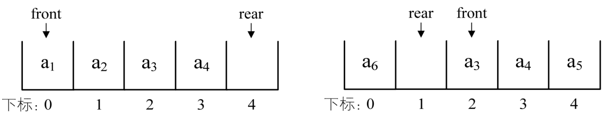
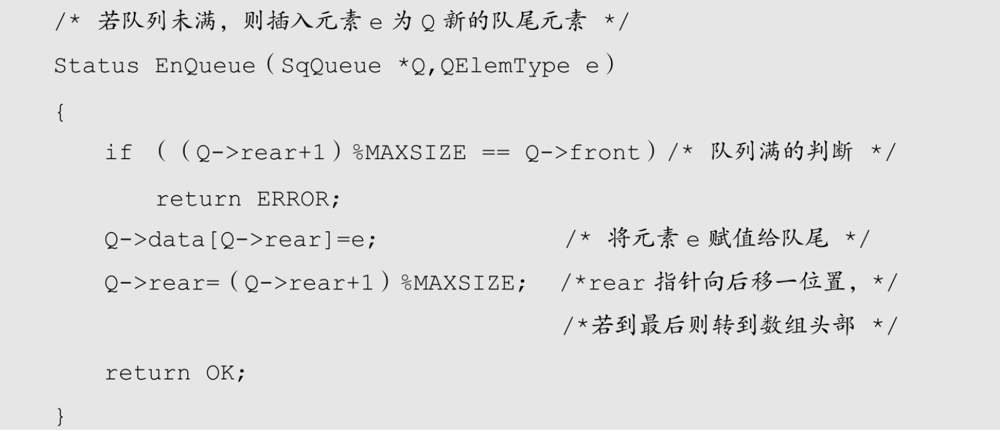
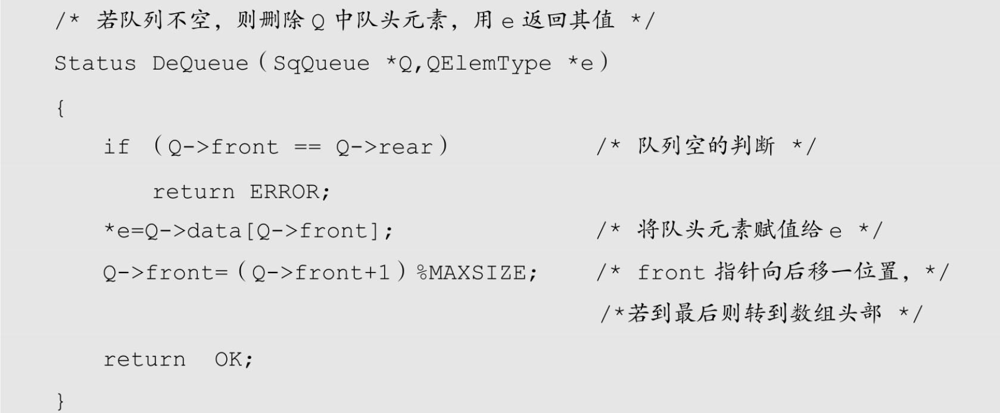

线性表有顺序存储和链式存储，栈是线性表，所以有这两种存储方式。同样，队列作为一种特殊的线性表，也同样存在这两种存储方式。我们先来看队列的顺序存储结构。

## 4.12.1 队列顺序存储的不足

我们假设一个队列有 n 个元素，则顺序存储的队列需建立一个大于 n 的数组，并把队列的所有元素存储在数组的前 n 个单元，数组下标为 0 的一端即是队头。所谓的入队列操作，其实就是在队尾追加一个元素，不需要移动任何元素，因此时间复杂度为 O(1)，如图 4-12-1 所示。



与栈不同的是，队列元素的出列是在队头，即下标为 0 的位置，那也就意味着，队列中的所有元素都得向前移动，以保证队列的队头，也就是下标为 0 的位置不为空，此时时间复杂度为 O(n)，如图 4-12-2 所示。



这里的实现和线性表的顺序存储结构完全相同，不再详述。

在现实中也是如此，一群人在排队买票，前面的人买好了离开，后面的人就要全部向前一步，补上空位，似乎这也没什么不好。

可有时想想，为什么出队列时一定要全部移动呢，如果不去限制队列的元素必须存储在数组的前 n 个单元这一条件，出队的性能就会大大增加。也就是说，队头不需要一定在下标为 0 的位置，如图 4-12-3 所示。



为了避免当只有一个元素时，队头和队尾重合使处理变得麻烦，所以引入两个指针，front 指针指向队头元素，rear 指针指向队尾元素的下一个位置，这样当 front 等于 rear 时，此队列不是还剩一个元素，而是空队列。

假设是长度为 5 的数组，初始状态，空队列如图 4-12-4 的左图所示，front 与 rear 指针均指向下标为 0 的位置。然后入队 a1、a2、a3、a4，front 指针依然指向下标为 0 位置，而 rear 指针指向下标为 4 的位置，如图 4-12-4 的右图所示。



出队 a1、a2，则 front 指针指向下标为 2 的位置，rear 不变，如图 4-12-5 的左图所示，再入队 a5，此时 front 指针不变，rear 指针移动到数组之外。嗯？数组之外，那将是哪里？如图 4-12-5 的右图所示。



问题还不止于此。假设这个队列的总个数不超过 5 个，但目前如果接着入队的话，因数组末尾元素已经占用，再向后加，就会产生数组越界的错误，可实际上，我们的队列在下标为 0 和 1 的地方还是空闲的。我们把这种现象叫做“假溢出”​。

现实当中，你上了公交车，发现前排有两个空座位，而后排所有座位都已经坐满，你会怎么做？立马下车，并对自己说，后面没座了，我等下一辆？

没有这么笨的人，前面有座位，当然也是可以坐的，除非坐满了，才会考虑下一辆。

## 4.12.2 循环队列定义

所以解决假溢出的办法就是后面满了，就再从头开始，也就是头尾相接的循环。我们把队列的这种头尾相接的顺序存储结构称为循环队列。

刚才的例子继续，图 4-12-5 的 rear 可以改为指向下标为 0 的位置，这样就不会造成指针指向不明的问题了，如图 4-12-6 所示。



接着入队 a6，将它放置于下标为 0 处，rear 指针指向下标为 1 处，如图 4-12-7 的左图所示。若再入队 a7，则 rear 指针就与 front 指针重合，同时指向下标为 2 的位置，如图 4-12-7 的右图所示。



- 此时问题又出来了，我们刚才说，空队列时，front 等于 rear，现在当队列满时，也是 front 等于 rear，那么如何判断此时的队列究竟是空还是满呢？
- 办法一是设置一个标志变量 f​lag，当 front==rear，且 f​lag=0 时为队列空，当 front==rear，且 f​lag=1 时为队列满。
- 办法二是当队列空时，条件就是 front=rear，当队列满时，我们修改其条件，保留一个元素空间。也就是说，队列满时，数组中还有一个空闲单元。例如图 4-12-8 所示，我们就认为此队列已经满了，也就是说，我们不允许图 4-12-7 的右图情况出现。



我们重点来讨论第二种方法，由于 rear 可能比 front 大，也可能比 front 小，所以尽管它们只相差一个位置时就是满的情况，但也可能是相差整整一圈。所以若队列的最大尺寸为 QueueSize，那么队列满的条件是（rear+1）%QueueSize==front（取模“%”的目的就是为了整合 rear 与 front 大小为一个问题）​。比如上面这个例子，QueueSize=5，图 4-12-8 的左图中 front=0，而 rear=4，​（4+1）%5=0，所以此时队列满。再比如图 4-12-8 中的右图，front=2 而 rear=1。​（1+1）%5=2，所以此时队列也是满的。而对于图 4-12-6，front=2 而 rear=0，​（0+1）%5=1，1 ≠ 2，所以此时队列并没有满。

另外，当 rear &​g​t​; front 时，即图 4-12-4 的右图和 4-12-5 的左图，此时队列的长度为 rear－front。但当 rear &​l​t​; front 时，如图 4-12-6 和图 4-12-7 的左图，队列长度分为两段，一段是 QueueSize－front，另一段是 0+rear，加在一起，队列长度为 rear-front+QueueSize。因此通用的计算队列长度公式为：

```
（rear－front+QueueSize）%QueueSize
```

有了这些讲解，现在实现循环队列的代码就不难了。

循环队列的顺序存储结构代码如下：

```c++
    typedef int QElemType; /* QElemType类型根据实际情况而定，这里假设为int */
    /* 循环队列的顺序存储结构 */
    typedef struct
    {
        QElemType data[MAXSIZE];
        int front;       /* 头指针 */
        int rear;        /* 尾指针，若队列不空，指向队列尾元素的下一个位置 */
    }SqQueue;
```

循环队列的初始化代码如下：

```rust
    /* 初始化一个空队列Q */
    Status InitQueue（SqQueue *Q）
    {
        Q->front=0;
        Q->rear=0;
        return  OK;
    }
```

循环队列求队列长度代码如下：

```rust
    /* 返回Q的元素个数，也就是队列的当前长度 */
    int QueueLength（SqQueue Q）
    {
        return  （Q.rear-Q.front+MAXSIZE）%MAXSIZE;
    }
```

循环队列的入队列操作代码如下：



循环队列的出队列操作代码如下：



从这一段讲解，大家应该发现，单是顺序存储，若不是循环队列，算法的时间性能是不高的，但循环队列又面临着数组可能会溢出的问题，所以我们还需要研究一下不需要担心队列长度的链式存储结构。
