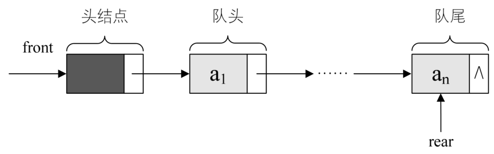
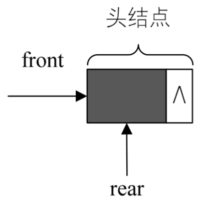
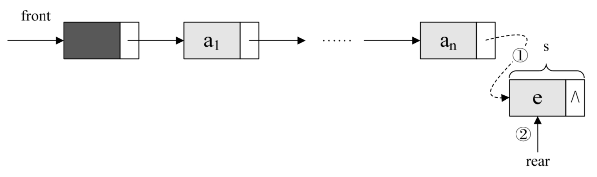
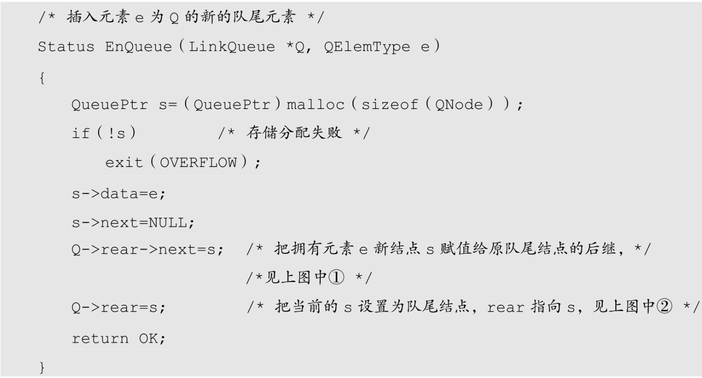
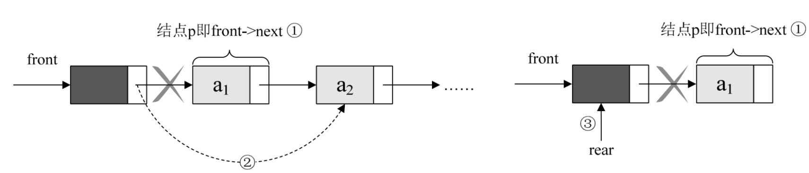
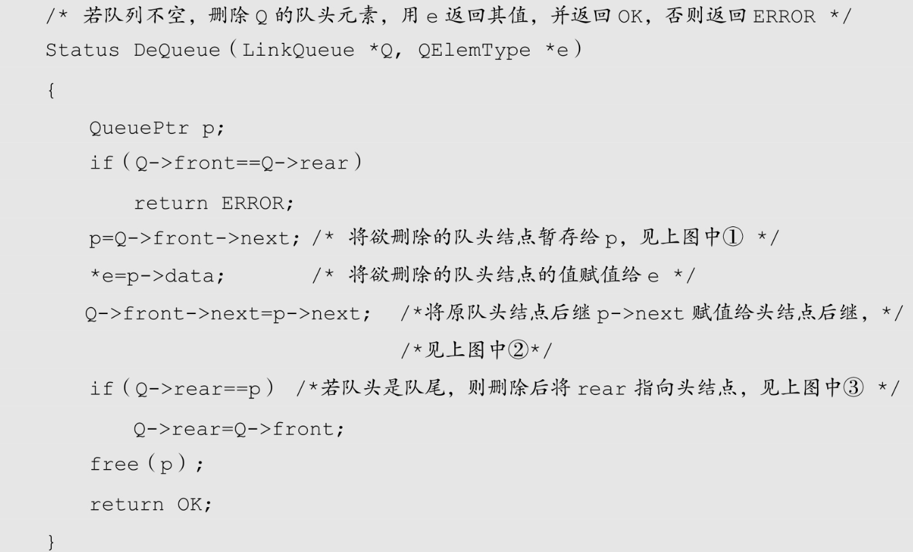

队列的链式存储结构，其实就是线性表的单链表，只不过它只能尾进头出而已，我们把它简称为链队列。为了操作上的方便，我们将队头指针指向链队列的头结点，而队尾指针指向终端结点，如图 4-13-1 所示。



空队列时，front 和 rear 都指向头结点，如图 4-13-2 所示。



链队列的结构为：

```c++
    typedef int QElemType;  /* QElemType类型根据实际情况而定，这里假设为int */
    typedef struct QNode    /* 结点结构 */
    {
       QElemType data;
       struct QNode *next;
    }QNode,*QueuePtr;
    typedef struct           /* 队列的链表结构 */
    {
        QueuePtr front,rear; /* 队头、队尾指针 */
    }LinkQueue;
```

## 4.13.1 队列的链式存储结构——入队操作

入队操作时，其实就是在链表尾部插入结点，如图 4-13-3 所示。



其代码如下：



## 4.13.2 队列的链式存储结构——出队操作

出队操作时，就是头结点的后继结点出队，将头结点的后继改为它后面的结点，若链表除头结点外只剩一个元素时，则需将 rear 指向头结点，如图 4-13-4 所示。



代码如下：



对于循环队列与链队列的比较，可以从两方面来考虑，从时间上，其实它们的基本操作都是常数时间，即都为 O(1)的，不过循环队列是事先申请好空间，使用期间不释放，而对于链队列，每次申请和释放结点也会存在一些时间开销，如果入队出队频繁，则两者还是有细微差异。对于空间上来说，循环队列必须有一个固定的长度，所以就有了存储元素个数和空间浪费的问题。而链队列不存在这个问题，尽管它需要一个指针域，会产生一些空间上的开销，但也可以接受。所以在空间上，链队列更加灵活。

总的来说，在可以确定队列长度最大值的情况下，建议用循环队列，如果你无法预估队列的长度时，则用链队列。
