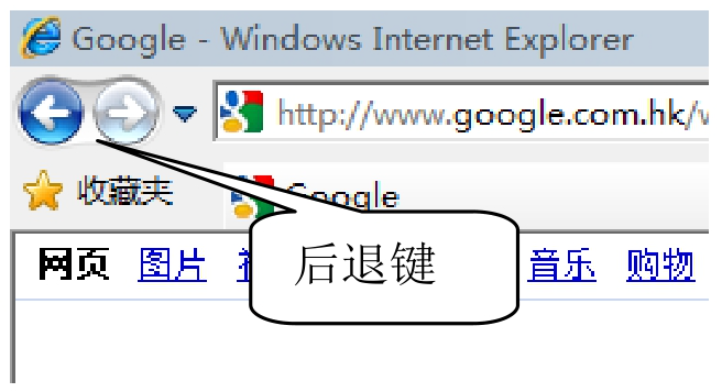
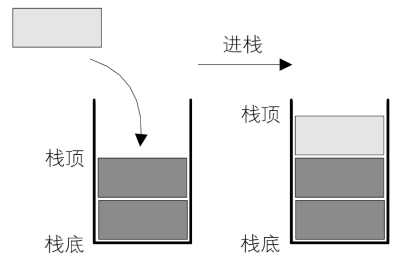
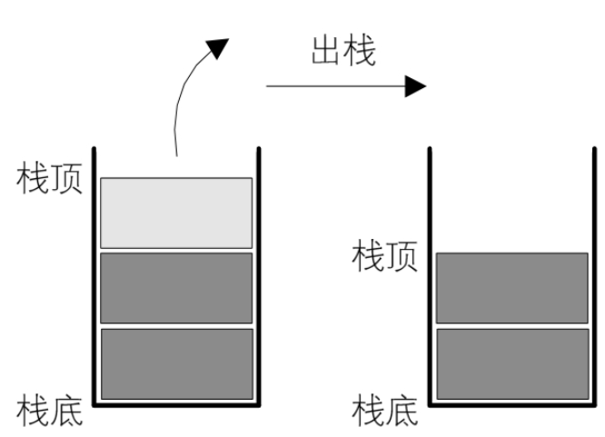

## 4.2.1 　栈的定义

好了，说这个例子目的不是要告诉你们我当年有多笨，而是为了引出今天的主题，就是类似弹夹中的子弹一样先进去，却要后出来，而后进的，反而可以先出来的数据结构——栈。

在我们软件应用中，栈这种后进先出数据结构的应用是非常普遍的。比如你用浏览器上网时，不管什么浏览器都有一个“后退”键，你点击后可以按访问顺序的逆序加载浏览过的网页。比如你本来看着新闻好好的，突然看到一个链接说，有个可以让你年薪 100 万的工作，你毫不犹豫点击它，跳转进去一看，这都是啥呀，具体内容我也就不说了，骗人骗得一点水平都没有。此时你还想回去继续看新闻，就可以点击左上角的后退键。即使你从一个网页开始，连续点了几十个链接跳转，你点“后退”时，还是可以像历史倒退一样，回到之前浏览过的某个页面，如图 4-2-1 所示。



很多类似的软件，比如 Word、Photoshop 等文档或图像编辑软件中，都有撤销（undo）的操作，也是用栈这种方式来实现的，当然不同的软件具体实现代码会有很大差异，不过原理其实都是一样的。

```
栈（stack）是限定仅在表尾进行插入和删除操作的线性表。
```

我们把允许插入和删除的一端称为栈顶（top）​，另一端称为栈底（bot​tom）​，不含任何数据元素的栈称为空栈。栈又称为后进先出（Last In First Out）的线性表，简称 LIFO 结构。

理解栈的定义需要注意：

首先它是一个线性表，也就是说，栈元素具有线性关系，即前驱后继关系。只不过它是一种特殊的线性表而已。定义中说是在线性表的表尾进行插入和删除操作，这里表尾是指栈顶，而不是栈底。

它的特殊之处就在于限制了这个线性表的插入和删除位置，它始终只在栈顶进行。这也就使得：栈底是固定的，最先进栈的只能在栈底。

栈的插入操作，叫作进栈，也称压栈、入栈。类似子弹入弹夹，如图 4-2-2 所示。



栈的删除操作，叫作出栈，也有的叫作弹栈。如同弹夹中的子弹出夹，如图 4-2-3 所示。



## 4.2.2 　进栈出栈变化形式

现在我要问问大家，这个最先进栈的元素，是不是就只能是最后出栈呢？

答案是不一定，要看什么情况。栈对线性表的插入和删除的位置进行了限制，并没有对元素进出的时间进行限制，也就是说，在不是所有元素都进栈的情况下，事先进去的元素也可以出栈，只要保证是栈顶元素出栈就可以。

举例来说，如果我们现在是有 3 个整型数字元素 1、2、3 依次进栈，会有哪些出栈次序呢？

- 第一种：1、2、3 进，再 3、2、1 出。这是最简单的最好理解的一种，出栈次序为 321。
- 第二种：1 进，1 出，2 进，2 出，3 进，3 出。也就是进一个就出一个，出栈次序为 123。
- 第三种：1 进，2 进，2 出，1 出，3 进，3 出。出栈次序为 213。
- 第四种：1 进，1 出，2 进，3 进，3 出，2 出。出栈次序为 132。
- 第五种：1 进，2 进，2 出，3 进，3 出，1 出。出栈次序为 231。

有没有可能是 312 这样的次序出栈呢？答案是肯定不会。因为 3 先出栈，就意味着，3 曾经进栈，既然 3 都进栈了，那也就意味着，1 和 2 已经进栈了，此时，2 一定是在 1 的上面，就是更接近栈顶，那么出栈只可能是 321，不然不满足 123 依次进栈的要求，所以此时不会发生 1 比 2 先出栈的情况。

从这个简单的例子就能看出，只是 3 个元素，就有 5 种可能的出栈次序，如果元素数量多，其实出栈的变化将会更多的。这个知识点一定要弄明白。
