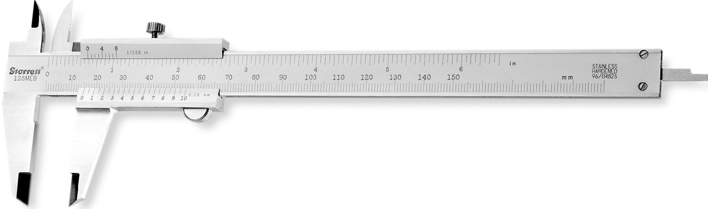
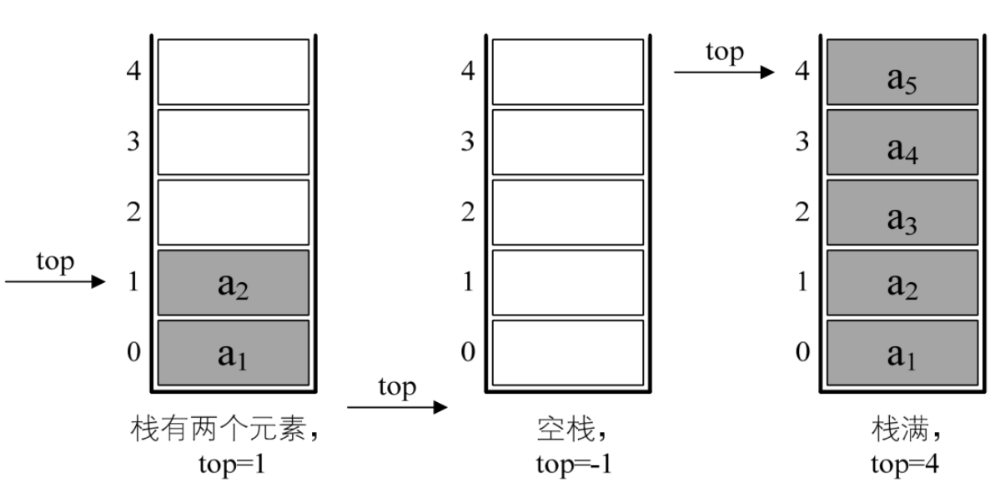
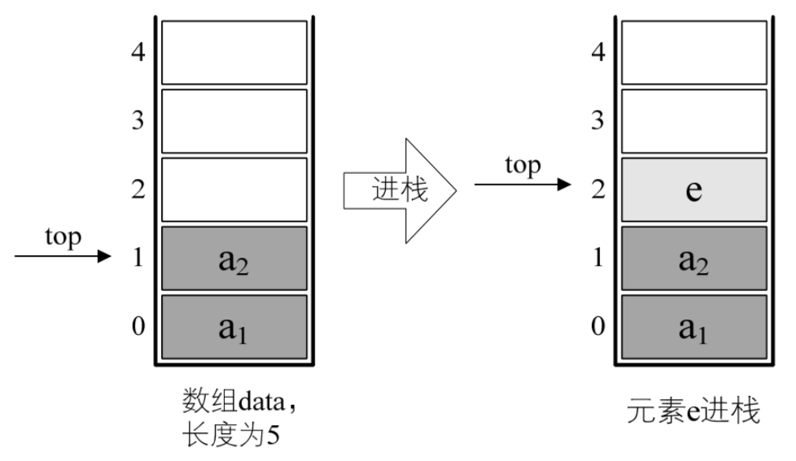

## 4.4.1 栈的顺序存储结构

既然栈是线性表的特例，那么栈的顺序存储其实也是线性表顺序存储的简化，我们简称为顺序栈。线性表是用数组来实现的，想想看，对于栈这种只能一头插入删除的线性表来说，用数组哪一端来作为栈顶和栈底比较好？

对，没错，下标为 0 的一端作为栈底比较好，因为首元素都存在栈底，变化最小，所以让它作栈底。

我们定义一个 top 变量来指示栈顶元素在数组中的位置，这 top 就如同中学物理学过的游标卡尺的游标，如图 4-4-1，它可以来回移动，意味着栈顶的 top 可以变大变小，但无论如何游标不能超出尺的长度。同理，若存储栈的长度为 StackSize，则栈顶位置 top 必须小于 StackSize。当栈存在一个元素时，top 等于 0，因此通常把空栈的判定条件定为 top 等于－1。



来看栈的结构定义

```c++
    typedef int SElemType; /* SElemType类型根据实际情况而定，这里假设为int */
    typedef struct
    {
        SElemType data[MAXSIZE];
        int top;          /* 用于栈顶指针 */
    }SqStack;
```

若现在有一个栈，StackSize 是 5，则栈普通情况、空栈和栈满的情况示意图如图 4-4-2 所示。



## 4.4.2 栈的顺序存储结构——进栈操作

对于栈的插入，即进栈操作，其实就是做了如图 4-4-3 所示的处理。图 4-4-3



因此对于进栈操作 push，其代码如下：

```rust
    /* 插入元素e为新的栈顶元素 */
    Status Push（SqStack *S, SElemType e）
    {
        if（S->top == MAXSIZE －1）  /* 栈满 */
        {
             return ERROR;
        }
        S->top++;                    /* 栈顶指针增加一 */
        S->data[S->top]=e;           /* 将新插入元素赋值给栈顶空间 */
        return OK;
    }
```

## 4.4.3 栈的顺序存储结构——出栈操作

出栈操作 pop，代码如下：

```rust
    /* 若栈不空，则删除S的栈顶元素，用e返回其值，并返回OK；否则返回ERROR */
    Status Pop（SqStack *S, SElemType *e）
    {
        if（S->top==－1）
            return ERROR;
        *e=S->data[S->top];          /* 将要删除的栈顶元素赋值给e */
        S->top－－;                  /* 栈顶指针减一 */
        return OK;
    }
```

两者没有涉及到任何循环语句，因此时间复杂度均是 O(1)。
