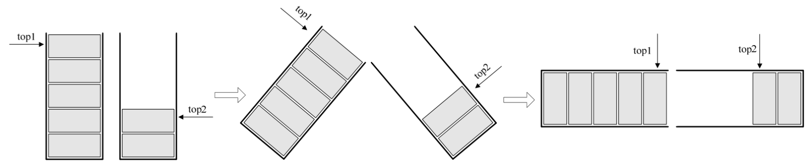
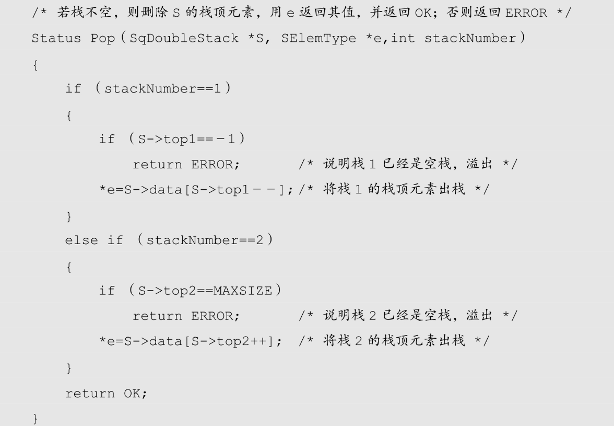

其实栈的顺序存储还是很方便的，因为它只准栈顶进出元素，所以不存在线性表插入和删除时需要移动元素的问题。不过它有一个很大的缺陷，就是必须事先确定数组存储空间大小，万一不够用了，就需要编程手段来扩展数组的容量，非常麻烦。对于一个栈，我们也只能尽量考虑周全，设计出合适大小的数组来处理，但对于两个相同类型的栈，我们却可以做到最大限度地利用其事先开辟的存储空间来进行操作。

打个比方，两个大学室友毕业同时到北京工作，开始时，他们觉得住了这么多年学校的集体宿舍，现在工作了一定要有自己的私密空间。于是他们都希望租房时能找到独住的一居室，可找来找去却发现，最便宜的一居室也要每月 1500 元，地段还不好，实在是承受不起，最终他俩还是合租了一套两居室，一共 2000 元，各出一半，还不错。

对于两个一居室，都有独立的卫生间和厨房，是私密了，但大部分空间的利用率却不高。而两居室，两个人各有卧室，还共享了客厅、厨房和卫生间，房间的利用率就显著提高，而且租房成本也大大下降了。

同样的道理，如果我们有两个相同类型的栈，我们为它们各自开辟了数组空间，极有可能是第一个栈已经满了，再进栈就溢出了，而另一个栈还有很多存储空间空闲。这又何必呢？我们完全可以用一个数组来存储两个栈，只不过需要点小技巧。

我们的做法如图 4-5-1，数组有两个端点，两个栈有两个栈底，让一个栈的栈底为数组的始端，即下标为 0 处，另一个栈为栈的末端，即下标为数组长度 n－1 处。这样，两个栈如果增加元素，就是两端点向中间延伸。



其实关键思路是：它们是在数组的两端，向中间靠拢。top1 和 top2 是栈 1 和栈 2 的栈顶指针，可以想象，只要它们俩不见面，两个栈就可以一直使用。

从这里也就可以分析出来，栈 1 为空时，就是 top1 等于－1 时；而当 top2 等于 n 时，即是栈 2 为空时，那什么时候栈满呢？

想想极端的情况，若栈 2 是空栈，栈 1 的 top1 等于 n－1 时，就是栈 1 满了。反之，当栈 1 为空栈时，top2 等于 0 时，为栈 2 满。但更多的情况，其实就是我刚才说的，两个栈见面之时，也就是两个指针之间相差 1 时，即 top1+1==top2 为栈满。

两栈共享空间的结构的代码如下：

```rust
    /* 两栈共享空间结构 */
    typedef struct
    {
        SElemType data[MAXSIZE];
        int top1; /* 栈1栈顶指针 */
        int top2; /* 栈2栈顶指针 */
    }SqDoubleStack;
```

对于两栈共享空间的 push 方法，我们除了要插入元素值参数外，还需要有一个判断是栈 1 还是栈 2 的栈号参数 stackNumber。插入元素的代码如下：

```rust
    /* 插入元素e为新的栈顶元素 */
    Status Push（SqDoubleStack *S, SElemType e, int stackNumber）
    {
        if （S->top1+1==S->top2）/* 栈已满，不能再push新元素了 */
            return ERROR;
        if （stackNumber==1）   /* 栈1有元素进栈 */
            S->data[++S->top1]=e;/* 若栈1则先top1+1后给数组元素赋值 */
        else if （stackNumber==2）/* 栈2有元素进栈 */
            S->data[－－S->top2]=e;/* 若栈2则先top2－1后给数组元素赋值 */
        return OK;
    }
```

因为在开始已经判断了是否有栈满的情况，所以后面的 top1+1 或 top2－1 是不担心溢出问题的。

对于两栈共享空间的 pop 方法，参数就只是判断栈 1 栈 2 的参数 stackNumber，代码如下：



事实上，使用这样的数据结构，通常都是当两个栈的空间需求有相反关系时，也就是一个栈增长时另一个栈在缩短的情况。就像买卖股票一样，你买入时，一定是有一个你不知道的人在做卖出操作。有人赚钱，就一定是有人赔钱。这样使用两栈共享空间存储方法才有比较大的意义。否则两个栈都在不停地增长，那很快就会因栈满而溢出了。

当然，这只是针对两个具有相同数据类型的栈的一个设计上的技巧，如果是不相同数据类型的栈，这种办法不但不能更好地处理问题，反而会使问题变得更复杂，大家要注意这个前提。
