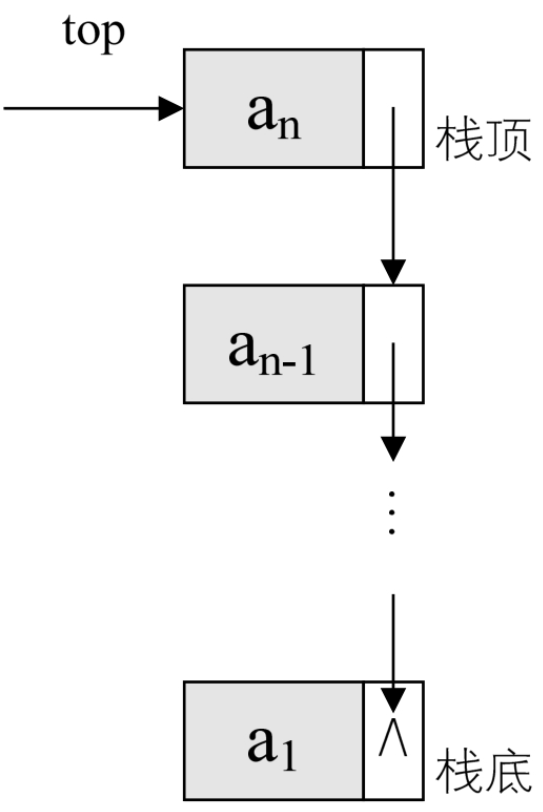
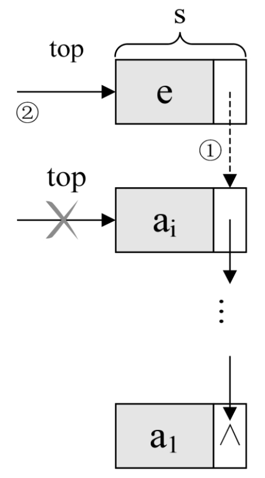
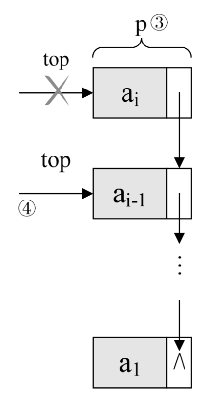

## 4.6.1 栈的链式存储结构

讲完了栈的顺序存储结构，我们现在来看看栈的链式存储结构，简称为链栈。

想想看，栈只是栈顶来做插入和删除操作，栈顶放在链表的头部还是尾部呢？由于单链表有头指针，而栈顶指针也是必须的，那干吗不让它俩合二为一呢，所以比较好的办法是把栈顶放在单链表的头部（如图 4-6-1 所示）​。另外，都已经有了栈顶在头部了，单链表中比较常用的头结点也就失去了意义，通常对于链栈来说，是不需要头结点的。



对于链栈来说，基本不存在栈满的情况，除非内存已经没有可以使用的空间，如果真的发生，那此时的计算机操作系统已经面临死机崩溃的情况，而不是这个链栈是否溢出的问题。

但对于空栈来说，链表原定义是头指针指向空，那么链栈的空其实就是 top=NULL 的时候。

链栈的结构代码如下：

```rust
    typedef struct StackNode
    {
        SElemType data;
        struct StackNode *next;
    }StackNode,*LinkStackPtr;
    typedef struct LinkStack
    {
        LinkStackPtr top;
        int count;
    }LinkStack;
```

链栈的操作绝大部分都和单链表类似，只是在插入和删除上，特殊一些。

## 4.6.2 栈的链式存储结构——进栈操作

对于链栈的进栈 push 操作，假设元素值为 e 的新结点是 s，top 为栈顶指针，示意图如图 4-6-2 所示代码如下。



```rust
    /* 插入元素e为新的栈顶元素 */
    Status Push（LinkStack *S, SElemType e）
    {
        LinkStackPtr s=（LinkStackPtr）malloc（sizeof（StackNode））;
        s->data=e;
        s->next=S->top;/* 把当前的栈顶元素赋值给新结点的直接后继，如图中① */
        S->top=s;      /* 将新的结点s赋值给栈顶指针，如图中② */
        S->count++;
        return OK;
    }
```

## 4.6.3 　栈的链式存储结构——出栈操作

至于链栈的出栈 pop 操作，也是很简单的三句操作。假设变量 p 用来存储要删除的栈顶结点，将栈顶指针下移一位，最后释放 p 即可，如图 4-6-3 所示。



```rust
    /* 若栈不空，则删除S的栈顶元素，用e返回其值，并返回OK；否则返回ERROR */
    Status Pop（LinkStack *S,SElemType *e）
    {
        LinkStackPtr p;
        if（StackEmpty（*S））
            return ERROR;
        *e=S->top->data;
        p=S->top;            /* 将栈顶结点赋值给p，如图③ */
        S->top=S->top->next; /* 使得栈顶指针下移一位，指向后一结点，如图④*/
        free（p）;           /* 释放结点p */
        S->count--;
        return OK;
    }
```

链栈的进栈 push 和出栈 pop 操作都很简单，没有任何循环操作，时间复杂度均为 O(1)。

对比一下顺序栈与链栈，它们在时间复杂度上是一样的，均为 O(1)。对于空间性能，顺序栈需要事先确定一个固定的长度，可能会存在内存空间浪费的问题，但它的优势是存取时定位很方便，而链栈则要求每个元素都有指针域，这同时也增加了一些内存开销，但对于栈的长度无限制。所以它们的区别和线性表中讨论的一样，如果栈的使用过程中元素变化不可预料，有时很小，有时非常大，那么最好是用链栈，反之，如果它的变化在可控范围内，建议使用顺序栈会更好一些。
