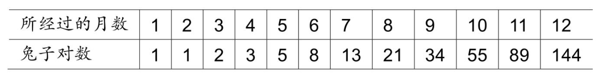
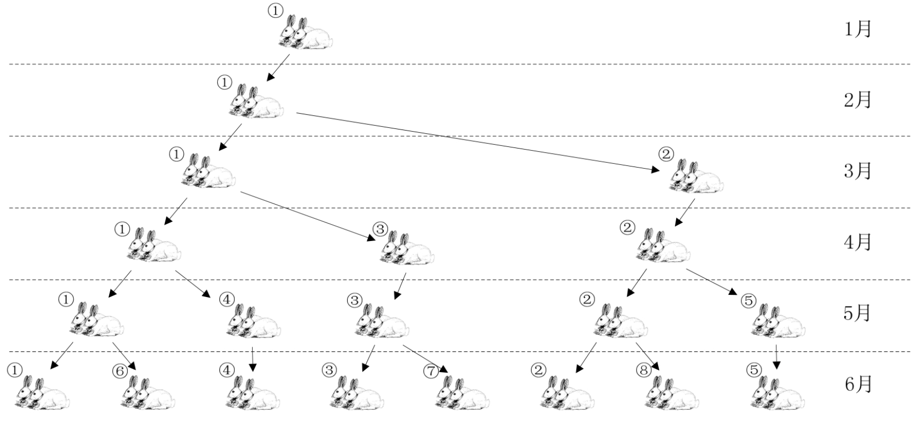
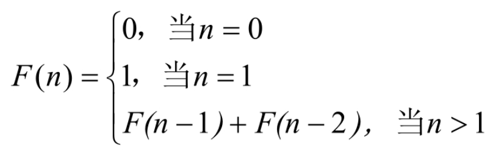
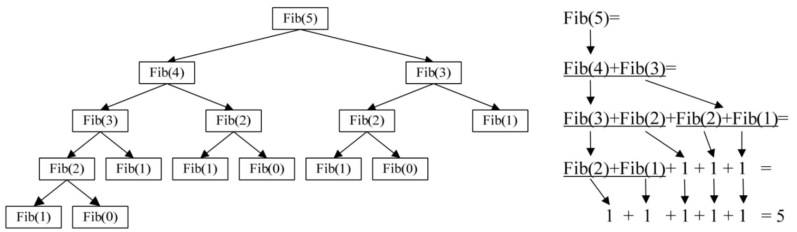

栈有一个很重要的应用：在程序设计语言中实现了递归。那么什么是递归呢？

当你往镜子前面一站，镜子里面就有一个你的像。但你试过两面镜子一起照吗？如果 A、B 两面镜子相互面对面放着，你往中间一站，嘿，两面镜子里都有你的千百个“化身”​。为什么会有这么奇妙的现象呢？原来，A 镜子里有 B 镜子的像，B 镜子里也有 A 镜子的像，这样反反复复，就会产生一连串的“像中像”​。这是一种递归现象，如图 4-8-1 所示。


我们先来看一个经典的递归例子：斐波那契数列（Fibonacci）​。为了说明这个数列，这位斐老还举了一个很形象的例子。

## 4.8.1 斐波那契数列实现

说如果兔子在出生两个月后，就有繁殖能力，一对兔子每个月能生出一对小兔子来。假设所有兔都不死，那么一年以后可以繁殖多少对兔子呢？我们拿新出生的一对小兔子分析一下：第一个月小兔子没有繁殖能力，所以还是一对；两个月后，生下一对小兔子数共有两对；三个月以后，老兔子又生下一对，因为小兔子还没有繁殖能力，所以一共是三对……依次类推可以列出下表（表 4-8-1）​。



表中数字 1，1，2，3，5，8，13……构成了一个序列。这个数列有个十分明显的特点，那是：前面相邻两项之和，构成了后一项，如图 4-8-2 所示。



可以发现，编号 ① 的一对兔子经过六个月就变成 8 对兔子了。如果我们用数学函数来定义就是：



先考虑一下，如果我们要实现这样的数列用常规的迭代的办法如何实现？假设我们需要打印出前 40 位的斐波那契数列数。代码如下：

```rust
    int main（）
    {
        int i;
        int a[40];
        a[0]=0;
        a[1]=1;
        printf（"%d ",a[0]）;
        printf（"%d ",a[1]）;
        for（i = 2;i < 40;i++）
        {
            a[i] = a[i-1] + a[i-2];
            printf（"%d ",a[i]）;
        }
        return 0;
    }
```

代码很简单，几乎不用做什么解释。但其实我们的代码，如果用递归来实现，还可以更简单。

```c++
    /* 斐波那契的递归函数 */
    int Fbi（int i）
    {
        if（ i < 2 ）
            return i == 0 ? 0 : 1;
        return Fbi（i-1）+ Fbi（i-2）;/*这里Fbi就是函数自己，它在调用自己 */
    }
    int main（）
    {
        int i;
        for（int i = 0;i < 40;i++）
            printf（"%d ", Fbi（i））;
        return 0;
    }
```

怎么样，相比较迭代的代码，是不是干净很多。嘿嘿，不过要弄懂它得费点脑子。

函数怎么可以自己调用自己？听起来有些难以理解，不过你可以不要把一个递归函数中调用自己的函数看作是在调用自己，而就当它是在调另一个函数。只不过，这个函数和自己长得一样而已。

我们来模拟代码中的 Fbi（i）函数当 i=5 的执行过程，如图 4-8-3 所示。



## 4.8.2 递归定义

在高级语言中，调用自己和其他函数并没有本质的不同。我们把一个直接调用自己或通过一系列的调用语句间接地调用自己的函数，称做递归函数。

当然，写递归程序最怕的就是陷入永不结束的无穷递归中，所以，每个递归定义必须至少有一个条件，满足时递归不再进行，即不再引用自身而是返回值退出。比如刚才的例子，总有一次递归会使得 i<2 的，这样就可以执行 return i 的语句而不用继续递归了。

对比了两种实现斐波那契的代码。迭代和递归的区别是：迭代使用的是循环结构，递归使用的是选择结构。递归能使程序的结构更清晰、更简洁、更容易让人理解，从而减少读懂代码的时间。但是大量的递归调用会建立函数的副本，会耗费大量的时间和内存。迭代则不需要反复调用函数和占用额外的内存。因此我们应该视不同情况选择不同的代码实现方式。

那么我们讲了这么多递归的内容，和栈有什么关系呢？这得从计算机系统的内部说起。

前面我们已经看到递归是如何执行它的前行和退回阶段的。递归过程退回的顺序是它前行顺序的逆序。在退回过程中，可能要执行某些动作，包括恢复在前行过程中存储起来的某些数据。

这种存储某些数据，并在后面又以存储的逆序恢复这些数据，以提供之后使用的需求，显然很符合栈这样的数据结构，因此，编译器使用栈实现递归就没什么好惊讶的了。

简单的说，就是在前行阶段，对于每一层递归，函数的局部变量、参数值以及返回地址都被压入栈中。在退回阶段，位于栈顶的局部变量、参数值和返回地址被弹出，用于返回调用层次中执行代码的其余部分，也就是恢复了调用的状态。

当然，对于现在的高级语言，这样的递归问题是不需要用户来管理这个栈的，一切都由系统代劳了。
