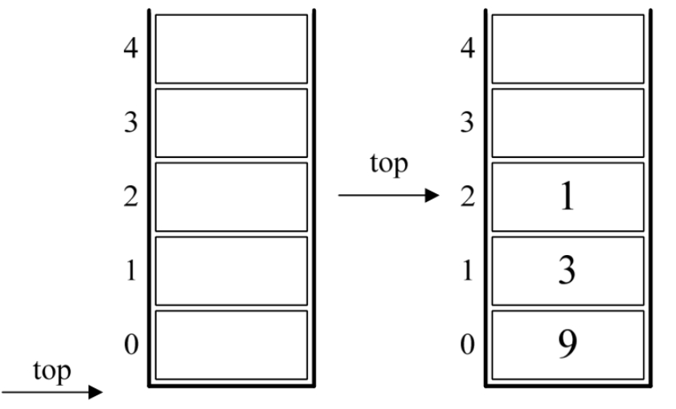
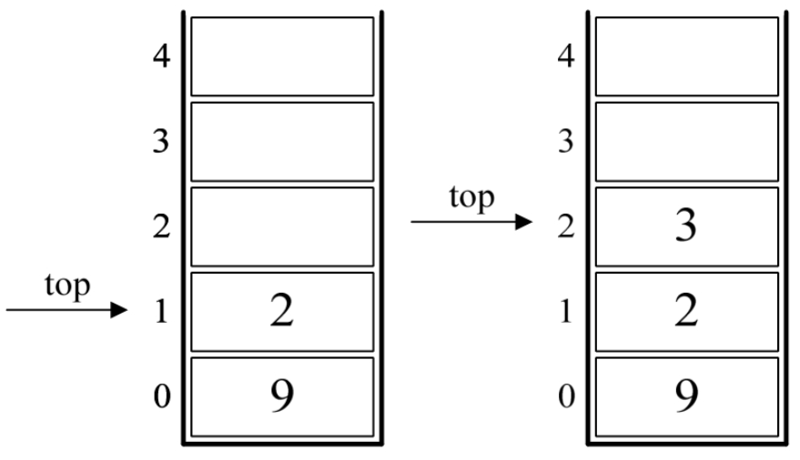
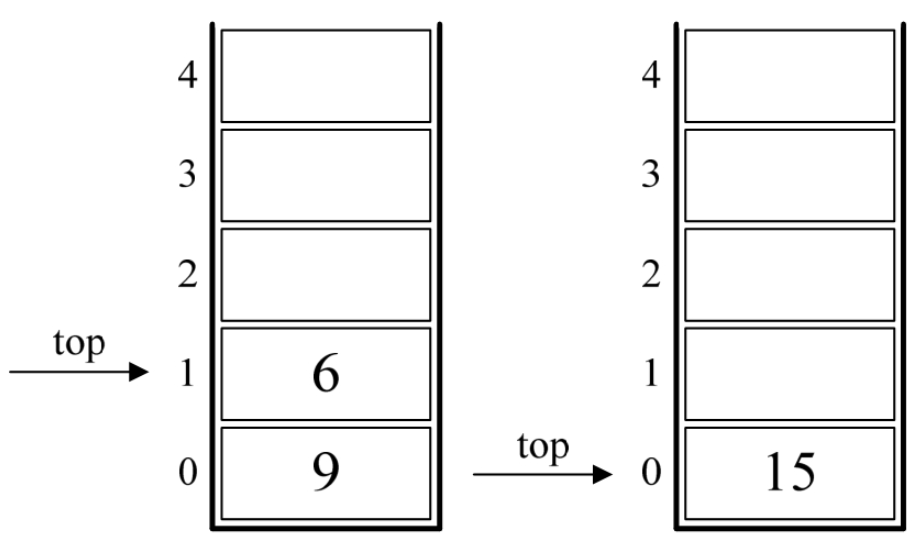
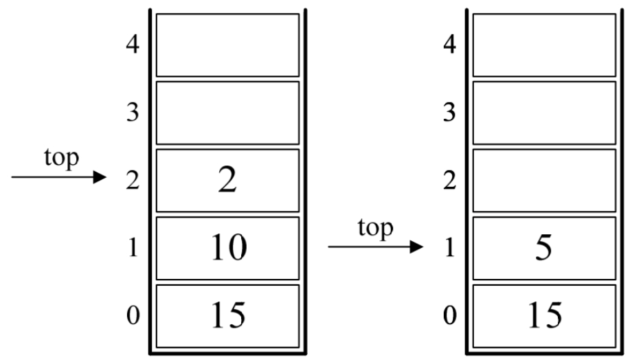
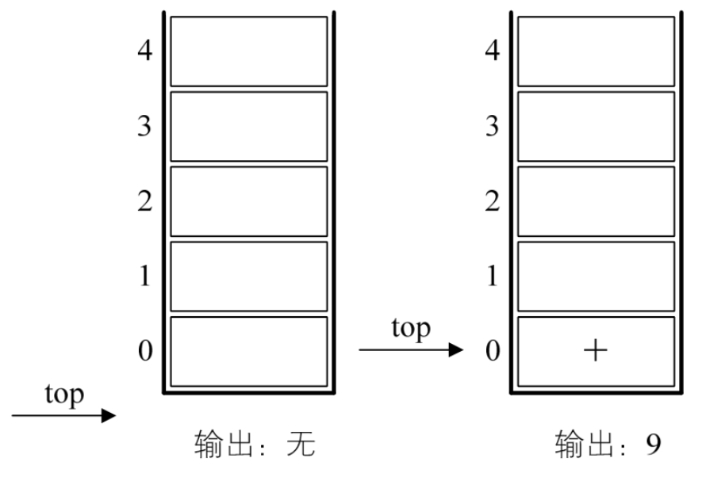
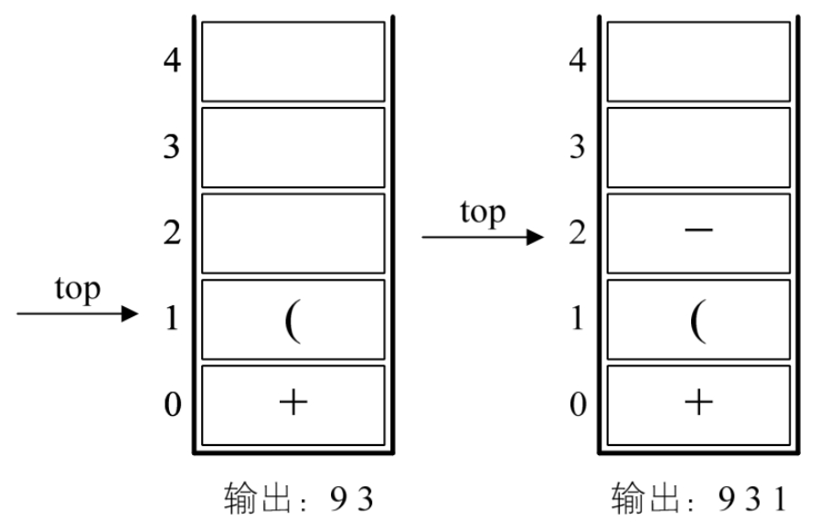
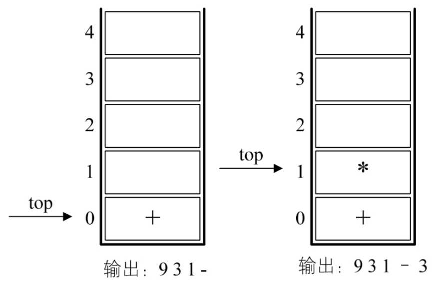
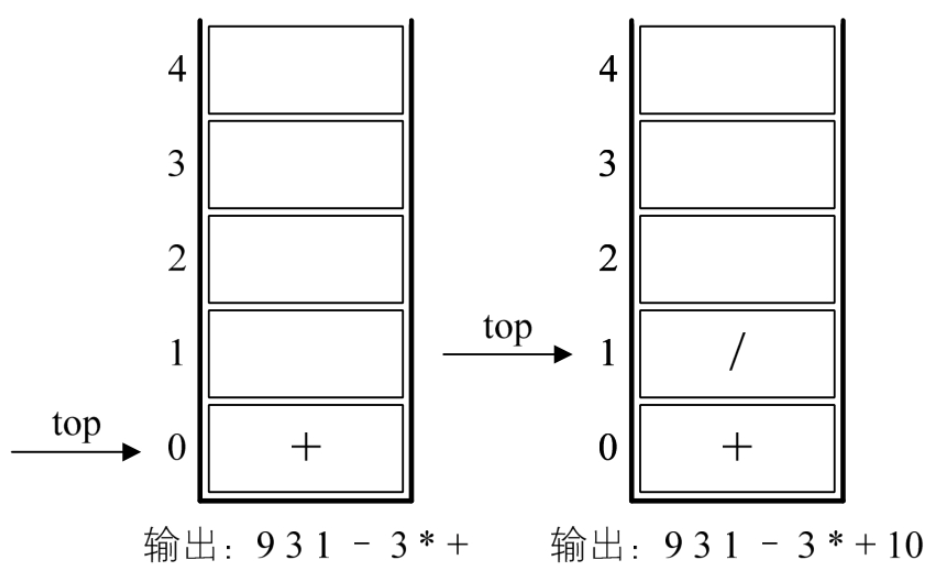
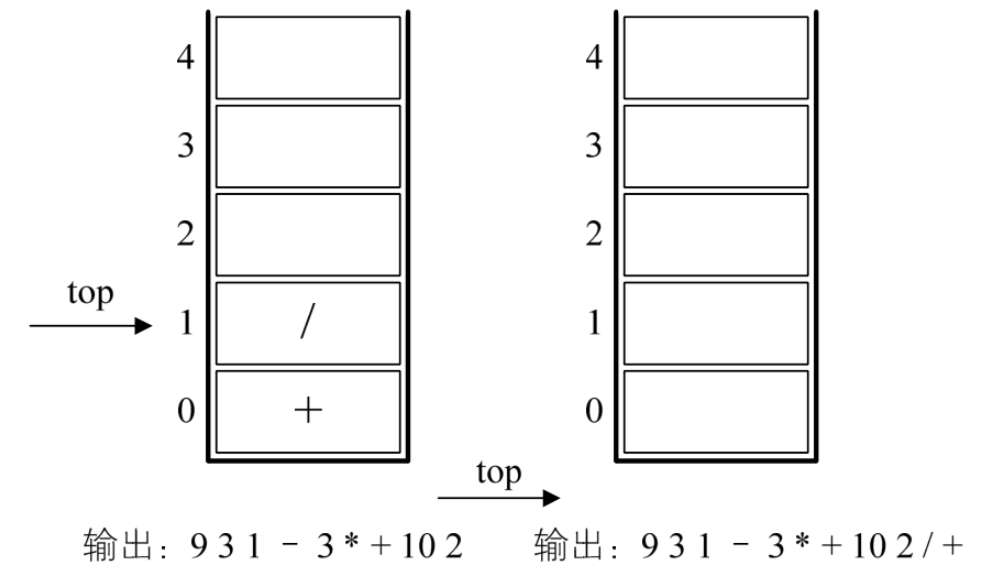

## 4.9.1 后缀（逆波兰）表示法定义

栈的现实应用也很多，我们再来重点讲一个比较常见的应用：数学表达式的求值。

我们小学学数学的时候，有一句话是老师反复强调的，​“先乘除，后加减，从左算到右，先括号内后括号外”​。这个大家都不陌生。我记得我小时候，天天做这种加减乘除的数学作业，很烦，于是就偷偷拿了老爸的计算器来帮着算答案，对于单纯的两个数的加减乘除，的确是省心不少，我也因此潇洒了一两年。可后来要求要加减乘除，甚至还有带有大中小括号的四则运算，我发现老爸那个简陋的计算器不好使了。比如 9+（3－1）×3+10÷2，这是一个非常简单的题目，心算也可以很快算出是 20。可就这么简单的题目，计算器却不能在一次输入后马上得出结果，很是不方便。

当然，后来出的计算器就高级多了，它引入了四则运算表达式的概念，也可以输入括号了，所以现在的 00 后的小朋友们，更加可以偷懒、抄近路做数学作业了。

那么在新式计算器中或者计算机中，它是如何实现的呢？如果让你用 C 语言或其他高级语言实现对数学表达式的求值，你打算如何做？

这里面的困难就在于乘除在加减的后面，却要先运算，而加入了括号后，就变得更加复杂。不知道该如何处理。

但仔细观察后发现，括号都是成对出现的，有左括号就一定会有右括号，对于多重括号，最终也是完全嵌套匹配的。这用栈结构正好合适，只有碰到左括号，就将此左括号进栈，不管表达式有多少重括号，反正遇到左括号就进栈，而后面出现右括号时，就让栈顶的左括号出栈，期间让数字运算，这样，最终有括号的表达式从左到右巡查一遍，栈应该是由空到有元素，最终再因全部匹配成功后成为空栈的结果。

但对于四则运算，括号也只是当中的一部分，先乘除后加减使得问题依然复杂，如何有效地处理它们呢？我们伟大的科学家想到了好办法。

20 世纪 50 年代，波兰逻辑学家 Jan Łukasiewicz，当时也和我们现在的同学们一样，困惑于如何才可以搞定这个四则运算，不知道他是否也像牛顿被苹果砸到头而想到万有引力的原理，或者还是阿基米德在浴缸中洗澡时想到判断皇冠是否纯金的办法，总之他也是灵感突现，想到了一种不需要括号的后缀表达法，我们也把它称为逆波兰（Reverse Pol​ishNotat​ion，RPN）表示。我想可能是他的名字太复杂了，所以后人只用他的国籍而不是姓名来命名，实在可惜。这也告诉我们，想要流芳百世，名字还要起得朗朗上口才行。这种后缀表示法，是表达式的一种新的显示方式，非常巧妙地解决了程序实现四则运算的难题。

我们先来看看，对于“9+（3－1）×3+10÷2”​，如果要用后缀表示法应该是什么样子：​`9 3 1－3 *+10 2 /+`​，这样的表达式称为后缀表达式，叫后缀的原因在于所有的符号都是在要运算数字的后面出现。显 然，这里没有了括号。对于从来没有接触过后缀表达式的同学来讲，这样的表述是很难受的。不过你不喜欢，有机器喜欢，比如我们聪明的计算机。

## 4.9.2 后缀表达式计算结果

为了解释后缀表达式的好处，我们先来看看，计算机如何应用后缀表达式计算出最终的结果 20 的。

后缀表达式：`9 3 1－3 *+10 2 /+`

规则：从左到右遍历表达式的每个数字和符号，遇到是数字就进栈，遇到是符号，就将处于栈顶两个数字出栈，进行运算，运算结果进栈，一直到最终获得结果。

1. 初始化一个空栈。此栈用来对要运算的数字进出使用。如图 4-9-1 的左图所示。

2. 后缀表达式中前三个都是数字，所以 9、3、1 进栈，如图 4-9-1 的右图所示。
3. 接下来是“－”​，所以将栈中的 1 出栈作为减数，3 出栈作为被减数，并运算 3－1 得到 2，再将 2 进栈，如图 4-9-2 的左图所示。

4. 接着是数字 3 进栈，如图 4-9-2 的右图所示。
5. 后面是 `*`​，也就意味着栈中 3 和 2 出栈，2 与 3 相乘，得到 6，并将 6 进栈，如图 4-9-3 的左图所示。

6. 下面是“+”​，所以栈中 6 和 9 出栈，9 与 6 相加，得到 15，将 15 进栈，如图 4-9-3 的右图所示。
7. 接着是 10 与 2 两数字进栈，如图 4-9-4 的左图所示。

8. 接下来是符号“/”​，因此，栈顶的 2 与 10 出栈，10 与 2 相除，得到 5，将 5 进栈，如图 4-9-4 的右图所示。
9. 最后一个是符号“+”​，所以 15 与 5 出栈并相加，得到 20，将 20 进栈，如图 4-9-5 的左图所示。
10. 结果是 20 出栈，栈变为空，如图 4-9-5 的右图所示。

果然，后缀表达法可以很顺利解决计算的问题。现在除了睡觉的同学，应该都有同样的疑问，就是这个后缀表达式“9 3 1－3 \_+10 2 /+”是怎么出来的？这个问题不搞清楚，等于没有解决。所以下面，我们就来推导如何让“9+（3－1）×3+10÷ 2”转化为`9 3 1－3 *+10 2 /+`​。

## 4.9.3 中缀表达式转后缀表达式

我们把平时所用的标准四则运算表达式，即 `9+（3－1）×3+10÷2` 叫做中缀表达式。因为所有的运算符号都在两数字的中间，现在我们的问题就是中缀到后缀的转化。

中缀表达式 `9+(3－1)×3+10÷2` 转化为后缀表达式 `9 3 1－3 *+10 2 /+`​。

规则：从左到右遍历中缀表达式的每个数字和符号，若是数字就输出，即成为后缀表达式的一部分；若是符号，则判断其与栈顶符号的优先级，是右括号或优先级低于栈顶符号（乘除优先加减）则栈顶元素依次出栈并输出，并将当前符号进栈，一直到最终输出后缀表达式为止。

1. 初始化一空栈，用来对符号进出栈使用。如图 4-9-6 的左图所示。

2. 第一个字符是数字 9，输出 9，后面是符号“+”​，进栈。如图 4-9-6 的右图所示。
3. 第三个字符是“​（​”​，依然是符号，因其只是左括号，还未配对，故进栈。如图 4-9-7 的左图所示。
4. 第四个字符是数字 3，输出，总表达式为 9 3，接着是“－”​，进栈。如图 4-9-7 的右图所示。

5. 接下来是数字 1，输出，总表达式为 `9 3 1`，后面是符号“​）​”​，此时，我们需要去匹配此前的“​（​”​，所以栈顶依次出栈，并输出，直到“​（​”出栈为止。此时左括号上方只有“－”​，因此输出“－”​。总的输出表达式为 `9 3 1－`。如图 4-9-8 的左图所示。
6. 接着是数字 3，输出，总的表达式为 `9 3 1 – 3`。紧接着是符号“×”​，因为此时的栈顶符号为“+”号，优先级低于“×”​，因此不输出，​`*` 进栈。如图 4-9-8 的右图所示。

7. 之后是符号“+”​，此时当前栈顶元素“_”比这个“+”的优先级高，因此栈中元素出栈并输出（没有比“+”号更低的优先级，所以全部出栈）​，总输出表达式为 `9 3 1－3 _+`。然后将当前这个符号“+”进栈。也就是说，前 6 张图的栈底的“+”是指中缀表达式中开头的 9 后面那个“+”​，而图 4-9-9 左图中的栈底（也是栈顶）的“+”是指`9+（3－1）×3+`中的最后一个“+”​。
8. 紧接着数字 10，输出，总表达式变为 `9 3 1－3 *+10` 。后是符号“÷”​，所以“/”进栈。如图 4-9-9 的右图所示。

9. 最后一个数字 2，输出，总的表达式为 `9 3 1 – 3 *+10 2` 。如图 4-9-10 的左图所示。
10. 因已经到最后，所以将栈中符号全部出栈并输出。最终输出的后缀表达式结果为 `9 3 1 – 3 *+10 2 /+` 。如图 4-9-10 的右图所示。

从刚才的推导中你会发现，要想让计算机具有处理我们通常的标准（中缀）表达式的能力，最重要的就是两步：

- 将中缀表达式转化为后缀表达式（栈用来进出运算的符号）​。
- 将后缀表达式进行运算得出结果（栈用来进出运算的数字）​。

整个过程，都充分利用了栈的后进先出特性来处理，理解好它其实也就理解好了栈这个数据结构。

好了，休息一下，一会儿我们继续，接下来会讲队列。
