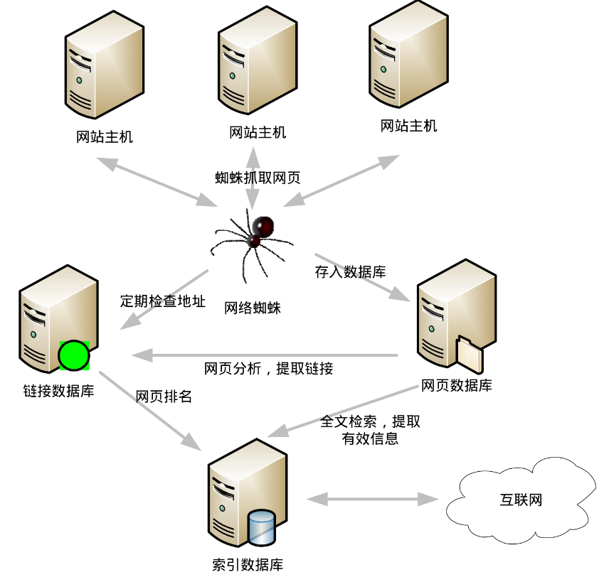

相信在座的所有同学都用过搜索引擎。那么，你知道它的大概工作原理吗？

当你精心制作了一个网页、或写了一篇博客、或者上传一组照片到互联网上，来自世界各地的无数“蜘蛛”便会蜂拥而至。所谓蜘蛛就是搜索引擎公司服务器上的软件，它如同蜘蛛一样把互联网当成了蜘蛛网，没日没夜的访问互联网上的各种信息。

它抓取并复制你的网页，且通过你网页上的链接爬上更多的页面，将所有信息纳入到搜索引擎网站的索引数据库。服务器拆解你网页上的文字内容、标记关键词的位置、字体、颜色，以及相关图片、音频、视频的位置等信息，并生成庞大的索引记录，如图 8-1-1 所示。

当你在搜索引擎上输入一个单词，点击“搜索”按钮时，它会在不到 1 秒的时间，带着单词奔向索引数据库的每个“神经末梢”​，检索到所有包含搜索词的网页，依据它们的浏览次数与关联性等一系列算法确定网页级别，排列出顺序，最终按你期望的格式呈现在网页上。

这就是一个“关键词”的云端之旅。在过去的 10 多年里，成就了本世纪最早期的创新明星 Google，还有 Yandex、Navar 和百度等来自全球各地的搜索引擎，搜索引擎已经成为人们最依赖的互联网工具。

作为学习编程的人，面对查找或者叫做搜索（Search）这种最为频繁的操作，理解它的原理并学习应用它是非常必要的事情，让我们开始对“Search”的探索之旅吧。
