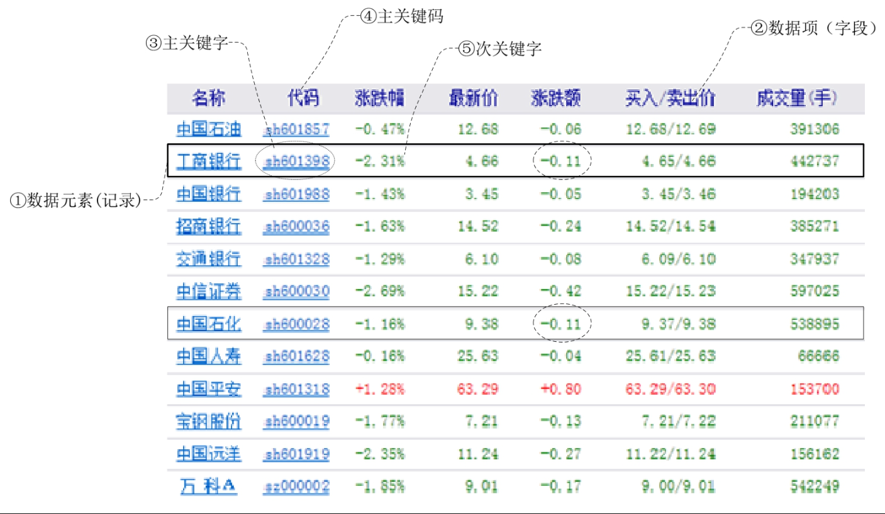

只要你打开电脑，就会涉及到查找技术。如炒股软件中查股票信息、硬盘文件中找照片、在光盘中搜 DVD，甚至玩游戏时在内存中查找攻击力、魅力值等数据修改用来作弊等，都要涉及到查找。当然，在互联网上查找信息就更加是家常便饭。所有这些需要被查的数据所在的集合，我们给它一个统称叫查找表。

查找表（Search Table）是由同一类型的数据元素（或记录）构成的集合。例如图 8-2-1 就是一个查找表。

关键字（Key）是数据元素中某个数据项的值，又称为键值，用它可以标识一个数据元素。也可以标识一个记录的某个数据项（字段）​，我们称为关键码，如图 8-2-1 中 ① 和 ② 所示。

若此关键字可以唯一地标识一个记录，则称此关键字为主关键字（Primary Key）​。注意这也就意味着，对不同的记录，其主关键字均不相同。主关键字所在的数据项称为主关键码，如图 8-2-1 中 ③ 和 ④ 所示。

那么对于那些可以识别多个数据元素（或记录）的关键字，我们称为次关键字（Secondary Key），如图 8-2-1 中 ⑤ 所示。次关键字也可以理解为是不以唯一标识一个数据元素（或记录）的关键字，它对应的数据项就是次关键码。



```
查找（Searching）就是根据给定的某个值，在查找表中确定一个其关键字等于给定值的数据元素（或记录）​。
```

若表中存在这样的一个记录，则称查找是成功的，此时查找的结果给出整个记录的信息，或指示该记录在查找表中的位置。比如图 8-2-1 所示，如果我们查找主关键码“代码”的主关键字为“sh601398”的记录时，就可以得到第 2 条唯一记录。如果我们查找次关键码“涨跌额”为“-0.11”的记录时，就可以得到两条记录。

若表中不存在关键字等于给定值的记录，则称查找不成功，此时查找的结果可给出一个“空”记录或“空”指针。

查找表按照操作方式来分有两大种：静态查找表和动态查找表。

静态查找表（Stat​ic Search Table）​：只作查找操作的查找表。它的主要操作有：

- 查询某个“特定的”数据元素是否在查找表中。
- 检索某个“特定的”数据元素和各种属性。

按照我们大多数人的理解，查找，当然是在已经有的数据中找到我们需要的。静态查找就是在干这样的事情，不过，现实中还有存在这样的应用：查找的目的不仅仅只是查找。

比如网络时代的新名词，如反应年轻人生活的“蜗居”、“蚁族”、“孩奴”、“啃老”等，以及“X 客”系列如博客、播客、闪客、黑客、威客等，如果需要将它们收录到汉语词典中，显然收录时就需要查找它们是否存在，以及找到如果不存在时应该收录的位置。再比如，如果你需要对某网站上亿的注册用户进行清理工作，注销一些非法用户，你就需查找到它们后进行删除，删除后其实整个查找表也会发生变化。对于这样的应用，我们就引入了动态查找表。

动态查找表（Dynamic Search Table）​：在查找过程中同时插入查找表中不存在的数据元素，或者从查找表中删除已经存在的某个数据元素。显然动态查找表的操作就是两个：

- 查找时插入数据元素。
- 查找时删除数据元素。

为了提高查找的效率，我们需要专门为查找操作设置数据结构，这种面向查找操作的数据结构称为查找结构。

从逻辑上来说，查找所基于的数据结构是集合，集合中的记录之间没有本质关系。可是要想获得较高的查找性能，我们就不能不改变数据元素之间的关系，在存储时可以将查找集合组织成表、树等结构。

例如，对于静态查找表来说，我们不妨应用线性表结构来组织数据，这样可以使用顺序查找算法，如果再对主关键字排序，则可以应用折半查找等技术进行高效的查找。

如果是需要动态查找，则会复杂一些，可以考虑二叉排序树的查找技术。

另外，还可以用散列表结构来解决一些查找问题，这些技术都将在后面的讲解中说明。
