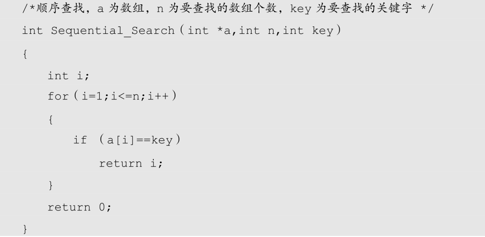

试想一下，要在散落的一大堆书中找到你需要的那本有多么麻烦。碰到这种情况的人大都会考虑做一件事，那就是把这些书排列整齐，比如竖起来放置在书架上，这样根据书名，就很容易查找到需要的图书，如图 8-3-1 所示。


散落的图书可以理解为一个集合，而将它们排列整齐，就如同是将此集合构造成一个线性表。我们要针对这一线性表进行查找操作，因此它就是静态查找表。

此时图书尽管已经排列整齐，但还没有分类，因此我们要找书只能从头到尾或从尾到头一本一本查看，直到找到或全部查找完为止。这就是我们现在要讲的顺序查找。

顺序查找（Sequent​ial Search）又叫线性查找，是最基本的查找技术，它的查找过程是：从表中第一个（或最后一个）记录开始，逐个进行记录的关键字和给定值比较，若某个记录的关键字和给定值相等，则查找成功，找到所查的记录；如果直到最后一个（或第一个）记录，其关键字和给定值比较都不等时，则表中没有所查的记录，查找不成功。

## 8.3.1 顺序表查找算法

顺序查找的算法实现如下。



这段代码非常简单，就是在数组 a（注意元素值从下标 1 开始）中查看有没有关键字（key）​，当你需要查找复杂表结构的记录时，只需要把数组 a 与关键字 key 定义成你需要的表结构和数据类型即可。

## 8.3.2 　顺序表查找优化

到这里并非足够完美，因为每次循环时都需要对 i 是否越界，即是否小于等于 n 作判断。事实上，还可以有更好一点的办法，设置一个哨兵，可以解决不需要每次让 i 与 n 作比较。看下面的改进后的顺序查找算法代码。

```c++
    /* 有哨兵顺序查找 */
    int Sequential_Search2（int *a,int n,int key）
    {
        int i;
        a[0]=key; /* 设置a[0]为关键字值，我们称之为“哨兵”*/
        i=n;         /* 循环从数组尾部开始 */
        while（a[i]!=key）
        {
            i--;
        }
        return i; /* 返回0则说明查找失败 */
    }
```

此时代码是从尾部开始查找，由于 a[0]=key，也就是说，如果在 a[i]中有 key 则返回 i 值，查找成功。否则一定在最终的 a[0]处等于 key，此时返回的是 0，即说明 a[1]～ a[n]中没有关键字 key，查找失败。

这种在查找方向的尽头放置“哨兵”免去了在查找过程中每一次比较后都要判断查找位置是否越界的小技巧，看似与原先差别不大，但在总数据较多时，效率提高很大，是非常好的编码技巧。当然，​“哨兵”也不一定就一定要在数组开始，也可以在末端。

对于这种顺序查找算法来说，查找成功最好的情况就是在第一个位置就找到了，算法时间复杂度为 O(1)，最坏的情况是在最后一位置才找到，需要 n 次比较，时间复杂度为 O(n)，当查找不成功时，需要 n+1 次比较，时间复杂度为 O(n)。我们之前推导过，关键字在任何一位置的概率是相同的，所以平均查找次数为(n+1)/2，所以最终时间复杂度还是 O(n)。

很显然，顺序查找技术是有很大缺点的，n 很大时，查找效率极为低下，不过优点也是有的，这个算法非常简单，对静态查找表的记录没有任何要求，在一些小型数据的查找时，是可以适用的。

另外，也正由于查找概率的不同，我们完全可以将容易查找到的记录放在前面，而不常用的记录放置在后面，效率就可以有大幅提高。
