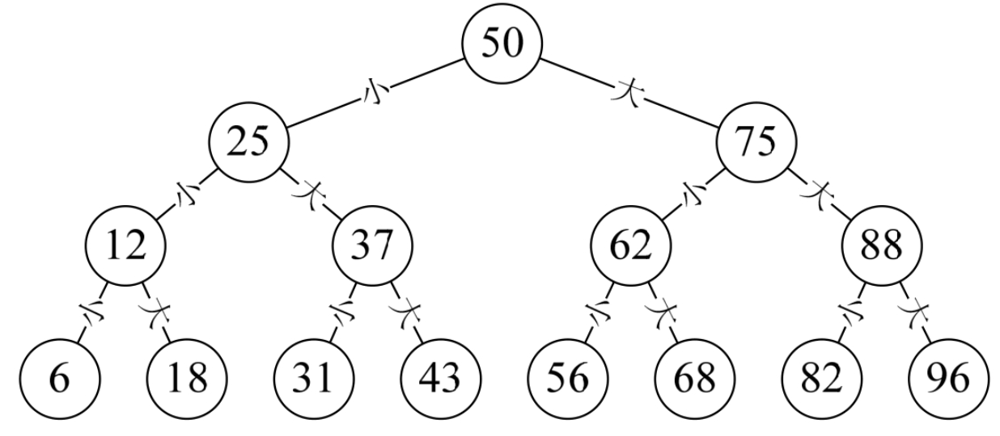
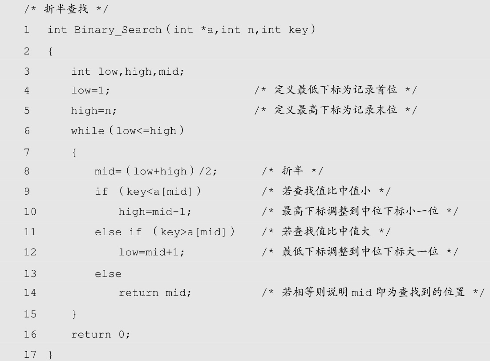
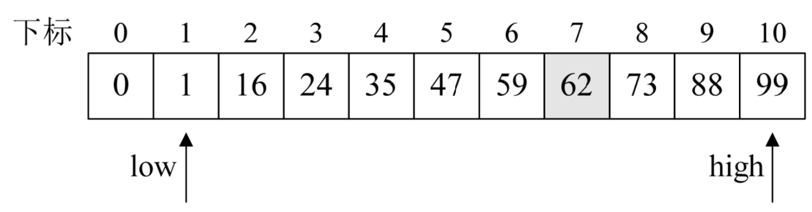
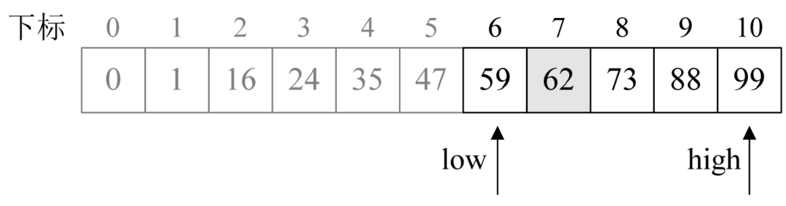
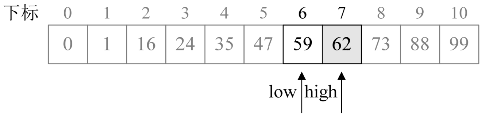
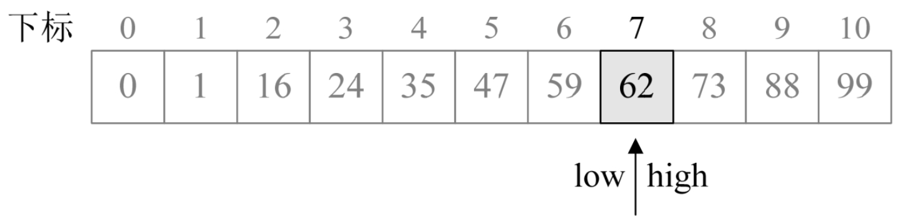
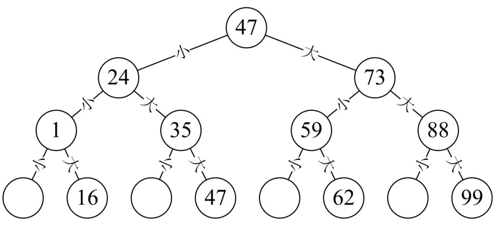

我们如果仅仅是把书整理在书架上，要找到一本书还是比较困难的，也就是刚才讲的需要逐个顺序查找。但如果我们在整理书架时，将图书按照书名的拼音排序放置，那么要找到某一本书就相对容易了。说白了，就是对图书做了有序排列，一个线性表有序时，对于查找总是很有帮助的。

## 8.4.1 　折半查找

我们在讲树结构的二叉树定义（本书第 6.5 节）时，曾经提到过一个小游戏，我在纸上已经写好了一个 100 以内的正整数数字请你猜，问几次可以猜出来，当时已经介绍了如何最快猜出这个数字。我们把这种每次取中间记录查找的方法叫做折半查找，如图 8-4-1 所示。

折半查找（Binary Search）技术，又称为二分查找。它的前提是线性表中的记录必须是关键码有序（通常从小到大有序）​，线性表必须采用顺序存储。折半查找的基本思想是：在有序表中，取中间记录作为比较对象，若给定值与中间记录的关键字相等，则查找成功；若给定值小于中间记录的关键字，则在中间记录的左半区继续查找；若给定值大于中间记录的关键字，则在中间记录的右半区继续查找。不断重复上述过程，直到查找成功，或所有查找区域无记录，查找失败为止。

假设我们现在有这样一个有序表数组{0,1,16,24,35,47,59,62,73,88,99}，除 0 下标外共 10 个数字。对它进行查找是否存在 62 这个数。我们来看折半查找的算法是如何工作的。

1. 程序开始运行，参数 a={0,1,16,24,35,47,59,62,73,88,99}，n=10，key=62，第 3 ～ 5 行，此时 low=1，high=10，如图 8-4-2 所示。

2. 第 6 ～ 15 行循环，进行查找。
3. 第 8 行，mid 计算得 5，由于 `a[5]=47<key` ，所以执行了第 12 行，low=5+1=6，如图 8-4-3 所示。

4. 再次循环，mid=(6+10)/2=8，此时 `a[8]=73>key` ，所以执行第 10 行，high=8－1=7，如图 8-4-4 所示。

5. 再次循环，mid=(6+7)/2=6，此时 `a[6]=59<key` ，所以执行 12 行，low=6+1=7，如图 8-4-5 所示。

该算法还是比较容易理解的，同时我们也能感觉到它的效率非常高。但到底高多少？关键在于此算法的时间复杂度分析。

首先，我们将这个数组的查找过程绘制成一棵二叉树，如图 8-4-6 所示，从图上就可以理解，如果查找的关键字不是中间记录 47 的话，折半查找等于是把静态有序查找表分成了两棵子树，即查找结果只需要找其中的一半数据记录即可，等于工作量少了一半，然后继续折半查找，效率当然是非常高了。

我们之前 6.6 节讲的二叉树的性质 4，有过对“具有 n 个结点的完全二叉树的深度为⌊log2n⌋+1。”性质的推导过程。在这里尽管折半查找判定二叉树并不是完全二叉树，但同样相同的推导可以得出，最坏情况是查找到关键字或查找失败的次数为⌊log2n⌋+1。

有人还在问最好的情况？那还用说吗，当然是 1 次了。

因此最终我们折半算法的时间复杂度为 O(logn)，它显然远远好于顺序查找的 O(n)时间复杂度了。

不过由于折半查找的前提条件是需要有序表顺序存储，对于静态查找表，一次排序后不再变化，这样的算法已经比较好了。但对于需要频繁执行插入或删除操作的数据集来说，维护有序的排序会带来不小的工作量，那就不建议使用。
