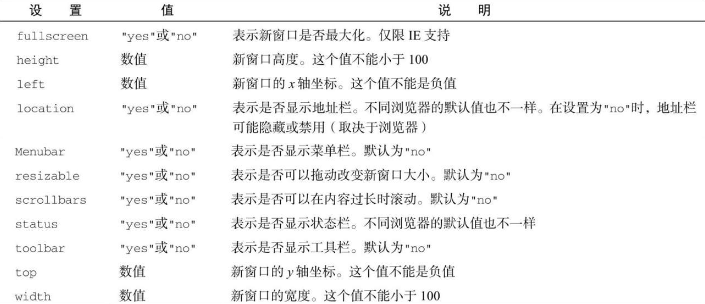

window.open()方法可以用于导航到指定 URL，也可以用于打开新浏览器窗口。这个方法接收 4 个参数：要加载的 URL、目标窗口、特性字符串和表示新窗口在浏览器历史记录中是否替代当前加载页面的布尔值。通常，调用这个方法时只传前 3 个参数，最后一个参数只有在不打开新窗口时才会使用。

如果 window.open()的第二个参数是一个已经存在的窗口或窗格（frame）的名字，则会在对应的窗口或窗格中打开 URL。下面是一个例子：

```javascript
// 与<a href="http://www.wrox.com" target="topFrame"/>相同
window.open("http://www.wrox.com/", "topFrame");
```

执行这行代码的结果就如同用户点击了一个 href 属性为"http://www.wrox.com", target 属性为"topFrame"的链接。如果有一个窗口名叫"topFrame"，则这个窗口就会打开这个 URL；否则就会打开一个新窗口并将其命名为"topFrame"。第二个参数也可以是一个特殊的窗口名，比如 `_self` 、 `_parent`、 `_top` 或 `_blank` 。

## 1．弹出窗口

如果 window.open()的第二个参数不是已有窗口，则会打开一个新窗口或标签页。第三个参数，即特性字符串，用于指定新窗口的配置。如果没有传第三个参数，则新窗口（或标签页）会带有所有默认的浏览器特性（工具栏、地址栏、状态栏等都是默认配置）​。如果打开的不是新窗口，则忽略第三个参数。

特性字符串是一个逗号分隔的设置字符串，用于指定新窗口包含的特性。下表列出了一些选项。



这些设置需要以逗号分隔的名值对形式出现，其中名值对以等号连接。​（特性字符串中不能包含空格。​）来看下面的例子：

```javascript
window.open(
  "http://www.wrox.com/",
  "wroxWindow",
  "height=400, width=400, top=10, left=10, resizable=yes"
);
```

这行代码会打开一个可缩放的新窗口，大小为 400 像素 ×400 像素，位于离屏幕左边及顶边各 10 像素的位置。

window.open()方法返回一个对新建窗口的引用。这个对象与普通 window 对象没有区别，只是为控制新窗口提供了方便。例如，某些浏览器默认不允许缩放或移动主窗口，但可能允许缩放或移动通过 window.open()创建的窗口。跟使用任何 window 对象一样，可以使用这个对象操纵新打开的窗口。

```javascript
let wroxWin = window.open(
  "http://www.wrox.com/",
  "wroxWindow",
  "height=400, width=400, top=10, left=10, resizable=yes"
);
// 缩放
wroxWin.resizeTo(500, 500);
// 移动
wroxWin.moveTo(100, 100);
```

还可以使用 close()方法像这样关闭新打开的窗口：

```javascript
wroxWin.close();
```

这个方法只能用于 window.open()创建的弹出窗口。虽然不可能不经用户确认就关闭主窗口，但弹出窗口可以调用 top.close()来关闭自己。关闭窗口以后，窗口的引用虽然还在，但只能用于检查其 closed 属性了：

```javascript
wroxWin.close();
alert(wroxWin.closed); // true
```

新创建窗口的 window 对象有一个属性 opener，指向打开它的窗口。这个属性只在弹出窗口的最上层 window 对象（top）有定义，是指向调用 window.open()打开它的窗口或窗格的指针。例如：

```javascript
let wroxWin = window.open(
  "http://www.wrox.com/",
  "wroxWindow",
  "height=400, width=400, top=10, left=10, resizable=yes"
);
alert(wroxWin.opener === window); // true
```

虽然新建窗口中有指向打开它的窗口的指针，但反之则不然。窗口不会跟踪记录自己打开的新窗口，因此开发者需要自己记录。

在某些浏览器中，每个标签页会运行在独立的进程中。如果一个标签页打开了另一个，而 window 对象需要跟另一个标签页通信，那么标签便不能运行在独立的进程中。在这些浏览器中，可以将新打开的标签页的 opener 属性设置为 null，表示新打开的标签页可以运行在独立的进程中。比如：

```javascript
let wroxWin = window.open(
  "http://www.wrox.com/",
  "wroxWindow",
  "height=400, width=400, top=10, left=10, resizable=yes"
);
wroxWin.opener = null;
```

把 opener 设置为 null 表示新打开的标签页不需要与打开它的标签页通信，因此可以在独立进程中运行。这个连接一旦切断，就无法恢复了。

## 2．安全限制

弹出窗口有段时间被在线广告用滥了。很多在线广告会把弹出窗口伪装成系统对话框，诱导用户点击。因为长得像系统对话框，所以用户很难分清这些弹窗的来源。为了让用户能够区分清楚，浏览器开始对弹窗施加限制。

IE 的早期版本实现针对弹窗的多重安全限制，包括不允许创建弹窗或把弹窗移出屏幕之外，以及不允许隐藏状态栏等。从 IE7 开始，地址栏也不能隐藏了，而且弹窗默认是不能移动或缩放的。Firefox 1 禁用了隐藏状态栏的功能，因此无论 window.open()的特性字符串是什么，都不会隐藏弹窗的状态栏。Firefox 3 强制弹窗始终显示地址栏。Opera 只会在主窗口中打开新窗口，但不允许它们出现在系统对话框的位置。

此外，浏览器会在用户操作下才允许创建弹窗。在网页加载过程中调用 window.open()没有效果，而且还可能导致向用户显示错误。弹窗通常可能在鼠标点击或按下键盘中某个键的情况下才能打开。

```
注意 IE对打开本地网页的窗口再弹窗解除了某些限制。同样的代码如果来自服务器，则会施加弹窗限制。
```

## 3．弹窗屏蔽程序

所有现代浏览器都内置了屏蔽弹窗的程序，因此大多数意料之外的弹窗都会被屏蔽。在浏览器屏蔽弹窗时，可能会发生一些事。如果浏览器内置的弹窗屏蔽程序阻止了弹窗，那么 window.open()很可能会返回 null。此时，只要检查这个方法的返回值就可以知道弹窗是否被屏蔽了，比如：

```javascript
let wroxWin = window.open("http://www.wrox.com", "_blank");
if (wroxWin == null) {
  alert("The popup was blocked! ");
}
```

在浏览器扩展或其他程序屏蔽弹窗时，window.open()通常会抛出错误。因此要准确检测弹窗是否被屏蔽，除了检测 window.open()的返回值，还要把它用 try/catch 包装起来，像这样：

```javascript
let blocked = false;
try {
  let wroxWin = window.open("http://www.wrox.com", "_blank");
  if (wroxWin == null) {
    blocked = true;
  }
} catch (ex) {
  blocked = true;
}
if (blocked) {
  alert("Thepopupwasblocked!");
}
```

无论弹窗是用什么方法屏蔽的，以上代码都可以准确判断调用 window.open()的弹窗是否被屏蔽了。

```
注意 检查弹窗是否被屏蔽，不影响浏览器显示关于弹窗被屏蔽的消息。
```
