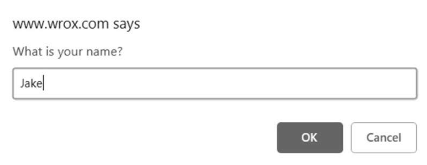

使用 alert()、confirm()和 prompt()方法，可以让浏览器调用系统对话框向用户显示消息。这些对话框与浏览器中显示的网页无关，而且也不包含 HTML。它们的外观由操作系统或者浏览器决定，无法使用 CSS 设置。此外，这些对话框都是同步的模态对话框，即在它们显示的时候，代码会停止执行，在它们消失以后，代码才会恢复执行。

alert()方法在本书示例中经常用到。它接收一个要显示给用户的字符串。与 console.log 可以接收任意数量的参数且能一次性打印这些参数不同，alert()只接收一个参数。调用 alert()时，传入的字符串会显示在一个系统对话框中。对话框只有一个“OK”​（确定）按钮。如果传给 alert()的参数不是一个原始字符串，则会调用这个值的 toString()方法将其转换为字符串。

警告框（alert）通常用于向用户显示一些他们无法控制的消息，比如报错。用户唯一的选择就是在看到警告框之后把它关闭。图 12-1 展示了一个警告框。


第二种对话框叫确认框，通过调用 confirm()来显示。确认框跟警告框类似，都会向用户显示消息。但不同之处在于，确认框有两个按钮：​“Cancel”​（取消）和“OK”​（确定）​。用户通过单击不同的按钮表明希望接下来执行什么操作。比如，confirm("Are you sure? ")会显示图 12-2 所示的确认框。


要知道用户单击了 OK 按钮还是 Cancel 按钮，可以判断 confirm()方法的返回值：true 表示单击了 OK 按钮，false 表示单击了 Cancel 按钮或者通过单击某一角上的 X 图标关闭了确认框。确认框的典型用法如下所示：

```javascript
if (confirm("Are you sure? ")) {
  alert("I'm so glad you're sure! ");
} else {
  alert("I'm sorry to hear you're not sure.");
}
```

在这个例子中，第一行代码向用户显示了确认框，也就是 if 语句的条件。如果用户单击了 OK 按钮，则会弹出警告框显示"I'm so glad you're sure!"。如果单击了 Cancel，则会显示"I'm sorry to hear you're not sure."。确认框通常用于让用户确认执行某个操作，比如删除邮件等。因为这种对话框会完全打断正在浏览网页的用户，所以应该在必要时再使用。

最后一种对话框是提示框，通过调用 prompt()方法来显示。提示框的用途是提示用户输入消息。除了 OK 和 Cancel 按钮，提示框还会显示一个文本框，让用户输入内容。prompt()方法接收两个参数：要显示给用户的文本，以及文本框的默认值（可以是空字符串）​。调用 prompt("What isyour name? ","Jake")会显示图 12-3 所示的提示框。



如果用户单击了 OK 按钮，则 prompt()会返回文本框中的值。如果用户单击了 Cancel 按钮，或者对话框被关闭，则 prompt()会返回 null。下面是一个例子：

```javascript
let result = prompt("What is your name? ", "");
if (result !== null) {
  alert("Welcome, " + result);
}
```

这些系统对话框可以向用户显示消息、确认操作和获取输入。由于不需要 HTML 和 CSS，所以系统对话框是 Web 应用程序最简单快捷的沟通手段。

很多浏览器针对这些系统对话框添加了特殊功能。如果网页中的脚本生成了两个或更多系统对话框，则除第一个之外所有后续的对话框上都会显示一个复选框，如果用户选中则会禁用后续的弹框，直到页面刷新。

如果用户选中了复选框并关闭了对话框，在页面刷新之前，所有系统对话框（警告框、确认框、提示框）都会被屏蔽。开发者无法获悉这些对话框是否显示了。对话框计数器会在浏览器空闲时重置，因此如果两次独立的用户操作分别产生了两个警告框，则两个警告框上都不会显示屏蔽复选框。如果一次独立的用户操作连续产生了两个警告框，则第二个警告框会显示复选框。

JavaScript 还可以显示另外两种对话框：find()和 print()。这两种对话框都是异步显示的，即控制权会立即返回给脚本。用户在浏览器菜单上选择“查找”​（find）和“打印”​（print）时显示的就是这两种对话框。通过在 window 对象上调用 find()和 print()可以显示它们，比如：

```javascript
// 显示打印对话框
window.print();
// 显示查找对话框
window.find();
```

这两个方法不会返回任何有关用户在对话框中执行了什么操作的信息，因此很难加以利用。此外，因为这两种对话框是异步的，所以浏览器的对话框计数器不会涉及它们，而且用户选择禁用对话框对它们也没有影响。
