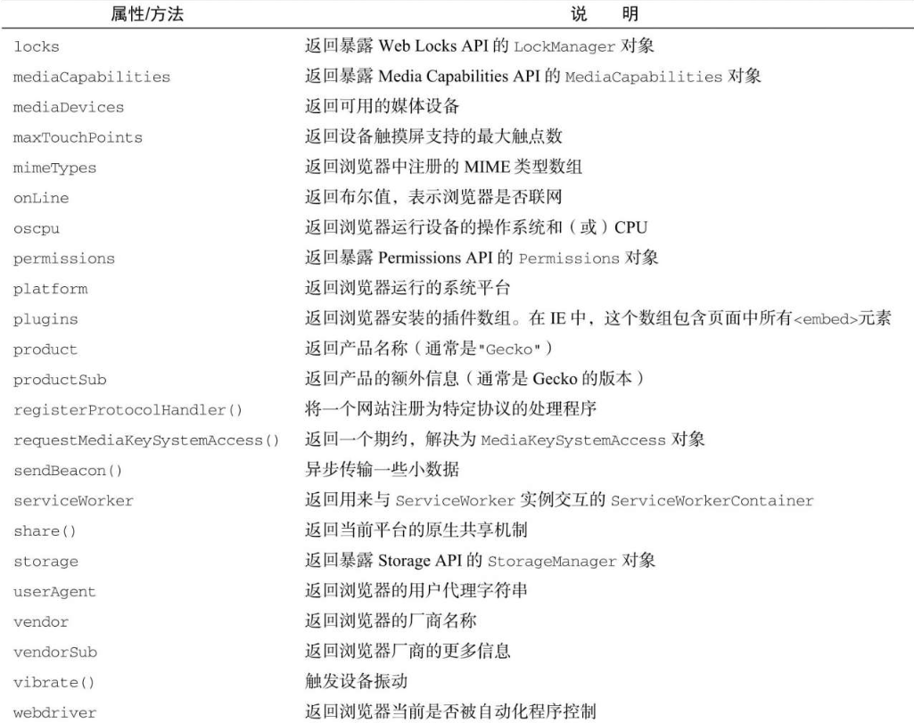

navigator 是由 Netscape Navigator 2 最早引入浏览器的，现在已经成为客户端标识浏览器的标准。只要浏览器启用 JavaScript, navigator 对象就一定存在。但是与其他 BOM 对象一样，每个浏览器都支持自己的属性。

```
注意 navigator对象中关于系统能力的属性将在第13章详细介绍。
```

navigator 对象实现了 NavigatorID、NavigatorLanguage、NavigatorOnLine、NavigatorContentUtils、NavigatorStorage、NavigatorStorageUtils、Navigator-ConcurrentHardware、NavigatorPlugins 和 NavigatorUserMedia 接口定义的属性和方法。

下表列出了这些接口定义的属性和方法：



