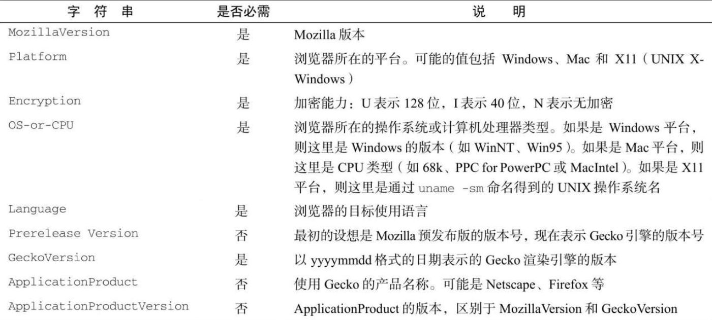

HTTP 规范（1.0 和 1.1）要求浏览器应该向服务器发送包含浏览器名称和版本信息的简短字符串。RFC 2616（HTTP 1.1）是这样描述用户代理字符串的：

- 产品标记用于通过软件名称和版本来标识通信产品的身份。多数使用产品标记的字段也允许列出属于应用主要部分的子产品，以空格分隔。按照约定，产品按照标识应用重要程度的先后顺序列出。

这个规范进一步要求用户代理字符串应该是“标记/版本”形式的产品列表。但现实当中的用户代理字符串远没有那么简单。

## 1．早期浏览器

美国国家超级计算应用中心（NCSA, National Center forSupercomputing Applications）发布于 1993 年的 Mosaic 是早期 Web 浏览器的代表，其用户代理字符串相当简单，类似于：

```
    Mosaic/0.9
```

虽然在不同操作系统和平台中可能会有所不同，但基本形式都是这么简单直接。斜杠前是产品名称（有时候可能是“NCSA Mosaic”之类的）​，斜杠后是产品版本。

在网景公司准备开发浏览器时，代号确定为“Mozilla”​（Mosaic Killer 的简写）​。第一个公开发行版 Netscape Navigator 2 的用户代理字符串是这样的：

```
    Mozilla/Version[Language] (Platform;Encryption)
```

网景公司遵守了将产品名称和版本作为用户代理字符串的规定，但又在后面添加了如下信息。

- Language：语言代码，表示浏览器的目标使用语言。
- Platform：表示浏览器所在的操作系统和/或平台。
- Encryption：包含的安全加密类型，可能的值是 U（128 位加密）、I（40 位加密）和 N（无加密）​。

Netscape Navigator 2 的典型用户代理字符串如下所示：

```
    Mozilla/2.02 [fr] (WinNT; I)
```

这个字符串表示 Netscape Navigator 2.02，在主要使用法语地区的发行，运行在 Windows NT 上，40 位加密。总体上看，通过产品名称还是很容易知道这是什么浏览器的。

## 2．Netscape Navigator 3 和 IE3

1996 年，Netscape Navigator 3 发布之后超过 Mosaic 成为最受欢迎的浏览器。其用户代理字符串也发生了一些小变化，删除了语言信息，并将操作系统或系统 CPU 信息（OS-or-CPU description）等列为可选信息。此时的格式如下：

```
    Mozilla/Version(Platform; Encryption[; OS-or-CPUdescription])
```

运行在 Windows 系统上的 Netscape Navigator 3 的典型用户代理字符串如下：

```
    Mozilla/3.0 (Win95; U)
```

这个字符串表示 Netscape Navigator 3 运行在 Windows 95 上，采用了 128 位加密。注意在 Windows 系统上，没有“OS-or-CPU”部分。

Netscape Navigator 3 发布后不久，微软也首次对外发布了 IE3。这是因为当时 Netscape Navigator 是市场占有率最高的浏览器，很多服务器在返回网页之前都会特意检测其用户代理字符串。如果 IE 因此打不开网页，那么这个当时初出茅庐的浏览器就会遭受重创。为此，IE 就在用户代理字符串中添加了兼容 Netscape 用户代理字符串的内容。结果格式为：

```
    Mozilla/2.0 (compatible; MSIE Version;OperatingSystem)
```

比如，Windows 95 平台上的 IE3.02 的用户代理字符串如下：

```
    Mozilla/2.0 (compatible; MSIE 3.02; Windows 95)
```

当时的大多数浏览器检测程序都只看用户代理字符串中的产品名称，因此 IE 成功地将自己伪装成了 Mozilla，也就是 Netscape Navigator。这个做法引发了一些争议，因为它违反了浏览器标识的初衷。另外，真正的浏览器版本也跑到了字符串中间。

这个字符串中还有一个地方很有意思，即它将自己标识为 Mozilla 2.0 而不是 3.0。3.0 是当时市面上使用最多的版本，按理说使用这个版本更合逻辑。背后的原因至今也没有揭开，不过很可能就是当事人一时大意造成的。

## 3．Netscape Communicator 4 和 IE4~8

1997 年 8 月，Netscape Communicator 4 发布（这次发布将 Navigator 改成了 Communicator）​。Netscape 在这个版本中仍然沿用了上一个版本的格式：

```
    Mozilla/Version(Platform; Encryption[; OS-or-CPUdescription])
```

比如，Windows 98 上的第 4 版，其用户代理字符串就是这样的：

```
    Mozilla/4.0 (Win98; I)
```

如果发布了补丁，则相应增加版本号，比如下面是 4.79 版的字符串：

```
    Mozilla/4.79 (Win98; I)
```

微软在发布 IE4 时只更新了版本，格式不变：

```
    Mozilla/4.0 (compatible; MSIE Version; OperatingSystem)
```

比如，Windows 98 上运行的 IE4 的字符串如下：

```
    Mozilla/4.0 (compatible; MSIE 4.0; Windows 98)
```

更新版本号之后，IE 的版本号跟 Mozilla 的就一致了，识别同为第 4 代的两款浏览器也方便了。可是，这种版本同步就此打住。在 IE4.5（只针对 Mac）面世时，Mozilla 的版本号还是 4, IE 的版本号却变了：

```
    Mozilla/4.0 (compatible; MSIE 4.5; Mac_PowerPC)
```

直到 IE7, Mozilla 的版本号就没有变过，比如：

```
    Mozilla/4.0 (compatible; MSIE 7.0; Windows NT 5.1)
```

IE8 在用户代理字符串中添加了额外的标识“Trident”​，就是浏览器渲染引擎的代号。格式变成：

```
    Mozilla/4.0 (compatible; MSIE Version;OperatingSystem; Trident/TridentVersion)
```

比如：

```
    Mozilla/4.0 (compatible; MSIE 8.0; Windows NT 5.1; Trident/4.0)
```

这个新增的“Trident”是为了让开发者知道什么时候 IE8 运行兼容模式。在兼容模式下，MSIE 的版本会变成 7，但 Trident 的版本不变：

```
    Mozilla/4.0 (compatible; MSIE 7.0; Windows NT 5.1; Trident/4.0)
```

添加这个标识之后，就可以确定浏览器究竟是 IE7（没有“Trident”​）​，还是 IE8 运行在兼容模式。

IE9 稍微升级了一下用户代理字符串的格式。Mozilla 的版本增加到了 5.0,Trident 的版本号也增加到了 5.0。IE9 的默认用户代理字符串是这样的：

```
    Mozilla/5.0 (compatible; MSIE 9.0; Windows NT 6.1; Trident/5.0)
```

如果 IE9 运行兼容模式，则会恢复旧版的 Mozilla 和 MSIE 版本号，但 Trident 的版本号还是 5.0。比如，下面就是 IE9 运行在 IE7 兼容模式下的字符串：

```
    Mozilla/4.0(compatible; MSIE 7.0; Windows NT 6.1; Trident/5.0)
```

所有这些改变都是为了让之前的用户代理检测脚本正常运作，同时还能为新脚本提供额外的信息。

## 4．Gecko

Gecko 渲染引擎是 Firefox 的核心。Gecko 最初是作为通用 Mozilla 浏览器（即后来的 Netscape 6）的一部分开发的。有一个针对 Netscape 6 的用户代理字符串规范，规定了未来的版本应该如何构造这个字符串。新的格式与之前一直沿用到 4.x 版的格式有了很大出入：

```
    Mozilla/MozillaVersion(Platform;Encryption;OS-or-CPU;Language;
      PrereleaseVersion)Gecko/GeckoVersion
      ApplicationProduct/ApplicationProductVersion
```

这个复杂的用户代理字符串包含了不少想法。下表列出了其中每一部分的含义。



要更好地理解 Gecko 的用户代理字符串，最好是看几个不同的基于 Gecko 的浏览器返回的字符串。

Windowx XP 上的 Netscape 6.21：

```
    Mozilla/5.0 (Windows; U; Windows NT 5.1; en-US; rv:0.9.4) Gecko/20011128
      Netscape6/6.2.1
```

Linux 上的 SeaMonkey 1.1a：

```
    Mozilla/5.0 (X11; U; Linux i686; en-US; rv:1.8.1b2) Gecko/20060823 SeaMonkey/1.1a
```

Windows XP 上的 Firefox 2.0.0.11：

```
    Mozilla/5.0 (Windows; U; Windows NT 5.1; en-US; rv:1.8.1.11) Gecko/20071127
      Firefox/2.0.0.11
```

Mac OS X 上的 Camino 1.5.1：

```
    Mozilla/5.0 (Macintosh; U; Intel Mac OS X; en; rv:1.8.1.6) Gecko/20070809
      Camino/1.5.1
```

所有这些字符串都表示使用的是基于 Gecko 的浏览器（只是版本不同）​。有时候，相比于知道特定的浏览器，知道是不是基于 Gecko 才更重要。从第一个基于 Gecko 的浏览器发布开始，Mozilla 版本就是 5.0，一直没有变过。以后也不太可能会变。

在 Firefox 4 发布时，Mozilla 简化了用户代理字符串。主要变化包括以下几方面。

- 去掉了语言标记（即前面例子中的"en-US"）​。
- 在浏览器使用强加密时去掉加密标记（因为是默认了）​。这意味着 I 和 N 还可能出现，但 U 不可能出现了。
- 去掉了 Windows 平台上的平台标记，这是因为跟 OS-or-CPU 部分重复了，否则两个地方都会有 Windows。
- GeckoVersion 固定为"Gecko/20100101"。

下面是 Firefox 4 中用户代理字符串的例子：

```
    Mozilla/5.0 (Windows NT 6.1; rv:2.0.1) Gecko/20100101 Firefox 4.0.1
```

## 5．WebKit

2003 年，苹果宣布将发布自己的浏览器 Safari。Safari 的渲染引擎叫 WebKit，是基于 Linux 平台浏览器 Konqueror 使用的渲染引擎 KHTML 开发的。几年后，WebKit 又拆分出自己的开源项目，专注于渲染引擎开发。

这个新浏览器和渲染引擎的开发者也面临与当初 IE3.0 时代同样的问题：怎样才能保证浏览器不被排除在流行的站点之外。答案就是在用户代理字符串中添加足够多的信息，让网站知道这个浏览器与其他浏览器是兼容的。于是 Safari 就有了下面这样的用户代理字符串：

```
    Mozilla/5.0 (Platform;Encryption;OS-or-CPU;Language)
      AppleWebKit/AppleWebKitVersion(KHTML, like Gecko) Safari/SafariVersion
```

下面是一个实际的例子：

```
    Mozilla/5.0 (Macintosh; U; PPC Mac OS X; en) AppleWebKit/124 (KHTML, like Gecko)
      Safari/125.1
```

这个字符串也很长，不仅包括苹果 WebKit 的版本，也包含 Safari 的版本。一开始还有是否需要将浏览器标识为 Mozilla 的争论，但考虑到兼容性很快就达成了一致。现在，所有基于 WebKit 的浏览器都将自己标识为 Mozilla 5.0，与所有基于 Gecko 的浏览器一样。Safari 版本通常是浏览器的构建编号，不一定表示发布的版本号。比如 Safari 1.25 在用户代理字符串中的版本是 125.1，但也不一定始终这样对应。

Safari 用户代理字符串中最受争议的部分是在 1.0 预发布版中添加的"(KHTML, like Gecko)"。由于有意想让客户端和服务器把 Safari 当成基于 Gecko 的浏览器（好像光添加"Mozilla/5.0"还不够）​，苹果也招来了很多开发者的反对。苹果的回应与微软当初 IE 遭受质疑时一样：Safari 与 Mozilla 兼容，不能让网站以为用户使用了不受支持的浏览器而把 Safari 排斥在外。

Safari 的用户代理字符串在第 3 版时有所改进。下面的版本标记现在用来表示 Safari 实际的版本号：

```
    Mozilla/5.0 (Macintosh; U; PPC Mac OS X; en) AppleWebKit/522.15.5
      (KHTML, like Gecko) Version/3.0.3Safari/522.15.5
```

注意这个变化只针对 Safari 而不包括 WebKit。因此，其他基于 WebKit 的浏览器可能不会有这个变化。一般来说，与 Gecko 一样，通常识别是不是 WebKit 比识别是不是 Safari 更重要。

## 6．Konqueror

Konqueror 是与 KDE Linux 桌面环境打包发布的浏览器，基于开源渲染引擎 KHTML。虽然只有 Linux 平台的版本，Konqueror 的用户却不少。为实现最大化兼容，Konqueror 决定采用 Internet Explore 的用户代理字符串格式：

```
    Mozilla/5.0 (compatible; Konqueror/Version;OS-or-CPU)
```

不过，Konqueror 3.2 为了与 WebKit 就标识为 KHTML 保持一致，也对格式做了一点修改：

```
    Mozilla/5.0 (compatible; Konqueror/Version;OS-or-CPU) KHTML/KHTMLVersion
      (like Gecko)
```

下面是一个例子：

```
    Mozilla/5.0 (compatible; Konqueror/3.5; SunOS) KHTML/3.5.0 (like Gecko)
```

Konqueror 和 KHTML 的版本号通常是一致的，有时候也只有子版本号不同。比如 Konqueror 是 3.5，而 KHTML 是 3.5.1。

## 7．Chrome

谷歌的 Chrome 浏览器使用 Blink 作为渲染引擎，使用 V8 作为 JavaScript 引擎。Chrome 的用户代理字符串包含所有 WebKit 的信息，另外又加上了 Chrome 及其版本的信息。其格式如下所示：

```
    Mozilla/5.0 (Platform;Encryption;OS-or-CPU;Language)
      AppleWebKit/AppleWebKitVersion(KHTML, like Gecko)
      Chrome/ChromeVersionSafari/SafariVersion
```

以下是 Chrome 7 完整的用户代理字符串：

```
    Mozilla/5.0 (Windows; U; Windows NT 5.1; en-US) AppleWebKit/534.7
      (KHTML, like Gecko) Chrome/7.0.517.44 Safari/534.7
```

其中的 Safari 版本和 WebKit 版本有可能始终保持一致，但也不能肯定。

## 8．Opera

在用户代理字符串方面引发争议最大的一个浏览器就是 Opera。Opera 默认的用户代理字符串是所有现代浏览器中最符合逻辑的，因为它正确标识了自己和版本。在 Opera 8 之前，其用户代理字符串都是这个格式：

```
    Opera/Version(OS-or-CPU;Encryption) [Language]
```

比如，Windows XP 上的 Opera 7.54 的字符串是这样的：

```
    Opera/7.54 (Windows NT 5.1; U) [en]
```

Opera 8 发布后，语言标记从括号外挪到了括号内，目的是与其他浏览器保持一致：

```
    Opera/Version(OS-or-CPU; Encryption; Language)
```

Windows XP 上的 Opera 8 的字符串是这样的：

```
    Opera/8.0 (Windows NT 5.1; U; en)
```

默认情况下，Opera 会返回这个简单的用户代理字符串。这是唯一一个使用产品名称和版本完全标识自身的主流浏览器。不过，与其他浏览器一样，Opera 也遇到了使用这种字符串的问题。虽然从技术角度看这是正确的，但网上已经有了很多浏览器检测代码只考虑 Mozilla 这个产品名称。还有不少代码专门针对 IE 或 Gecko。为了不让这些检测代码判断错误，Opera 坚持使用唯一标识自身的字符串。

从 Opera 9 开始，Opera 也采用了两个策略改变自己的字符串。一是把自己标识为别的浏览器，如 Firefox 或 IE。这时候的字符串跟 Firefox 和 IE 的一样，只不过末尾会多一个"Opera"及其版本号。比如：

```
    Mozilla/5.0 (Windows NT 5.1; U; en; rv:1.8.1) Gecko/20061208 Firefox/2.0.0
      Opera 9.50
    Mozilla/4.0 (compatible; MSIE 6.0; Windows NT 5.1; en) Opera 9.50
```

第一个字符串把 Opera 9.5 标识为 Firefox 2，同时保持了 Opera 版本信息。第二个字符串把 Opera 9.5 标识为 IE6，也保持了 Opera 版本信息。虽然这些字符串可以通过针对 Firefox 和 IE 的测试，但也可以被识别为 Opera。

另一个策略是伪装成 Firefox 或 IE。这种情况下的用户代理字符串与 Firefox 和 IE 返回的一样，末尾也没有"Opera"及其版本信息。这样就根本没办法区分 Opera 与其他浏览器了。更严重的是，Opera 还会根据访问的网站不同设置不同的用户代理字符串，却不通知用户。比如，导航到 MyYahoo 网站会导致 Opera 将自己伪装成 Firefox。这就导致很难通过用户代理字符串来识别 Opera。

```
注意 在Opera 7之前的版本中，Opera可以解析Windows操作系统字符串的含义。比如，Windows NT 5.1实际上表示Windows XP。因此Opera 6的用户代理字符串中会包含Windows XP而不是Windows NT 5.1。为了与其他浏览器表现更一致，Opera 7及后来的版本就改为使用官方报告的操作系统字符串，而不是自己转换的了。
```

Opera 10 又修改了字符串格式，变成了下面这样：

```
    Opera/9.80 (OS-or-CPU;Encryption;Language) Presto/PrestoVersionVersion/Version
```

注意开头的版本号 Opera/9.80 是固定不变的。Opera 没有 9.8 这个版本，但 Opera 工程师担心某些浏览器检测脚本会错误地把 Opera/10.0 当成 Opera 1 而不是 Opera 10。因此，Opera 10 新增了额外的 Presto 标识（Presto 是 Opera 的渲染引擎）和版本标识。比如，下面是 Windows 7 上的 Opera 10.63 的字符串：

```
    Opera/9.80 (Windows NT 6.1; U; en) Presto/2.6.30 Version/10.63
```

Opera 最近的版本已经改为在更标准的字符串末尾追加"OPR"标识符和版本号。这样，除了末尾的"OPR"标识符和版本号，字符串的其他部分与 WebKit 浏览器是类似的。下面就是 Windows 10 上的 Opera 52 的用户代理字符串：

```
    Mozilla/5.0 (Windows NT 10.0; Win64; x64) AppleWebKit/537.36 (KHTML, like Gecko)
    Chrome/65.0.3325.181 Safari/537.36 OPR/52.0.2871.64
```

## 9．iOS 与 Android

iOS 和 Android 移动操作系统上默认的浏览器都是基于 WebKit 的，因此具有与相应桌面浏览器一样的用户代理字符串。iOS 设备遵循以下基本格式：

```
    Mozilla/5.0 (Platform;Encryption;OS-or-CPUlikeMacOSX;Language)
      AppleWebKit/AppleWebKitVersion(KHTML, like Gecko) Version/BrowserVersion
      Mobile/MobileVersionSafari/SafariVersion
```

注意其中用于辅助判断 Mac 操作系统的"like Mac OS X"和"Mobile"相关的标识。这里的 Mobile 标识除了说明这是移动 WebKit 之外并没有什么用。平台可能是"iPhone"、"iPod"或"iPad"，因设备而异。例如：

```
    Mozilla/5.0 (iPhone; U; CPU iPhone OS 3_0 like Mac OS X; en-us)
      AppleWebKit/528.18 (KHTML, like Gecko) Version/4.0 Mobile/7A341 Safari/528.16
```

注意在 iOS 3 以前，操作系统的版本号不会出现在用户代理字符串中。

默认的 Android 浏览器通常与 iOS 上的浏览器格式相同，只是没有 Mobile 后面的版本号（"Mobile"标识还有）​。例如：

```
    Mozilla/5.0 (Linux; U; Android 2.2; en-us; Nexus One Build/FRF91)
      AppleWebKit/533.1 (KHTML, like Gecko) Version/4.0 Mobile Safari/533.1
```

这个用户代理字符串是谷歌 Nexus One 手机上的默认浏览器的。不过，其他 Android 设备上的浏览器也遵循相同的模式。
