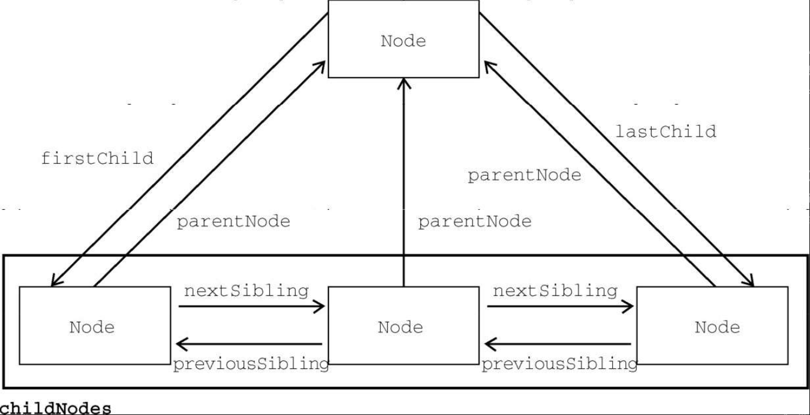

DOM Level 1 描述了名为 Node 的接口，这个接口是所有 DOM 节点类型都必须实现的。Node 接口在 JavaScript 中被实现为 Node 类型，在除 IE 之外的所有浏览器中都可以直接访问这个类型。在 JavaScript 中，所有节点类型都继承 Node 类型，因此所有类型都共享相同的基本属性和方法。

每个节点都有 nodeType 属性，表示该节点的类型。节点类型由定义在 Node 类型上的 12 个数值常量表示：

1. Node.ELEMENT_NODE（1）
2. Node.ATTRIBUTE_NODE（2）
3. Node.TEXT_NODE（3）
4. Node.CDATA_SECTION_NODE（4）
5. Node.ENTITY_REFERENCE_NODE（5）
6. Node.ENTITY_NODE（6）
7. Node.PROCESSING_INSTRUCTION_NODE（7）
8. Node.COMMENT_NODE（8）
9. Node.DOCUMENT_NODE（9）
10. Node.DOCUMENT_TYPE_NODE（10）
11. Node.DOCUMENT_FRAGMENT_NODE（11）
12. Node.NOTATION_NODE（12）

节点类型可通过与这些常量比较来确定，比如：

```javascript
if (someNode.nodeType == Node.ELEMENT_NODE) {
  alert("Node is an element.");
}
```

这个例子比较了 someNode.nodeType 与 Node.ELEMENT_NODE 常量。如果两者相等，则意味着 someNode 是一个元素节点。

浏览器并不支持所有节点类型。开发者最常用到的是元素节点和文本节点。本章后面会讨论每种节点受支持的程度及其用法。

1. nodeName 与 nodeValue

nodeName 与 nodeValue 保存着有关节点的信息。这两个属性的值完全取决于节点类型。在使用这两个属性前，最好先检测节点类型，如下所示：

```javascript
if (someNode.nodeType == 1) {
  value = someNode.nodeName; // 会显示元素的标签名
}
```

在这个例子中，先检查了节点是不是元素。如果是，则将其 nodeName 的值赋给一个变量。对元素而言，nodeName 始终等于元素的标签名，而 nodeValue 则始终为 null。

2. 节点关系

文档中的所有节点都与其他节点有关系。这些关系可以形容为家族关系，相当于把文档树比作家谱。在 HTML 中， `<body>` 元素是 `<html>` 元素的子元素，而 `<html>` 元素则是 `<body>` 元素的父元素。 `<head>` 元素是 `<body>` 元素的同胞元素，因为它们有共同的父元素 `<html>` 。

每个节点都有一个 childNodes 属性，其中包含一个 NodeList 的实例。 NodeList 是一个类数组对象，用于存储可以按位置存取的有序节点。注意， NodeList 并不是 Array 的实例，但可以使用中括号访问它的值，而且它也有 length 属性。 NodeList 对象独特的地方在于，它其实是一个对 DOM 结构的查询，因此 DOM 结构的变化会自动地在 NodeList 中反映出来。我们通常说 NodeList 是实时的活动对象，而不是第一次访问时所获得内容的快照。

下面的例子展示了如何使用中括号或使用 item() 方法访问 NodeList 中的元素：

```javascript
let firstChild = someNode.childNodes[0];
let secondChild = someNode.childNodes.item(1);
let count = someNode.childNodes.length;
```

无论是使用中括号还是 item() 方法都是可以的，但多数开发者倾向于使用中括号，因为它是一个类数组对象。注意， length 属性表示那一时刻 NodeList 中节点的数量。使用 Array.prototype. slice() 可以像前面介绍 arguments 时一样把 NodeList 对象转换为数组。比如：

```javascript
let arrayOfNodes = Array.prototype.slice.call(someNode.childNodes, 0);
```

当然，使用 ES6 的 Array.from()静态方法，可以替换这种笨拙的方式：

```javascript
let arrayOfNodes = Array.from(someNode.childNodes);
```

每个节点都有一个 parentNode 属性，指向其 DOM 树中的父元素。 childNodes 中的所有节点都有同一个父元素，因此它们的 parentNode 属性都指向同一个节点。此外， childNodes 列表中的每个节点都是同一列表中其他节点的同胞节点。而使用 previousSibling 和 nextSibling 可以在这个列表的节点间导航。这个列表中第一个节点的 previousSibling 属性是 null ，最后一个节点的 nextSibling 属性也是 null ，如下所示：

```javascript
if (someNode.nextSibling === null) {
  alert("Last node in the parent's childNodes list.");
} else if (someNode.previousSibling === null) {
  alert("First node in the parent's childNodes list.");
}
```

注意，如果 childNodes 中只有一个节点，则它的 previousSibling 和 nextSibling 属性都是 null 。

父节点和它的第一个及最后一个子节点也有专门属性： firstChild 和 lastChild 分别指向 childNodes 中的第一个和最后一个子节点。

someNode.firstChild 的值始终等于 someNode. childNodes[0] ，而 someNode.lastChild 的值始终等于 someNode.childNodes[someNode. childNodes.length-1] 。如果只有一个子节点，则 firstChild 和 lastChild 指向同一个节点。如果没有子节点，则 firstChild 和 lastChild 都是 null 。上述这些节点之间的关系为在文档树的节点之间导航提供了方便。图 14-2 形象地展示了这些关系。



有了这些关系， childNodes 属性的作用远远不止是必备属性那么简单了。这是因为利用这些关系指针，几乎可以访问到文档树中的任何节点，而这种便利性是 childNodes 的最大亮点。还有一个便利的方法是 hasChildNodes() ，这个方法如果返回 true 则说明节点有一个或多个子节点。相比查询 childNodes 的 length 属性，这个方法无疑更方便。

最后还有一个所有节点都共享的关系。 ownerDocument 属性是一个指向代表整个文档的文档节点的指针。所有节点都被创建它们（或自己所在）的文档所拥有，因为一个节点不可能同时存在于两个或者多个文档中。这个属性为迅速访问文档节点提供了便利，因为无需在文档结构中逐层上溯了。

```
注意 虽然所有节点类型都继承了 Node ，但并非所有节点都有子节点。本章后面会讨论不同节点类型的差异。
```

3. 操纵节点

因为所有关系指针都是只读的，所以 DOM 又提供了一些操纵节点的方法。最常用的方法是 appendChild() ，用于在 childNodes 列表末尾添加节点。添加新节点会更新相关的关系指针，包括父节点和之前的最后一个子节点。 appendChild() 方法返回新添加的节点，如下所示：

```javascript
let returnedNode = someNode.appendChild(newNode);
alert(returnedNode == newNode); // true
alert(someNode.lastChild == newNode); // true
```

如果想把节点放到 childNodes 中的特定位置而不是末尾，则可以使用 insertBefore() 方法。这个方法接收两个参数：要插入的节点和参照节点。调用这个方法后，要插入的节点会变成参照节点的前一个同胞节点，并被返回。如果参照节点是 null ，则 insertBefore() 与 appendChild() 效果相同，如下面的例子所示：

```javascript
// 作为最后一个子节点插入
returnedNode = someNode.insertBefore(newNode, null);
alert(newNode == someNode.lastChild); // true
// 作为新的第一个子节点插入
returnedNode = someNode.insertBefore(newNode, someNode.firstChild);
alert(returnedNode == newNode); // true
alert(newNode == someNode.firstChild); // true
// 插入最后一个子节点前面
returnedNode = someNode.insertBefore(newNode, someNode.lastChild);
alert(newNode == someNode.childNodes[someNode.childNodes.length - 2]); // true
```

appendChild() 和 insertBefore() 在插入节点时不会删除任何已有节点。相对地， replaceChild() 方法接收两个参数：要插入的节点和要替换的节点。要替换的节点会被返回并从文档树中完全移除，要插入的节点会取而代之。下面看一个例子：

```javascript
// 替换第一个子节点
let returnedNode = someNode.replaceChild(newNode, someNode.firstChild);
// 替换最后一个子节点
returnedNode = someNode.replaceChild(newNode, someNode.lastChild);
```

使用 replaceChild() 插入一个节点后，所有关系指针都会从被替换的节点复制过来。虽然被替换的节点从技术上说仍然被同一个文档所拥有，但文档中已经没有它的位置。

要移除节点而不是替换节点，可以使用 removeChild() 方法。这个方法接收一个参数，即要移除的节点。被移除的节点会被返回，如下面的例子所示：

```javascript
// 删除第一个子节点
let formerFirstChild = someNode.removeChild(someNode.firstChild);
// 删除最后一个子节点
let formerLastChild = someNode.removeChild(someNode.lastChild);
```

与 replaceChild() 方法一样，通过 removeChild() 被移除的节点从技术上说仍然被同一个文档所拥有，但文档中已经没有它的位置。

上面介绍的 4 个方法都用于操纵某个节点的子元素，也就是说使用它们之前必须先取得父节点（使用前面介绍的 parentNode 属性）。并非所有节点类型都有子节点，如果在不支持子节点的节点上调用这些方法，则会导致抛出错误。

4. 其他方法

所有节点类型还共享了两个方法。第一个是 cloneNode() ，会返回与调用它的节点一模一样的节点。 cloneNode() 方法接收一个布尔值参数，表示是否深复制。在传入 true 参数时，会进行深复制，即复制节点及其整个子 DOM 树。如果传入 false ，则只会复制调用该方法的节点。复制返回的节点属于文档所有，但尚未指定父节点，所以可称为孤儿节点（orphan）。可以通过 appendChild() 、 insertBefore() 或 replaceChild() 方法把孤儿节点添加到文档中。以下面的 HTML 片段为例：

```html
<ul>
  <li>item 1</li>
  <li>item 2</li>
  <li>item 3</li>
</ul>
```

如果 myList 保存着对这个 `<ul>` 元素的引用，则下列代码展示了使用 cloneNode() 方法的两种方式：

```javascript
let deepList = myList.cloneNode(true);
alert(deepList.childNodes.length); // 3（IE9 之前的版本）或7（其他浏览器）
let shallowList = myList.cloneNode(false);
alert(shallowList.childNodes.length); // 0
```

在这个例子中， deepList 保存着 myList 的副本。这意味着 deepList 有 3 个列表项，每个列表项又各自包含文本。变量 shallowList 则保存着 myList 的浅副本，因此没有子节点。 deepList.childNodes.length 的值会因 IE8 及更低版本和其他浏览器对空格的处理方式而不同。IE9 之前的版本不会为空格创建节点。

```
注意 cloneNode()方法不会复制添加到DOM节点的JavaScript属性，比如事件处理程序。这个方法只复制HTML属性，以及可选地复制子节点。除此之外则一概不会复制。IE在很长时间内会复制事件处理程序，这是一个bug，所以推荐在复制前先删除事件处理程序。
```

本节要介绍的最后一个方法是 normalize() 。这个方法唯一的任务就是处理文档子树中的文本节点。由于解析器实现的差异或 DOM 操作等原因，可能会出现并不包含文本的文本节点，或者文本节点之间互为同胞关系。在节点上调用 normalize() 方法会检测这个节点的所有后代，从中搜索上述两种情形。如果发现空文本节点，则将其删除；如果两个同胞节点是相邻的，则将其合并为一个文本节点。这个方法将在本章后面进一步讨论。
