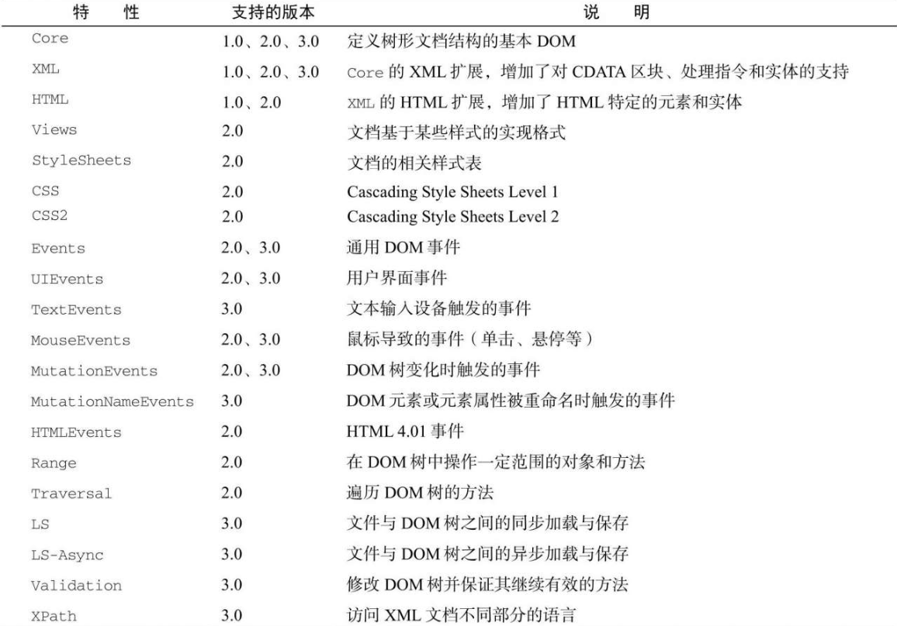

Document 类型是 JavaScript 中表示文档节点的类型。在浏览器中，文档对象 document 是 HTMLDocument 的实例（HTMLDocument 继承 Document），表示整个 HTML 页面。 document 是 window 对象的属性，因此是一个全局对象。 Document 类型的节点有以下特征：

- nodeType 等于 9；
- nodeName 值为"#document"；
- nodeValue 值为 null；
- parentNode 值为 null；
- ownerDocument 值为 null；
- 子节点可以是 DocumentType（最多一个）、Element（最多一个）、ProcessingInstruction 或 Comment 类型。

Document 类型可以表示 HTML 页面或其他 XML 文档，但最常用的还是通过 HTMLDocument 的实例取得 document 对象。 document 对象可用于获取关于页面的信息以及操纵其外观和底层结构。

1. 文档子节点

虽然 DOM 规范规定 Document 节点的子节点可以是 DocumentType 、 Element 、 Processing-Instruction 或 Comment ，但也提供了两个访问子节点的快捷方式。第一个是 documentElement 属性，始终指向 HTML 页面中的 `<html>` 元素。虽然 document.childNodes 中始终有 `<html>` 元素，但使用 documentElement 属性可以更快更直接地访问该元素。假如有以下简单的页面：

```html
<html>
  <body></body>
</html>
```

浏览器解析完这个页面之后，文档只有一个子节点，即 `<html>` 元素。这个元素既可以通过 documentElement 属性获取，也可以通过 childNodes 列表访问，如下所示：

```javascript
let html = document.documentElement; // 取得对<html>的引用
alert(html === document.childNodes[0]); // true
alert(html === document.firstChild); // true
```

这个例子表明 documentElement 、 firstChild 和 childNodes[0] 都指向同一个值，即 `<html>` 元素。

作为 HTMLDocument 的实例， document 对象还有一个 body 属性，直接指向 `<body>` 元素。因为这个元素是开发者使用最多的元素，所以 JavaScript 代码中经常可以看到 document.body ，比如：

```javascript
let body = document.body; // 取得对<body>的引用所有主流浏览器都支持document.documentElement和document.body。
```

Document 类型另一种可能的子节点是 DocumentType 。 `<! doctype>` 标签是文档中独立的部分，其信息可以通过 doctype 属性（在浏览器中是 document.doctype ）来访问，比如：

```javascript
let doctype = document.doctype; // 取得对<! doctype>的引用
```

另外，严格来讲出现在 `<html>` 元素外面的注释也是文档的子节点，它们的类型是 Comment 。不过，由于浏览器实现不同，这些注释不一定能被识别，或者表现可能不一致。比如以下 HTML 页面：

```html
<! -- 第一条注释-->
<html>
  <body></body>
</html>
<! -- 第二条注释-->
```

这个页面看起来有 3 个子节点：注释、 `<html>` 元素、注释。逻辑上讲， document.childNodes 应该包含 3 项，对应代码中的每个节点。但实际上，浏览器有可能以不同方式对待 `<html>` 元素外部的注释，比如忽略一个或两个注释。

一般来说， appendChild() 、 removeChild() 和 replaceChild() 方法不会用在 document 对象上。这是因为文档类型（如果存在）是只读的，而且只能有一个 Element 类型的子节点（即 `<html>` ，已经存在了）。

2. 文档信息

document 作为 HTMLDocument 的实例，还有一些标准 Document 对象上所没有的属性。这些属性提供浏览器所加载网页的信息。其中第一个属性是 title ，包含 `<title>` 元素中的文本，通常显示在浏览器窗口或标签页的标题栏。通过这个属性可以读写页面的标题，修改后的标题也会反映在浏览器标题栏上。不过，修改 title 属性并不会改变 `<title>` 元素。下面是一个例子：

```javascript
// 读取文档标题
let originalTitle = document.title;
// 修改文档标题
document.title = "New page title";
```

接下来要介绍的 3 个属性是 URL 、 domain 和 referrer 。其中， URL 包含当前页面的完整 URL （地址栏中的 URL）, domain 包含页面的域名，而 referrer 包含链接到当前页面的那个页面的 URL 。如果当前页面没有来源，则 referrer 属性包含空字符串。所有这些信息都可以在请求的 HTTP 头部信息中获取，只是在 JavaScript 中通过这几个属性暴露出来而已，如下面的例子所示：

```javascript
// 取得完整的URL
let url = document.URL;
// 取得域名
let domain = document.domain;
// 取得来源
let referrer = document.referrer;
```

URL 跟域名是相关的。比如，如果 document.URL 是 http://www.wrox.com/WileyCDA/ ，则 document.domain 就是 www.wrox.com 。

在这些属性中，只有 domain 属性是可以设置的。出于安全考虑，给 domain 属性设置的值是有限制的。如果 URL 包含子域名如 p2p.wrox.com ，则可以将 domain 设置为 "wrox.com" （URL 包含“www”时也一样，比如www.wrox.com）。不能给这个属性设置URL中不包含的值，比如：

```javascript
// 页面来自p2p.wrox.com
document.domain = "wrox.com"; // 成功
document.domain = "nczonline.net"; // 出错！
```

当页面中包含来自某个不同子域的窗格（`<frame>`）或内嵌窗格（`<iframe>`）时，设置 document.domain 是有用的。因为跨源通信存在安全隐患，所以不同子域的页面间无法通过 JavaScript 通信。此时，在每个页面上把 document.domain 设置为相同的值，这些页面就可以访问对方的 JavaScript 对象了。比如，一个加载自 www.wrox.com 的页面中包含一个内嵌窗格，其中的页面加载自 p2p.wrox.com 。这两个页面的 document.domain 包含不同的字符串，内部和外部页面相互之间不能访问对方的 JavaScript 对象。如果每个页面都把 document.domain 设置为 wrox.com ，那这两个页面之间就可以通信了。

浏览器对 domain 属性还有一个限制，即这个属性一旦放松就不能再收紧。比如，把 document.domain 设置为 "wrox.com" 之后，就不能再将其设置回 "p2p.wrox.com" ，后者会导致错误，比如：

```javascript
// 页面来自p2p.wrox.com
document.domain = "wrox.com"; // 放松，成功
document.domain = "p2p.wrox.com"; // 收紧，错误！
```

3. 定位元素

使用 DOM 最常见的情形可能就是获取某个或某组元素的引用，然后对它们执行某些操作。 document 对象上暴露了一些方法，可以实现这些操作。 getElementById() 和 getElementsBy-TagName() 就是 Document 类型提供的两个方法。

getElementById() 方法接收一个参数，即要获取元素的 ID ，如果找到了则返回这个元素，如果没找到则返回 null 参数 ID 必须跟元素在页面中的 id 属性值完全匹配，包括大小写。比如页面中有以下元素：

```html
<div id="myDiv">Some text</div>
```

可以使用如下代码取得这个元素：

```javascript
let div = document.getElementById("myDiv"); // 取得对这个<div>元素的引用
```

但参数大小写不匹配会返回 null：

```javascript
let div = document.getElementById("mydiv"); // null
```

如果页面中存在多个具有相同 ID 的元素，则 getElementById() 返回在文档中出现的第一个元素。

getElementsByTagName() 是另一个常用来获取元素引用的方法。这个方法接收一个参数，即要获取元素的标签名，返回包含零个或多个元素的 NodeList 。在 HTML 文档中，这个方法返回一个 HTMLCollection 对象。考虑到二者都是“实时”列表， HTMLCollection 与 NodeList 是很相似的。例如，下面的代码会取得页面中所有的 `` 元素并返回包含它们的 HTMLCollection ：

```javascript
let images = document.getElementsByTagName("img");
```

这里把返回的 HTMLCollection 对象保存在了变量 images 中。与 NodeList 对象一样，也可以使用中括号或 item() 方法从 HTMLCollection 取得特定的元素。而取得元素的数量同样可以通过 length 属性得知，如下所示：

```javascript
alert(images.length); // 图片数量
alert(images[0].src); // 第一张图片的src属性
alert(images.item(0).src); // 同上
```

HTMLCollection 对象还有一个额外的方法 namedItem() ，可通过标签的 name 属性取得某一项的引用。例如，假设页面中包含如下的 `` 元素：

```html

```

那么也可以像这样从 images 中取得对这个 `` 元素的引用：

```javascript
let myImage = images.namedItem("myImage");
```

这样， HTMLCollection 就提供了除索引之外的另一种获取列表项的方式，从而为取得元素提供了便利。对于 name 属性的元素，还可以直接使用中括号来获取，如下面的例子所示：

```javascript
let myImage = images["myImage"];
```

对 HTMLCollection 对象而言，中括号既可以接收数值索引，也可以接收字符串索引。而在后台，数值索引会调用 item() ，字符串索引会调用 namedItem() 。

要取得文档中的所有元素，可以给 getElementsByTagName() 传入 _ 。在 JavaScript 和 CSS 中， _ 一般被认为是匹配一切的字符。来看下面的例子：

```javascript
let allElements = document.getElementsByTagName("*");
```

这行代码可以返回包含页面中所有元素的 HTMLCollection 对象，顺序就是它们在页面中出现的顺序。因此第一项是 `<html>` 元素，第二项是 `<head>` 元素，以此类推。

```
注意 对于document.getElementsByTagName() 方法，虽然规范要求区分标签的大小写，但为了最大限度兼容原有 HTML 页面，实际上是不区分大小写的。如果是在XML页面（如XHTML）中使用，那么 document.getElementsByTagName() 就是区分大小写的。
```

HTMLDocument 类型上定义的获取元素的第三个方法是 getElementsByName() 。顾名思义，这个方法会返回具有给定 name 属性的所有元素。 getElementsByName() 方法最常用于单选按钮，因为同一字段的单选按钮必须具有相同的 name 属性才能确保把正确的值发送给服务器，比如下面的例子：

```xml
    <fieldset>
      <legend>Which color do you prefer? </legend>
      <ul>
        <li>
          <input type="radio" value="red" name="color" id="colorRed">
          <label for="colorRed">Red</label>
        </li>
        <li>
          <input type="radio" value="green" name="color" id="colorGreen">
          <label for="colorGreen">Green</label>
        </li>
        <li>
          <input type="radio" value="blue" name="color" id="colorBlue">
          <label for="colorBlue">Blue</label>
        </li>
      </ul>
    </fieldset>
```

这里所有的单选按钮都有名为"color"的 name 属性，但它们的 ID 都不一样。这是因为 ID 是为了匹配对应的 `<label>` 元素，而 name 相同是为了保证只将三个中的一个值发送给服务器。然后就可以像下面这样取得所有单选按钮：

```javascript
let radios = document.getElementsByName("color");
```

与 getElementsByTagName() 一样， getElementsByName() 方法也返回 HTMLCollection 。不过在这种情况下， namedItem() 方法只会取得第一项（因为所有项的 name 属性都一样）。

4. 特殊集合

document 对象上还暴露了几个特殊集合，这些集合也都是 HTMLCollection 的实例。这些集合是访问文档中公共部分的快捷方式，列举如下。

- document.anchors 包含文档中所有带 name 属性的 `<a>` 元素。
- document.applets 包含文档中所有 `<applet>` 元素（因为 `<applet>` 元素已经不建议使用，所以这个集合已经废弃）。
- document.forms 包含文档中所有 `<form>` 元素（与 document.getElementsByTagName ("form") 返回的结果相同）。
- document.images 包含文档中所有 `` 元素（与 document.getElementsByTagName ("img") 返回的结果相同）。
- document.links 包含文档中所有带 href 属性的 `<a>` 元素。

这些特殊集合始终存在于 HTMLDocument 对象上，而且与所有 HTMLCollection 对象一样，其内容也会实时更新以符合当前文档的内容。

5. DOM 兼容性检测

由于 DOM 有多个 Level 和多个部分，因此确定浏览器实现了 DOM 的哪些部分是很必要的。 document.implementation 属性是一个对象，其中提供了与浏览器 DOM 实现相关的信息和能力。 DOM Level 1 在 document.implementation 上 只定义了一个方法，即 hasFeature() 。这个方法接收两个参数：特性名称和 DOM 版本。如果浏览器支持指定的特性和版本，则 hasFeature() 方法返回 true ，如下面的例子所示：

```javascript
let hasXmlDom = document.implementation.hasFeature("XML", "1.0");
```



由于实现不一致，因此 hasFeature() 的返回值并不可靠。目前这个方法已经被废弃，不再建议使用。为了向后兼容，目前主流浏览器仍然支持这个方法，但无论检测什么都一律返回 true。

6. 文档写入

document 对象有一个古老的能力，即向网页输出流中写入内容。这个能力对应 4 个方法： write() 、 writeln() 、 open() 和 close() 。其中， write() 和 writeln() 方法都接收一个字符串参数，可以将这个字符串写入网页中。 write() 简单地写入文本，而 writeln() 还会在字符串末尾追加一个换行符（\n）。这两个方法可以用来在页面加载期间向页面中动态添加内容，如下所示：

```html
<html>
  <head>
    <title>document.write() Example</title>
  </head>
  <body>
    <p>
      The current date and time is:
      <script type="text/javascript">
        document.write("<strong>" + new Date().toString() + "</strong>");
      </script>
    </p>
  </body>
</html>
```

这个例子会在页面加载过程中输出当前日期和时间。日期放在了 `<strong>` 元素中，如同它们之前就包含在 HTML 页面中一样。这意味着会创建一个 DOM 元素，以后也可以访问。通过 write() 和 writeln() 输出的任何 HTML 都会以这种方式来处理。

write() 和 writeln() 方法经常用于动态包含外部资源，如 JavaScript 文件。在包含 JavaScript 文件时，记住不能像下面的例子中这样直接包含字符串 `</script>` ，因为这个字符串会被解释为脚本块的结尾，导致后面的代码不能执行：

```html
    <html>
    <head>
      <title>document.write() Example</title>
    </head>
    <body>
      <script type="text/javascript">
        document.write("<script type=\"text/javascript\" src=\"file.js\">" +
          "</script>");
      </script>
    </body>
    </html>
```

虽然这样写看起来没错，但输出之后的 `</script>` 会匹配最外层的 `<script>` 标签，导致页面中显示出 `);` 。为避免出现这个问题，需要对前面的例子稍加修改：

```html
<html>
  <head>
    <title>document.write() Example</title>
  </head>
  <body>
    <script type="text/javascript">
      document.write(
        '<script type="text/javascript" src="file.js">' + "<\/script>"
      );
    </script>
  </body>
</html>
```

这里的字符串 `<\/script>` 不会再匹配最外层的 `<script>` 标签，因此不会在页面中输出额外内容。

前面的例子展示了在页面渲染期间通过 document.write() 向文档中输出内容。如果是在页面加载完之后再调用 document.write() ，则输出的内容会重写整个页面，如下面的例子所示：

```html
<html>
  <head>
    <title>document.write() Example</title>
  </head>
  <body>
    <p>
      This is some content that you won't get to see because it will be
      overwritten.
    </p>
    <script type="text/javascript">
      window.onload = function () {
        document.write("Hello world! ");
      };
    </script>
  </body>
</html>
```

这个例子使用了 window.onload 事件处理程序，将调用 document.write() 的函数推迟到页面加载完毕后执行。执行之后，字符串 "Hello world! " 会重写整个页面内容。

open() 和 close() 方法分别用于打开和关闭网页输出流。在调用 write() 和 writeln() 时，这两个方法都不是必需的。

```
注意 严格的XHTML文档不支持文档写入。对于内容类型为application/xml+xhtml的页面，这些方法不起作用。
```
