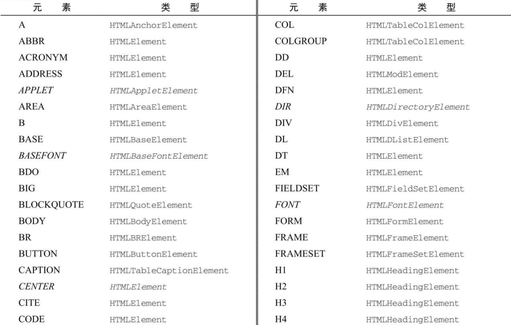
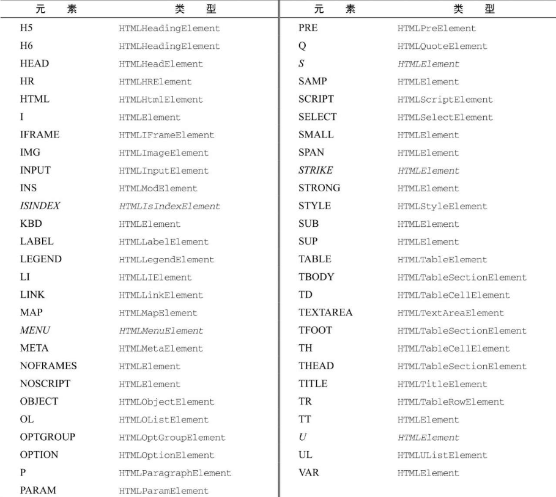

除了 Document 类型， Element 类型就是 Web 开发中最常用的类型了。 Element 表示 XML 或 HTML 元素，对外暴露出访问元素标签名、子节点和属性的能力。 Element 类型的节点具有以下特征：

- nodeType 等于 1；
- nodeName 值为元素的标签名；
- nodeValue 值为 null；
- parentNode 值为 Document 或 Element 对象；
- 子节点可以是 Element 、 Text 、 Comment 、 ProcessingInstruction 、 CDATASection 、 EntityReference 类型。

可以通过 nodeName 或 tagName 属性来获取元素的标签名。这两个属性返回同样的值（添加后一个属性明显是为了不让人误会）。比如有下面的元素：

```html
<div id="myDiv"></div>
```

可以像这样取得这个元素的标签名：

```javascript
let div = document.getElementById("myDiv");
alert(div.tagName); // "DIV"
alert(div.tagName == div.nodeName); // true
```

例子中的元素标签名为 div , ID 为 "myDiv" 。注意， div.tagName 实际上返回的是 "DIV" 而不是 "div" 。在 HTML 中，元素标签名始终以全大写表示；在 XML（包括 XHTML）中，标签名始终与源代码中的大小写一致。如果不确定脚本是在 HTML 文档还是 XML 文档中运行，最好将标签名转换为小写形式，以便于比较：

```javascript
if (element.tagName == "div") {
  // 不要这样做，可能出错！
  // do something here
}
if (element.tagName.toLowerCase() == "div") {
  // 推荐，适用于所有文档
  // 做点什么
}
```

这个例子演示了比较 tagName 属性的情形。第一个是容易出错的写法，因为 HTML 文档中 tagName 返回大写形式的标签名。第二个先把标签名转换为全部小写后再比较，这是推荐的做法，因为这对 HTML 和 XML 都适用。

1. HTML 元素

所有 HTML 元素都通过 HTMLElement 类型表示，包括其直接实例和间接实例。另外， HTMLElement 直接继承 Element 并增加了一些属性。每个属性都对应下列属性之一，它们是所有 HTML 元素上都有的标准属性：

- id，元素在文档中的唯一标识符；
- title，包含元素的额外信息，通常以提示条形式展示；
- lang，元素内容的语言代码（很少用）；
- dir，语言的书写方向（"ltr"表示从左到右，"rtl"表示从右到左，同样很少用）；
- className，相当于 class 属性，用于指定元素的 CSS 类（因为 class 是 ECMAScript 关键字，所以不能直接用这个名字）。

所有这些都可以用来获取对应的属性值，也可以用来修改相应的值。比如有下面的 HTML 元素：

```html
<div id="myDiv" class="bd" title="Body text" lang="en" dir="ltr"></div>
```

这个元素中的所有属性都可以使用下列 JavaScript 代码读取：

```javascript
let div = document.getElementById("myDiv");
alert(div.id); // "myDiv"
alert(div.className); // "bd"
alert(div.title); // "Body text"
alert(div.lang); // "en"
alert(div.dir); // "ltr"
```

而且，可以使用下列代码修改元素的属性：

```javascript
div.id = "someOtherId";
div.className = "ft";
div.title = "Some other text";
div.lang = "fr";
div.dir = "rtl";
```

并非所有这些属性的修改都会对页面产生影响。比如，把 id 或 lang 改成其他值对用户是不可见的（假设没有基于这两个属性应用 CSS 样式），而修改 title 属性则只会在鼠标移到这个元素上时才会反映出来。修改 dir 会导致页面文本立即向左或向右对齐。修改 className 会立即反映应用到新类名的 CSS 样式（如果定义了不同的样式）。

如前所述，所有 HTML 元素都是 HTMLElement 或其子类型的实例。下表列出了所有 HTML 元素及其对应的类型（斜体表示已经废弃的元素）。





这里列出的每种类型都有关联的属性和方法。本书会涉及其中的很多类型。

2. 取得属性

每个元素都有零个或多个属性，通常用于为元素或其内容附加更多信息。与属性相关的 DOM 方法主要有 3 个： getAttribute() 、 setAttribute() 和 removeAttribute() 。这些方法主要用于操纵属性，包括在 HTMLElement 类型上定义的属性。下面看一个例子：

```javascript
let div = document.getElementById("myDiv");
alert(div.getAttribute("id")); // "myDiv"
alert(div.getAttribute("class")); // "bd"
alert(div.getAttribute("title")); // "Body text"
alert(div.getAttribute("lang")); // "en"
alert(div.getAttribute("dir")); // "ltr"
```

注意传给 getAttribute() 的属性名与它们实际的属性名是一样的，因此这里要传 "class" 而非 "className" （className 是作为对象属性时才那么拼写的）。如果给定的属性不存在，则 getAttribute() 返回 null 。

getAttribute() 方法也能取得不是 HTML 语言正式属性的自定义属性的值。比如下面的元素：

```html
<div id="myDiv" my_special_attribute="hello! "></div>
```

这个元素有一个自定义属性 my_special_attribute ，值为 "hello! " 。可以像其他属性一样使用 getAttribute() 取得这个属性的值：

```javascript
let value = div.getAttribute("my_special_attribute");
```

注意，属性名不区分大小写，因此 "ID" 和 "id" 被认为是同一个属性。另外，根据 HTML5 规范的要求，自定义属性名应该前缀 data- 以方便验证。

元素的所有属性也可以通过相应 DOM 元素对象的属性来取得。当然，这包括 HTMLElement 上定义的直接映射对应属性的 5 个属性，还有所有公认（非自定义）的属性也会被添加为 DOM 对象的属性。比如下面的例子：

```html
<div id="myDiv" align="left" my_special_attribute="hello"></div>
```

因为 id 和 align 在 HTML 中是 `<div>` 元素公认的属性，所以 DOM 对象上也会有这两个属性。但 my_special_attribute 是自定义属性，因此不会成为 DOM 对象的属性。

通过 DOM 对象访问的属性中有两个返回的值跟使用 getAttribute() 取得的值不一样。首先是 style 属性，这个属性用于为元素设定 CSS 样式。在使用 getAttribute() 访问 style 属性时，返回的是 CSS 字符串。而在通过 DOM 对象的属性访问时， style 属性返回的是一个（CSSStyleDeclaration）对象。 DOM 对象的 style 属性用于以编程方式读写元素样式，因此不会直接映射为元素中 style 属性的字符串值。

第二个属性其实是一类，即事件处理程序（或者事件属性），比如 onclick 。在元素上使用事件属性时（比如 onclick），属性的值是一段 JavaScript 代码。如果使用 getAttribute() 访问事件属性，则返回的是字符串形式的源代码。而通过 DOM 对象的属性访问事件属性时返回的则是一个 JavaScript 函数（未指定该属性则返回 null）。这是因为 onclick 及其他事件属性是可以接受函数作为值的。

考虑到以上差异，开发者在进行 DOM 编程时通常会放弃使用 getAttribute() 而只使用对象属性。 getAttribute() 主要用于取得自定义属性的值。

3. 设置属性

与 getAttribute() 配套的方法是 setAttribute() ，这个方法接收两个参数：要设置的属性名和属性的值。如果属性已经存在，则 setAttribute() 会以指定的值替换原来的值；如果属性不存在，则 setAttribute() 会以指定的值创建该属性。下面看一个例子：

```javascript
div.setAttribute("id", "someOtherId");
div.setAttribute("class", "ft");
div.setAttribute("title", "Some other text");
div.setAttribute("lang", "fr");
div.setAttribute("dir", "rtl");
```

setAttribute() 适用于 HTML 属性，也适用于自定义属性。另外，使用 setAttribute() 方法设置的属性名会规范为小写形式，因此 "ID" 会变成 "id" 。

因为元素属性也是 DOM 对象属性，所以直接给 DOM 对象的属性赋值也可以设置元素属性的值，如下所示：

```javascript
div.id = "someOtherId";
div.align = "left";
```

注意，在 DOM 对象上添加自定义属性，如下面的例子所示，不会自动让它变成元素的属性：

```javascript
div.mycolor = "red";
alert(div.getAttribute("mycolor")); // null（IE除外）
```

这个例子添加了一个自定义属性 mycolor 并将其值设置为 "red" 。在多数浏览器中，这个属性不会自动变成元素属性。因此调用 getAttribute() 取得 mycolor 的值会返回 null。

最后一个方法 removeAttribute() 用于从元素中删除属性。这样不单单是清除属性的值，而是会把整个属性完全从元素中去掉，如下所示：

```javascript
div.removeAttribute("class");
```

这个方法用得并不多，但在序列化 DOM 元素时可以通过它控制要包含的属性。

4. attributes 属性

Element 类型是唯一使用 attributes 属性的 DOM 节点类型。 attributes 属性包含一个 NamedNodeMap 实例，是一个类似 NodeList 的“实时”集合。元素的每个属性都表示为一个 Attr 节点，并保存在这个 NamedNodeMap 对象中。 NamedNodeMap 对象包含下列方法：

- getNamedItem（name），返回 nodeName 属性等于 name 的节点；
- removeNamedItem（name），删除 nodeName 属性等于 name 的节点；
- setNamedItem（node），向列表中添加 node 节点，以其 nodeName 为索引；
- item（pos），返回索引位置 pos 处的节点。

attributes 属性中的每个节点的 nodeName 是对应属性的名字， nodeValue 是属性的值。比如，要取得元素 id 属性的值，可以使用以下代码：

```javascript
let id = element.attributes.getNamedItem("id").nodeValue;
```

下面是使用中括号访问属性的简写形式：

```javascript
let id = element.attributes["id"].nodeValue;
```

同样，也可以用这种语法设置属性的值，即先取得属性节点，再将其 nodeValue 设置为新值，如下所示：

```javascript
element.attributes["id"].nodeValue = "someOtherId";
```

removeNamedItem() 方法与元素上的 removeAttribute() 方法类似，也是删除指定名字的属性。下面的例子展示了这两个方法唯一的不同之处，就是 removeNamedItem() 返回表示被删除属性的 Attr 节点：

```javascript
let oldAttr = element.attributes.removeNamedItem("id");
```

setNamedItem() 方法很少使用，它接收一个属性节点，然后给元素添加一个新属性，如下所示：

```javascript
element.attributes.setNamedItem(newAttr);
```

一般来说，因为使用起来更简便，通常开发者更喜欢使用 getAttribute() 、 removeAttribute() 和 setAttribute() 方法，而不是刚刚介绍的 NamedNodeMap 对象的方法。

attributes 属性最有用的场景是需要迭代元素上所有属性的时候。这时候往往是要把 DOM 结构序列化为 XML 或 HTML 字符串。比如，以下代码能够迭代一个元素上的所有属性并以 `attribute1="value1"attribute2="value2"` 的形式生成格式化字符串：

```javascript
function outputAttributes(element) {
  let pairs = [];
  for (let i = 0, len = element.attributes.length; i < len; ++i) {
    const attribute = element.attributes[i];
    pairs.push(`${attribute.nodeName}="${attribute.nodeValue}"`);
  }
  return pairs.join(" ");
}
```

这个函数使用数组存储每个名/值对，迭代完所有属性后，再将这些名/值对用空格拼接在一起。（这个技术常用于序列化为长字符串。）这个函数中的 for 循环使用 attributes.length 属性迭代每个属性，将每个属性的名字和值输出为字符串。不同浏览器返回的 attributes 中的属性顺序也可能不一样。 HTML 或 XML 代码中属性出现的顺序不一定与 attributes 中的顺序一致。

5. 创建元素

可以使用 document.createElement() 方法创建新元素。这个方法接收一个参数，即要创建元素的标签名。在 HTML 文档中，标签名是不区分大小写的，而 XML 文档（包括 XHTML）是区分大小写的。要创建 `<div>` 元素，可以使用下面的代码：

```javascript
let div = document.createElement("div");
```

使用 createElement() 方法创建新元素的同时也会将其 ownerDocument 属性设置为 document 。此时，可以再为其添加属性、添加更多子元素。比如：

```javascript
div.id = "myNewDiv";
div.className = "box";
```

在新元素上设置这些属性只会附加信息。因为这个元素还没有添加到文档树，所以不会影响浏览器显示。要把元素添加到文档树，可以使用 appendChild() 、 insertBefore() 或 replaceChild() 。比如，以下代码会把刚才创建的元素添加到文档的 `<body>` 元素中：

```javascript
document.body.appendChild(div);
```

元素被添加到文档树之后，浏览器会立即将其渲染出来。之后再对这个元素所做的任何修改，都会立即在浏览器中反映出来。

6. 元素后代

元素可以拥有任意多个子元素和后代元素，因为元素本身也可以是其他元素的子元素。 childNodes 属性包含元素所有的子节点，这些子节点可能是其他元素、文本节点、注释或处理指令。不同浏览器在识别这些节点时的表现有明显不同。比如下面的代码：

```html
<ul id="myList">
  <li>Item 1</li>
  <li>Item 2</li>
  <li>Item 3</li>
</ul>
```

在解析以上代码时， `<ul>` 元素会包含 7 个子元素，其中 3 个是 `<li>` 元素，还有 4 个 Text 节点（表示 `<li>` 元素周围的空格）。如果把元素之间的空格删掉，变成下面这样，则所有浏览器都会返回同样数量的子节点：

```html
<ul id="myList">
  <li>Item 1</li>
  <li>Item 2</li>
  <li>Item 3</li>
</ul>
```

所有浏览器解析上面的代码后， `<ul>` 元素都会包含 3 个子节点。考虑到这情况，通常在执行某个操作之后需要先检测一下节点的 nodeType ，如所示：

```javascript
for (let i = 0, len = element.childNodes.length; i < len; ++i) {
  if (element.childNodes[i].nodeType == 1) {
    // 执行某个操作
  }
}
```

上代码会遍历某个元素的子节点，并且只在 nodeType 等于 1（即 lement 节点）时执行某个操作。

取得某个元素的子节点和其他后代节点，可以使用元素的 getElementsByTagName() 方法。在元素上调用这个方法与在文档上调是一样的，只不过搜索范围限制在当前元素之内，即只会返回当前元素后代。对于本节前面 `<ul>` 的例子，可以像下面这样取得其所有的 `<li>`

```javascript
let ul = document.getElementById("myList");
let items = ul.getElementsByTagName("li");
```

例子中的 `<ul>` 元素只有一级子节点，如果它包含更多层级，则所有级中的 `<li>` 元素都会返回。
