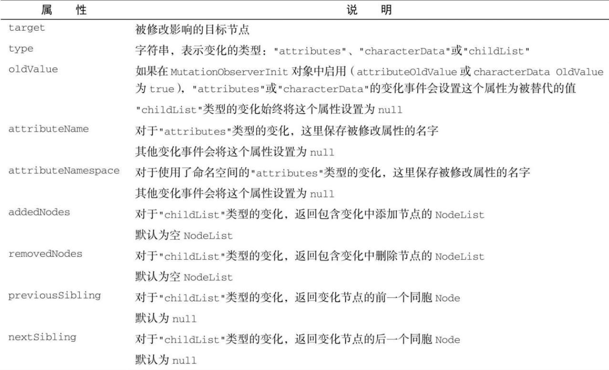

Mutat​ionObserver 的实例要通过调用 Mutat​ionObserver 构造函数并传入一个回调函数来创建：

```javascript
let observer = new MutationObserver(() => console.log("DOM was mutated! "));
```

## 1．observe()方法

新创建的 Mutat​ionObserver 实例不会关联 DOM 的任何部分。要把这个 observer 与 DOM 关联起来，需要使用 observe()方法。这个方法接收两个必需的参数：要观察其变化的 DOM 节点，以及一个 Mutat​ionObserverIni​t 对象。

Mutat​ionObserverIni​t 对象用于控制观察哪些方面的变化，是一个键/值对形式配置选项的字典。例如，下面的代码会创建一个观察者（observer）并配置它观察 `<body>` 元素上的属性变化：

```javascript
let observer = new MutationObserver(() =>
  console.log("<body> attributes changed")
);
observer.observe(document.body, { attributes: true });
```

执行以上代码后， `<body>` 元素上任何属性发生变化都会被这个 Mutat​ionObserver 实例发现，然后就会异步执行注册的回调函数。 `<body>` 元素后代的修改或其他非属性修改都不会触发回调进入任务队列。可以通过以下代码来验证：

```javascript
let observer = new MutationObserver(() =>
  console.log("<body> attributes changed")
);
observer.observe(document.body, { attributes: true });
document.body.className = "foo";
console.log("Changed body class");
// Changed body class
// <body> attributes changed
```

```
注意，回调中的console.log()是后执行的。这表明回调并非与实际的DOM变化同步执行。
```

## 2．回调与 Mutat​ionRecord

每个回调都会收到一个 Mutat​ionRecord 实例的数组。Mutat​ionRecord 实例包含的信息包括发生了什么变化，以及 DOM 的哪一部分受到了影响。因为回调执行之前可能同时发生多个满足观察条件的事件，所以每次执行回调都会传入一个包含按顺序入队的 Mutat​ionRecord 实例的数组。

下面展示了反映一个属性变化的 Mutat​ionRecord 实例的数组：

```javascript
let observer = new MutationObserver((mutationRecords) =>
  console.log(mutationRecords)
);
observer.observe(document.body, { attributes: true });
document.body.setAttribute("foo", "bar");
// [
//    {
//      addedNodes: NodeList [],
//     attributeName: "foo",
//      attributeNamespace: null,
//      nextSibling: null,
//      oldValue: null,
//      previousSibling: null
//      removedNodes: NodeList [],
//     target: body
//     type: "attributes"
//    }
// ]
```

下面是一次涉及命名空间的类似变化：

```javascript
let observer = new MutationObserver((mutationRecords) =>
  console.log(mutationRecords)
);
observer.observe(document.body, { attributes: true });
document.body.setAttributeNS("baz", "foo", "bar");
// [
//    {
//      addedNodes: NodeList [],
//      attributeName: "foo",
//     attributeNamespace: "baz",
//      nextSibling: null,
//      oldValue: null,
//      previousSibling: null
//      removedNodes: NodeList [],
//      target: body
//      type: "attributes"
//    }
// ]
```

连续修改会生成多个 Mutat​ionRecord 实例，下次回调执行时就会收到包含所有这些实例的数组，顺序为变化事件发生的顺序：

```javascript
let observer = new MutationObserver((mutationRecords) =>
  console.log(mutationRecords)
);
observer.observe(document.body, { attributes: true });
document.body.className = "foo";
document.body.className = "bar";
document.body.className = "baz";
//[MutationRecord, MutationRecord, MutationRecord]
```

下表列出了 Mutat​ionRecord 实例的属性。



传给回调函数的第二个参数是观察变化的 Mutat​ionObserver 的实例，演示如下：

```javascript
let observer = new MutationObserver((mutationRecords, mutationObserver) =>
  console.log(mutationRecords, mutationObserver)
);
observer.observe(document.body, { attributes: true });
document.body.className = "foo";
//[MutationRecord], MutationObserver
```

## 3．disconnect()方法

默认情况下，只要被观察的元素不被垃圾回收，Mutat​ionObserver 的回调就会响应 DOM 变化事件，从而被执行。要提前终止执行回调，可以调用 disconnect()方法。下面的例子演示了同步调用 disconnect()之后，不仅会停止此后变化事件的回调，也会抛弃已经加入任务队列要异步执行的回调：

```javascript
let observer = new MutationObserver(() =>
  console.log("<body> attributes changed")
);
observer.observe(document.body, { attributes: true });
document.body.className = "foo";
observer.disconnect();
document.body.className = "bar";
//（没有日志输出）
```

要想让已经加入任务队列的回调执行，可以使用 setTimeout()让已经入列的回调执行完毕再调用 disconnect()：

```javascript
let observer = new MutationObserver(() =>
  console.log("<body> attributes changed")
);
observer.observe(document.body, { attributes: true });
document.body.className = "foo";
setTimeout(() => {
  observer.disconnect();
  document.body.className = "bar";
}, 0);
// <body> attributeschanged
```

## 4．复用 Mutat​ionObserver

多次调用 observe()方法，可以复用一个 Mutat​ionObserver 对象观察多个不同的目标节点。此时，Mutat​ionRecord 的 target 属性可以标识发生变化事件的目标节点。下面的示例演示了这个过程：

```javascript
let observer = new MutationObserver((mutationRecords) =>
  console.log(mutationRecords.map((x) => x.target))
);
// 向页面主体添加两个子节点
let childA = document.createElement("div"),
  childB = document.createElement("span");
document.body.appendChild(childA);
document.body.appendChild(childB);
// 观察两个子节点
observer.observe(childA, { attributes: true });
observer.observe(childB, { attributes: true });
// 修改两个子节点的属性
childA.setAttribute("foo", "bar");
childB.setAttribute("foo", "bar");
//[<div>, <span>]
```

disconnect()方法是一个“一刀切”的方案，调用它会停止观察所有目标：

```javascript
let observer = new MutationObserver((mutationRecords) =>
  console.log(mutationRecords.map((x) => x.target))
);
// 向页面主体添加两个子节点
let childA = document.createElement("div"),
  childB = document.createElement("span");
document.body.appendChild(childA);
document.body.appendChild(childB);
// 观察两个子节点
observer.observe(childA, { attributes: true });
observer.observe(childB, { attributes: true });
observer.disconnect();
// 修改两个子节点的属性
childA.setAttribute("foo", "bar");
childB.setAttribute("foo", "bar");
//（没有日志输出）
```

## 5．重用 Mutat​ionObserver

调用 disconnect()并不会结束 Mutat​ionObserver 的生命。还可以重新使用这个观察者，再将它关联到新的目标节点。下面的示例在两个连续的异步块中先断开然后又恢复了观察者与 `<body>` 元素的关联：

```javascript
let observer = new MutationObserver(() =>
  console.log("<body> attributes changed")
);
observer.observe(document.body, { attributes: true });
// 这行代码会触发变化事件
document.body.setAttribute("foo", "bar");
setTimeout(() => {
  observer.disconnect();
  // 这行代码不会触发变化事件
  document.body.setAttribute("bar", "baz");
}, 0);
setTimeout(() => {
  // Reattach
  observer.observe(document.body, { attributes: true });
  // 这行代码会触发变化事件
  document.body.setAttribute("baz", "qux");
}, 0);
//<body>attributeschanged
//<body>attributeschanged
```
