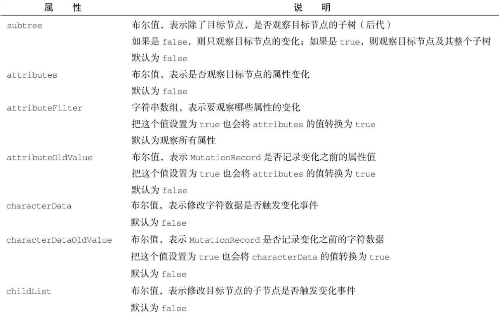

Mutat​ionObserverIni​t 对象用于控制对目标节点的观察范围。粗略地讲，观察者可以观察的事件包括属性变化、文本变化和子节点变化。

下表列出了 Mutat​ionObserverIni​t 对象的属性。



```
注意 在调用observe()时，Mutat​ionObserverIni​t对象中的at​tribute、characterData和chi​ldList属性必须至少有一项为true（无论是直接设置这几个属性，还是通过设置at​tributeOldValue等属性间接导致它们的值转换为true）​。否则会抛出错误，因为没有任何变化事件可能触发回调。
```

## 1．观察属性

Mutat​ionObserver 可以观察节点属性的添加、移除和修改。要为属性变化注册回调，需要在 Mutat​ionObserverIni​t 对象中将 at​tributes 属性设置为 true，如下所示：

```javascript
let observer = new MutationObserver((mutationRecords) =>
  console.log(mutationRecords)
);
observer.observe(document.body, { attributes: true });
// 添加属性
document.body.setAttribute("foo", "bar");
// 修改属性
document.body.setAttribute("foo", "baz");
// 移除属性
document.body.removeAttribute("foo");
// 以上变化都被记录下来了
//[MutationRecord, MutationRecord, MutationRecord]
```

把 at​tributes 设置为 true 的默认行为是观察所有属性，但不会在 Mutat​ionRecord 对象中记录原来的属性值。如果想观察某个或某几个属性，可以使用 at​tributeFi​l​ter 属性来设置白名单，即一个属性名字符串数组：

```javascript
let observer = new MutationObserver((mutationRecords) =>
  console.log(mutationRecords)
);
observer.observe(document.body, { attributeFilter: ["foo"] });
// 添加白名单属性
document.body.setAttribute("foo", "bar");
// 添加被排除的属性
document.body.setAttribute("baz", "qux");
// 只有foo属性的变化被记录了
//[MutationRecord]
```

如果想在变化记录中保存属性原来的值，可以将 at​tributeOldValue 属性设置为 true：

```javascript
let observer = new MutationObserver((mutationRecords) =>
  console.log(mutationRecords.map((x) => x.oldValue))
);
observer.observe(document.body, { attributeOldValue: true });
document.body.setAttribute("foo", "bar");
document.body.setAttribute("foo", "baz");
document.body.setAttribute("foo", "qux");
// 每次变化都保留了上一次的值
//[null, 'bar', 'baz']
```

## 2．观察字符数据

Mutat​ionObserver 可以观察文本节点（如 Text、Comment 或 ProcessingInstruct​ion 节点）中字符的添加、删除和修改。要为字符数据注册回调，需要在 Mutat​ionObserverIni​t 对象中将 characterData 属性设置为 true，如下所示

```javascript
let observer = new MutationObserver((mutationRecords) =>
  console.log(mutationRecords)
);
// 创建要观察的文本节点
document.body.firstChild.textContent = "foo";
observer.observe(document.body.firstChild, { characterData: true });
// 赋值为相同的字符串
document.body.firstChild.textContent = "foo";
// 赋值为新字符串
document.body.firstChild.textContent = "bar";
// 通过节点设置函数赋值
document.body.firstChild.textContent = "baz";
// 以上变化都被记录下来了
//[MutationRecord, MutationRecord, MutationRecord]
```

将 characterData 属性设置为 true 的默认行为不会在 Mutat​ionRecord 对象中记录原来的字符数据。如果想在变化记录中保存原来的字符数据，可以将 characterDataOldValue 属性设置为 true：

```javascript
let observer = new MutationObserver((mutationRecords) =>
  console.log(mutationRecords.map((x) => x.oldValue))
);
document.body.innerText = "foo";
observer.observe(document.body.firstChild, { characterDataOldValue: true });
document.body.innerText = "foo";
document.body.innerText = "bar";
document.body.firstChild.textContent = "baz";
// 每次变化都保留了上一次的值
// ["foo", "foo", "bar"]
```

## 3．观察子节点

Mutat​ionObserver 可以观察目标节点子节点的添加和移除。要观察子节点，需要在 Mutat​ion-ObserverIni​t 对象中将 chi​ldList 属性设置为 true。

下面的例子演示了添加子节点：

```javascript
// 清空主体
document.body.innerHTML = "";
let observer = new MutationObserver((mutationRecords) =>
  console.log(mutationRecords)
);
observer.observe(document.body, { childList: true });
document.body.appendChild(document.createElement("div"));
// [
//    {
//      addedNodes: NodeList[div],
//      attributeName: null,
//      attributeNamespace: null,
//      oldValue: null,
//      nextSibling: null,
//      previousSibling: null,
//      removedNodes: NodeList[],
//      target: body,
//      type: "childList",
//    }
// ]
```

下面的例子演示了移除子节点：

```javascript
// 清空主体
document.body.innerHTML = "";
let observer = new MutationObserver((mutationRecords) =>
  console.log(mutationRecords)
);
observer.observe(document.body, { childList: true });
document.body.appendChild(document.createElement("div"));
// [
//    {
//      addedNodes: NodeList[],
//      attributeName: null,
//      attributeNamespace: null,
//      oldValue: null,
//      nextSibling: null,
//      previousSibling: null,
//      removedNodes: NodeList[div],
//      target: body,
//      type: "childList",
//    }
// ]
```

对子节点重新排序（尽管调用一个方法即可实现）会报告两次变化事件，因为从技术上会涉及先移除和再添加：

```javascript
// 清空主体
document.body.innerHTML = "";
let observer = new MutationObserver((mutationRecords) =>
  console.log(mutationRecords)
);
//创建两个初始子节点
document.body.appendChild(document.createElement("div"));
document.body.appendChild(document.createElement("span"));
observer.observe(document.body, { childList: true });
// 交换子节点顺序
document.body.insertBefore(document.body.lastChild, document.body.firstChild);
// 发生了两次变化：第一次是节点被移除，第二次是节点被添加
// [
//    {
//      addedNodes: NodeList[],
//      attributeName: null,
//      attributeNamespace: null,
//      oldValue: null,
//      nextSibling: null,
//      previousSibling: div,
//      removedNodes: NodeList[span],
//      target: body,
//         type: childList,
//    },
//    {
//      addedNodes: NodeList[span],
//      attributeName: null,
//      attributeNamespace: null,
//      oldValue: null,
//      nextSibling: div,
//      previousSibling: null,
//      removedNodes: NodeList[],
//      target: body,
//      type: "childList",
//    }
// ]
```

## 4．观察子树

默认情况下，Mutat​ionObserver 将观察的范围限定为一个元素及其子节点的变化。可以把观察的范围扩展到这个元素的子树（所有后代节点）​，这需要在 Mutat​ionObserverIni​t 对象中将 subtree 属性设置为 true。

下面的代码展示了观察元素及其后代节点属性的变化：

```javascript
// 清空主体
document.body.innerHTML = "";
let observer = new MutationObserver((mutationRecords) =>
  console.log(mutationRecords)
);
// 创建一个后代
document.body.appendChild(document.createElement("div"));
// 观察<body>元素及其子树
observer.observe(document.body, { attributes: true, subtree: true });
// 修改<body>元素的子树
document.body.firstChild.setAttribute("foo", "bar");
// 记录了子树变化的事件
// [
//    {
//      addedNodes: NodeList[],
//     attributeName: "foo",
//      attributeNamespace: null,
//      oldValue: null,
//      nextSibling: null,
//      previousSibling: null,
//      removedNodes: NodeList[],
//     target: div,
//      type: "attributes",
//    }
// ]
```

有意思的是，被观察子树中的节点被移出子树之后仍然能够触发变化事件。这意味着在子树中的节点离开该子树后，即使严格来讲该节点已经脱离了原来的子树，但它仍然会触发变化事件。

下面的代码演示了这种情况：

```javascript
// 清空主体
document.body.innerHTML = "";
let observer = new MutationObserver((mutationRecords) =>
  console.log(mutationRecords)
);
let subtreeRoot = document.createElement("div"),
  subtreeLeaf = document.createElement("span");
// 创建包含两层的子树
document.body.appendChild(subtreeRoot);
subtreeRoot.appendChild(subtreeLeaf);
// 观察子树
observer.observe(subtreeRoot, { attributes: true, subtree: true });
// 把节点转移到其他子树
document.body.insertBefore(subtreeLeaf, subtreeRoot);
subtreeLeaf.setAttribute("foo", "bar");
// 移出的节点仍然触发变化事件
// [MutationRecord]
```
