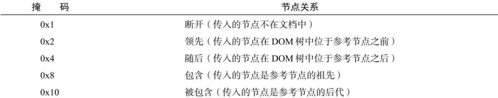

DOM 编程中经常需要确定一个元素是不是另一个元素的后代。IE 首先引入了 contains()方法，让开发者可以在不遍历 DOM 的情况下获取这个信息。contains()方法应该在要搜索的祖先元素上调用，参数是待确定的目标节点。

如果目标节点是被搜索节点的后代，contains()返回 true，否则返回 false。下面看一个例子：

```javascript
console.log(document.documentElement.contains(document.body)); // true
```

这个例子测试 `<html>` 元素中是否包含 `<body>` 元素，在格式正确的 HTML 中会返回 true。

另外，使用 DOM Level 3 的 compareDocumentPosition()方法也可以确定节点间的关系。这个方法会返回表示两个节点关系的位掩码。下表给出了这些位掩码的说明。



要模仿 contains()方法，就需要用到掩码 16（0x10）​。compareDocumentPosition()方法的结果可以通过按位与来确定参考节点是否包含传入的节点，比如：

```javascript
let result = document.documentElement.compareDocumentPosition(document.body);
console.log(!!(result & 0x10));
```

以上代码执行后 result 的值为 20（或 0x14，其中 0x4 表示“随后”​，加上 0x10“被包含”​）​。对 result 和 0x10 应用按位与会返回非零值，而两个叹号将这个值转换成对应的布尔值。

IE9 及之后的版本，以及所有现代浏览器都支持 contains()和 compareDocumentPosition()方法。
