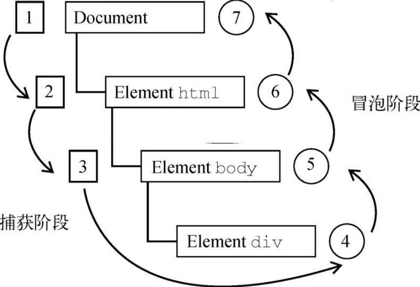

DOM2 Events 规范规定事件流分为 3 个阶段：事件捕获、到达目标和事件冒泡。事件捕获最先发生，为提前拦截事件提供了可能。然后，实际的目标元素接收到事件。最后一个阶段是冒泡，最迟要在这个阶段响应事件。仍以前面那个简单的 HTML 为例，点击 `<div>` 元素会以如图 17-3 所示的顺序触发事件。



在 DOM 事件流中，实际的目标（`<div>` 元素）在捕获阶段不会接收到事件。这是因为捕获阶段从 document 到 `<html>` 再到 `<body>` 就结束了。下一阶段，即会在 `<div>` 元素上触发事件的“到达目标”阶段，通常在事件处理时被认为是冒泡阶段的一部分（稍后讨论）​。然后，冒泡阶段开始，事件反向传播至文档。

大多数支持 DOM 事件流的浏览器实现了一个小小的拓展。虽然 DOM2Events 规范明确捕获阶段不命中事件目标，但现代浏览器都会在捕获阶段在事件目标上触发事件。最终结果是在事件目标上有两个机会来处理事件。

```
注意 所有现代浏览器都支持DOM事件流，只有IE8及更早版本不支持。
```
