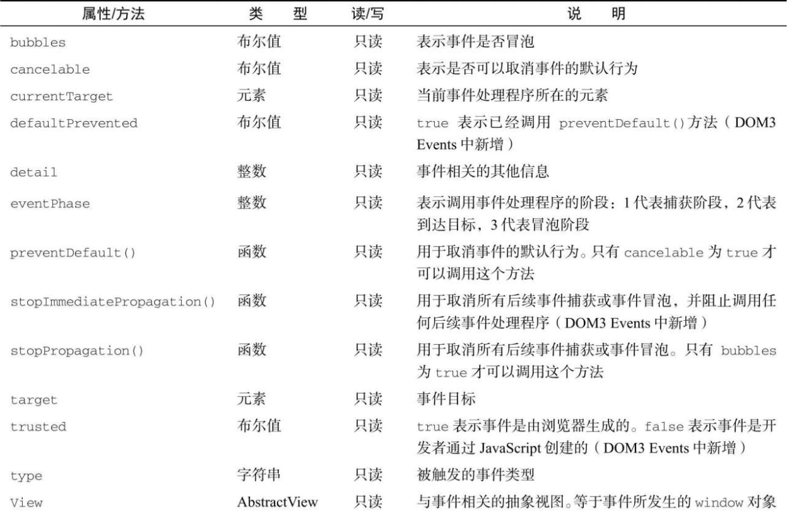

在 DOM 合规的浏览器中，event 对象是传给事件处理程序的唯一参数。不管以哪种方式（DOM0 或 DOM2）指定事件处理程序，都会传入这个 event 对象。下面的例子展示了在两种方式下都可以使用事件对象：

```javascript
let btn = document.getElementById("myBtn");
btn.onclick = function (event) {
  console.log(event.type); //"click"
};
btn.addEventListener(
  "click",
  (event) => {
    console.log(event.type); //"click"
  },
  false
);
```

这个例子中的两个事件处理程序都会在控制台打出 event.type 属性包含的事件类型。这个属性中始终包含被触发事件的类型，如"click"（与传给 addEventListener()和 removeEventListener()方法的事件名一致）​。

在通过 HTML 属性指定的事件处理程序中，同样可以使用变量 event 引用事件对象。下面的例子中演示了如何使用这个变量：

```html
<input type="button" value="Click Me" onclick="console.log(event.type)" />
```

以这种方式提供 event 对象，可以让 HTML 属性中的代码实现与 JavaScript 函数同样的功能。

如前所述，事件对象包含与特定事件相关的属性和方法。不同的事件生成的事件对象也会包含不同的属性和方法。不过，所有事件对象都会包含下表列出的这些公共属性和方法。



在事件处理程序内部，this 对象始终等于 currentTarget 的值，而 target 只包含事件的实际目标。如果事件处理程序直接添加在了意图的目标，则 this、currentTarget 和 target 的值是一样的。下面的例子展示了这两个属性都等于 this 的情形：

```javascript
let btn = document.getElementById("myBtn");
btn.onclick = function (event) {
  console.log(event.currentTarget === this); //true
  console.log(event.target === this); //true
};
```

上面的代码检测了 currentTarget 和 target 的值是否等于 this。因为 click 事件的目标是按钮，所以这 3 个值是相等的。如果这个事件处理程序是添加到按钮的父节点（如 document.body）上，那么它们的值就不一样了。比如下面的例子在 document.body 上添加了单击处理程序：

```javascript
document.body.onclick = function (event) {
  console.log(event.currentTarget === document.body); // true
  console.log(this === document.body); // true
  console.log(event.target === document.getElementById("myBtn")); // true
};
```

这种情况下点击按钮，this 和 currentTarget 都等于 document.body，这是因为它是注册事件处理程序的元素。而 target 属性等于按钮本身，这是因为那才是 click 事件真正的目标。由于按钮本身并没有注册事件处理程序，因此 click 事件冒泡到 document.body，从而触发了在它上面注册的处理程序。

type 属性在一个处理程序处理多个事件时很有用。比如下面的处理程序中就使用了 event.type：

```javascript
let btn = document.getElementById("myBtn");
let handler = function (event) {
  switch (event.type) {
    case "click":
      console.log("Clicked");
      break;
    case "mouseover":
      event.target.style.backgroundColor = "red";
      break;
    case "mouseout":
      event.target.style.backgroundColor = "";
      break;
  }
};
btn.onclick = handler;
btn.onmouseover = handler;
btn.onmouseout = handler;
```

在这个例子中，函数 handler 被用于处理 3 种不同的事件：click、mouseover 和 mouseout。当按钮被点击时，应该在控制台打印一条消息，如前面的例子所示。而把鼠标放到按钮上，会导致按钮背景变成红色，接着把鼠标从按钮上移开，背景颜色应该又恢复成默认值。这个函数使用 event.type 属性确定了事件类型，从而可以做出不同的响应。

preventDefault()方法用于阻止特定事件的默认动作。比如，链接的默认行为就是在被单击时导航到 href 属性指定的 URL。如果想阻止这个导航行为，可以在 onclick 事件处理程序中取消，如下面的例子所示：

```javascript
let link = document.getElementById("myLink");
link.onclick = function (event) {
  event.preventDefault();
};
```

任何可以通过 preventDefault()取消默认行为的事件，其事件对象的 cancelable 属性都会设置为 true。

stopPropagation()方法用于立即阻止事件流在 DOM 结构中传播，取消后续的事件捕获或冒泡。例如，直接添加到按钮的事件处理程序中调用 stopPropagation()，可以阻止 document.body 上注册的事件处理程序执行。比如：

```javascript
let btn = document.getElementById("myBtn");
btn.onclick = function (event) {
  console.log("Clicked");
  event.stopPropagation();
};
document.body.onclick = function (event) {
  console.log("Body clicked");
};
```

如果这个例子中不调用 stopPropagation()，那么点击按钮就会打印两条消息。但这里由于 click 事件不会传播到 document.body，因此 onclick 事件处理程序永远不会执行。

eventPhase 属性可用于确定事件流当前所处的阶段。如果事件处理程序在捕获阶段被调用，则 eventPhase 等于 1；如果事件处理程序在目标上被调用，则 eventPhase 等于 2；如果事件处理程序在冒泡阶段被调用，则 eventPhase 等于 3。不过要注意的是，虽然“到达目标”是在冒泡阶段发生的，但其 eventPhase 仍然等于 2。下面的例子展示了 eventPhase 在不同阶段的值：

```javascript
let btn = document.getElementById("myBtn");
btn.onclick = function (event) {
  console.log(event.eventPhase); // 2
};
document.body.addEventListener(
  "click",
  (event) => {
    console.log(event.eventPhase); //1
  },
  true
);
document.body.onclick = (event) => {
  console.log(event.eventPhase); // 3
};
```

在这个例子中，点击按钮首先会触发注册在捕获阶段的 document.body 上的事件处理程序，显示 eventPhase 为 1。接着，会触发按钮本身的事件处理程序（尽管是注册在冒泡阶段）​，此时显示 eventPhase 等于 2。最后触发的是注册在冒泡阶段的 document.body 上的事件处理程序，显示 eventPhase 为 3。而当 eventPhase 等于 2 时，this、target 和 currentTarget 三者相等。

```
注意 event对象只在事件处理程序执行期间存在，一旦执行完毕，就会被销毁。
```
