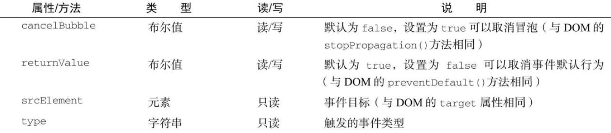

与 DOM 事件对象不同，IE 事件对象可以基于事件处理程序被指定的方式以不同方式来访问。如果事件处理程序是使用 DOM0 方式指定的，则 event 对象只是 window 对象的一个属性，如下所示：

```javascript
var btn = document.getElementById("myBtn");
btn.onclick = function () {
  let event = window.event;
  console.log(event.type); //"click"
};
```

这里，window.event 中保存着 event 对象，其 event.type 属性保存着事件类型（IE 的这个属性的值与 DOM 事件对象中一样）​。不过，如果事件处理程序是使用 attachEvent()指定的，则 event 对象会作为唯一的参数传给处理函数，如下所示：

```javascript
var btn = document.getElementById("myBtn");
btn.attachEvent("onclick", function (event) {
  console.log(event.type); //"click"
});
```

使用 attachEvent()时，event 对象仍然是 window 对象的属性（像 DOM0 方式那样）​，只是出于方便也将其作为参数传入。

如果是使用 HTML 属性方式指定的事件处理程序，则 event 对象同样可以通过变量 event 访问（与 DOM 模型一样）​。下面是在 HTML 事件属性中使用 event.type 的例子：

```html
<input type="button" value="Click Me" onclick="console.log(event.type)" />
```

IE 事件对象也包含与导致其创建的特定事件相关的属性和方法，其中很多都与相关的 DOM 属性和方法对应。与 DOM 事件对象一样，基于触发的事件类型不同，event 对象中包含的属性和方法也不一样。不过，所有 IE 事件对象都会包含下表所列的公共属性和方法。



由于事件处理程序的作用域取决于指定它的方式，因此 this 值并不总是等于事件目标。为此，更好的方式是使用事件对象的 srcElement 属性代替 this。下面的例子表明，不同事件对象上的 srcElement 属性中保存的都是事件目标：

```javascript
var btn = document.getElementById("myBtn");
btn.onclick = function () {
  console.log(window.event.srcElement === this); // true
};
btn.attachEvent("onclick", function (event) {
  console.log(event.srcElement === this); //false
});
```

在第一个以 DOM0 方式指定的事件处理程序中，srcElement 属性等于 this，而在第二个事件处理程序中（运行在全局作用域下）​，两个值就不相等了。

returnValue 属性等价于 DOM 的 preventDefault()方法，都是用于取消给定事件默认的行为。只不过在这里要把 returnValue 设置为 false 才是阻止默认动作。下面是一个设置该属性的例子：

```javascript
var link = document.getElementById("myLink");
link.onclick = function () {
  window.event.returnValue = false;
};
```

在这个例子中，returnValue 在 onclick 事件处理程序中被设置为 false，阻止了链接的默认行为。与 DOM 不同，没有办法通过 JavaScript 确定事件是否可以被取消。

cancelBubble 属性与 DOMstopPropagation()方法用途一样，都可以阻止事件冒泡。因为 IE8 及更早版本不支持捕获阶段，所以只会取消冒泡。stopPropagation()则既取消捕获也取消冒泡。下面是一个取消冒泡的例子：

```javascript
var btn = document.getElementById("myBtn");
btn.onclick = function () {
  console.log("Clicked");
  window.event.cancelBubble = true;
};
document.body.onclick = function () {
  console.log("Bodyclicked");
};
```

通过在按钮的 onclick 事件处理程序中将 cancelBubble 设置为 true，可以阻止事件冒泡到 document.body，也就阻止了调用注册在它上面的事件处理程序。于是，点击按钮只会输出一条消息。
