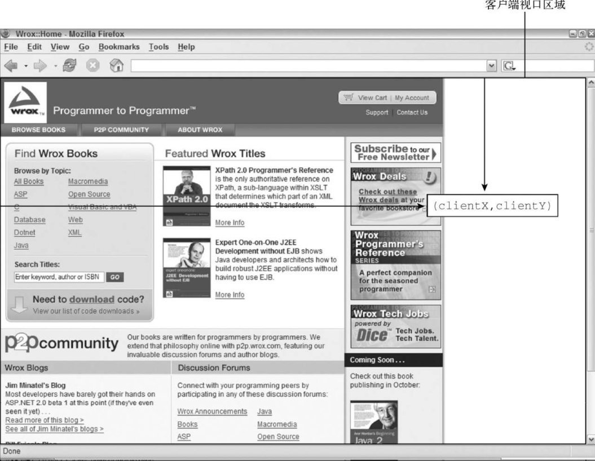
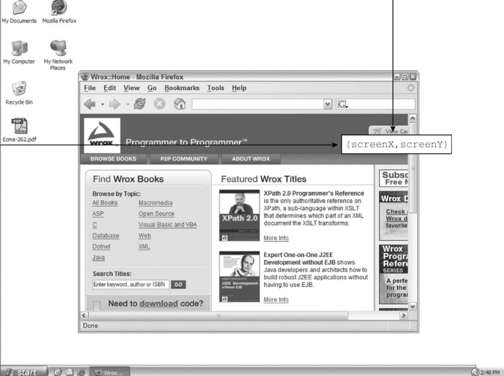
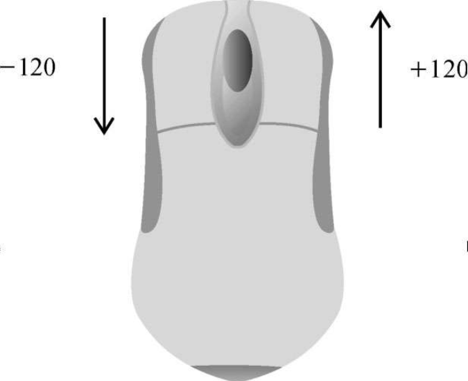

鼠标事件是 Web 开发中最常用的一组事件，这是因为鼠标是用户的主要定位设备。DOM3 Events 定义了 9 种鼠标事件。

- click：在用户单击鼠标主键（通常是左键）或按键盘回车键时触发。这主要是基于无障碍的考虑，让键盘和鼠标都可以触发 onclick 事件处理程序。
- dblclick：在用户双击鼠标主键（通常是左键）时触发。这个事件不是在 DOM2 Events 中定义的，但得到了很好的支持，DOM3Events 将其进行了标准化。
- mousedown：在用户按下任意鼠标键时触发。这个事件不能通过键盘触发。
- mouseenter：在用户把鼠标光标从元素外部移到元素内部时触发。这个事件不冒泡，也不会在光标经过后代元素时触发。mouseenter 事件不是在 DOM2 Events 中定义的，而是 DOM3Events 中新增的事件。
- mouseleave：在用户把鼠标光标从元素内部移到元素外部时触发。这个事件不冒泡，也不会在光标经过后代元素时触发。mouseleave 事件不是在 DOM2 Events 中定义的，而是 DOM3Events 中新增的事件。
- mouseout：在用户把鼠标光标从一个元素移到另一个元素上时触发。移到的元素可以是原始元素的外部元素，也可以是原始元素的子元素。这个事件不能通过键盘触发。
- mouseover：在用户把鼠标光标从元素外部移到元素内部时触发。这个事件不能通过键盘触发。
- mouseup：在用户释放鼠标键时触发。这个事件不能通过键盘触发。

页面中的所有元素都支持鼠标事件。除了 mouseenter 和 mouseleave，所有鼠标事件都会冒泡，都可以被取消，而这会影响浏览器的默认行为。

由于事件之间存在关系，因此取消鼠标事件的默认行为也会影响其他事件。

比如，click 事件触发的前提是 mousedown 事件触发后，紧接着又在同一个元素上触发了 mouseup 事件。如果 mousedown 和 mouseup 中的任意一个事件被取消，那么 click 事件就不会触发。类似地，两次连续的 click 事件会导致 dblclick 事件触发。只要有任何逻辑阻止了这两个 click 事件发生（比如取消其中一个 click 事件或者取消 mousedown 或 mouseup 事件中的任一个）, dblclick 事件就不会发生。这 4 个事件永远会按照如下顺序触发：

（1）mousedown

（2）mouseup

（3）click

（4）mousedown

（5）mouseup

（6）click

（7）dblclick

click 和 dblclick 在触发前都依赖其他事件触发，mousedown 和 mouseup 则不会受其他事件影响。

IE8 及更早版本的实现中有个问题，这会导致双击事件跳过第二次 mousedown 和 click 事件。相应的顺序变成了：

（1）mousedown

（2）mouseup

（3）click

（4）mouseup

（5）dblclick

鼠标事件在 DOM3 Events 中对应的类型是"MouseEvent"，而不是"MouseEvents"。

鼠标事件还有一个名为滚轮事件的子类别。滚轮事件只有一个事件 mousewheel，反映的是鼠标滚轮或带滚轮的类似设备上滚轮的交互。

## 1．客户端坐标

鼠标事件都是在浏览器视口中的某个位置上发生的。这些信息被保存在 event 对象的 clientX 和 clientY 属性中。这两个属性表示事件发生时鼠标光标在视口中的坐标，所有浏览器都支持。图 17-4 展示了视口中的客户端坐标。



可以通过下面的方式获取鼠标事件的客户端坐标：

```javascript
let div = document.getElementById("myDiv");
div.addEventListener("click", (event) => {
  console.log(`Client coordinates: ${event.clientX}, ${event.clientY}`);
});
```

这个例子为 `<div>` 元素指定了一个 onclick 事件处理程序。当元素被点击时，会显示事件发生时鼠标光标在客户端视口中的坐标。注意客户端坐标不考虑页面滚动，因此这两个值并不代表鼠标在页面上的位置。

## 2．页面坐标

客户端坐标是事件发生时鼠标光标在客户端视口中的坐标，而页面坐标是事件发生时鼠标光标在页面上的坐标，通过 event 对象的 pageX 和 pageY 可以获取。这两个属性表示鼠标光标在页面上的位置，因此反映的是光标到页面而非视口左边与上边的距离。

可以像下面这样取得鼠标事件的页面坐标：

```javascript
let div = document.getElementById("myDiv");
div.addEventListener("click", (event) => {
  console.log(`Page coordinates: ${event.pageX}, ${event.pageY}`);
});
```

在页面没有滚动时，pageX 和 pageY 与 clientX 和 clientY 的值相同。

IE8 及更早版本没有在 event 对象上暴露页面坐标。不过，可以通过客户端坐标和滚动信息计算出来。滚动信息可以从 document.body（混杂模式）或 document.documentElement（标准模式）的 scrollLeft 和 scrollTop 属性获取。计算过程如下所示：

```javascript
let div = document.getElementById("myDiv");
div.addEventListener("click", (event) => {
  let pageX = event.pageX,
    pageY = event.pageY;
  if (pageX === undefined) {
    pageX =
      event.clientX +
      (document.body.scrollLeft || document.documentElement.scrollLeft);
  }
  if (pageY === undefined) {
    pageY =
      event.clientY +
      (document.body.scrollTop || document.documentElement.scrollTop);
  }
  console.log(`Page coordinates: ${pageX}, ${pageY}`);
});
```

## 3．屏幕坐标

鼠标事件不仅是在浏览器窗口中发生的，也是在整个屏幕上发生的。可以通过 event 对象的 screenX 和 screenY 属性获取鼠标光标在屏幕上的坐标。图 17-5 展示了浏览器中触发鼠标事件的光标的屏幕坐标。



可以像下面这样获取鼠标事件的屏幕坐标：

```javascript
let div = document.getElementById("myDiv");
div.addEventListener("click", (event) => {
  console.log(`Screencoordinates: ${event.screenX}, ${event.screenY}`);
});
```

与前面的例子类似，这段代码也为 `<div>` 元素指定了 onclick 事件处理程序。当元素被点击时，会通过控制台打印出事件的屏幕坐标。

## 4．修饰键

虽然鼠标事件主要是通过鼠标触发的，但有时候要确定用户想实现的操作，还要考虑键盘按键的状态。键盘上的修饰键 Shift、Ctrl、Alt 和 Meta 经常用于修改鼠标事件的行为。DOM 规定了 4 个属性来表示这几个修饰键的状态：shiftKey、ctrlKey、altKey 和 metaKey。这几属性会在各自对应的修饰键被按下时包含布尔值 true，没有被按下时包含 false。在鼠标事件发生的，可以通过这几个属性来检测修饰键是否被按下。来看下面的例子，其中在 click 事件发生时检测了每个修饰键的状态：

```javascript
let div = document.getElementById("myDiv");
div.addEventListener("click", (event) => {
  let keys = new Array();
  if (event.shiftKey) {
    keys.push("shift");
  }
  if (event.ctrlKey) {
    keys.push("ctrl");
  }
  if (event.altKey) {
    keys.push("alt");
  }
  if (event.metaKey) {
    keys.push("meta");
  }
  console.log("Keys: " + keys.join(", "));
});
```

在这个例子中，onclick 事件处理程序检查了不同修饰键的状态。keys 数组中包含了在事件发生时被按下的修饰键的名称。每个对应属性为 true 的修饰键的名称都会添加到 keys 中。最后，事件处理程序会输出所有键的名称。

```
注意 现代浏览器支持所有这4个修饰键。IE8及更早版本不支持metaKey属性。
```

## 5．相关元素

对 mouseover 和 mouseout 事件而言，还存在与事件相关的其他元素。这两个事件都涉及从一个元素的边界之内把光标移到另一个元素的边界之内。对 mouseover 事件来说，事件的主要目标是获得光标的元素，相关元素是失去光标的元素。类似地，对 mouseout 事件来说，事件的主要目标是失去光标的元素，而相关元素是获得光标的元素。来看下面的例子：

```html
<!DOCTYPE html>
<html>
  <head>
    <title>Related Elements Example</title>
  </head>
  <body>
    <div
      id="myDiv"
      style="background-color:red; height:100px; width:100px; "
    ></div>
  </body>
</html>
```

这个页面中只包含一个 `<div>` 元素。如果光标开始在 `<div>` 元素上，然后从它上面移出，则 `<div>` 元素上会触发 mouseout 事件，相关元素为 `<body>` 元素。与此同时， `<body>` 元素上会触发 mouseover 事件，相关元素是 `<div>`元素。

DOM 通过 event 对象的 relatedTarget 属性提供了相关元素的信息。这个属性只有在 mouseover 和 mouseout 事件发生时才包含值，其他所有事件的这个属性的值都是 null。IE8 及更早版本不支持 relatedTarget 属性，但提供了其他的可以访问到相关元素的属性。在 mouseover 事件触发时，IE 会提供 fromElement 属性，其中包含相关元素。而在 mouseout 事件触发时，IE 会提供 toElement 属性，其中包含相关元素。​（IE9 支持所有这些属性。​）因此，可以在 EventUtil 中增加一个通用的获取相关属性的方法：

```javascript
var EventUtil = {
  // 其他代码
  getRelatedTarget: function (event) {
    if (event.relatedTarget) {
      return event.relatedTarget;
    } else if (event.toElement) {
      return event.toElement;
    } else if (event.fromElement) {
      return event.fromElement;
    } else {
      return null;
    }
  },
  // 其他代码
};
```

与前面介绍的其他跨浏览器方法一样，这个方法同样使用特性检测来确定要返回哪个值。可以像下面这样使用 EventUtil.getRelatedTarget()方法：

```javascript
let div = document.getElementById("myDiv");
div.addEventListener("mouseout", (event) => {
  let target = event.target;
  let relatedTarget = EventUtil.getRelatedTarget(event);
  console.log(`Moused out of ${target.tagName} to ${relatedTarget.tagName}`);
});
```

这个例子在 `<div>` 元素上注册了 mouseout 事件处理程序。当事件触发时，就会打印出一条消息说明鼠标从哪个元素移出，移到了哪个元素上。

## 6．鼠标按键

只有在元素上单击鼠标主键（或按下键盘上的回车键）时 click 事件才会触发，因此按键信息并不是必需的。对 mousedown 和 mouseup 事件来说，event 对象上会有一个 button 属性，表示按下或释放的是哪个按键。DOM 为这个 button 属性定义了 3 个值：0 表示鼠标主键、1 表示鼠标中键（通常也是滚轮键）、2 表示鼠标副键。按照惯例，鼠标主键通常是左边的按键，副键通常是右边的按键。

IE8 及更早版本也提供了 button 属性，但这个属性的值与前面说的完全不同：

❑ 0，表示没有按下任何键；

❑ 1，表示按下鼠标主键；

❑ 2，表示按下鼠标副键；

❑ 3，表示同时按下鼠标主键、副键；

❑ 4，表示按下鼠标中键；

❑ 5，表示同时按下鼠标主键和中键；

❑ 6，表示同时按下鼠标副键和中键；

❑ 7，表示同时按下 3 个键。

很显然，DOM 定义的 button 属性比 IE 这一套更简单也更有用，毕竟同时按多个鼠标键的情况很少见。为此，实践中基本上都以 DOM 的 button 属性为准，这是因为除 IE8 及更早版本外的所有主流浏览器都原生支持。主、中、副键的定义非常明确，而 IE 定义的其他情形都可以翻译为按下其中某个键，而且优先翻译为主键。比如，IE 返回 5 或 7 时，就会对应到 DOM 的 0。

## 7．额外事件信息

DOM2 Events 规范在 event 对象上提供了 detail 属性，以给出关于事件的更多信息。对鼠标事件来说，detail 包含一个数值，表示在给定位置上发生了多少次单击。单击相当于在同一个像素上发生一次 mousedown 紧跟一次 mouseup。detail 的值从 1 开始，每次单击会加 1。如果鼠标在 mousedown 和 mouseup 之间移动了，则 detail 会重置为 0。

IE 还为每个鼠标事件提供了以下额外信息：

❑ altLeft，布尔值，表示是否按下了左 Alt 键（如果 altLeft 是 true，那么 altKey 也是 true）​；
❑ ctrlLeft，布尔值，表示是否按下了左 Ctrl 键（如果 ctrlLeft 是 true，那么 ctrlKey 也是 true）​；
❑ offsetX，光标相对于目标元素边界的 x 坐标；
❑ offsetY，光标相对于目标元素边界的 y 坐标；
❑ shiftLeft，布尔值，表示是否按下了左 Shift 键（如果 shiftLeft 是 true，那么 shiftKey 也是 true）​。

这些属性的作用有限，这是因为只有 IE 支持。而且，它们提供的信息要么没必要，要么可以通过其他方式计算。

## 8．mousewheel 事件

IE6 首先实现了 mousewheel 事件。之后，Opera、Chrome 和 Safari 也跟着实现了。mousewheel 事件会在用户使用鼠标滚轮时触发，包括在垂直方向上任意滚动。这个事件会在任何元素上触发，并（在 IE8 中）冒泡到 document 和（在所有现代浏览器中）window。mousewheel 事件的 event 对象包含鼠标事件的所有标准信息，此外还有一个名为 wheelDelta 的新属性。当鼠标滚轮向前滚动时，wheelDelta 每次都是+120；而当鼠标滚轮向后滚动时，wheelDelta 每次都是-120（见图 17-6）​。



可以为页面上的任何元素或文档添加 onmousewheel 事件处理程序，以处理所有鼠标滚轮交互，比如：

```javascript
document.addEventListener("mousewheel", (event) => {
  console.log(event.wheelDelta);
});
```

这个例子简单地显示了鼠标滚轮事件触发时 wheelDelta 的值。多数情况下只需知道滚轮滚动的方向，而这通过 wheelDelta 值的符号就可以知道。

```
注意 HTML5也增加了mousewheel事件，以反映大多数浏览器对它的支持。
```

## 9．触摸屏设备

iOS 和 Android 等触摸屏设备的实现大相径庭，因为触摸屏通常不支持鼠标操作。在为触摸屏设备开发时，要记住以下事项。

❑ 不支持 dblclick 事件。双击浏览器窗口可以放大，但没有办法覆盖这个行为。

❑ 单指点触屏幕上的可点击元素会触发 mousemove 事件。如果操作会导致内容变化，则不会再触发其他事件。如果屏幕上没有变化，则会相继触发 mousedown、mouseup 和 click 事件。点触不可点击的元素不会触发事件。可点击元素是指点击时有默认动作的元素（如链接）或指定了 onclick 事件处理程序的元素。

❑ mousemove 事件也会触发 mouseover 和 mouseout 事件。

❑ 双指点触屏幕并滑动导致页面滚动时会触发 mousewheel 和 scroll 事件。

## 10．无障碍问题

如果 Web 应用或网站必须考虑残障人士，特别是使用屏幕阅读器的用户，那么必须小心使用鼠标事件。如前所述，按回车键可以触发 click 事件，但其他鼠标事件不能通过键盘触发。因此，建议不要使用 click 事件之外的其他鼠标事件向用户提示功能或触发代码执行，这是因为其他鼠标事件会严格妨碍盲人或视障用户使用。以下是几条使用鼠标事件时应该遵循的无障碍建议。

❑ 使用 click 事件执行代码。有人认为，当使用 onmousedown 执行代码时，应用程序会运行得更快。对视力正常用户来说确实如此。但在屏幕阅读器上，这样会导致代码无法执行，这是因为屏幕阅读器无法触发 mousedown 事件。

❑ 不要使用 mouseover 向用户显示新选项。同样，原因是屏幕阅读器无法触发 mousedown 事件。如果必须要通过这种方式显示新选项，那么可以考虑显示相同信息的键盘快捷键。

❑ 不要使用 dblclick 执行重要的操作，这是因为键盘不能触发这个事件。

遵循这些简单的建议可以极大提升 Web 应用或网站对残障人士的无障碍性。

```
注意 要了解更多关于网站无障碍的信息，可以参考WebAIM网站。
```
