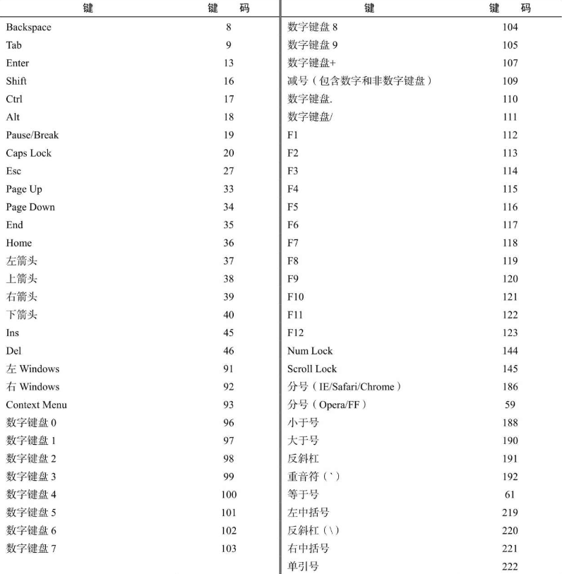
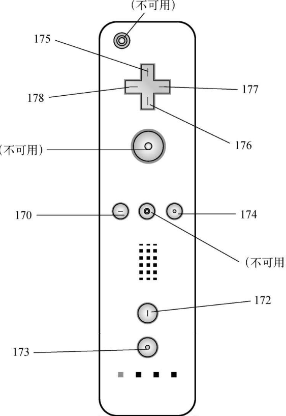

键盘事件是用户操作键盘时触发的。DOM2 Events 最初定义了键盘事件，但该规范在最终发布前删除了相应内容。因此，键盘事件很大程度上是基于原始的 DOM0 实现的。

DOM3 Events 为键盘事件提供了一个首先在 IE9 中完全实现的规范。其他浏览器也开始实现该规范，但仍然存在很多遗留的实现。

键盘事件包含 3 个事件：

❑ keydown，用户按下键盘上某个键时触发，而且持续按住会重复触发。

❑ keypress，用户按下键盘上某个键并产生字符时触发，而且持续按住会重复触发。Esc 键也会触发这个事件。DOM3 Events 废弃了 keypress 事件，而推荐 textInput 事件。

❑ keyup，用户释放键盘上某个键时触发。

虽然所有元素都支持这些事件，但当用户在文本框中输入内容时最容易看到。

输入事件只有一个，即 textInput。这个事件是对 keypress 事件的扩展，用于在文本显示给用户之前更方便地截获文本输入。textInput 会在文本被插入到文本框之前触发。

当用户按下键盘上的某个字符键时，首先会触发 keydown 事件，然后触发 keypress 事件，最后触发 keyup 事件。注意，这里 keydown 和 keypress 事件会在文本框出现变化之前触发，而 keyup 事件会在文本框出现变化之后触发。如果一个字符键被按住不放，keydown 和 keypress 就会重复触发，直到这个键被释放。

```
注意 键盘事件支持与鼠标事件相同的修饰键。shiftKey、ctrlKey、altKey和metaKey属性在键盘事件中都是可用的。IE8及更早版本不支持metaKey属性。
```

## 1．键码

对于 keydown 和 keyup 事件，event 对象的 keyCode 属性中会保存一个键码，对应键盘上特定的一个键。对于字母和数字键，keyCode 的值与小写字母和数字的 ASCII 编码一致。比如数字 7 键的 keyCode 为 55，而字母 A 键的 keyCode 为 65，而且跟是否按了 Shift 键无关。DOM 和 IE 的 event 对象都支持 keyCode 属性。下面这个例子展示了如何使用 keyCode 属性：

```javascript
let textbox = document.getElementById("myText");
textbox.addEventListener("keyup", (event) => {
  console.log(event.keyCode);
});
```

这个例子在 keyup 事件触发时直接显示出 event 对象的 keyCode 属性值。下表给出了键盘上所有非字符键的键码。



## 2．字符编码

在 keypress 事件发生时，意味着按键会影响屏幕上显示的文本。对插入或移除字符的键，所有浏览器都会触发 keypress 事件，其他键则取决于浏览器。因为 DOM3 Events 规范才刚刚开始实现，所以不同浏览器之间的实现存在显著差异。

浏览器在 event 对象上支持 charCode 属性，只有发生 keypress 事件时这个属性才会被设置值，包含的是按键字符对应的 ASCII 编码。通常，charCode 属性的值是 0，在 keypress 事件发生时则是对应按键的键码。IE8 及更早版本和 Opera 使用 keyCode 传达字符的 ASCII 编码。要以跨浏览器方式获取字符编码，首先要检查 charCode 属性是否有值，如果没有再使用 keyCode，如下所示：

```javascript
var EventUtil = {
  // 其他代码
  getCharCode: function (event) {
    if (typeof event.charCode == "number") {
      return event.charCode;
    } else {
      return event.keyCode;
    }
  },
  // 其他代码
};
```

这个方法检测 charCode 属性是否为数值（在不支持的浏览器中是 undefined）​。如果是数值，则返回。否则，返回 keyCode 值。可以像下面这样使用：

```javascript
let textbox = document.getElementById("myText");
textbox.addEventListener("keypress", (event) => {
  console.log(EventUtil.getCharCode(event));
});
```

一旦有了字母编码，就可以使用 String.fromCharCode()方法将其转换为实际的字符了。

## 3．DOM3 的变化

尽管所有浏览器都实现了某种形式的键盘事件，DOM3 Events 还是做了一些修改。比如，DOM3 Events 规范并未规定 charCode 属性，而是定义了 key 和 char 两个新属性。

其中，key 属性用于替代 keyCode，且包含字符串。在按下字符键时，key 的值等于文本字符（如“k”或“M”​）​；在按下非字符键时，key 的值是键名（如“Shift”或“ArrowDown”​）​。char 属性在按下字符键时与 key 类似，在按下非字符键时为 null。

IE 支持 key 属性但不支持 char 属性。Safari 和 Chrome 支持 keyIdentifier 属性，在按下非字符键时返回与 key 一样的值（如“Shift”​）​。对于字符键，keyIdentifier 返回以“U+0000”形式表示 Unicode 值的字符串形式的字符编码。

```javascript
let textbox = document.getElementById("myText");
textbox.addEventListener("keypress", (event) => {
  let identifier = event.key || event.keyIdentifier;
  if (identifier) {
    console.log(identifier);
  }
});
```

由于缺乏跨浏览器支持，因此不建议使用 key、keyIdentifier、和 char。

DOM3 Events 也支持一个名为 location 的属性，该属性是一个数值，表示是在哪里按的键。可能的值为：0 是默认键，1 是左边（如左边的 Alt 键）,2 是右边（如右边的 Shift 键）,3 是数字键盘，4 是移动设备（即虚拟键盘）,5 是游戏手柄（如任天堂 Wii 控制器）​。IE9 支持这些属性。Safari 和 Chrome 支持一个等价的 keyLocation 属性，但由于实现有问题，这个属性值始终为 0，除非是数字键盘（此时值为 3）​，值永远不会是 1、2、4、5。

```javascript
let textbox = document.getElementById("myText");
textbox.addEventListener("keypress", (event) => {
  letloc = event.location || event.keyLocation;
  if (loc) {
    console.log(loc);
  }
});
```

与 key 属性类似，location 属性也没有得到广泛支持，因此不建议在跨浏览器开发时使用。

最后一个变化是给 event 对象增加了 getModifierState()方法。这个方法接收一个参数，一个等于 Shift、Control、Alt、AltGraph 或 Meta 的字符串，表示要检测的修饰键。如果给定的修饰键处于激活状态（键被按住）​，则方法返回 true，否则返回 false：

```javascript
let textbox = document.getElementById("myText");
textbox.addEventListener("keypress", (event) => {
  if (event.getModifierState) {
    console.log(event.getModifierState("Shift"));
  }
});
```

当然，event 对象已经通过 shiftKey、altKey、ctrlKey 和 metaKey 属性暴露了这些信息。

## 4．textInput 事件

DOM3 Events 规范增加了一个名为 textInput 的事件，其在字符被输入到可编辑区域时触发。作为对 keypress 的替代，textInput 事件的行为有些不一样。一个区别是 keypress 会在任何可以获得焦点的元素上触发，而 textInput 只在可编辑区域上触发。另一个区别是 textInput 只在有新字符被插入时才会触发，而 keypress 对任何可能影响文本的键都会触发（包括退格键）​。

因为 textInput 事件主要关注字符，所以在 event 对象上提供了一个 data 属性，包含要插入的字符（不是字符编码）​。data 的值始终是要被插入的字符，因此如果在按 S 键时没有按 Shift 键，data 的值就是"s"，但在按 S 键时同时按 Shift 键，data 的值则是"S"。

textInput 事件可以这样来用：

```javascript
let textbox = document.getElementById("myText");
textbox.addEventListener("textInput", (event) => {
  console.log(event.data);
});
```

这个例子会实时把输入文本框的文本通过日志打印出来。

event 对象上还有一个名为 inputMethod 的属性，该属性表示向控件中输入文本的手段。可能的值如下：

❑ 0，表示浏览器不能确定是什么输入手段；

❑ 1，表示键盘；

❑ 2，表示粘贴；

❑ 3，表示拖放操作；

❑ 4，表示 IME；

❑ 5，表示表单选项；

❑ 6，表示手写（如使用手写笔）​；

❑ 7，表示语音；

❑ 8，表示组合方式；

❑ 9，表示脚本。

使用这些属性，可以确定用户是如何将文本输入到控件中的，从而可以辅助验证。

## 5．设备上的键盘事件

任天堂 Wii 会在用户按下 Wii 遥控器上的键时触发键盘事件。虽然不能访问 Wii 遥控器上所有的键，但其中一些键可以触发键盘事件。图 17-7 中标识出了某些键的键码。



如图所示，按下十字键（175~178）、减号键（170）、加号键（174）、1（172）或 2（173）按钮会触发键盘事件。无法判断电源键、A、B 或 Home 键是否已按下。
