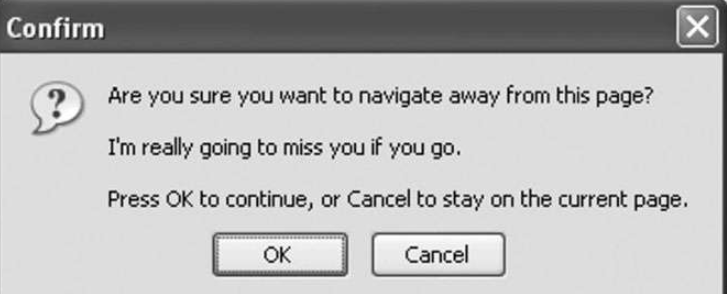

DOM 规范并未涵盖浏览器都支持的所有事件。很多浏览器根据特定的用需求或使用场景实现了自定义事件。HTML5 详尽地列出了浏览器支持所有事件。本节讨论 HTML5 中得到浏览器较好支持的一些事件。注意些并不是浏览器支持的所有事件。​（本书后面也会涉及一些其他事件。​）

## 1. contextmenu 事件

Windows 95 通过单击鼠标右键为 PC 用户增加了上下文菜单的概念。不久，这个概念也在 Web 上得以实现。开发者面临的问题是如何确定何时显示上下文菜单（在 Windows 上是右击鼠标，在 Mac 上是 Ctrl+单）​，以及如何避免默认的上下文菜单起作用。结果就出现了 contextmenu 事件，以专门用于表示何时该显示上下文菜单，从而允许发者取消默认的上下文菜单并提供自定义菜单。

contextmenu 事件冒泡，因此只要给 document 指定一个事件处理程序可以处理页面上的所有同类事件。事件目标是触发操作的元素。这个事件在所有浏览器中都可以取消，在 DOM 合规的浏览器中使用 event.preventDefault()，在 IE8 及更早版本中将 event.returnValue 设置 false。contextmenu 事件应该算一种鼠标事件，因此 event 对象上的很多属性都与光标位置有关。通常，自定义的上下文菜单都是通过 oncontextmenu 事件处理程序触发显示，并通过 onclick 事件处理程序触隐藏的。来看下面的例子：

```html
<!DOCTYPE html>
<html>
  <head>
    <title>ContextMenu Event Example</title>
  </head>
  <body>
    <div id="myDiv">
      Right click or Ctrl+click me to get a custom context menu. Click anywhere
      else to get the default context menu.
    </div>
    <ul
      id="myMenu"
      style="position:absolute; visibility:hidden; background-color:
        silver"
    >
      <li><a href="http://www.somewhere.com"> somewhere</a></li>
      <li><a href="http://www.wrox.com">Wrox site</a></li>
      <li><a href="http://www.somewhere-else.com">somewhere-else</a></li>
    </ul>
  </body>
</html>
```

这个例子中的 `<div>` 元素有一个上下文菜单 `<ul>` 。作为上下文菜单， `<ul>` 元素初始时是隐藏的。以下是实现上下文菜单功能的 JavaScript 代码：

```javascript
window.addEventListener("load", (event) => {
  let div = document.getElementById("myDiv");
  div.addEventListener("contextmenu", (event) => {
    event.preventDefault();
    let menu = document.getElementById("myMenu");
    menu.style.left = event.clientX + "px";
    menu.style.top = event.clientY + "px";
    menu.style.visibility = "visible";
  });
  document.addEventListener("click", (event) => {
    document.getElementById("myMenu").style.visibility = "hidden";
  });
});
```

这里在 `<div>` 元素上指定了一个 oncontextmenu 事件处理程序。这个事处理程序首先取消默认行，确保不会显示浏览器默认的上下文菜单。接着基于 event 对象的 clientX 和 clientY 属性把 `<ul>` 元素放到适当位置。最一步通过将 visibility 属性设置为"visible"让自定义上下文菜单显示出来。另外，又给 document 添加了一个 onclick 事件处理程序，以便在单事件发生时隐藏上下文菜单（系统上下文菜单就是这样隐藏的）​。

然这个例子很简单，但它是网页中所有自定义上下文菜单的基础。在这个简单例子的基础上，再添加一些 CSS，上下文菜单就会更漂亮。

## 2. beforeunload 事件

beforeunload 事件会在 window 上触发，用意是给开发者提供阻止页面卸载的机会。这个事件会在页面即将从浏览器中卸载时触发，如果页面要继续使用，则可以不被卸载。这个事件不能取消，否则就意味着可以用户永久阻拦在一个页面上。相反，这个事件会向用户显示一个确认框，其中的消息表明浏览器即将卸载页面，并请用户确认是希望关闭页，还是继续留在页面上（见图 17-8）​。

为了显示类似图 17-8 的确认框，需要将 event.returnValue 设置为要在确框中显示的字符串（对于 IE 和 Firefox 来说）​，并将其作为函数值返回对于 Safari 和 Chrome 来说）​，如下所示：



```javascript
window.addEventListener("beforeunload", (event) => {
  let message = "I'm really going to miss you if you go.";
  event.returnValue = message;
  return message;
});
```

## 3. DOMContentLoaded 事件

window 的 load 事件会在页面完全加载后触发，因为要等待很多外部资源载完成，所以会花费较长时间。而 DOMContentLoaded 事件会在 DOM 树构建完成后立即触发，而不用等待图片、JavaScript 文件、CSS 文或其他资源加载完成。相对于 load 事件，DOMContentLoaded 可以让发者在外部资源下载的同时就能指定事件处理程序，从而让用户能够更地与页面交互。

要处理 DOMContentLoaded 事件，需要给 document 或 window 添加事处理程序（实际的事件目标是 document，但会冒泡到 window）​。下是一个在 document 上监听 DOMContentLoaded 事件的例子：

```javascript
document.addEventListener("DOMContentLoaded", (event) => {
  console.log("Content loaded");
});
```

DOMContentLoaded 事件的 event 对象中不包含任何额外信息（除了 target 等于 document）​。

DOMContentLoaded 事件通常用于添加事件处理程序或执行其他 DOM 操作。这个事件始终在 load 事件之前触发。

对于不支持 DOMContentLoaded 事件的浏览器，可以使用超时为 0 的 setTimeout()函数，通过其回调来设置事件处理程序，比如：

```javascript
setTimeout(() => {
  // 在这里添加事件处理程序
}, 0);
```

以上代码本质上意味着在当前 JavaScript 进程执行完毕后立即执行这个回调。页面加载和构建期间，只有一个 JavaScript 进程运行。所以可以在这进程空闲后立即执行回调，至于是否与同一个浏览器或同一页面上不同本的 DOMContentLoaded 触发时机一致并无绝对把握。为了尽可能早些执行，以上代码最好是页面上的第一个超时代码。即使如此，考虑到种影响因素，也不一定保证能在 load 事件之前执行超时回调。

## 4. readystatechange 事件

IE 首先在 DOM 文档的一些地方定义了一个名为 readystatechange 事件。这个有点神秘的事件旨在提供文档或元素加载状态的信息，但行为有时候不稳定。支持 readystatechange 事件的每个对象都有一个 readyState 属性，该属性具有一个以下列出的可能的字符串值。

❑ uninitialized：对象存在并尚未初始化。

❑ loading：对象正在加载数据。

❑ loaded：对象已经加载完数据。

❑ interactive：对象可以交互，但尚未加载完成。

❑ complete：对象加载完成。

看起来很简单，其实并非所有对象都会经历所有 readystate 阶段。文档中有些对象会完全跳过某个阶段，但并未说明哪些阶段适用于哪些对象。意味着 readystatechange 事件经常会触发不到 4 次，而 readyState 未必会依次呈现上述值。

在 document 上使用时，值为"interactive"的 readyState 首先会触发 readystatechange 事件，时机类似于 DOMContentLoaded。进入交互段，意味着 DOM 树已加载完成，因而可以安全地交互了。此时图片和他外部资源不一定都加载完了。可以像下面这样使用 readystatechange 事件：

```javascript
document.addEventListener("readystatechange", (event) => {
  if (document.readyState == "interactive") {
    console.log("Content loaded");
  }
});
```

这个事件的 event 对象中没有任何额外的信息，连事件目标都不会设置。

在与 load 事件共同使用时，这个事件的触发顺序不能保证。在包含特别多较大外部资源的页面中，交互阶段会在 load 事件触发前先触发。而在包含较少且较小外部资源的页面中，这个 readystatechange 事件有可能在 load 事件触发后才触发。

让问题变得更加复杂的是，交互阶段与完成阶段的顺序也不是固定的。在部资源较多的页面中，很可能交互阶段会早于完成阶段，而在外部资源少的页面中，很可能完成阶段会早于交互阶段。因此，实践中为了抢到早的时机，需要同时检测交互阶段和完成阶段。比如：

```javascript
document.addEventListener("readystatechange", (event) => {
  if (
    document.readyState == "interactive" ||
    document.readyState == "complete"
  ) {
    document.removeEventListener("readystatechange", arguments.callee);
    console.log("Content loaded");
  }
});
```

当 readystatechange 事件触发时，这段代码会检测 document.readyState 属性，以确定当前是不是交互或完成状态。如果是，则移除事件处理程序，以保证其他阶段不再执行。注意，因为这里的件处理程序是匿名函数，所以使用了 arguments.callee 作为函数指针。然后，又打印出一条表示内容已加载的消息。这样的逻辑可以保证尽可能接近使用 DOMContentLoaded 事件的效果。

注意 使用 readystatechange 只能尽量模拟 DOMContentLoaded，但做不到分毫不差。load 事件和 readystatechange 事件发生的顺序在不同页面中是不一样的。

## 5.0 pageshow 与 pagehide 事件

Firefox 和 Opera 开发了一个名为往返缓存（bfcache, back-forward cache）的功能，此功能旨在使用浏览器“前进”和“后退”按钮时加快页面之间的切换。这个缓存不仅存储页面数据，也存储 DOM 和 javaScript 状态，实际上是把整个页面都保存在内存里。如果页面在缓存中，那么导航到这个页面时就不会触发 load 事件。通常，这不会导致什么问题，因为整个页面状态都被保存起来了。不过，Firefox 决定提供一些事件，把往返缓存的行为暴露出来。一个事件是 pageshow，其会在页面显示时触发，无论是否来自往返缓存。在新加载的页面上，pageshow 会在 load 事件之后触发；在来自往返缓存的页面上，pageshow 会在页面状态完全恢复后触发。注意，虽然这事件的目标是 document，但事件处理程序必须添加到 window 上。下面的例子展示了追踪这些事件的代码：

```javascript
(function () {
  let showCount = 0;
  window.addEventListener("load", () => {
    console.log("Load fired");
  });
  window.addEventListener("pageshow", () => {
    showCount++;
    console.log(`Show has been fired ${showCount} times.`);
  });
})();
```

这个例子使用了私有作用域来保证 showCount 变量不进入全局作用域。页面首次加载时，showCount 的值为 0。之后每次触发 pageshow 事，showCount 都会加 1 并输出消息。如果从包含以上代码的页面跳走，后又点击“后退”按钮返回以恢复它，就能够每次都看到 showCount 递增的值。这是因为变量的状态连同整个页面状态都保存在了内存中，导航回来后可以恢复。如果是点击了浏览器的“刷新”按钮，则 showCount 的值会重置为 0，因为页面会重新加载。

除了常用的属性，pageshow 的 event 对象中还包含一个名为 persisted 的性。这个属性是一个布尔值，如果页面存储在了往返缓存中就是 true，否则就是 false。可以像下面这样在事件处理程序中检测这个属性：

```javascript
(function () {
  let showCount = 0;
  window.addEventListener("load", () => {
    console.log("Load fired");
  });
  window.addEventListener("pageshow", () => {
    showCount++;
    console.log(
      `Showhasbeenfired${showCount}times.`,
      `Persisted?${event.persisted}`
    );
  });
})();
```

通过检测 persisted 属性可以根据页面是否取自往返缓存而决定是否采取不同的操作。

与 pageshow 对应的事件是 pagehide，这个事件会在页面从浏览器中卸载后，在 unload 事件之前触发。与 pageshow 事件一样，pagehide 事件样是在 document 上触发，但事件处理程序必须被添加到 window。event 对象中同样包含 persisted 属性，但用法稍有不同。比如，以下代码测了 event.persisted 属性：

```javascript
window.addEventListener("pagehide", (event) => {
  console.log("Hiding. Persisted? " + event.persisted);
});
```

这样，当 pagehide 事件触发时，也许可以根据 persisted 属性的值来采取些不同的操作。对 pageshow 事件来说，persisted 为 true 表示页面是往返缓存中加载的；而对 pagehide 事件来说，persisted 为 true 表示页在卸载之后会被保存在往返缓存中。因此，第一次触发 pageshow 事件 persisted 始终是 false，而第一次触发 pagehide 事件时 persisted 始终 true（除非页面不符合使用往返缓存的条件）​。

```
注意 注册了onunload事件处理程序（即使是空函数）的页面会自动排除在往返缓存之外。这是因为onunload事件典型的使用场景是撤销onload事件发生时所做的事情，如果使用往返缓存，则下一次页面显示时就不会触发onload事件，而这可能导致页面无法使用。
```

## 6. hashchange 事件

HTML5 增加了 hashchange 事件，用于在 URL 散列值（URL 最后#后面的部用）发生变化时通知开发者。这是因为开发者经常在 Ajax 应用程序中使 URL 散列值存储状态信息或路由导航信息。

onhashchange 事件处理程序必须添加给 window，每次 URL 散列值发生化时会调用它。event 对象有两个新属性：oldURL 和 newURL。这两个性分别保存变化前后的 URL，而且是包含散列值的完整 URL。下面的例展示了如何获取变化前后的 URL：

```javascript
window.addEventListener("hashchange", (event) => {
  console.log(`Old URL: ${event.oldURL}, New URL: ${event.newURL}`);
});
```

如果想确定当前的散列值，最好使用 location 对象

```javascript
window.addEventListener("hashchange", (event) => {
  console.log(`Currenthash: ${location.hash}`);
});
```
