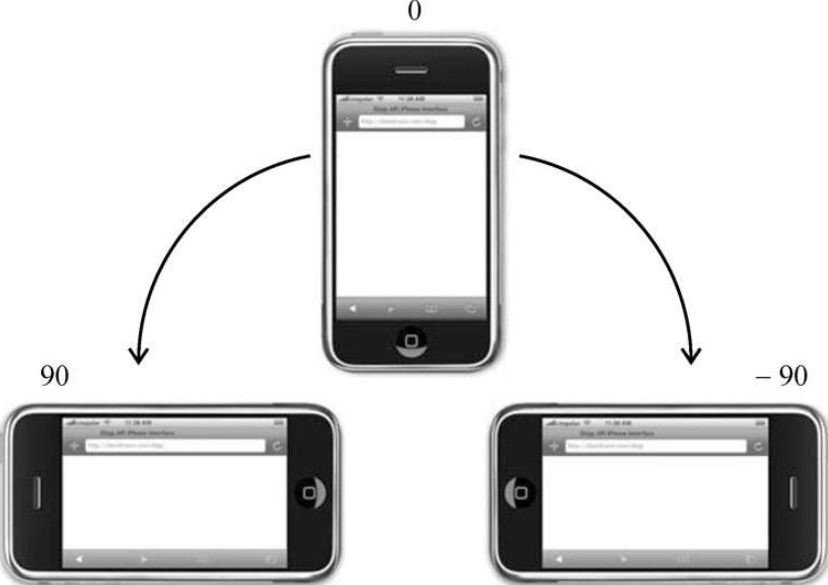
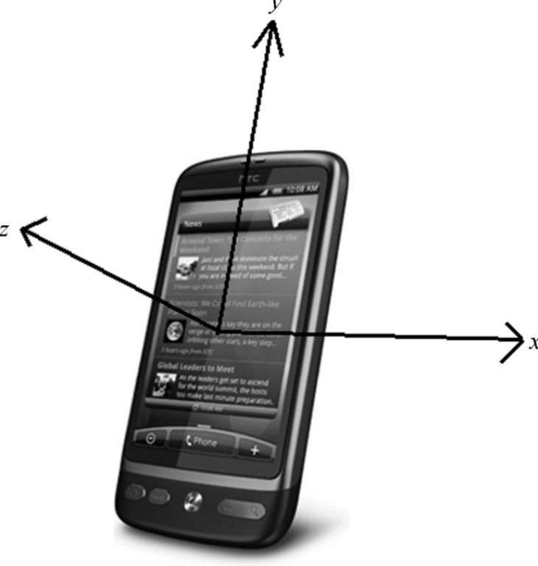
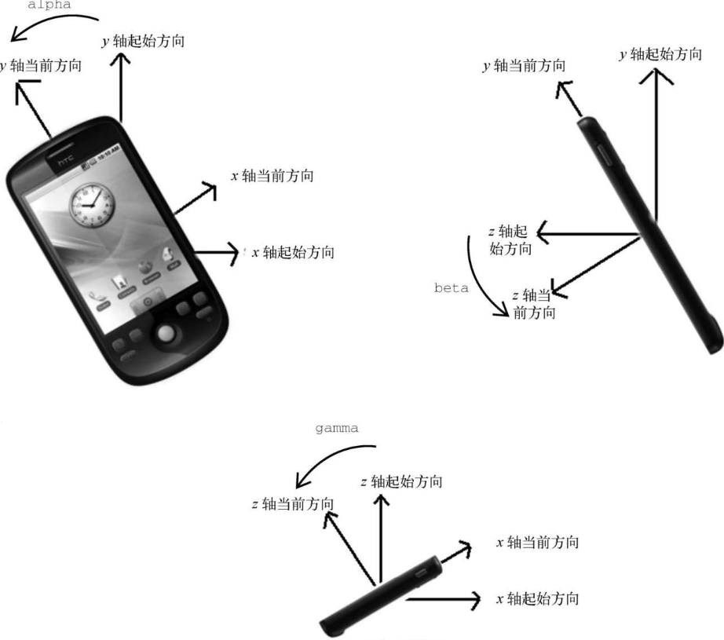

随着智能手机和平板计算机的出现，用户与浏览器交互的新方式应运而生。为此，一批新事件被发明了出来。设备事件可以用于确定用户使用设备的方式。W3C 在 2011 年就开始起草一份新规范，用于定义新设备及设相关的事件。

## 1. orientationchange 事件

苹果公司在移动 Safari 浏览器上创造了 orientationchange 事件，以方便开发者判断用户的设备是处于垂直模式还是水平模式。移动 Safari 在 window 上暴露了 window.orientation 属性，它有以下 3 种值之一：0 表示垂直模式，90 表示左转水平模式（主屏幕键在右侧）, -90 表示右转水平式（主屏幕键在左）​。虽然相关文档也提及设备倒置后的值为 180，但设备本身至今还不支持。图 17-9 展示了 window.orientation 属性的各种值。



每当用户旋转设备改变了模式，就会触发 orientationchange 事件。但 event 对象上没有暴露任何有用的信息，这是因为相关信息都可以从 window.orientation 属性中获取。以下是这个事件典型的用法：

```javascript
window.addEventListener("load", (event) => {
  let div = document.getElementById("myDiv");
  div.innerHTML = "Current orientation is " + window.orientation;
  window.addEventListener("orientationchange", (event) => {
    div.innerHTML = "Current orientation is " + window.orientation;
  });
});
```

这个例子会在 load 事件触发时显示设备初始的朝向。然后，又指定了 orientationchange 事件处理程序。此后，只要这个事件触发，页面就会更新以显示新的朝向信息。

所有 iOS 设备都支持 orientationchange 事件和 window.orientation 属性。

```
注意 因为orientationchange事件被认为是window事件，所以也可以通过给<body>元素添加onorientationchange属性来指定事件处理程序。
```

## 2. deviceorientation 事件

deviceorientation 是 DeviceOrientationEvent 规范定义的事件。如果可获取设备的加速计信息，而且数据发生了变化，这个事件就会在 window 上触发。要注意的是，deviceorientation 事件只反映设备在空间的朝向，而不涉及移动相关的信息。

设备本身处于 3D 空间即拥有 x 轴、y 轴和 z 轴的坐标系中。如果把设备静止在水平的表面上，那么三轴的值均为 0，其中，x 轴方向为从设备左侧到右侧，y 轴方向为从设备底部到上部，z 轴方向为从设备背面到正面，如图 7-10 所示。



当 deviceorientation 触发时，event 对象中会包含各个轴相对于设备静置时图坐标值的变化，主要是以下 5 个属性。

❑ alpha:0~360 范围内的浮点值，表示围绕 z 轴旋转时 y 轴的度数（左右转）​。

❑ beta:-180~180 范围内的浮点值，表示围绕 x 轴旋转时 z 轴的度数（前后转）​。

❑ gamma:-90~90 范围内的浮点值，表示围绕 y 轴旋转时 z 轴的度数（扭转）​。

❑ absolute：布尔值，表示设备是否返回绝对值。

❑ compassCalibrated：布尔值，表示设备的指南针是否正确校准。

图 17-11 展示了 alpha、beta 和 gamma 值的计算方式。下



下面是一个输出 alpha、beta 和 gamma 值的简单例子：基素这 w 头

```javascript
window.addEventListener("deviceorientation", (event) => {
  let output = document.getElementById("output");
  output.innerHTML = `Alpha=${event.alpha}, Beta=${event.beta}, Gamma=${event.gamma}<br>`;
});
```

基于这些信息，可以随着设备朝向的变化重新组织或修改屏幕上显示的元素。例如，以下代码会随着朝向变化旋转一个元素：

```javascript
window.addEventListener("deviceorientation", (event) => {
  let arrow = document.getElementById("arrow");
  arrow.style.webkitTransform = `rotate(${Math.round(event.alpha)}deg)`;
});
```

这个例子只适用于移动 WebKit 浏览器，因为使用的是专有的 webkitTransform 属性（CSS 标准的 transform 属性的临时版本）​。​“箭”​（arrow）元素会随着 event.alpha 值的变化而变化，呈现出指南针样子。这里给 CSS3 旋转变形函数传入了四舍五入后的值，以确保平顺。

## 3. devicemotion 事件

DeviceOrientationEvent 规范也定义了 devicemotion 事件。这个事件用提示设备实际上在移动，而不仅仅是改变了朝向。例如，devicemotion 事件可以用来确定设备正在掉落或者正拿在一个行走的人里。

devicemotion 事件触发时，event 对象中包含如下额外的属性。

❑ acceleration：对象，包含 x、y 和 z 属性，反映不考虑重力情况下各个维度的加速信息。

❑ accelerationIncludingGravity：对象，包含 x、y 和 z 属性，反映各个维度的加速信息，包含 z 轴自然重力加速度。

❑ interval：毫秒，距离下次触发 devicemotion 事件的时间。此值在事件之间应为常量。如 r 测

❑ rotationRate：对象，包含 alpha、beta 和 gamma 属性，表示设备朝向。

如果无法提供 acceleration、accelerationIncludingGravity 和 rotationRate 信息，则属性值为 null。为此，在使用这些属性前必须先检它们的值是否为 null。比如：

```javascript
window.addEventListener("devicemotion", (event) => {
  let output = document.getElementById("output");
  if (event.rotationRate !== null) {
    output.innerHTML +=
      `Alpha=${event.rotationRate.alpha}` +
      `Beta=${event.rotationRate.beta}` +
      `Gamma=${event.rotationRate.gamma}`;
  }
});
```
