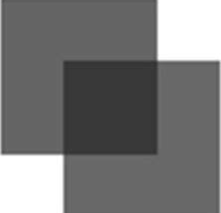
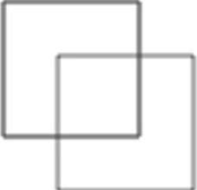
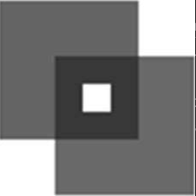

矩形是唯一一个可以直接在 2D 绘图上下文中绘制的形状。与绘制矩形相关的方法有 3 个：fillRect()、strokeRect()和 clearRect()。这些方法都接收 4 个参数：矩形 x 坐标、矩形 y 坐标、矩形宽度和矩形高度。这几个参数的单位都是像素。

fillRect()方法用于以指定颜色在画布上绘制并填充矩形。填充的颜色使用 fillStyle 属性指定。来看下面的例子：

```javascript
let drawing = document.getElementById("drawing");
// 确保浏览器支持<canvas>
if (drawing.getContext) {
  let context = drawing.getContext("2d");
  // 引自MDN文档
  //绘制红色矩形
  context.fillStyle = "#ff0000";
  context.fillRect(10, 10, 50, 50);
  //绘制半透明蓝色矩形
  context.fillStyle = "rgba(0,0,255,0.5)";
  context.fillRect(30, 30, 50, 50);
}
```

以上代码先将 fillStyle 设置为红色并在坐标点(10, 10)绘制了一个宽高均为 50 像素的矩形。接着，使用 rgba()格式将 fillStyle 设置为半透明蓝色，并绘制了另一个与第一个部分重叠的矩形。结果就是可以透过蓝色矩形看到红色矩形（见图 18-1）​。



strokeRect()方法使用通过 strokeStyle 属性指定的颜色绘制矩形轮廓。下面是一个例子：

```javascript
let drawing = document.getElementById("drawing");
// 确保浏览器支持<canvas>
if (drawing.getContext) {
  let context = drawing.getContext("2d");
  // 引自MDN文档
  //绘制红色轮廓的矩形
  context.strokeStyle = "#ff0000";
  context.strokeRect(10, 10, 50, 50);
  //绘制半透明蓝色轮廓的矩形
  context.strokeStyle = "rgba(0,0,255,0.5)";
  context.strokeRect(30, 30, 50, 50);
}
```

以上代码同样绘制了两个重叠的矩形，不过只有轮廓，而不是实心的（见图 18-2）​。



```
注意 描边宽度由lineWidth属性控制，它可以是任意整数值。类似地，lineCap属性控制线条端点的形状［"butt"（平头）、"round"（出圆头）或"square"（出方头）］，而lineJoin属性控制线条交点的形状［"round"（圆转）、"bevel"（取平）或"miter"（出尖）］。
```

使用 clearRect()方法可以擦除画布中某个区域。该方法用于把绘图上下文中的某个区域变透明。通过先绘制形状再擦除指定区域，可以创建出有趣的效果，比如从已有矩形中开个孔。来看下面的例子：

```javascript
let drawing = document.getElementById("drawing");
// 确保浏览器支持<canvas>
if (drawing.getContext) {
  let context = drawing.getContext("2d");
  // 引自MDN文档
  // 绘制红色矩形
  context.fillStyle = "#ff0000";
  context.fillRect(10, 10, 50, 50);
  // 绘制半透明蓝色矩形
  context.fillStyle = "rgba(0,0,255,0.5)";
  context.fillRect(30, 30, 50, 50);
  //在前两个矩形重叠的区域擦除一个矩形区域
  context.clearRect(40, 40, 10, 10);
}
```

以上代码在两个矩形重叠的区域上擦除了一个小矩形，图 18-3 展示了结果。


