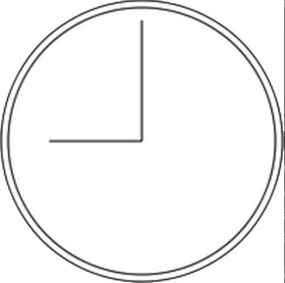

2D 绘图上下文支持很多在画布上绘制路径的方法。通过路径可以创建复杂的形状和线条。要绘制路径，必须首先调用 beginPath()方法以表示要开始绘制新路径。然后，再调用下列方法来绘制路径。

❑ arc(x, y, radius, startAngle, endAngle, counterclockwise)：以坐标(x, y)为圆心，以 radius 为半径绘制一条弧线，起始角度为 startAngle，结束角度为 endAngle（都是弧度）​。最后一个参数 counterclockwise 表示是否逆时针计算起始角度和结束角度（默认为顺时针）​。

❑ arcTo(x1, y1, x2, y2, radius)：以给定半径 radius，经由(x1, y1)绘制一条从上一点到(x2, y2)的弧线。

❑ bezierCurveTo(c1x, c1y, c2x, c2y, x, y)：以(c1x, c1y)和(c2x,c2y)为控制点，绘制一条从上一点到(x, y)的弧线（三次贝塞尔曲线）​。

❑ lineTo(x, y)：绘制一条从上一点到(x, y)的直线。

❑ moveTo(x, y)：不绘制线条，只把绘制光标移动到(x, y)。❑ quadraticCurveTo(cx, cy, x, y)：以(cx, cy)为控制点，绘制一条从上一点到(x, y)的弧线（二次贝塞尔曲线）​。

❑ rect(x, y, width, height)：以给定宽度和高度在坐标点(x, y)绘制一个矩形。这个方法与 strokeRect()和 fillRect()的区别在于，它创建的是一条路径，而不是独立的图形。

创建路径之后，可以使用 closePath()方法绘制一条返回起点的线。如果路径已经完成，则既可以指定 fillStyle 属性并调用 fill()方法来填充路径，也可以指定 strokeStyle 属性并调用 stroke()方法来描画路径，还可以调用 clip()方法基于已有路径创建一个新剪切区域。

下面这个例子使用前面提到的方法绘制了一个不带数字的表盘：

```javascript
let drawing = document.getElementById("drawing");
// 确保浏览器支持<canvas>
if (drawing.getContext) {
  let context = drawing.getContext("2d");
  // 创建路径
  context.beginPath();
  // 绘制外圆
  context.arc(100, 100, 99, 0, 2 * Math.PI, false);
  // 绘制内圆
  context.moveTo(194, 100);
  context.arc(100, 100, 94, 0, 2 * Math.PI, false);
  // 绘制分针
  context.moveTo(100, 100);
  context.lineTo(100, 15);
  // 绘制时针
  context.moveTo(100, 100);
  context.lineTo(35, 100);
  // 描画路径
  context.stroke();
}
```

这个例子使用 arc()绘制了两个圆形，一个外圆和一个内圆，以构成表盘的边框。外圆半径 99 像素，原点为(100,100)，也就是画布的中心。要绘制完整的圆形，必须从 0 弧度绘制到 2π 弧度（使用数学常量 Math.PI）​。而在绘制内圆之前，必须先把路径移动到内圆上的一点，以避免绘制出多余的线条。第二次调用 arc()时使用了稍小一些的半径，以呈现边框效果。然后，再组合运用 moveTo()和 lineTo()分别绘制分针和时针。最后一步是调用 stroke()，得到如图 18-4 所示的图像。



路径是 2D 上下文的主要绘制机制，为绘制结果提供了很多控制。因为路径经常被使用，所以也有一个 isPointInPath()方法，接收 x 轴和 y 轴坐标作为参数。这个方法用于确定指定的点是否在路径上，可以在关闭路径前随时调用，比如：

```javascript
if (context.isPointInPath(100, 100)) {
  alert("Point (100, 100) is in the path.");
}
```

2D 上下文的路径 API 非常可靠，可用于创建涉及各种填充样式、描述样式等的复杂图像。
