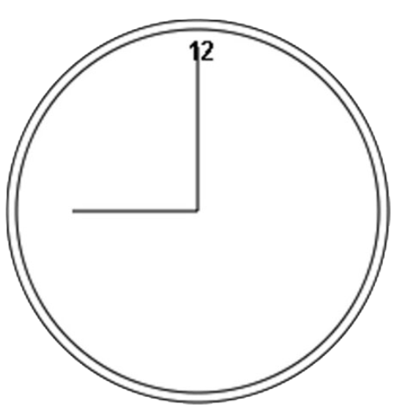
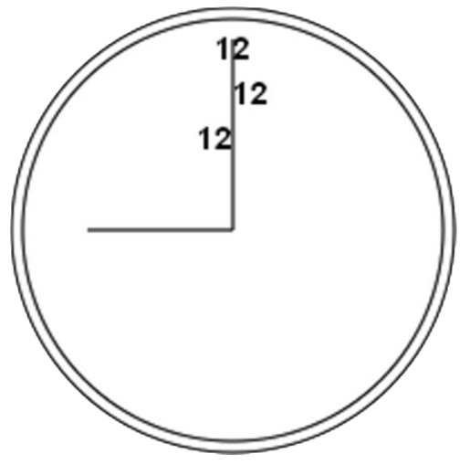
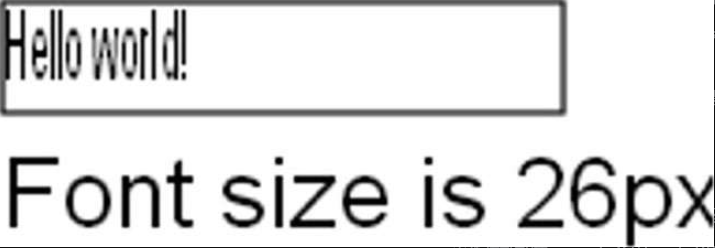

文本和图像混合也是常见的绘制需求，因此 2D 绘图上下文还提供了绘制文本的方法，即 fillText()和 strokeText()。这两个方法都接收 4 个参数：要绘制的字符串、x 坐标、y 坐标和可选的最大像素宽度。而且，这两个方法最终绘制的结果都取决于以下 3 个属性。

❑ font：以 CSS 语法指定的字体样式、大小、字体族等，比如"10px Arial"。

❑ textAlign：指定文本的对齐方式，可能的值包括"start"、"end"、"left"、"right"和"center"。推荐使用"start"和"end"，不使用"left"和"right"，因为前者无论在从左到右书写的语言还是从右到左书写的语言中含义都更明确。

❑ textBaseLine：指定文本的基线，可能的值包括"top"、"hanging"、"middle"、"alphabetic"、"ideographic"和"bottom"。

这些属性都有相应的默认值，因此没必要每次绘制文本时都设置它们。fillText()方法使用 fillStyle 属性绘制文本，而 strokeText()方法使用 strokeStyle 属性。通常，fillText()方法是使用最多的，因为它模拟了在网页中渲染文本。例如，下面的例子会在前一节示例的表盘顶部绘制数字“12”​：

```javascript
context.font = "bold 14px Arial";
context.textAlign = "center";
context.textBaseline = "middle";
context.fillText("12", 100, 20);
```

结果就得到了如图 18-5 所示的图像。



因为把 textAlign 设置为了"center"，把 textBaseline 设置为了"middle"，所以(100, 20)表示文本水平和垂直中心点的坐标。如果 textAlign 是"start"，那么 x 坐标在从左到右书写的语言中表示文本的左侧坐标，而"end"会让 x 坐标在从左到右书写的语言中表示文本的右侧坐标。例如：

```javascript
// 正常
context.font = "bold 14px Arial";
context.textAlign = "center";
context.textBaseline = "middle";
context.fillText("12", 100, 20);
// 与开头对齐
context.textAlign = "start";
context.fillText("12", 100, 40);
// 与末尾对齐
context.textAlign = "end";
context.fillText("12", 100, 60);
```

字符串"12"被绘制了 3 次，每次使用的坐标都一样，但 textAlign 值不同。为了让每个字符串不至于重叠，每次绘制的 y 坐标都会设置得大一些。结果就是如图 18-6 所示的图像。



因为表盘中垂直的线条是居中的，所以文本的对齐方式就一目了然了。类似地，通过修改 textBaseline 属性，可以改变文本的垂直对齐方式。比如，设置为"top"意味着 y 坐标表示文本顶部，"bottom"表示文本底部，"hanging"、"alphabetic"和"ideographic"分别引用字体中特定的基准点。

由于绘制文本很复杂，特别是想把文本绘制到特定区域的时候，因此 2D 上下文提供了用于辅助确定文本大小的 measureText()方法。这个方法接收一个参数，即要绘制的文本，然后返回一个 TextMetrics 对象。这个返回的对象目前只有一个属性 width，不过将来应该会增加更多度量指标。

measureText()方法使用 font、textAlign 和 textBaseline 属性当前的值计算绘制指定文本后的大小。例如，假设要把文本"Hello world! "放到一个 140 像素宽的矩形中，可以使用以下代码，从 100 像素的字体大小开始计算，不断递减，直到文本大小合适：

```javascript
let fontSize = 100;
context.font = fontSize + "px Arial";
while (context.measureText("Hello world! ").width > 140) {
  fontSize--;
  context.font = fontSize + "px Arial";
}
context.fillText("Hello world! ", 10, 10);
context.fillText("Font size is " + fontSize + "px", 10, 50);
```

fillText()和 strokeText()方法还有第四个参数，即文本的最大宽度。这个参数是可选的（Firefox 4 是第一个实现它的浏览器）​，如果调用 fillText()和 strokeText()时提供了此参数，但要绘制的字符串超出了最大宽度限制，则文本会以正确的字符高度绘制，这时字符会被水平压缩，以达到限定宽度。图 18-7 展示了这个参数的效果。



绘制文本是一项比较复杂的操作，因此支持 `<canvas>` 元素的浏览器不一定全部实现了相关的文本绘制 API。
