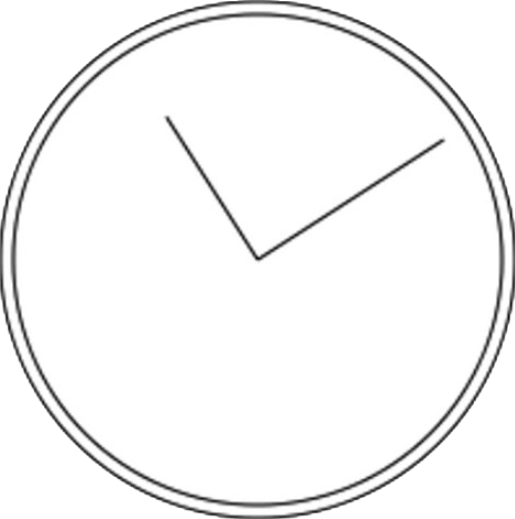

上下文变换可以操作绘制在画布上的图像。2D 绘图上下文支持所有常见的绘制变换。在创建绘制上下文时，会以默认值初始化变换矩阵，从而让绘制操作如实应用到绘制结果上。对绘制上下文应用变换，可以导致以不同的变换矩阵应用绘制操作，从而产生不同的结果。

以下方法可用于改变绘制上下文的变换矩阵。

❑ rotate(angle)：围绕原点把图像旋转 angle 弧度。

❑ scale(scaleX, scaleY)：通过在 x 轴乘以 scaleX、在 y 轴乘以 scaleY 来缩放图像。scaleX 和 scaleY 的默认值都是 1.0。

❑ translate(x, y)：把原点移动到(x, y)。执行这个操作后，坐标(0,0)就会变成(x, y)。

❑ transform(m1_1, m1_2, m2_1, m2_2, dx, dy)：像下面这样通过矩阵乘法直接修改矩阵。

```
      m1_1 m1_2 dx
      m2_1 m2_2 dy
      0     0     1
```

❑ setTransform(m1_1, m1_2, m2_1, m2_2, dx, dy)：把矩阵重置为默认值，再以传入的参数调用 transform()。

变换可以简单，也可以复杂。例如，在前面绘制表盘的例子中，如果把坐标原点移动到表盘中心，那再绘制表针就非常简单了：

```javascript
let drawing = document.getElementById("drawing");
// 确保浏览器支持<canvas>
if (drawing.getContext) {
  let context = drawing.getContext("2d");
  // 创建路径
  context.beginPath();
  // 绘制外圆
  context.arc(100, 100, 99, 0, 2 * Math.PI, false);
  // 绘制内圆
  context.moveTo(194, 100);
  context.arc(100, 100, 94, 0, 2 * Math.PI, false);
  //移动原点到表盘中心
  context.translate(100, 100);
  //绘制分针
  context.moveTo(0, 0);
  context.lineTo(0, -85);
  //绘制时针
  context.moveTo(0, 0);
  context.lineTo(-65, 0);
  // 描画路径
  context.stroke();
}
```

把原点移动到(100, 100)，也就是表盘的中心后，要绘制表针只需简单的数学计算即可。这是因为所有计算都是基于(0, 0)，而不是(100, 100)了。当然，也可以使用 rotate()方法来转动表针：

```javascript
let drawing = document.getElementById("drawing");
// 确保浏览器支持<canvas>
if (drawing.getContext) {
  let context = drawing.getContext("2d");
  // 创建路径
  context.beginPath();
  // 绘制外圆
  context.arc(100, 100, 99, 0, 2 * Math.PI, false);
  // 绘制内圆
  context.moveTo(194, 100);
  context.arc(100, 100, 94, 0, 2 * Math.PI, false);
  // 移动原点到表盘中心
  context.translate(100, 100);
  //旋转表针
  context.rotate(1);
  // 绘制分针
  context.moveTo(0, 0);
  context.lineTo(0, -85);
  // 绘制时针
  context.moveTo(0, 0);
  context.lineTo(-65, 0);
  // 描画路径
  context.stroke();
}
```

因为原点已经移动到表盘中心，所以旋转就是以该点为圆心的。这相当于把表针一头固定在表盘中心，然后向右拨了一个弧度。结果如图 18-8 所示。



所有这些变换，包括 fillStyle 和 strokeStyle 属性，会一直保留在上下文中，直到再次修改它们。虽然没有办法明确地将所有值都重置为默认值，但有两个方法可以帮我们跟踪变化。如果想着什么时候再回到当前的属性和变换状态，可以调用 save()方法。调用这个方法后，所有这一时刻的设置会被放到一个暂存栈中。保存之后，可以继续修改上下文。而在需要恢复之前的上下文时，可以调用 restore()方法。这个方法会从暂存栈中取出并恢复之前保存的设置。多次调用 save()方法可以在暂存栈中存储多套设置，然后通过 restore()可以系统地恢复。下面来看一个例子：

```javascript
context.fillStyle = "#ff0000";
context.save();
context.fillStyle = "#00ff00";
context.translate(100, 100);
context.save();
context.fillStyle = "#0000ff";
context.fillRect(0, 0, 100, 200); // 在(100, 100)绘制蓝色矩形
context.restore();
context.fillRect(10, 10, 100, 200); // 在(100, 100)绘制绿色矩形
context.restore();
context.fillRect(0, 0, 100, 200); // 在(0, 0)绘制红色矩形
```

以上代码先将 fillStyle 设置为红色，然后调用 save()。接着，将 fillStyle 修改为绿色，坐标移动到(100, 100)，并再次调用 save()，保存设置。随后，将 fillStyle 属性设置为蓝色并绘制一个矩形。因为此时坐标被移动了，所以绘制矩形的坐标实际上是(100, 100)。在调用 restore()之后，fillStyle 恢复为绿色，因此这一次绘制的矩形是绿色的。而绘制矩形的坐标是(110, 110)，因为变换仍在起作用。再次调用 restore()之后，变换被移除，fillStyle 也恢复为红色。绘制最后一个矩形的坐标变成了(0, 0)。

注意，save()方法只保存应用到绘图上下文的设置和变换，不保存绘图上下文的内容。
