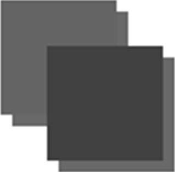

2D 上下文可以根据以下属性的值自动为已有形状或路径生成阴影。

❑ shadowColor: CSS 颜色值，表示要绘制的阴影颜色，默认为黑色。

❑ shadowOffsetX：阴影相对于形状或路径的 x 坐标的偏移量，默认为 0。

❑ shadowOffsetY：阴影相对于形状或路径的 y 坐标的偏移量，默认为 0。

❑ shadowBlur：像素，表示阴影的模糊量。默认值为 0，表示不模糊。

这些属性都可以通过 context 对象读写。只要在绘制图形或路径前给这些属性设置好适当的值，阴影就会自动生成。比如：

```javascript
let context = drawing.getContext("2d");
//设置阴影
context.shadowOffsetX = 5;
context.shadowOffsetY = 5;
context.shadowBlur = 4;
context.shadowColor = "rgba(0, 0, 0, 0.5)";
// 绘制红色矩形
context.fillStyle = "#ff0000";
context.fillRect(10, 10, 50, 50);
// 绘制蓝色矩形
context.fillStyle = "rgba(0,0,255,1)";
context.fillRect(30, 30, 50, 50);
```

这里两个矩形使用了相同的阴影样式，得到了如图 18-10 所示的结果。


