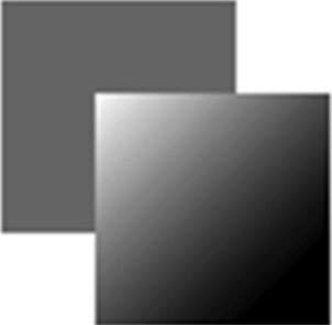

渐变通过 CanvasGradient 的实例表示，在 2D 上下文中创建和修改都非常简单。要创建一个新的线性渐变，可以调用上下文的 createLinearGradient()方法。这个方法接收 4 个参数：起点 x 坐标、起点 y 坐标、终点 x 坐标和终点 y 坐标。调用之后，该方法会以指定大小创建一个新的 CanvasGradient 对象并返回实例。

有了 gradient 对象后，接下来要使用 addColorStop()方法为渐变指定色标。这个方法接收两个参数：色标位置和 CSS 颜色字符串。色标位置通过 0 ～ 1 范围内的值表示，0 是第一种颜色，1 是最后一种颜色。比如：

```javascript
let gradient = context.createLinearGradient(30, 30, 70, 70);
gradient.addColorStop(0, "white");
gradient.addColorStop(1, "black");
```

这个 gradient 对象现在表示的就是在画布上从(30, 30)到(70, 70)绘制一个渐变。渐变的起点颜色为白色，终点颜色为黑色。可以把这个对象赋给 fillStyle 或 strokeStyle 属性，从而以渐变填充或描画绘制的图形：

```javascript
// 绘制红色矩形
context.fillStyle = "#ff0000";
context.fillRect(10, 10, 50, 50);
// 绘制渐变矩形
context.fillStyle = gradient;
context.fillRect(30, 30, 50, 50);
```

为了让渐变覆盖整个矩形，而不只是其中一部分，两者的坐标必须搭配合适。以上代码将得到如图 18-11 所示的结果。



如果矩形没有绘制到渐变的范围内，则只会显示部分渐变。比如：

```javascript
context.fillStyle = gradient;
context.fillRect(50, 50, 50, 50);
```

以上代码执行之后绘制的矩形只有左上角有一部分白色。这是因为矩形的起点在渐变的中间，此时颜色的过渡几乎要完成了。结果矩形大部分地方是黑色的，因为渐变不会重复。保持渐变与形状的一致非常重要，有时候可能需要写个函数计算相应的坐标。比如：

```javascript
function createRectLinearGradient(context, x, y, width, height) {
  return context.createLinearGradient(x, y, x + width, y + height);
}
```

这个函数会基于起点的 x、y 坐标和传入的宽度、高度创建渐变对象，之后调用 fillRect()方法时可以使用相同的值：

```javascript
let gradient = createRectLinearGradient(context, 30, 30, 50, 50);
gradient.addColorStop(0, "white");
gradient.addColorStop(1, "black");
// 绘制渐变矩形
context.fillStyle = gradient;
context.fillRect(30, 30, 50, 50);
```

计算坐标是使用画布时重要而复杂的问题。使用类似 createRectLinearGradient()这样的辅助函数能让计算坐标简单一些。

径向渐变（或放射性渐变）要使用 createRadialGradient()方法来创建。这个方法接收 6 个参数，分别对应两个圆形圆心的坐标和半径。前 3 个参数指定起点圆形中心的 x、y 坐标和半径，后 3 个参数指定终点圆形中心的 x、y 坐标和半径。在创建径向渐变时，可以把两个圆形想象成一个圆柱体的两个圆形表面。把一个表面定义得小一点，另一个定义得大一点，就会得到一个圆锥体。然后，通过移动两个圆形的圆心，就可以旋转这个圆锥体。

要创建起点圆心在形状中心并向外扩散的径向渐变，需要将两个圆形设置为同心圆。比如，要在前面例子中矩形的中心创建径向渐变，则渐变的两个圆形的圆心都必须设置为(55, 55)。这是因为矩形的起点是(30, 30)，终点是(80, 80)。代码如下：

```javascript
let gradient = context.createRadialGradient(55, 55, 10, 55, 55, 30);
gradient.addColorStop(0, "white");
gradient.addColorStop(1, "black");
// 绘制红色矩形
context.fillStyle = "#ff0000";
context.fillRect(10, 10, 50, 50);
// 绘制渐变矩形
context.fillStyle = gradient;
context.fillRect(30, 30, 50, 50);
```

运行以上代码会得到如图 18-12 所示的效果。

因为创建起来要复杂一些，所以径向渐变比较难处理。不过，通常情况下，起点和终点的圆形都是同心圆，只要定义好圆心坐标，剩下的就是调整各自半径的问题了。
