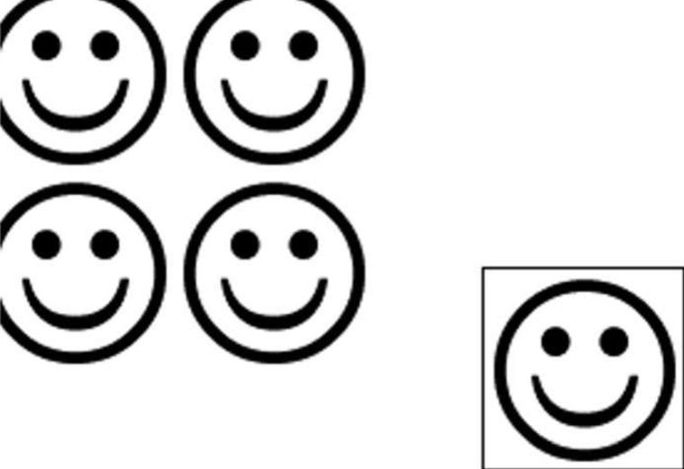

图案是用于填充和描画图形的重复图像。要创建新图案，可以调用 createPattern()方法并传入两个参数：一个 HTML `` 元素和一个表示该如何重复图像的字符串。第二个参数的值与 CSS 的 background-repeat 属性是一样的，包括"repeat"、"repeat-x"、"repeat-y"和"no-repeat"。比如：

```javascript
let image = document.images[0],
  pattern = context.createPattern(image, "repeat");
// 绘制矩形
context.fillStyle = pattern;
context.fillRect(10, 10, 150, 150);
```

记住，跟渐变一样，图案的起点实际上是画布的原点(0, 0)。将填充样式设置为图案，表示在指定位置而不是开始绘制的位置显示图案。以上代码执行的结果如图 18-13 所示。



传给 createPattern()方法的第一个参数也可以是 `<video>` 元素或者另一个 `<canvas>` 元素。
