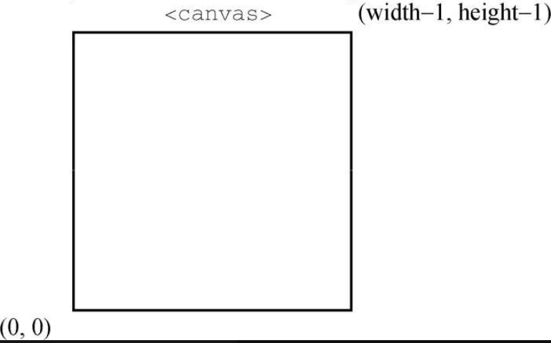
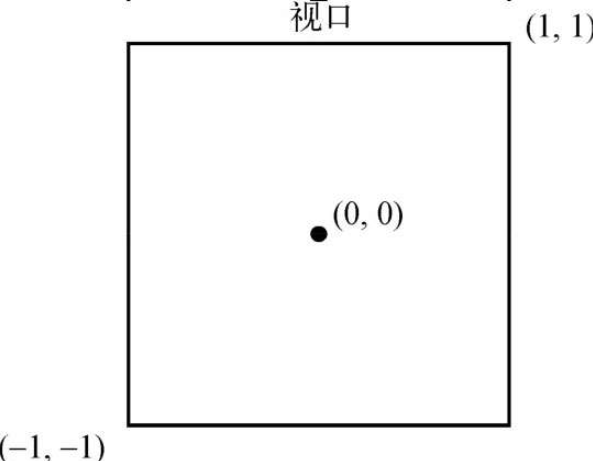
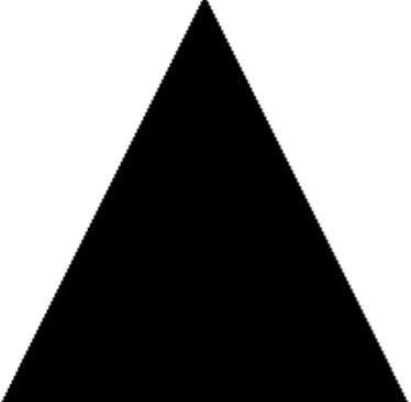
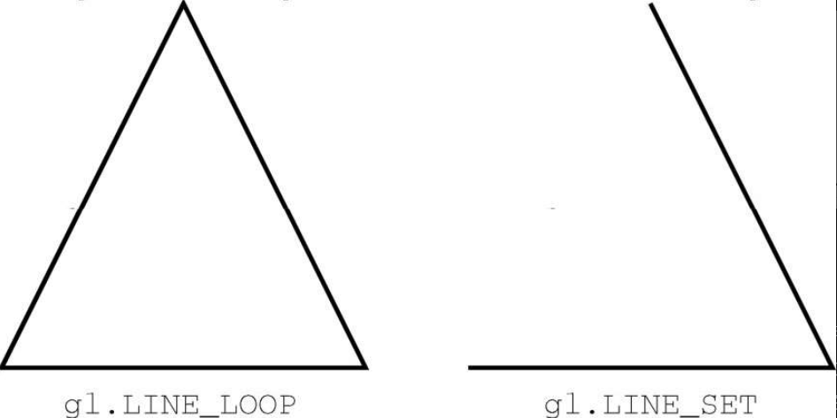

取得 WebGL 上下文后，就可以开始 3D 绘图了。如前所述，因为 WebGL 是 OpenGL ES 2.0 的 Web 版，所以本节讨论的概念实际上是 JavaScript 所实现的 OpenGL 概念。

可以在调用 getContext()取得 WebGL 上下文时指定一些选项。这些选项通过一个参数对象传入，选项就是参数对象的一个或多个属性。

❑ alpha：布尔值，表示是否为上下文创建透明通道缓冲区，默认为 true。

❑ depth：布尔值，表示是否使用 16 位深缓冲区，默认为 true。

❑ stencil：布尔值，表示是否使用 8 位模板缓冲区，默认为 false。

❑ antialias：布尔值，表示是否使用默认机制执行抗锯齿操作，默认为 true。

❑ premultipliedAlpha：布尔值，表示绘图缓冲区是否预乘透明度值，默认为 true。

❑ preserveDrawingBuffer：布尔值，表示绘图完成后是否保留绘图缓冲区，默认为 false。建议在充分了解这个选项的作用后再自行修改，因为这可能会影响性能。

可以像下面这样传入 options 对象：

```javascript
let drawing = document.getElementById("drawing");
// 确保浏览器支持<canvas>
if (drawing.getContext) {
  let gl = drawing.getContext("webgl", { alpha: false });
  if (gl) {
    //使用WebGL
  }
}
```

这些上下文选项大部分适合开发高级功能。多数情况下，默认值就可以满足要求。

如果调用 getContext()不能创建 WebGL 上下文，某些浏览器就会抛出错误。为此，最好把这个方法调用包装在 try/catch 块中：

```javascript
let drawing = document.getElementById("drawing"),
  gl;
// 确保浏览器支持<canvas>
if (drawing.getContext) {
  try {
    gl = drawing.getContext("webgl");
  } catch (ex) {
    //什么也不做
  }
  if (gl) {
    // 使用WebGL
  } else {
    alert("WebGL context could not be created.");
  }
}
```

## 1．常量

如果你熟悉 OpenGL，那么可能知道用于操作的各种常量。这些常量在 OpenGL 中的名字以 GL*开头。在 WebGL 中，context 对象上的常量则不包含 GL*前缀。例如，GL_COLOR_BUFFER_BIT 常量在 WebGL 中要这样访问 gl.COLOR_BUFFER_BIT。WebGL 以这种方式支持大部分 OpenGL 常量（少数常量不支持）​。

## 2．方法命名

OpenGL（同时也是 WebGL）中的很多方法会包含相关的数据类型信息。接收不同类型和不同数量参数的方法，会通过方法名的后缀体现这些信息。表示参数数量的数字（1~4）在先，表示数据类型的字符串（​“f”表示浮点数，​“i”表示整数）在后。比如，gl.uniform4f()的意思是需要 4 个浮点数值参数，而 gl.uniform3i()表示需要 3 个整数值参数。

还有很多方法接收数组，这类方法用字母“v”​（vector）来表示。因此，gl.uniform3iv()就是要接收一个包含 3 个值的数组参数。在编写 WebGL 代码时，要记住这些约定。

## 3．准备绘图

准备使用 WebGL 上下文之前，通常需要先指定一种实心颜色清除 `<canvas>` 。为此，要调用 clearColor()方法并传入 4 个参数，分别表示红、绿、蓝和透明度值。每个参数必须是 0~1 范围内的值，表示各个组件在最终颜色的强度。比如：

```javascript
gl.clearColor(0, 0, 0, 1); // 黑色
gl.clear(gl.COLOR_BUFFER_BIT);
```

以上代码把清理颜色缓冲区的值设置为黑色，然后调用 clear()方法，这个方法相当于 OpenGL 中的 glClear()方法。参数 gl.COLOR_BUFFER_BIT 告诉 WebGL 使用之前定义的颜色填充画布。通常，所有绘图操作之前都需要先清除绘制区域。

## 4．视口与坐标

绘图前还要定义 WebGL 视口。默认情况下，视口使用整个 `<canvas>` 区域。要改变视口，可以调用 viewport()方法并传入视口相对于 `<canvas>` 元素的 x、y 坐标及宽度和高度。例如，以下代码表示要使用整个 `<canvas>` 元素：

```javascript
gl.viewport(0, 0, drawing.width, drawing.height);
```

这个视口的坐标系统与网页中通常的坐标系统不一样。视口的 x 和 y 坐标起点(0, 0)表示 `<canvas>` 元素的左下角，向上、向右增长可以用点(width-1, height-1)定义（见图 18-14）​。



知道如何定义视口就可以只使用 `<canvas>` 元素的一部分来绘图。比如下面的例子：

```javascript
// 视口是<canvas> 左下角四分之一区域
gl.viewport(0, 0, drawing.width / 2, drawing.height / 2);
// 视口是<canvas> 左上角四分之一区域
gl.viewport(0, drawing.height / 2, drawing.width / 2, drawing.height / 2);
// 视口是<canvas> 右下角四分之一区域
gl.viewport(drawing.width / 2, 0, drawing.width / 2, drawing.height / 2);
```

定义视口的坐标系统与视口中的坐标系统不一样。在视口中，坐标原点(0, 0)是视口的中心点。左下角是(-1, -1)，右上角是(1, 1)，如图 18-15 所示。



如果绘图时使用了视口外部的坐标，则绘制结果会被视口剪切。例如，要绘制的形状有一个顶点在(1, 2)，则视口右侧的图形会被切掉。

## 5．缓冲区

在 JavaScript 中，顶点信息保存在定型数组中。要使用这些信息，必须先把它们转换为 WebGL 缓冲区。创建缓冲区要调用 gl.createBuffer()方法，并使用 gl.bindBuffer()方法将缓冲区绑定到 WebGL 上下文。绑定之后，就可以用数据填充缓冲区了。比如：

```javascript
let buffer = gl.createBuffer();
gl.bindBuffer(gl.ARRAY_BUFFER, buffer);
gl.bufferData(gl.ARRAY_BUFFER, new Float32Array([0, 0.5, 1]), gl.STATIC_DRAW);
```

调用 gl.bindBuffer()将 buffer 设置为上下文的当前缓冲区。然后，所有缓冲区操作都在 buffer 上直接执行。因此，调用 gl.bufferData()虽然没有包含对 buffer 的直接引用，但仍然是在它上面执行的。上面最后一行代码使用一个 Float32Array（通常把所有顶点信息保存在 Float32Array 中）初始化了 buffer。如果想输出缓冲区内容，那么可以调用 drawElements()方法并传入 gl.ELEMENT_ARRAY_BUFFER。

gl.bufferData()方法的最后一个参数表示如何使用缓冲区。这个参数可以是以下常量值。

❑ gl.STATIC_DRAW：数据加载一次，可以在多次绘制中使用。

❑ gl.STREAM_DRAW：数据加载一次，只能在几次绘制中使用。

❑ gl.DYNAMIC_DRAW：数据可以重复修改，在多次绘制中使用。

除非是很有经验的 OpenGL 程序员，否则我们会对大多数缓冲区使用 gl.STATIC_DRAW。

缓冲区会一直驻留在内存中，直到页面卸载。如果不再需要缓冲区，那么最好调用 gl.deleteBuffer()方法释放其占用的内存：

```javascript
gl.deleteBuffer(buffer);
```

## 6．错误

与 JavaScript 多数情况下不同的是，在 WebGL 操作中通常不会抛出错误。必须在调用可能失败的方法后，调用 gl.getError()方法。这个方法返回一个常量，表示发生的错误类型。下面列出了这些常量。

❑ gl.NO_ERROR：上一次操作没有发生错误（0 值）​。

❑ gl.INVALID_ENUM：上一次操作没有传入 WebGL 预定义的常量。

❑ gl.INVALID_VALUE：上一次操作需要无符号数值，但是传入了负数。

❑ gl.INVALID_OPERATION：上一次操作在当前状态下无法完成。

❑ gl.OUT_OF_MEMORY：上一次操作因内存不足而无法完成。

❑ gl.CONTEXT_LOST_WEBGL：上一次操作因外部事件（如设备掉电）而丢失了 WebGL 上下文。

每次调用 gl.getError()方法会返回一个错误值。第一次调用之后，再调用 gl.getError()可能会返回另一个错误值。如果有多个错误，则可以重复这个过程，直到 gl.getError()返回 gl.NO_ERROR。如果执行了多次操作，那么可以通过循环调用 getError()：

```javascript
let errorCode = gl.getError();
while (errorCode) {
  console.log("Error occurred: " + errorCode);
  errorCode = gl.getError();
}
```

如果 WebGL 代码没有产出想要的输出结果，那么可以调用几次 getError()，这样有可能帮你找到问题所在。

## 7．着色器

着色器是 OpenGL 中的另一个概念。WebGL 中有两种着色器：顶点着色器和片段（或像素）着色器。顶点着色器用于把 3D 顶点转换为可以渲染的 2D 点。片段着色器用于计算绘制一个像素的正确颜色。WebGL 着色器的独特之处在于，它们不是 JavaScript 实现的，而是使用一种与 C 或 JavaScript 完全不同的语言 GLSL（OpenGL Shading Language）写的。

● 编写着色器

GLSL 是一种类似于 C 的语言，专门用于编写 OpenGL 着色器。因为 WebGL 是 OpenGL ES 2 的实现，所以 OpenGL 中的着色器可以直接在 WebGL 中使用。这样也可以让桌面应用更方便地移植到 Web 上。

每个着色器都有一个 main()方法，在绘制期间会重复执行。给着色器传递数据的方式有两种：attribute 和 uniform。attribute 用于将顶点传入顶点着色器，而 uniform 用于将常量值传入任何着色器。attribute 和 uniform 是在 main()函数外部定义的。在值类型关键字之后是数据类型，然后是变量名。下面是一个简单的顶点着色器的例子：

```javascript
    // OpenGL着色器语言
    // 着色器，摘自Bartek Drozdz的文章“Get started with WebGL—draw a square”
    attribute vec2 aVertexPosition;
    void main() {
      gl_Position = vec4(aVertexPosition, 0.0, 1.0);
    }
```

这个顶点着色器定义了一个名为 aVertexPosition 的 attribute。这个 attribute 是一个包含两项的数组（数据类型为 vec2）​，代表 x 和 y 坐标。即使只传入了两个坐标，顶点着色器返回的值也会包含 4 个元素，保存在变量 gl_Position 中。这个着色器创建了一个新的包含 4 项的数组（vec4）​，缺少的坐标会补充上，实际上是把 2D 坐标转换为了 3D 坐标。

```javascript
    // 片段着色器与顶点着色器类似，只不过是通过uniform传入数据。下面是一个片段着色器的例子：
    // OpenGL着色器语言
    // 着色器，摘自Bartek Drozdz的文章“Get started with WebGL—draw a square”
    uniform vec4 uColor;
    void main() {
      gl_FragColor = uColor;
    }
```

片段着色器必须返回一个值，保存到变量 gl_FragColor 中，这个值表示绘制时使用的颜色。这个着色器定义了一个 uniform，包含颜色的 4 个组件（vec4）​，保存在 uColor 中。从代码上看，这个着色器只是把传入的值赋给了 gl_FragColor。uColor 的值在着色器内不能改变。

```
注意 OpenGL着色器语言比示例中的代码要复杂，详细介绍需要整本书的篇幅。因此，本节只是从使用WebGL的角度对这门语言做个极其简单的介绍。要了解更多信息，可以参考Randi J. Rost的著作《OpenGL着色语言》​。
```

● 创建着色器程序

浏览器并不理解原生 GLSL 代码，因此 GLSL 代码的字符串必须经过编译并链接到一个着色器程序中。为便于使用，通常可以使用带有自定义 type 属性的 `<script>` 元素把着色器代码包含在网页中。如果 type 属性无效，则浏览器不会解析 `<script>` 的内容，但这并不妨碍读写其中的内容：

```html
<script type="x-webgl/x-vertex-shader" id="vertexShader">
  attribute vec2 aVertexPosition;
  void main() {
    gl_Position = vec4(aVertexPosition, 0.0, 1.0);
  }
</script>
<script type="x-webgl/x-fragment-shader" id="fragmentShader">
  uniform vec4 uColor;
  void main() {
    gl_FragColor = uColor;
  }
</script>
```

然后可以使用 text 属性提取 `<script>` 元素的内容：

```javascript
let vertexGlsl = document.getElementById("vertexShader").text,
  fragmentGlsl = document.getElementById("fragmentShader").text;
```

更复杂的 WebGL 应用可以动态加载着色器。重点在于要使用着色器，必须先拿到 GLSL 代码的字符串。

有了 GLSL 字符串，下一步是创建 shader 对象。为此，需要调用 gl.createShader()方法，并传入想要创建的着色器类型（gl.VERTEX_SHADER 或 gl.FRAGMENT_SHADER）​。然后，调用 gl.shaderSource()方法把 GLSL 代码应用到着色器，再调用 gl.compileShader()编译着色器。下面是一个例子：

```javascript
let vertexShader = gl.createShader(gl.VERTEX_SHADER);
gl.shaderSource(vertexShader, vertexGlsl);
gl.compileShader(vertexShader);
let fragmentShader = gl.createShader(gl.FRAGMENT_SHADER);
gl.shaderSource(fragmentShader, fragmentGlsl);
gl.compileShader(fragmentShader);
```

这里的代码创建了两个着色器，并把它们保存在 vertexShader 和 fragmentShader 中。然后，可以通过以下代码把这两个对象链接到着色器程序：

```javascript
let program = gl.createProgram();
gl.attachShader(program, vertexShader);
gl.attachShader(program, fragmentShader);
gl.linkProgram(program);
```

第一行代码创建了一个程序，然后 attachShader()用于添加着色器。调用 gl.linkProgram()将两个着色器链接到了变量 program 中。链接到程序之后，就可以通过 gl.useProgram()方法让 WebGL 上下文使用这个程序了：

```javascript
gl.useProgram(program);
```

调用 gl.useProgram()之后，所有后续的绘制操作都会使用这个程序。

● 给着色器传值

前面定义的每个着色器都需要传入一个值，才能完成工作。要给着色器传值，必须先找到要接收值的变量。对于 uniform 变量，可以调用 gl.getUniformLocation()方法。这个方法返回一个对象，表示该 uniform 变量在内存中的位置。然后，可以使用这个位置来完成赋值。比如：

```javascript
let uColor = gl.getUniformLocation(program, "uColor");
gl.uniform4fv(uColor, [0, 0, 0, 1]);
```

这个例子从 program 中找到 uniform 变量 uColor，然后返回了它的内存位置。第二行代码调用 gl.uniform4fv()方法给 uColor 传入了值。

给顶点着色器传值也是类似的过程。而要获得 attribute 变量的位置，可以调用 gl.getAttrib-Location()方法。找到变量的内存地址后，可以像下面这样给它传入值：

```javascript
let aVertexPosition = gl.getAttribLocation(program, "aVertexPosition");
gl.enableVertexAttribArray(aVertexPosition);
gl.vertexAttribPointer(aVertexPosition, itemSize, gl.FLOAT, false, 0, 0);
```

这里，首先取得 aVertexPosition 的内存位置，然后使用 gl.enableVertexAttribArray()来启用。最后一行代码创建了一个指向调用 gl.bindBuffer()指定的缓冲区的指针，并把它保存在 aVertexPosition 中，从而可以在后面由顶点着色器使用。

● 调试着色器和程序

与 WebGL 中的其他操作类似，着色器操作也可能失败，而且是静默失败。如果想知道发生了什么错误，则必须手工通过 WebGL 上下文获取关于着色器或程序的信息。

对于着色器，可以调用 gl.getShaderParameter()方法取得编译之后的编译状态：

```javascript
if (!gl.getShaderParameter(vertexShader, gl.COMPILE_STATUS)) {
  alert(gl.getShaderInfoLog(vertexShader));
}
```

这个例子检查了 vertexShader 编译的状态。如果着色器编译成功，则调用 gl.getShaderParameter()会返回 true。如果返回 false，则说明编译出错了。此时，可以使用 gl.getShaderInfoLog()并传入着色器取得错误。这个方法返回一个字符串消息，表示问题所在。gl.getShaderParameter()和 gl.getShaderInfoLog()既可以用于顶点着色器，也可以用于片段着色器。

着色器程序也可能失败，因此也有类似的方法。gl.getProgramParameter()用于检测状态。最常见的程序错误发生在链接阶段，为此可以使用以下代码来检查：

```javascript
if (!gl.getProgramParameter(program, gl.LINK_STATUS)) {
  alert(gl.getProgramInfoLog(program));
}
```

与 gl.getShaderParameter()一样，gl.getProgramParameter()会在链接成功时返回 true，失败时返回 false。当然也有一个 gl.getProgramInfoLog()方法，可以在程序失败时获取错误信息。

这些方法主要在开发时用于辅助调试。只要没有外部依赖，在产品环境中就可以放心地删除它们。

● GLSL 100 升级到 GLSL 300

WebGL2 的主要变化是升级到了 GLSL 3.00 ES 着色器。这个升级暴露了很多新的着色器功能，包括 3D 纹理等在支持 OpenGL ES 3.0 的设备上都有的功能。要使用升级版的着色器，着色器代码的第一行必须是：

```
    #version 300 es
```

这个升级需要一些语法的变化。

❑ 顶点 attribute 变量要使用 in 而不是 attribute 关键字声明。

❑ 使用 varying 关键字为顶点或片段着色器声明的变量，现在必须根据相应着色器的行为改为使用 in 或 out。

❑ 预定义的输出变量 gl_FragColor 没有了，片段着色器必须为颜色输出声明自己的 out 变量。

❑ 纹理查找函数 texture2D 和 textureCube 统一成了一个 texture 函数。

## 8．绘图

WebGL 只能绘制三种形状：点、线和三角形。其他形状必须通过这三种基本形状在 3D 空间的组合来绘制。WebGL 绘图要使用 drawArrays()和 drawElements()方法，前者使用数组缓冲区，后者则操作元素数组缓冲区。

drawArrays()和 drawElements()的第一个参数都表示要绘制形状的常量。下面列出了这些常量。

❑ gl.POINTS：将每个顶点当成一个点来绘制。

❑ gl.LINES：将数组作为一系列顶点，在这些顶点间绘制直线。每个顶点既是起点也是终点，因此数组中的顶点必须是偶数个才能开始绘制。

❑ gl.LINE_LOOP：将数组作为一系列顶点，在这些顶点间绘制直线。从第一个顶点到第二个顶点绘制一条直线，再从第二个顶点到第三个顶点绘制一条直线，以此类推，直到绘制到最后一个顶点。此时再从最后一个顶点到第一个顶点绘制一条直线。这样就可以绘制出形状的轮廓。

❑ gl.LINE_STRIP：类似于 gl.LINE_LOOP，区别在于不会从最后一个顶点到第一个顶点绘制直线。

❑ gl.TRIANGLES：将数组作为一系列顶点，在这些顶点间绘制三角形。如不特殊指定，每个三角形都分开绘制，不共享顶点。

❑ gl.TRIANGLES_STRIP：类似于 gl.TRIANGLES，区别在于前 3 个顶点之后的顶点会作为第三个顶点与其前面的两个顶点构成三角形。例如，如果数组中包含顶点 A、B、C、D，那么第一个三角形使用 ABC，第二个三角形使用 BCD。

❑ gl.TRIANGLES_FAN：类似于 gl.TRIANGLES，区别在于前 3 个顶点之后的顶点会作为第三个顶点与其前面的顶点和第一个顶点构成三角形。例如，如果数组中包含顶点 A、B、C、D，那么第一个三角形使用 ABC，第二个三角形使用 ACD。

以上常量可以作为 gl.drawArrays()方法的第一个参数，第二个参数是数组缓冲区的起点索引，第三个参数是数组缓冲区包含的顶点集合的数量。以下代码使用 gl.drawArrays()在画布上绘制了一个三角形：

```javascript
// 假设已经使用本节前面的着色器清除了视口
// 定义3 个顶点的x坐标和y坐标
let vertices = new Float32Array([0, 1, 1, -1, -1, -1]),
  buffer = gl.createBuffer(),
  vertexSetSize = 2,
  vertexSetCount = vertices.length / vertexSetSize,
  uColor,
  aVertexPosition;
// 将数据放入缓冲区
gl.bindBuffer(gl.ARRAY_BUFFER, buffer);
gl.bufferData(gl.ARRAY_BUFFER, vertices, gl.STATIC_DRAW);
// 给片段着色器传入颜色
uColor = gl.getUniformLocation(program, "uColor");
gl.uniform4fv(uColor, [0, 0, 0, 1]);
// 把顶点信息传给着色器
aVertexPosition = gl.getAttribLocation(program, "aVertexPosition");
gl.enableVertexAttribArray(aVertexPosition);
gl.vertexAttribPointer(aVertexPosition, vertexSetSize, gl.FLOAT, false, 0, 0);
// 绘制三角形
gl.drawArrays(gl.TRIANGLES, 0, vertexSetCount);
```

这个例子定义了一个 Float32Array 变量，它包含 3 组两个点的顶点。完成计算的关键是跟踪顶点大小和数量。将 vertexSetSize 的值指定为 2，再计算出 vertexSetCount。顶点信息保存在了缓冲区。然后把颜色信息传给片段着色器。

接着给顶点着色器传入顶点集的大小，以及表示顶点坐标数值类型的 gl.FlOAT。第四个参数是一个布尔值，表示坐标不是标准的。第五个参数是步长值（stride value）​，表示跳过多个数组元素取得下一个值。除非真要跳过一些值，否则就向这里传入 0 即可。最后一个参数是起始偏移量，这里的 0 表示从第一个数组元素开始。

最后一步是使用 gl.drawArrays()把三角形绘制出来。通过把第一个参数指定为 gl.TRIANGLES，就可以从(0, 1)到(1, -1)再到(-1, -1)绘制一个三角形，并填充传给片段着色器的颜色。第二个参数表示缓冲区的起始偏移量，最后一个参数是要读取的顶点数量。以上绘图操作的结果如图 18-16 所示。



通过改变 gl.drawArrays()的第一个参数，可以修改绘制三角形的方式。图 18-17 展示了修改第一个参数之后的两种输出。

图 18-17 展示了修改第一个参数之后的两种输出。



## 9．纹理

WebGL 纹理可以使用 DOM 中的图片。可以使用 gl.createTexture()方法创建新的纹理，然后再将图片绑定到这个纹理。如果图片还没有加载，则可以创建一个 Image 对象来动态加载。图片加载完成后才能初始化纹理，因此在图片的 load 事件之后才能使用纹理。比如：

```javascript
let image = new Image(),
  texture;
image.src = "smile.gif";
image.onload = function () {
  texture = gl.createTexture();
  gl.bindTexture(gl.TEXTURE_2D, texture);
  gl.pixelStorei(gl.UNPACK_FLIP_Y_WEBGL, true);
  gl.texImage2D(gl.TEXTURE_2D, 0, gl.RGBA, gl.RGBA, gl.UNSIGNED_BYTE, image);
  gl.texParameteri(gl.TEXTURE_2D, gl.TEXTURE_MAG_FILTER, gl.NEAREST);
  gl.texParameteri(gl.TEXTURE_2D, gl.TEXTURE_MIN_FILTER, gl.NEAREST);
  // 除当前纹理
  gl.bindTexture(gl.TEXTURE_2D, null);
};
```

除了使用 DOM 图片，这些步骤跟在 OpenGL 中创建纹理是一样的。最大的区别在于使用 gl.pixelStorei()设置了像素存储格式。常量 gl.UNPACK_FLIP_Y_WEBGL 是 WebGL 独有的，在基于 Web 加载图片时通常要使用。原因在于 GIF、JPEG 和 PNG 图片使用的坐标系统与 WebGL 内部的坐标系统不一样。如果不使用这个标志，图片就会倒过来。

用于纹理的图片必须跟当前页面同源，或者是来自启用了跨源资源共享（CORS, Cross-Origin Resource Sharing）的服务器上。

```
注意 纹理来源可以是图片、通过<video>元素加载的视频，甚至是别的<canvas>元素。视频同样受跨源限制。
```

## 10．读取像素

与 2D 上下文一样，可以从 WebGL 上下文中读取像素数据。读取像素的 readPixels()方法与 OpenGL 中的方法有同样的参数，只不过最后一个参数必须是定型数组。像素信息是从帧缓冲区读出来并放到这个定型数组中的。readPixels()方法的参数包括 x 和 y 坐标、宽度、高度、图像格式、类型和定型数组。前 4 个参数用于指定要读取像素的位置。图像格式参数几乎总是 gl.RGBA。类型参数指的是要存储在定型数组中的数据类型，有如下限制：

❑ 如果这个类型是 gl.UNSIGNED_BYTE，则定型数组必须是 Uint8Array；

❑ 如果这个类型是 gl.UNSIGNED_SHORT_5_6_5、gl.UNSIGNED_SHORT_4_4_4_4 或 gl.UNSIGNED_SHORT_5_5_5_1，则定型数组必须是 Uint16Array。

下面是一个调用 readPixels()方法的例子：

```javascript
let pixels = new Uint8Array(25 * 25);
gl.readPixels(0, 0, 25, 25, gl.RGBA, gl.UNSIGNED_BYTE, pixels);
```

以上代码读取了帧缓冲区中 25 像素 ×25 像素大小的区域，并把读到的像素信息保存在 pixels 数组中，其中每个像素的颜色在这个数组中都以 4 个值表示，分别代表红、绿、蓝和透明度值。每个数组值的取值范围是 0~255（包括 0 和 255）​。别忘了先按照预期存储的数据量初始化定型数组。

在浏览器绘制更新后的 WebGL 图像之前调用 readPixels()没有问题。而在绘制完成后，帧缓冲区会恢复到其初始清除状态，此时调用 readPixels()会得到与清除状态一致的像素数据。如果想在绘制之后读取像素，则必须使用前面讨论过的 preserveDrawingBuffer 选项初始化 WebGL 上下文：

```javascript
let gl = drawing.getContext("webgl", { preserveDrawingBuffer: true });
```

设置这个标志可以强制帧缓冲区在下一次绘制之前保持上一次绘制的状态。这个选项可能会影响性能，因此尽量不要使用。
