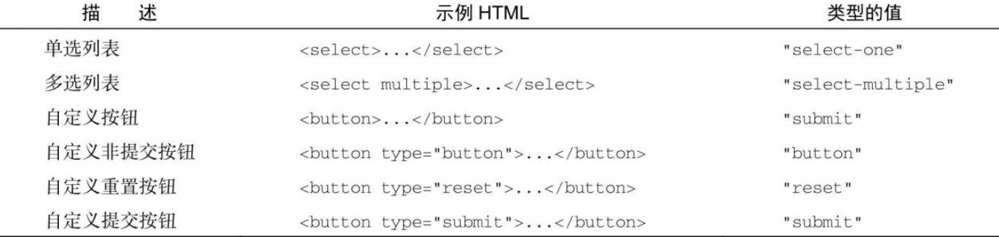

表单元素可以像页面中的其他元素一样使用原生 DOM 方法来访问。此外，所有表单元素都是表单 elements 属性（元素集合）中包含的一个值。这个 elements 集合是一个有序列表，包含对表单中所有字段的引用，包括所有 `<input>` 、 `<textarea>` 、 `<button>` 、 `<select>` 和 `<fieldset>` 元素。elements 集合中的每个字段都以它们在 HTML 标记中出现的次序保存，可以通过索引位置和 name 属性来访问。以下是几个例子：

```javascript
let form = document.getElementById("form1");
// 取得表单中的第一个字段
let field1 = form.elements[0];
// 取得表单中名为"textbox1"的字段
let field2 = form.elements["textbox1"];
// 取得字段的数量
let fieldCount = form.elements.length;
```

如果多个表单控件使用了同一个 name，比如像单选按钮那样，则会返回包含所有同名元素的 HTMLCollection。比如，来看下面的 HTML 代码片段：

```html
<form method="post" id="myForm">
  <ul>
    <li><input type="radio" name="color" value="red" />Red</li>
    <li><input type="radio" name="color" value="green" />Green</li>
    <li><input type="radio" name="color" value="blue" />Blue</li>
  </ul>
</form>
```

这个 HTML 中的表单有 3 个单选按钮的 name 是"color"，这个名字把它们联系在了一起。在访问 elements["color"]时，返回的 NodeList 就包含这 3 个元素。而在访问 elements[0]时，只会返回第一个元素。比如：

```javascript
let form = document.getElementById("myForm");
let colorFields = form.elements["color"];
console.log(colorFields.length); // 3
let firstColorField = colorFields[0];
let firstFormField = form.elements[0];
console.log(firstColorField === firstFormField); // true
```

以上代码表明，使用 form.elements[0]获取的表单的第一个字段就是 form.elements["color"]中包含的第一个元素。

```
注意 也可以通过表单属性的方式访问表单字段，比如form[0]这种使用索引和form ["color"]这种使用字段名字的方式。访问这些属性与访问form.elements集合是一样的。这种方式是为向后兼容旧版本浏览器而提供的，实际开发中应该使用elements。
```

## 1．表单字段的公共属性

除 `<fieldset>` 元素以外，所有表单字段都有一组同样的属性。由于 `<input>` 类型可以表示多种表单字段，因此某些属性只适用于特定类型的字段。除此之外的属性可以在任何表单字段上使用。以下列出了这些表单字段的公共属性和方法。

❑ disabled：布尔值，表示表单字段是否禁用。

❑ form：指针，指向表单字段所属的表单。这个属性是只读的。

❑ name：字符串，这个字段的名字。

❑ readOnly：布尔值，表示这个字段是否只读。

❑ tabIndex：数值，表示这个字段在按 Tab 键时的切换顺序。

❑ type：字符串，表示字段类型，如"checkbox"、"radio"等。

❑ value：要提交给服务器的字段值。对文件输入字段来说，这个属性是只读的，仅包含计算机上某个文件的路径。

这里面除了 form 属性以外，JavaScript 可以动态修改任何属性。来看下面的例子：

```javascript
let form = document.getElementById("myForm");
let field = form.elements[0];
// 修改字段的值
field.value = "Another value";
// 检查字段所属的表单
console.log(field.form === form); // true
// 给字段设置焦点
field.focus();
// 禁用字段
field.disabled = true;
// 改变字段的类型（不推荐，但对<input>来说是可能的）
field.type = "checkbox";
```

这种动态修改表单字段属性的能力为任何时候以任何方式修改表单提供了方便。举个例子，Web 表单的一个常见问题是用户常常会点击两次提交按钮。在涉及信用卡扣款的情况下，这是个严重的问题，可能会导致重复扣款。对此，常见的解决方案是第一次点击之后禁用提交按钮。可以通过监听 submit 事件来实现。比如下面这个例子：

```javascript
// 避免多次提交表单的代码
let form = document.getElementById("myForm");
form.addEventListener("submit", (event) => {
  let target = event.target;
  // 取得提交按钮
  let btn = target.elements["submit-btn"];
  // 禁用提交按钮
  btn.disabled = true;
});
```

以上代码在表单的 submit 事件上注册了一个事件处理程序。当 submit 事件触发时，代码会取得提交按钮，然后将其 disabled 属性设置为 true。注意，这个功能不能通过直接给提交按钮添加 onclick 事件处理程序来实现，原因是不同浏览器触发事件的时机不一样。有些浏览器会在触发表单的 submit 事件前先触发提交按钮的 click 事件，有些浏览器则会后触发 click 事件。对于先触发 click 事件的浏览器，这个按钮会在表单提交前被禁用，这意味着表单就不会被提交了。因此最好使用表单的 submit 事件来禁用提交按钮。但这种方式不适用于没有使用提交按钮的表单提交。如前所述，只有提交按钮才能触发 submit 事件。

type 属性可以用于除 `<fieldset>` 之外的任何表单字段。对于 `<input>` 元素，这个值等于 HTML 的 type 属性值。对于其他元素，这个 type 属性的值按照下表设置。



对于 `<input>` 和 `<button>` 元素，可以动态修改其 type 属性。但 `<select>` 元素的 type 属性是只读的。

## 2．表单字段的公共方法

每个表单字段都有两个公共方法：focus()和 blur()。focus()方法把浏览器焦点设置到表单字段，这意味着该字段会变成活动字段并可以响应键盘事件。例如，文本框在获得焦点时会在内部显示闪烁的光标，表示可以接收输入。focus()方法主要用来引起用户对页面中某个部分的注意。比如，在页面加载后把焦点定位到表单中第一个字段就是很常见的做法。实现方法是监听 load 事件，然后在第一个字段上调用 focus()，如下所示：

```javascript
window.addEventListener("load", (event) => {
  document.forms[0].elements[0].focus();
});
```

注意，如果表单中第一个字段是 type 为"hidden"的 `<input>` 元素，或者该字段被 CSS 属性 display 或 visibility 隐藏了，以上代码就会出错。

HTML5 为表单字段增加了 autofocus 属性，支持的浏览器会自动为带有该属性的元素设置焦点，而无须使用 JavaScript。比如：

```html
<input type="text" autofocus />
```

为了让之前的代码在使用 autofocus 时也能正常工作，必须先检测元素上是否设置了该属性。如果设置了 autofocus，就不再调用 focus()：

```javascript
window.addEventListener("load", (event) => {
  let element = document.forms[0].elements[0];
  if (element.autofocus !== true) {
    element.focus();
    console.log("JS focus");
  }
});
```

因为 autofocus 是布尔值属性，所以在支持的浏览器中通过 JavaScript 访问表单字段的 autofocus 属性会返回 true（在不支持的浏览器中是空字符串）​。上面的代码只会在 autofocus 属性不等于 true 时调用 focus()方法，以确保向前兼容。大多数现代浏览器支持 autofocus 属性，只有 iOSSafari、Opera Mini 和 IE10 及以下版本不支持。

```
注意 默认情况下只能给表单元素设置焦点。不过，通过将tabIndex属性设置为-1再调用focus()，也可以给任意元素设置焦点。只有Opera不支持这个技术。
```

focus()的反向操作是 blur()，其用于从元素上移除焦点。调用 blur()时，焦点不会转移到任何特定元素，仅仅只是从调用这个方法的元素上移除了。在浏览器支持 readonly 属性之前，Web 开发者通常会使用这个方法创建只读字段。现在很少有用例需要调用 blur()，不过如果需要是可以用的。下面是一个例子：

```javascript
document.forms[0].elements[0].blur();
```

## 3．表单字段的公共事件

除了鼠标、键盘、变化和 HTML 事件外，所有字段还支持以下 3 个事件。

❑ blur：在字段失去焦点时触发。

❑ change：在 `<input>` 和 `<textarea>` 元素的 value 发生变化且失去焦点时触发，或者在 `<select>` 元素中选中项发生变化时触发。

❑ focus：在字段获得焦点时触发。

blur 和 focus 事件会因为用户手动改变字段焦点或者调用 blur()或 focus()方法而触发。这两个事件对所有表单都会一视同仁。change 事件则不然，它会因控件不同而在不同时机触发。对于 `<input>` 和 `<textarea>` 元素，change 事件会在字段失去焦点，同时 value 自控件获得焦点后发生变化时触发。对于 `<select>` 元素，change 事件会在用户改变了选中项时触发，不需要控件失去焦点。

focus 和 blur 事件通常用于以某种方式改变用户界面，以提供可见的提示或额外功能（例如在文本框下面显示下拉菜单）​。change 事件通常用于验证用户在字段中输入的内容。比如，有的文本框可能只限于接收数值。focus 事件可以用来改变控件的背景颜色以便更清楚地表明当前字段获得了焦点。blur 事件可以用于去掉这个背景颜色。而 change 事件可以用于在用户输入了非数值时把背景改为红色。以下代码展示了上述操作：

```javascript
let textbox = document.forms[0].elements[0];
textbox.addEventListener("focus", (event) => {
  let target = event.target;
  if (target.style.backgroundColor != "red") {
    target.style.backgroundColor = "yellow";
  }
});
textbox.addEventListener("blur", (event) => {
  let target = event.target;
  target.style.backgroundColor = /[^\d]/.test(target.value) ? "red" : "";
});
textbox.addEventListener("change", (event) => {
  let target = event.target;
  target.style.backgroundColor = /[^\d]/.test(target.value) ? "red" : "";
});
```

这里的 onfocus 事件处理程序会把文本框的背景改为黄色，更清楚地表明它是当前活动字段。onblur 和 onchange 事件处理程序会在发现非数值字符时把背景改为红色。为测试非数值字符，这里使用了一个简单的正则表达式来检测文本框的 value。这个功能必须同时在 onblur 和 onchange 事件处理程序上实现，以确保无论文本框是否改变都能执行验证。

```
注意 blur和change事件的关系并没有明确定义。在某些浏览器中，blur事件会先于change事件触发；在其他浏览器中，触发顺序则相反。因此不能依赖这两个事件触发的顺序，必须区分时要多加注意。
```
