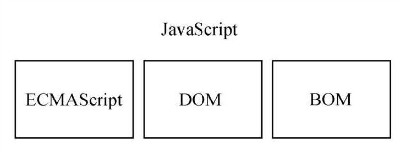
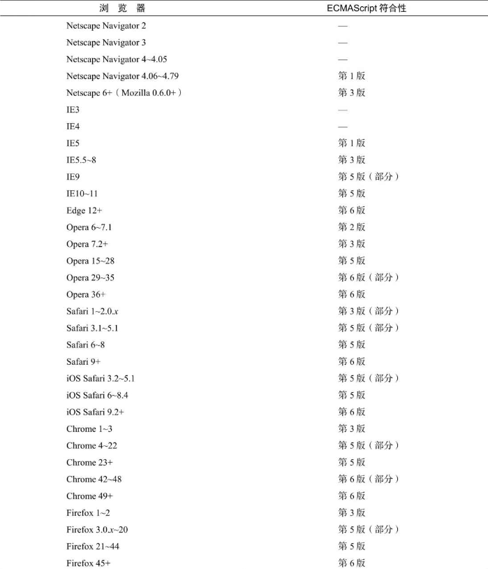
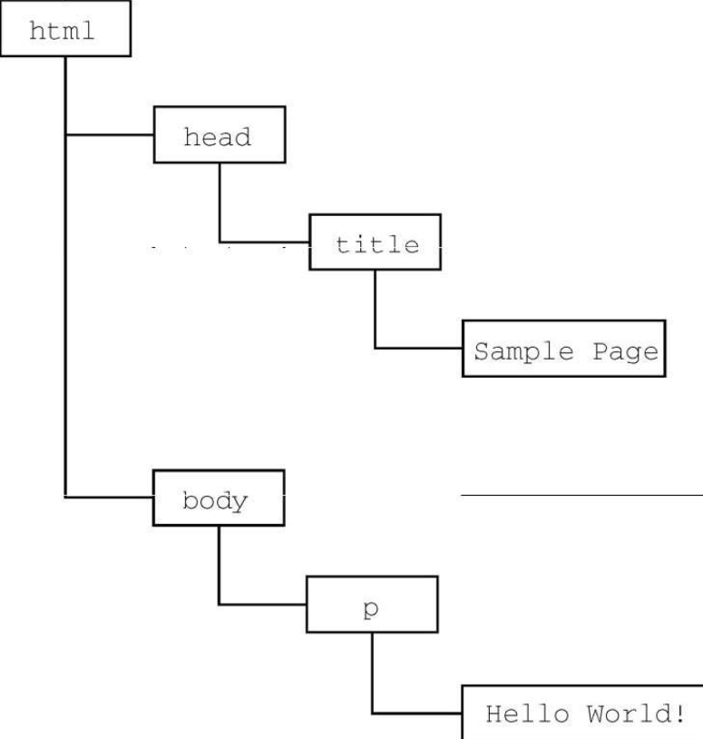
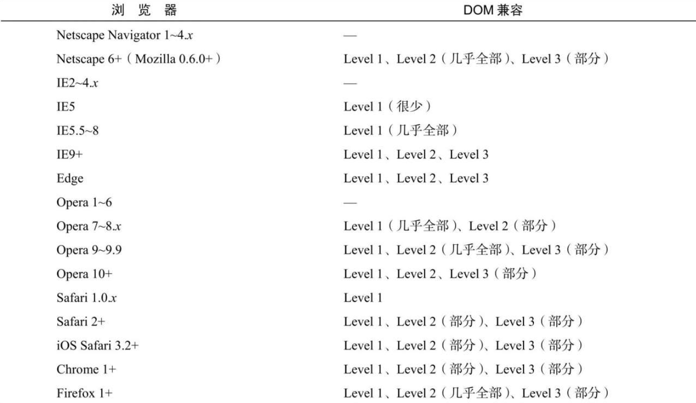

虽然 JavaScript 和 ECMAScript 基本上是同义词，但 JavaScript 远远不限于 ECMA-262 所定义的那样。没错，完整的 JavaScript 实现包含以下几个部分（见图 1-1）：



- 核心（ECMAScript）
- 文档对象模型（DOM）
- 浏览器对象模型（BOM）

## 1.2.1 ECMAScript

ECMAScript，即 ECMA-262 定义的语言，并不局限于 Web 浏览器。事实上，这门语言没有输入和输出之类的方法。ECMA-262 将这门语言作为一个基准来定义，以便在它之上再构建更稳健的脚本语言。Web 浏览器只是 ECMAScript 实现可能存在的一种宿主环境（host environment）。宿主环境提供 ECMAScript 的基准实现和与环境自身交互必需的扩展。扩展（比如 DOM）使用 ECMAScript 核心类型和语法，提供特定于环境的额外功能。其他宿主环境还有服务器端 JavaScript 平台 Node.js 和即将被淘汰的 Adobe Flash。

如果不涉及浏览器的话，ECMA-262 到底定义了什么？在基本的层面，它描述这门语言的如下部分：

- 语法
- 类型
- 语句
- 关键字
- 保留字
- 操作符
- 全局对象

ECMAScript 只是对实现这个规范描述的所有方面的一门语言的称呼。JavaScript 实现了 ECMAScript，而 Adobe ActionScript 同样也实现了 ECMAScript。

### 1．ECMAScript 版本\*\*

ECMAScript 不同的版本以“edition”表示（也就是描述特定实现的 ECMA-262 的版本）。ECMA-262 最近的版本是第 10 版，发布于 2019 年 6 月。ECMA-262 的第 1 版本质上跟网景的 JavaScript 1.1 相同，只不过删除了所有浏览器特定的代码，外加少量细微的修改。ECMA-262 要求支持 Unicode 标准（以支持多语言），而且对象要与平台无关（NetscapeJavaScript 1.1 的对象不是这样，比如它的 Date 对象就依赖平台）。这也是 JavaScript 1.1 和 JavaScript 1.2 不符合 ECMA-262 第 1 版要求的原因。

ECMA-262 第 2 版只是做了一些编校工作，主要是为了更新之后严格符合 ISO/IEC-16262 的要求，并没有增减或改变任何特性。ECMAScript 实现通常不使用第 2 版来衡量符合性（conformance）。

ECMA-262 第 3 版第一次真正对这个标准进行更新，更新了字符串处理、错误定义和数值输出。此外还增加了对正则表达式、新的控制语句、try/catch 异常处理的支持，以及为了更好地让标准国际化所做的少量修 改。对很多人来说，这标志着 ECMAScript 作为一门真正的编程语言的时代终于到来了。

ECMA-262 第 4 版是对这门语言的一次彻底修订。作为对 JavaScript 在 Web 上日益成功的回应，开发者开始修订 ECMAScript 以满足全球 Web 开发日益增长的需求。为此，Ecma T39 再次被召集起来，以决定这门语言的未来。结果，他们制定的规范几乎在第 3 版基础上完全定义了一门新语言。第 4 版包括强类型变量、新语句和数据结构、真正的类和经典的继承，以及操作数据的新手段。

与此同时，TC39 委员会的一个子委员会也提出了另外一份提案，叫作“ECMAScript 3.1”，只对这门语言进行了较少的改进。这个子委员会的人认为第 4 版对这门语言来说跳跃太大了。因此，他们提出了一个改动较小的提案，只要在现有 JavaScript 引擎基础上做一些增改就可以实现。最终，ES3.1 子委员会赢得了 TC39 委员会的支持，ECMA-262 第 4 版在正式发布之前被放弃。

ECMAScript 3.1 变成了 ECMA-262 的第 5 版，于 2009 年 12 月 3 日正式发布。第 5 版致力于厘清第 3 版存在的歧义，也增加了新功能。新功能包括原生的解析和序列化 JSON 数据的 JSON 对象、方便继承和高级属性定义的方法，以及新的增强 ECMAScript 引擎解释和执行代码能力的严格模式。第 5 版在 2011 年 6 月发布了一个维护性修订版，这个修订版只更正了规范中的错误，并未增加任何新的语言或库特性。

ECMA-262 第 6 版，俗称 ES6、ES2015 或 ES Harmony（和谐版），于 2015 年 6 月发布。这一版包含了大概这个规范有史以来最重要的一批增强特性。ES6 正式支持了类、模块、迭代器、生成器、箭头函数、期约、反射、代理和众多新的数据类型。

ECMA-262 第 7 版，也称为 ES7 或 ES2016，于 2016 年 6 月发布。这次修订只包含少量语法层面的增强，如 Array.prototype.includes 和指数操作符。

ECMA-262 第 8 版，也称为 ES8、ES2017，完成于 2017 年 6 月。这一版主要增加了异步函数（async/await）、SharedArrayBuffer 及 AtomicsAPI，以及 Object.values()/Object.entries()/Object.getOwnPropertyDescriptors()和字符串填充方法，另外明确支持对象字面量最后的逗号。

ECMA-262 第 9 版，也称为 ES9、ES2018，发布于 2018 年 6 月。这次修订包括异步迭代、剩余和扩展属性、一组新的正则表达式特性、Promisefinally()，以及模板字面量修订。

ECMA-262 第 10 版，也称为 ES10、ES2019，发布于 2019 年 6 月。这次修订增加了 Array.prototype. flat()/flatMap()、String.prototype.trimStart()/trimEnd()、Object.fromEntries()方法，以及 Symbol.prototype.description 属性，明确定义了 Function.prototype.toString()的返回值并固定了 Array.prototype.sort()的顺序。另外，这次修订解决了与 JSON 字符串兼容的问题，并定义了 catch 子句的可选绑定。

### 2．ECMAScript 符合性是什么意思

ECMA-262 阐述了什么是 ECMAScript 符合性。要成为 ECMAScript 实现，必须满足下列条件：

- 支持 ECMA-262 中描述的所有“类型、值、对象、属性、函数，以及程序语法与语义”
- 支持 Unicode 字符标准。

此外，符合性实现还可以满足下列要求。

- 增加 ECMA-262 中未提及的“额外的类型、值、对象、属性和函数”。ECMA-262 所说的这些额外内容主要指规范中未给出的新对象或对象的新属性。
- 支持 ECMA-262 中没有定义的“程序和正则表达式语法”（意思是允许修改和扩展内置的正则表达式特性

以上条件为实现开发者基于 ECMAScript 开发语言提供了极大的权限和灵活度，也是其广受欢迎的原因之一。

### 3．浏览器对 ECMAScript 的支持

1996 年，Netscape Navigator 3 发布时包含了 JavaScript 1.1。JavaScript 1.1 规范随后被提交给 Ecma，作为对新的 ECMA-262 标准的建议。随着 JavaScript 迅速走红，网景非常愿意开发 1.2 版。可是有个问题：Ecma 尚未接受网景的建议。

Netscape Navigator 3 发布后不久，微软推出了 IE3。IE 的这个版本包含了 JScript 1.0，本意是提供与 JavaScript 1.1 相同的功能。不过，由于缺少很多文档，而且还有不少重复性功能，JScript 1.0 远远没有 JavaScript1.1 那么强大。

JScript 的再次更新出现在 IE4 中的 JScript 3.0（2.0 版是在 MicrosoftInternet Information Server 3.0 中发布的，但从未包含在浏览器中）。 微软发新闻稿称 JScript 3.0 是世界上第一门真正兼容 Ecma 标准的脚本语言。当时 ECMA-262 还没制定完成，因此 JScript 3.0 遭受了与 JavaScript1.2 同样的命运，它同样没有遵守最终的 ECMAScript 标准。

网景又在 Netscape Navigator 4.06 中将其 JavaScript 版本升级到 1.3，因此做到了与 ECMA-262 第 1 版完全兼容。JavaScript 1.3 增加了对 Unicode 标准的支持，并做到了所有对象都与平台无关，同时保留了 JavaScript1.2 所有的特性。

后来，当网景以 Mozilla 项目的名义向公众发布其源代码时，人们都期待 Netscape Navigator 5 中会包含 JavaScript 1.4。可是，一个完全重新设计网景代码的激进决定导致了人们的希望落空。JavaScript 1.4 只在 Netscape Enterprise Server 中作为服务器端语言发布了，从来就没有进入浏览器。

到了 2008 年，五大浏览器（IE、Firefox、Safari、Chrome 和 Opera）全部兼容 ECMA-262 第 3 版。IE8 率先实现 ECMA-262 第 5 版，并在 IE9 中完整支持。Firefox 4 很快也做到了。下表列出了主要的浏览器版本对 ECMAScript 的支持情况。



## 1.2.2 DOM

文档对象模型（DOM, Document Object Model）是一个应用编程接口（API），用于在 HTML 中使用扩展的 XML。DOM 将整个页面抽象为一组分层节点。HTML 或 XML 页面的每个组成部分都是一种节点，包含不同的数据。比如下面的 HTML 页面：

```html
<html>
  <head>
    <title>Sample Page</title>
  </head>
  <body>
    <p>Hello World!</p>
  </body>
</html>
```

这些代码通过 DOM 可以表示为一组分层节点，如图 1-2 所示。



DOM 通过创建表示文档的树，让开发者可以随心所欲地控制网页的内容和结构。使用 DOM API，可以轻松地删除、添加、替换、修改节点。

### 1．为什么 DOM 是必需的

在 IE4 和 Netscape Navigator 4 支持不同形式的动态 HTML（DHTML）的情况下，开发者首先可以做到不刷新页面而修改页面外观和内容。这代表了 Web 技术的一个巨大进步，但也暴露了很大的问题。由于网景和微软采用不同思路开发 DHTML，开发者写一个 HTML 页面就可以在任何浏览器中运行的好日子就此终结。

为了保持 Web 跨平台的本性，必须要做点什么。人们担心如果无法控制网景和微软各行其是，那么 Web 就会发生分裂，导致人们面向浏览器开发网页。就在这时，万维网联盟（W3C, World Wide WebConsortium）开始了制定 DOM 标准的进程。

### 2．DOM 级别

1998 年 10 月，DOM Level 1 成为 W3C 的推荐标准。这个规范由两个模块组成：DOM Core 和 DOM HTML。前者提供了一种映射 XML 文档，从而方便访问和操作文档任意部分的方式；后者扩展了前者，并增加了特定于 HTML 的对象和方法。

```
注意 DOM并非只能通过JavaScript访问，而且确实被其他很多语言实现了。不过对于浏览器来说，DOM就是使用ECMAScript实现的，如今已经成为JavaScript语言的一大组成部分。
```

DOM Level 1 的目标是映射文档结构，而 DOM Level 2 的目标则宽泛得多。这个对最初 DOM 的扩展增加了对（DHTML 早就支持的）鼠标和用户界面事件、范围、遍历（迭代 DOM 节点的方法）的支持，而且通过对象接口支持了层叠样式表（CSS）。另外，DOM Level 1 中的 DOM Core 也被扩展以包含对 XML 命名空间的支持。

DOM Level 2 新增了以下模块，以支持新的接口。

- DOM 视图：描述追踪文档不同视图（如应用 CSS 样式前后的文档）的接口。
- DOM 事件：描述事件及事件处理的接口。
- DOM 样式：描述处理元素 CSS 样式的接口。
- DOM 遍历和范围：描述遍历和操作 DOM 树的接口。

DOM Level 3 进一步扩展了 DOM，增加了以统一的方式加载和保存文档的方法（包含在一个叫 DOM Load and Save 的新模块中），还有验证文档的方法（DOM Validation）。在 Level 3 中，DOM Core 经过扩展支持了所有 XML 1.0 的特性，包括 XML Infoset、XPath 和 XML Base。

目前，W3C 不再按照 Level 来维护 DOM 了，而是作为 DOM LivingStandard 来维护，其快照称为 DOM4。DOM4 新增的内容包括替代 Mutation Events 的 Mutation Observers。

```
注意 在阅读关于DOM的资料时，你可能会看到DOM Level 0的说法。注意，并没有一个标准叫“DOM Level 0”，这只是DOM历史中的一个参照点。DOM Level 0可以看作IE4和Netscape Navigator 4中最初支持的DHTML。
```

### 3．其他 DOM

除了 DOM Core 和 DOM HTML 接口，有些其他语言也发布了自己的 DOM 标准。下面列出的语言是基于 XML 的，每一种都增加了该语言独有的 DOM 方法和接口：

- 可伸缩矢量图（SVG, Scalable Vector Graphics）
- 数学标记语言（MathML, Mathematical Markup Language）
- 同步多媒体集成语言（SMIL, Synchronized MultimediaIntegration Language）

此外，还有一些语言开发了自己的 DOM 实现，比如 Mozilla 的 XML 用户界面语言（XUL, XML User Interface Language）。不过，只有前面列表中的语言是 W3C 推荐标准。

### 4．Web 浏览器对 DOM 的支持情况

DOM 标准在 Web 浏览器实现它之前就已经作为标准发布了。IE 在第 5 版中尝试支持 DOM，但直到 5.5 版才开始真正支持，该版本实现了 DOMLevel 1 的大部分。IE 在第 6 版和第 7 版中都没有实现新特性，第 8 版中修复了一些问题。

网景在 Netscape 6（Mozilla 0.6.0）之前都不支持 DOM。Netscape 7 之后，Mozilla 把开发资源转移到开发 Firefox 浏览器上。Firefox 3+支持全部的 Level 1、几乎全部的 Level 2，以及 Level 3 的某些部分。（Mozilla 开发团队的目标是打造百分之百兼容标准的浏览器，他们的工作也得到了应有的回报。）

支持 DOM 是浏览器厂商的重中之重，每个版本发布都会改进支持度。下表展示了主流浏览器支持 DOM 的情况。



```
注意 上表中兼容性的状态会随时间而变化，其中的内容仅反映本书写作时的状态。
```

## 1.2.3 BOM

IE3 和 Netscape Navigator 3 提供了浏览器对象模型（BOM）API，用于支持访问和操作浏览器的窗口。使用 BOM，开发者可以操控浏览器显示页面之外的部分。而 BOM 真正独一无二的地方，当然也是问题最多的地方，就是它是唯一一个没有相关标准的 JavaScript 实现。HTML5 改变了这个局面，这个版本的 HTML 以正式规范的形式涵盖了尽可能多的 BOM 特性。由于 HTML5 的出现，之前很多与 BOM 有关的问题都迎刃而解了。

总体来说，BOM 主要针对浏览器窗口和子窗口（frame），不过人们通常会把任何特定于浏览器的扩展都归在 BOM 的范畴内。比如，下面就是这样一些扩展：

- 弹出新浏览器窗口的能力；
- 移动、缩放和关闭浏览器窗口的能力；
- navigator 对象，提供关于浏览器的详尽信息；
- location 对象，提供浏览器加载页面的详尽信息；
- screen 对象，提供关于用户屏幕分辨率的详尽信息；
- performance 对象，提供浏览器内存占用、导航行为和时间统计的详尽信息；
- 对 cookie 的支持；
- 其他自定义对象，如 XMLHttpRequest 和 IE 的 ActiveXObject。

因为在很长时间内都没有标准，所以每个浏览器实现的都是自己的 BOM。有一些所谓的事实标准，比如对于 window 对象和 navigator 对象，每个浏览器都会给它们定义自己的属性和方法。现在有了 HTML5，BOM 的实现细节应该会日趋一致。关于 BOM，本书会在第 12 章再专门详细介绍。
