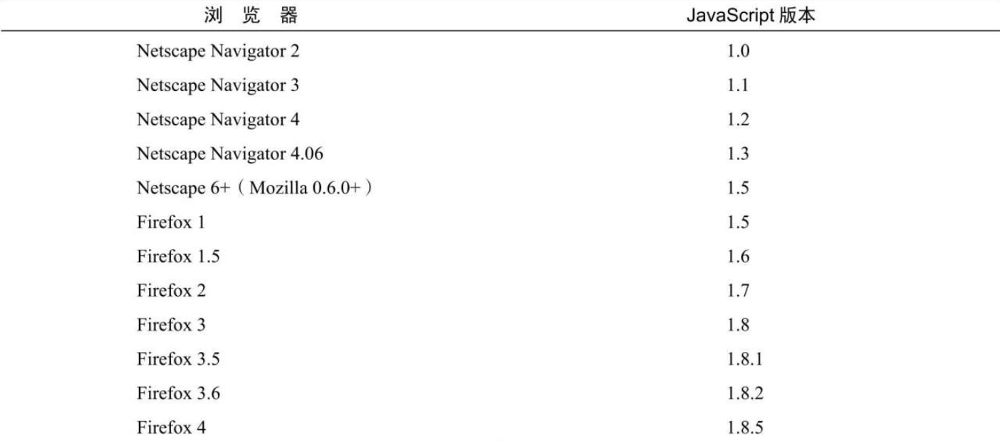

作为网景的继承者，Mozilla 是唯一仍在延续最初 JavaScript 版本编号的浏览器厂商。当初网景在将其源代码开源时（项目名为 MozillaProject），JavaScript 在其浏览器中最后的版本是 1.3。（前面提到过，1.4 版是专门为服务器实现的。）因为 Mozilla Foundation 在持续开发 JavaScript，为它增加新特性、关键字和语法，所以 JavaScript 的版本号也在不断递增。下表展示了 Netscape/Mozilla 浏览器发布的历代 JavaScript 版本。



这种版本编号方式是根据 Firefox 4 要发布 JavaScript 2.0 决定的，在此之前版本号的每次递增，反映的是 JavaScript 实现逐渐接近 2.0 建议。虽然这是最初的计划，但 JavaScript 的发展让这个计划变得不可能。JavaScript2.0 作为一个目标已经不存在了，而这种版本号编排方式在 Firefox 4 发布后就终止了。

```
注意 Netscape/Mozilla仍然沿用这种版本方案。而IE的JScript有不同的版本号规则。这些JScript版本与上表提到的JavaScript版本并不对应。此外，多数浏览器对JavaScript的支持，指的是实现ECMAScript 和DOM的程度。
```
