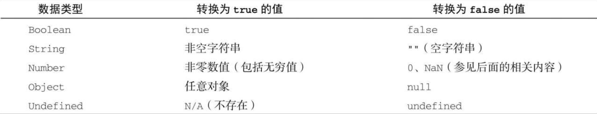
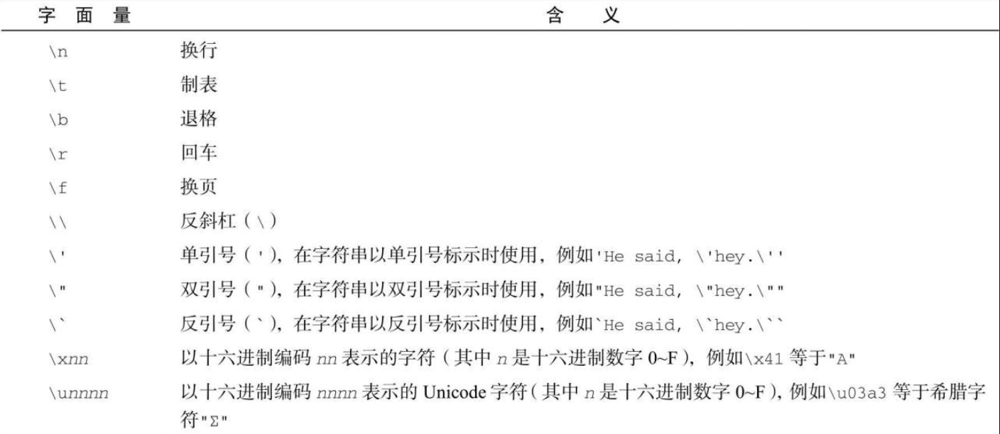

ECMAScript 有 6 种简单数据类型（也称为原始类型）: Undefined、Null、Boolean、Number、String 和 Symbol。Symbol（符号）是 ECMAScript 6 新增的。还有一种复杂数据类型叫 Object（对象）。Object 是一种无序名值对的集合。因为在 ECMAScript 中不能定义自己的数据类型，所有值都可以用上述 7 种数据类型之一来表示。只有 7 种数据类型似乎不足以表示全部数据。但 ECMAScript 的数据类型很灵活，一种数据类型可以当作多种数据类型来使用。

## 3.4.1 typeof 操作符

因为 ECMAScript 的类型系统是松散的，所以需要一种手段来确定任意变量的数据类型。typeof 操作符就是为此而生的。对一个值使用 typeof 操作符会返回下列字符串之一：

- "undefined"表示值未定义；
- "boolean"表示值为布尔值；
- "string"表示值为字符串；
- "number"表示值为数值；
- "object"表示值为对象（而不是函数）或 nul;
- "function"表示值为函数；
- "symbol"表示值为符号。

下面是使用 typeof 操作符的例子：

```javascript
let message = "some string";
console.log(typeof message); // "string"
console.log(typeof message); // "string"
console.log(typeof 95); // "number"
```

在这个例子中，我们把一个变量（message）和一个数值字面量传给了 typeof 操作符。注意，因为 typeof 是一个操作符而不是函数，所以不需要参数（但可以使用参数）。

注意 typeof 在某些情况下返回的结果可能会让人费解，但技术上讲还是正确的。比如，调用 typeof null 返回的是"object"。这是因为特殊值 null 被认为是一个对空对象的引用。

```
注意 严格来讲，函数在ECMAScript中被认为是对象，并不代表一种数据类型。可是，函数也有自己特殊的属性。为此，就有必要通过typeof操作符来区分函数和其他对象。
```

## 3.4.2 Undefined 类型

Undefined 类型只有一个值，就是特殊值 undefined。当使用 var 或 let 声明了变量但没有初始化时，就相当于给变量赋予了 undefined 值：

```javascript
let message;
console.log(message == undefined); // true
```

在这个例子中，变量 message 在声明的时候并未初始化。而在比较它和 undefined 的字面值时，两者是相等的。这个例子等同于如下示例：

```javascript
letmessage = undefined;
console.log(message == undefined); // true
```

这里，变量 message 显式地以 undefined 来初始化。但这是不必要的，因为默认情况下，任何未经初始化的变量都会取得 undefined 值。

```
注意 一般来说，永远不用显式地给某个变量设置undefined值。字面值undefined主要用于比较，而且在ECMA-262第3版之前是不存在的。增加这个特殊值的目的就是为了正式明确空对象指针（null）和未初始化变量的区别。
```

注意，包含 undefined 值的变量跟未定义变量是有区别的。请看下面的例子：

```javascript
let message; // 这个变量被声明了，只是值为undefined
// 确保没有声明过这个变量
// let age
console.log(message); // "undefined"
console.log(age); // 报错
```

在上面的例子中，第一个 console.log 会指出变量 message 的值，即"undefined"。而第二个 console.log 要输出一个未声明的变量 age 的值，因此会导致报错。对未声明的变量，只能执行一个有用的操作，就是对它调用 typeof。（对未声明的变量调用 delete 也不会报错，但这个操作没什么用，实际上在严格模式下会抛出错误。）

在对未初始化的变量调用 typeof 时，返回的结果是"undefined"，但对未声明的变量调用它时，返回的结果还是"undefined"，这就有点让人看不懂了。比如下面的例子：

```javascript
let message; // 这个变量被声明了，只是值为undefined
// 确保没有声明过这个变量
// let age
console.log(typeof message); //"undefined"
console.log(typeof age); //"undefined"
```

无论是声明还是未声明，typeof 返回的都是字符串"undefined"。逻辑上讲这是对的，因为虽然严格来讲这两个变量存在根本性差异，但它们都无法执行实际操作。

```
注意 即使未初始化的变量会被自动赋予undefined值，但我们仍然建议在声明变量的同时进行初始化。这样，当typeof返回"undefined"时，你就会知道那是因为给定的变量尚未声明，而不是声明了但未初始化。
```

undefined 是一个假值。因此，如果需要，可以用更简洁的方式检测它。不过要记住，也有很多其他可能的值同样是假值。所以一定要明确自己想检测的就是 undefined 这个字面值，而不仅仅是假值。

```javascript
let message; // 这个变量被声明了，只是值为undefined
// age没有声明
if (message) {
  // 这个块不会执行
}
if (!message) {
  // 这个块会执行
}
if (age) {
  // 这里会报错
}
```

## 3.4.3 Null 类型

Null 类型同样只有一个值，即特殊值 null。逻辑上讲，null 值表示一个空对象指针，这也是给 typeof 传一个 null 会返回"object"的原因：

```javascript
let car = null;
console.log(typeof car); // "object"
```

在定义将来要保存对象值的变量时，建议使用 null 来初始化，不要使用其他值。这样，只要检查这个变量的值是不是 null 就可以知道这个变量是否在后来被重新赋予了一个对象的引用，比如：

```javascript
if (car != null) {
  // car是一个对象的引用
}
```

undefined 值是由 null 值派生而来的，因此 ECMA-262 将它们定义为表面上相等，如下面的例子所示：

```javascript
console.log(null == undefined); // true
```

用等于操作符（==）比较 null 和 undefined 始终返回 true。但要注意，这个操作符会为了比较而转换它的操作数（本章后面将详细介绍）。

即使 null 和 undefined 有关系，它们的用途也是完全不一样的。如前所述，永远不必显式地将变量值设置为 undefined。但 null 不是这样的。任何时候，只要变量要保存对象，而当时又没有那个对象可保存，就要用 null 来填充该变量。这样就可以保持 null 是空对象指针的语义，并进一步将其与 undefined 区分开来。

null 是一个假值。因此，如果需要，可以用更简洁的方式检测它。不过要记住，也有很多其他可能的值同样是假值。所以一定要明确自己想检测的就是 null 这个字面值，而不仅仅是假值。

```javascript
let message = null;
let age;
if (message) {
  // 这个块不会执行
}
if (!message) {
  // 这个块会执行
}
if (age) {
  // 这个块不会执行
}
if (!age) {
  // 这个块会执行
}
```

## 3.4.4 Boolean 类型

Boolean（布尔值）类型是 ECMAScript 中使用最频繁的类型之一，有两个字面值：true 和 false。这两个布尔值不同于数值，因此 true 不等于 1，false 不等于 0。下面是给变量赋布尔值的例子：

```javascript
let found = true;
let lost = false;
```

注意，布尔值字面量 true 和 false 是区分大小写的，因此 True 和 False（及其他大小混写形式）是有效的标识符，但不是布尔值。

虽然布尔值只有两个，但所有其他 ECMAScript 类型的值都有相应布尔值的等价形式。要将一个其他类型的值转换为布尔值，可以调用特定的 Boolean()转型函数：

```javascript
let message = "Hello world! ";
let messageAsBoolean = Boolean(message);
```

在这个例子中，字符串 message 会被转换为布尔值并保存在变量 messageAsBoolean 中。Boolean()转型函数可以在任意类型的数据上调用，而且始终返回一个布尔值。什么值能转换为 true 或 false 的规则取决于数据类型和实际的值。下表总结了不同类型与布尔值之间的转换规则。



理解以上转换非常重要，因为像 if 等流控制语句会自动执行其他类型值到布尔值的转换，例如：

```javascript
let message = "Hello world! ";
if (message) {
  console.log("Value is true");
}
```

在这个例子中，console.log 会输出字符串"Value is true"，因为字符串 message 会被自动转换为等价的布尔值 true。由于存在这种自动转换，理解流控制语句中使用的是什么变量就非常重要。错误地使用对象而不是布尔值会明显改变应用程序的执行流。

## 3.4.5 Number 类型

ECMAScript 中最有意思的数据类型或许就是 Number 了。Number 类型使用 IEEE 754 格式表示整数和浮点值（在某些语言中也叫双精度值）。不同的数值类型相应地也有不同的数值字面量格式。

最基本的数值字面量格式是十进制整数，直接写出来即可：

```javascript
let intNum = 55; // 整数
```

整数也可以用八进制（以 8 为基数）或十六进制（以 16 为基数）字面量表示。对于八进制字面量，第一个数字必须是零（0），然后是相应的八进制数字（数值 0~7）。如果字面量中包含的数字超出了应有的范围，就会忽略前缀的零，后面的数字序列会被当成十进制数，如下所示：

```javascript
let octalNum1 = 070; // 八进制的56
let octalNum2 = 079; // 无效的八进制值，当成79 处理
let octalNum3 = 08; // 无效的八进制值，当成8 处理
```

八进制字面量在严格模式下是无效的，会导致 JavaScript 引擎抛出语法错误。

要创建十六进制字面量，必须让真正的数值前缀 0x（区分大小写），然后是十六进制数字（0~9 以及 A~F）。十六进制数字中的字母大小写均可。下面是几个例子：

```javascript
let hexNum1 = 0xa; // 十六进制10
let hexNum2 = 0x1f; // 十六进制31
```

使用八进制和十六进制格式创建的数值在所有数学操作中都被视为十进制数值。

```
注意 由于JavaScript保存数值的方式，实际中可能存在正零（+0）和负零（-0）。正零和负零在所有情况下都被认为是等同的，这里特地说明一下。
```

### 1．浮点值

要定义浮点值，数值中必须包含小数点，而且小数点后面必须至少有一个数字。虽然小数点前面不是必须有整数，但推荐加上。下面是几个例子：

```javascript
let floatNum1 = 1.1;
let floatNum2 = 0.1;
let floatNum3 = 0.1; // .1 有效，但不推荐
```

因为存储浮点值使用的内存空间是存储整数值的两倍，所以 ECMAScript 总是想方设法把值转换为整数。在小数点后面没有数字的情况下，数值就会变成整数。类似地，如果数值本身就是整数，只是小数点后面跟着 0（如 1.0），那它也会被转换为整数，如下例所示：

```javascript
let floatNum1 = 1; // 小数点后面没有数字，当成整数1 处理
let floatNum2 = 10.0; // 小数点后面是零，当成整数10 处理
```

对于非常大或非常小的数值，浮点值可以用科学记数法来表示。科学记数法用于表示一个应该乘以 10 的给定次幂的数值。ECMAScript 中科学记数法的格式要求是一个数值（整数或浮点数）后跟一个大写或小写的字母 e，再加上一个要乘的 10 的多少次幂。比如：

```javascript
let floatNum = 3.125e7; // 等于31250000
```

在这个例子中，floatNum 等于 31250000，只不过科学记数法显得更简洁。这种表示法实际上相当于说：“以 3.125 作为系数，乘以 10 的 7 次幂。”

科学记数法也可以用于表示非常小的数值，例如 0.00000000000000003。这个数值用科学记数法可以表示为 3e-17。默认情况下，ECMAScript 会将小数点后至少包含 6 个零的浮点值转换为科学记数法（例如，0.000000 3 会被转换为 3e-7）。

浮点值的精确度最高可达 17 位小数，但在算术计算中远不如整数精确。例如，0.1 加 0.2 得到的不是 0.3，而是 0.30000000000000004。由于这种微小的舍入错误，导致很难测试特定的浮点值。比如下面的例子：

```javascript
if (a + b == 0.3) {
  // 别这么干！
  console.log("You got 0.3.");
}
```

这里检测两个数值之和是否等于 0.3。如果两个数值分别是 0.05 和 0.25，或者 0.15 和 0.15，那没问题。但如果是 0.1 和 0.2，如前所述，测试将失败。因此永远不要测试某个特定的浮点值。

```
注意 之所以存在这种舍入错误，是因为使用了IEEE 754数值，这种错误并非ECMAScript所独有。其他使用相同格式的语言也有这个问题。
```

### 2．值的范围

由于内存的限制，ECMAScript 并不支持表示这个世界上的所有数值。ECMAScript 可以表示的最小数值保存在 Number.MIN_VALUE 中，这个值在多数浏览器中是 5e-324；可以表示的最大数值保存在 Number.MAX_VALUE 中，这个值在多数浏览器中是 1.797693134862315 7e+308。如果某个计算得到的数值结果超出了 JavaScript 可以表示的范围，那么这个数值会被自动转换为一个特殊的 Infinity（无穷）值。任何无法表示的负数以-Infinity（负无穷大）表示，任何无法表示的正数以 Infinity（正无穷大）表示。

如果计算返回正 Infinity 或负 Infinity，则该值将不能再进一步用于任何计算。这是因为 Infinity 没有可用于计算的数值表示形式。要确定一个值是不是有限大（即介于 JavaScript 能表示的最小值和最大值之间），可以使用 isFinite()函数，如下所示：

```javascript
let result = Number.MAX_VALUE + Number.MAX_VALUE;
console.log(isFinite(result)); // false
```

虽然超出有限数值范围的计算并不多见，但总归还是有可能的。因此在计算非常大或非常小的数值时，有必要监测一下计算结果是否超出范围。

```
注意 使用Number.NEGATIVE_INFINITY和Number.POSITIVE_INFINITY也可以获取正、负Infinity。没错，这两个属性包含的值分别就是-Infinity和Infinity。
```

### 3．NaN

有一个特殊的数值叫 NaN，意思是“不是数值”（Not a Number），用于表示本来要返回数值的操作失败了（而不是抛出错误）。比如，用 0 除任意数值在其他语言中通常都会导致错误，从而中止代码执行。但在 ECMAScript 中，0、+0 或-0 相除会返回 NaN：

```javascript
console.log(0 / 0); // NaN
console.log(-0 / +0); // NaN
```

如果分子是非 0 值，分母是有符号 0 或无符号 0，则会返回 Infinity 或-Infinity：

```javascript
console.log(5 / 0); // Infinity
console.log(5 / -0); // -Infinity
```

NaN 有几个独特的属性。首先，任何涉及 NaN 的操作始终返回 NaN（如 NaN/10），在连续多步计算时这可能是个问题。其次，NaN 不等于包括 NaN 在内的任何值。例如，下面的比较操作会返回 false：

```javascript
console.log(NaN == NaN); // false
```

为此，ECMAScript 提供了 isNaN()函数。该函数接收一个参数，可以是任意数据类型，然后判断这个参数是否“不是数值”。把一个值传给 isNaN()后，该函数会尝试把它转换为数值。某些非数值的值可以直接转换成数值，如字符串"10"或布尔值。任何不能转换为数值的值都会导致这个函数返回 true。举例如下：

```javascript
console.log(isNaN(NaN)); // true
console.log(isNaN(10)); // false，10 是数值
console.log(isNaN("10")); // false，可以转换为数值10
console.log(isNaN("blue")); // true，不可以转换为数值
console.log(isNaN(true)); // false，可以转换为数值1
```

上述的例子测试了 5 个不同的值。首先测试的是 NaN 本身，显然会返回 true。接着测试了数值 10 和字符串"10"，都返回 false，因为它们的数值都是 10。字符串"blue"不能转换为数值，因此函数返回 true。布尔值 true 可以转换为数值 1，因此返回 false。

```
注意 虽然不常见，但isNaN()可以用于测试对象。此时，首先会调用对象的valueOf()方法，然后再确定返回的值是否可以转换为数值。如果不能，再调用toString()方法，并测试其返回值。这通常是ECMAScript内置函数和操作符的工作方式，本章后面会讨论。
```

### 4．数值转换

有 3 个函数可以将非数值转换为数值：Number()、parseInt()和 parseFloat()。Number()是转型函数，可用于任何数据类型。后两个函数主要用于将字符串转换为数值。对于同样的参数，这 3 个函数执行的操作也不同。

Number()函数基于如下规则执行转换。

- 布尔值，true 转换为 1，false 转换为 0。
- 数值，直接返回。
- null，返回 0。
- undefined，返回 NaN。
- 字符串，应用以下规则。
  - 如果字符串包含数值字符，包括数值字符前面带加、减号的情况，则转换为一个十进制数值。因此，Number("1")返回 1,Number("123")返回 123, Number("011")返回 11（忽略前面的零）。
  - 如果字符串包含有效的浮点值格式如"1.1"，则会转换为相应的浮点值（同样，忽略前面的零）。
  - 如果字符串包含有效的十六进制格式如"0xf"，则会转换为与该十六进制值对应的十进制整数值。
  - 如果是空字符串（不包含字符），则返回 0。
  - 如果字符串包含除上述情况之外的其他字符，则返回 NaN。
- 对象，调用 valueOf()方法，并按照上述规则转换返回的值。如果转换结果是 NaN，则调用 toString()方法，再按照转换字符串的规则转换。

从不同数据类型到数值的转换有时候会比较复杂，看一看 Number()的转换规则就知道了。下面是几个具体的例子：

```javascript
let num1 = Number("Hello world! "); // NaN
let num2 = Number(""); // 0
let num3 = Number("000011"); // 11
let num4 = Number(true); // 1
```

可以看到，字符串"Hello world"转换之后是 NaN，因为它找不到对应的数值。空字符串转换后是 0。字符串 000011 转换后是 11，因为前面的零被忽略了。最后，true 转换为 1。

```
注意 本章后面会讨论到的一元加操作符与Number()函数遵循相同的转换规则。
```

考虑到用 Number()函数转换字符串时相对复杂且有点反常规，通常在需要得到整数时可以优先使用 parseInt()函数。parseInt()函数更专注于字符串是否包含数值模式。字符串最前面的空格会被忽略，从第一个非空格字符开始转换。如果第一个字符不是数值字符、加号或减号，parseInt()立即返回 NaN。这意味着空字符串也会返回 NaN（这一点跟 Number()不一样，它返回 0）。如果第一个字符是数值字符、加号或减号，则继续依次检测每个字符，直到字符串末尾，或碰到非数值字符。比如，"1234blue"会被转换为 1234，因为"blue"会被完全忽略。类似地，"22.5"会被转换为 22，因为小数点不是有效的整数字符。

假设字符串中的第一个字符是数值字符，parseInt()函数也能识别不同的整数格式（十进制、八进制、十六进制）。换句话说，如果字符串以"0x"开头，就会被解释为十六进制整数。如果字符串以"0"开头，且紧跟着数值字符，在非严格模式下会被某些实现解释为八进制整数。

下面几个转换示例有助于理解上述规则：

```javascript
let num1 = parseInt("1234blue"); // 1234
let num2 = parseInt(""); // NaN
let num3 = parseInt("0xA"); // 10，解释为十六进制整数
let num4 = parseInt(22.5); // 22
let num5 = parseInt("70"); // 70，解释为十进制值
let num6 = parseInt("0xf"); // 15，解释为十六进制整数
```

不同的数值格式很容易混淆，因此 parseInt()也接收第二个参数，用于指定底数（进制数）。如果知道要解析的值是十六进制，那么可以传入 16 作为第二个参数，以便正确解析：

```javascript
let num = parseInt("0xAF", 16); // 175
```

事实上，如果提供了十六进制参数，那么字符串前面的"0x"可以省掉：

```javascript
let num1 = parseInt("AF", 16); // 175
let num2 = parseInt("AF"); // NaN
```

在这个例子中，第一个转换是正确的，而第二个转换失败了。区别在于第一次传入了进制数作为参数，告诉 parseInt()要解析的是一个十六进制字符串。而第二个转换检测到第一个字符就是非数值字符，随即自动停止并返回 NaN。

通过第二个参数，可以极大扩展转换后获得的结果类型。比如：

```javascript
let num1 = parseInt("10", 2); // 2，按二进制解析
let num2 = parseInt("10", 8); // 8，按八进制解析
let num3 = parseInt("10", 10); // 10，按十进制解析
let num4 = parseInt("10", 16); // 16，按十六进制解析
```

因为不传底数参数相当于让 parseInt()自己决定如何解析，所以为避免解析出错，建议始终传给它第二个参数。

```
注意 多数情况下解析的应该都是十进制数，此时第二个参数就要传入10。
```

parseFloat()函数的工作方式跟 parseInt()函数类似，都是从位置 0 开始检测每个字符。同样，它也是解析到字符串末尾或者解析到一个无效的浮点数值字符为止。这意味着第一次出现的小数点是有效的，但第二次出现的小数点就无效了，此时字符串的剩余字符都会被忽略。因此，"22.34.5"将转换成 22.34。

parseFloat()函数的另一个不同之处在于，它始终忽略字符串开头的零。这个函数能识别前面讨论的所有浮点格式，以及十进制格式（开头的零始终被忽略）。十六进制数值始终会返回 0。因为 parseFloat()只解析十进制值，因此不能指定底数。最后，如果字符串表示整数（没有小数点或者小数点后面只有一个零），则 parseFloat()返回整数。下面是几个示例：

```javascript
let num1 = parseFloat("1234blue"); // 1234，按整数解析
let num2 = parseFloat("0xA"); // 0
let num3 = parseFloat("22.5"); // 22.5
let num4 = parseFloat("22.34.5"); // 22.34
let num5 = parseFloat("0908.5"); // 908.5
let num6 = parseFloat("3.125e7"); // 31250000
```

## 3.4.6 String 类型

String（字符串）数据类型表示零或多个 16 位 Unicode 字符序列。字符串可以使用双引号（"）、单引号（'）或反引号（`）标示，因此下面的代码都是合法的：

```javascript
let firstName = "John";
let lastName = "Jacob";
let lastName = `Jingleheimerschmidt`;
```

跟某些语言中使用不同的引号会改变对字符串的解释方式不同，ECMAScript 语法中表示字符串的引号没有区别。不过要注意的是，以某种引号作为字符串开头，必须仍然以该种引号作为字符串结尾。比如，下面的写法会导致语法错误：

```javascript
    let firstName = 'Nicholas"; // 语法错误：开头和结尾的引号必须是同一种
```

### 1．字符字面量

字符串数据类型包含一些字符字面量，用于表示非打印字符或有其他用途的字符，如下表所示：



这些字符字面量可以出现在字符串中的任意位置，且可以作为单个字符被解释：

```javascript
let text = "This is the letter sigma: \u03a3.";
```

在这个例子中，即使包含 6 个字符长的转义序列，变量 text 仍然是 28 个字符长。因为转义序列表示一个字符，所以只算一个字符。

字符串的长度可以通过其 length 属性获取：

```javascript
console.log(text.length); // 28
```

这个属性返回字符串中 16 位字符的个数。

```
注意 如果字符串中包含双字节字符，那么length属性返回的值可能不是准确的字符数。第5章将具体讨论如何解决这个问题。
```

### 2．字符串的特点

ECMAScript 中的字符串是不可变的（immutable），意思是一旦创建，它们的值就不能变了。要修改某个变量中的字符串值，必须先销毁原始的字符串，然后将包含新值的另一个字符串保存到该变量，如下所示：

```javascript
let lang = "Java";
lang = lang + "Script";
```

这里，变量 lang 一开始包含字符串"Java"。紧接着，lang 被重新定义为包含"Java"和"Script"的组合，也就是"JavaScript"。整个过程首先会分配一个足够容纳 10 个字符的空间，然后填充上"Java"和"Script"。最后销毁原始的字符串"Java"和字符串"Script"，因为这两个字符串都没有用了。所有处理都是在后台发生的，而这也是一些早期的浏览器（如 Firefox 1.0 之前的版本和 IE6.0）在拼接字符串时非常慢的原因。这些浏览器在后来的版本中都有针对性地解决了这个问题。

### 3．转换为字符串

有两种方式把一个值转换为字符串。首先是使用几乎所有值都有的 toString()方法。这个方法唯一的用途就是返回当前值的字符串等价物。比如：

```javascript
let age = 11;
let ageAsString = age.toString(); // 字符串"11"
let found = true;
let foundAsString = found.toString(); // 字符串"true"
```

toString()方法可见于数值、布尔值、对象和字符串值。（没错，字符串值也有 toString()方法，该方法只是简单地返回自身的一个副本。）null 和 undefined 值没有 toString()方法。

多数情况下，toString()不接收任何参数。不过，在对数值调用这个方法时，toString()可以接收一个底数参数，即以什么底数来输出数值的字符串表示。默认情况下，toString()返回数值的十进制字符串表示。而通过传入参数，可以得到数值的二进制、八进制、十六进制，或者其他任何有效基数的字符串表示，比如：

```javascript
let num = 10;
console.log(num.toString()); // "10"
console.log(num.toString(2)); // "1010"
console.log(num.toString(8)); // "12"
console.log(num.toString(10)); // "10"
console.log(num.toString(16)); // "a"
```

这个例子展示了传入底数参数时，toString()输出的字符串值也会随之改变。数值 10 可以输出为任意数值格式。注意，默认情况下（不传参数）的输出与传入参数 10 得到的结果相同。

如果你不确定一个值是不是 null 或 undefined，可以使用 String()转型函数，它始终会返回表示相应类型值的字符串。String()函数遵循如下规则。

- 如果值有 toString()方法，则调用该方法（不传参数）并返回结果
- 如果值是 null，返回"null"。
- 如果值是 undefined，返回"undefined"。

下面看几个例子：

```javascript
let value1 = 10;
let value2 = true;
let value3 = null;
let value4;
console.log(String(value1)); // "10"
console.log(String(value2)); // "true"
console.log(String(value3)); // "null"
console.log(String(value4)); // "undefined"
```

这里展示了将 4 个值转换为字符串的情况：一个数值、一个布尔值、一个 null 和一个 undefined。数值和布尔值的转换结果与调用 toString()相同。因为 null 和 undefined 没有 toString()方法，所以 String()方法就直接返回了这两个值的字面量文本。

```
注意 用加号操作符给一个值加上一个空字符串""也可以将其转换为字符串（加号操作符本章后面会介绍）。
```

### 4．模板字面量

ECMAScript 6 新增了使用模板字面量定义字符串的能力。与使用单引号或双引号不同，模板字面量保留换行字符，可以跨行定义字符串：

```javascript
let myMultiLineString = "first line\nsecond line";
let myMultiLineTemplateLiteral = `first line
    second line`;
console.log(myMultiLineString);
// first line
// second line"
console.log(myMultiLineTemplateLiteral);
// first line
// second line
console.log(myMultiLineString === myMultiLinetemplateLiteral); // true
```

顾名思义，模板字面量在定义模板时特别有用，比如下面这个 HTML 模板：

```javascript
let pageHTML = `
    <div>
      <a href="#">
        <span>Jake</span>
      </a>
    </div>`;
```

由于模板字面量会保持反引号内部的空格，因此在使用时要格外注意。格式正确的模板字符串看起来可能会缩进不当：

```javascript
// 这个模板字面量在换行符之后有25 个空格符
let myTemplateLiteral = `first line
                              second line`;
console.log(myTemplateLiteral.length); // 47
// 这个模板字面量以一个换行符开头
let secondTemplateLiteral = `
    first line
    second line`;
console.log(secondTemplateLiteral[0] === "\n"); // true
// 这个模板字面量没有意料之外的字符
let thirdTemplateLiteral = `first line
    second line`;
console.log(thirdTemplateLiteral);
// first line
// second line
```

所有插入的值都会使用 toString()强制转型为字符串，而且任何 JavaScript 表达式都可以用于插值。嵌套的模板字符串无须转义：

```javascript
console.log(`Hello, ${`World`}! `); // Hello, World!
```

将表达式转换为字符串时会调用 toString()：

```javascript
function capitalize(word) {
  return `${word[0].toUpperCase()}${word.slice(1)}`;
}
console.log(`${capitalize("hello")}, ${capitalize("world")}! `); // Hello, World!
```

此外，模板也可以插入自己之前的值：

```javascript
let value = "";
function append() {
  value = `${value}abc`;
  console.log(value);
}
append(); // abc
append(); // abcabc
append(); // abcabcabc
```

### 6．模板字面量标签函数

模板字面量也支持定义标签函数（tag funct​ion）​，而通过标签函数可以自定义插值行为。标签函数会接收被插值记号分隔后的模板和对每个表达式求值的结果。

标签函数本身是一个常规函数，通过前缀到模板字面量来应用自定义行为，如下例所示。标签函数接收到的参数依次是原始字符串数组和对每个表达式求值的结果。这个函数的返回值是对模板字面量求值得到的字符串。

最好通过一个例子来理解：

```javascript
let a = 6;
let b = 9;
function simpleTag(strings, aValExpression, bValExpression, sumExpression) {
  console.log(strings);
  console.log(aValExpression);
  console.log(bValExpression);
  console.log(sumExpression);
  return "foobar";
}
let untaggedResult = `${a} + ${b} = ${a + b}`;
lettaggedResult = simpleTag`${a}+${b}=${a + b}`;
// ["", " + ", " = ", ""]
// 6
// 9
// 15
console.log(untaggedResult); // "6 + 9 = 15"
console.log(taggedResult); // "foobar"
```

因为表达式参数的数量是可变的，所以通常应该使用剩余操作符（restoperator）将它们收集到一个数组中：

```javascript
    let a = 6;
    let b = 9;
    functionsimpleTag(strings, ...expressions){
      console.log(strings);
      for(const expression of expressions) {
        console.log(expression);
      }
      return 'foobar';
    }
    let taggedResult = simpleTag`${ a } + ${ b } = ${ a + b }`;
    // ["", " + ", " = ", ""]
    // 6
    // 9
    // 15
    console.log(taggedResult);   // "foobar"
```

对于有 n 个插值的模板字面量，传给标签函数的表达式参数的个数始终是 n，而传给标签函数的第一个参数所包含的字符串个数则始终是 n+1。因此，如果你想把这些字符串和对表达式求值的结果拼接起来作为默认返回的字符串，可以这样做：

```javascript
let a = 6;
let b = 9;
function zipTag(strings, ...expressions) {
  return (
    strings[0] + expressions.map((e, i) => `${e}${strings[i + 1]}`).join("")
  );
}
let untaggedResult = `${a} + ${b} = ${a + b}`;
let taggedResult = zipTag`${a} + ${b} = ${a + b}`;
console.log(untaggedResult); // "6 + 9 = 15"
console.log(taggedResult); // "6 + 9 = 15"
```

### 7．原始字符串

使用模板字面量也可以直接获取原始的模板字面量内容（如换行符或 Unicode 字符）​，而不是被转换后的字符表示。为此，可以使用默认的 String.raw 标签函数：

```javascript
// Unicode示例
// \u00A9 是版权符号
console.log(`\u00A9`); // ©
console.log(String.raw`\u00A9`); // \u00A9
// 换行符示例
console.log(`first line\nsecond line`);
// first line
// second line
console.log(String.raw`first line\nsecond line`); // "first line\nsecond line"
// 对实际的换行符来说是不行的
// 它们不会被转换成转义序列的形式
console.log(`first line
    second line`);
// first line
// second line
console.log(String.raw`first line
    second line`);
// first line
// second line
```

另外，也可以通过标签函数的第一个参数，即字符串数组的．raw 属性取得每个字符串的原始内容：

```javascript
function printRaw(strings) {
  console.log("Actual characters:");
  for (const string of strings) {
    console.log(string);
  }
  console.log("Escaped characters; ");
  for (const rawString of strings.raw) {
    console.log(rawString);
  }
}
printRaw`\u00A9${"and"}\n`;
// Actual characters:
// ©
//（换行符）
// Escaped characters:
// \u00A9
// \n
```

## 3.4.7 Symbol 类型

Symbol（符号）是 ECMAScript 6 新增的数据类型。符号是原始值，且符号实例是唯一、不可变的。符号的用途是确保对象属性使用唯一标识符，不会发生属性冲突的危险。

尽管听起来跟私有属性有点类似，但符号并不是为了提供私有属性的行为才增加的（尤其是因为 Object API 提供了方法，可以更方便地发现符号属性）​。相反，符号就是用来创建唯一记号，进而用作非字符串形式的对象属性。

### 1．符号的基本用法

符号需要使用 Symbol()函数初始化。因为符号本身是原始类型，所以 typeof 操作符对符号返回 symbol。

```javascript
let sym = Symbol();
console.log(typeof sym); // symbol
```

调用 Symbol()函数时，也可以传入一个字符串参数作为对符号的描述（descript​ion）​，将来可以通过这个字符串来调试代码。但是，这个字符串参数与符号定义或标识完全无关：

```javascript
let genericSymbol = Symbol();
let otherGenericSymbol = Symbol();
let fooSymbol = Symbol("foo");
let otherFooSymbol = Symbol("foo");
console.log(genericSymbol == otherGenericSymbol); // false
console.log(fooSymbol == otherFooSymbol); // false
```

符号没有字面量语法，这也是它们发挥作用的关键。按照规范，你只要创建 Symbol()实例并将其用作对象的新属性，就可以保证它不会覆盖已有的对象属性，无论是符号属性还是字符串属性。

```javascript
let genericSymbol = Symbol();
console.log(genericSymbol); // Symbol()
let fooSymbol = Symbol("foo");
console.log(fooSymbol); // Symbol(foo);
```

最重要的是，Symbol()函数不能与 new 关键字一起作为构造函数使用。这样做是为了避免创建符号包装对象，像使用 Boolean、String 或 Number 那样，它们都支持构造函数且可用于初始化包含原始值的包装对象：

```javascript
let myBoolean = new Boolean();
console.log(typeof myBoolean); // "object"
let myString = new String();
console.log(typeof myString); // "object"
let myNumber = new Number();
console.log(typeof myNumber); // "object"
letmySymbol = newSymbol(); //TypeError: Symbolisnotaconstructor
```

### 2．使用全局符号注册表

如果运行时的不同部分需要共享和重用符号实例，那么可以用一个字符串作为键，在全局符号注册表中创建并重用符号。

为此，需要使用 Symbol.for()方法：

```javascript
let fooGlobalSymbol = Symbol.for("foo");
console.log(typeof fooGlobalSymbol); // symbol
```

Symbol.for()对每个字符串键都执行幂等操作。第一次使用某个字符串调用时，它会检查全局运行时注册表，发现不存在对应的符号，于是就会生成一个新符号实例并添加到注册表中。后续使用相同字符串的调用同样会检查注册表，发现存在与该字符串对应的符号，然后就会返回该符号实例。

```javascript
let fooGlobalSymbol = Symbol.for("foo"); // 创建新符号
let otherFooGlobalSymbol = Symbol.for("foo"); // 重用已有符号
console.log(fooGlobalSymbol === otherFooGlobalSymbol); // true
```

即使采用相同的符号描述，在全局注册表中定义的符号跟使用 Symbol()定义的符号也并不等同：

```javascript
let localSymbol = Symbol("foo");
let globalSymbol = Symbol.for("foo");
console.log(localSymbol === globalSymbol); // false
```

全局注册表中的符号必须使用字符串键来创建，因此作为参数传给 Symbol.for()的任何值都会被转换为字符串。此外，注册表中使用的键同时也会被用作符号描述。

```javascript
let emptyGlobalSymbol = Symbol.for();
console.log(emptyGlobalSymbol); // Symbol(undefined)
```

还可以使用 Symbol.keyFor()来查询全局注册表，这个方法接收符号，返回该全局符号对应的字符串键。如果查询的不是全局符号，则返回 undef​ined。

```javascript
// 创建全局符号
let s = Symbol.for("foo");
console.log(Symbol.keyFor(s)); // foo
// 创建普通符号
let s2 = Symbol("bar");
console.log(Symbol.keyFor(s2)); // undefined
```

如果传给 Symbol.keyFor()的不是符号，则该方法抛出 TypeError：

```javascript
Symbol.keyFor(123); // TypeError: 123 is not a symbol
```

### 3．使用符号作为属性

凡是可以使用字符串或数值作为属性的地方，都可以使用符号。这就包括了对象字面量属性和 Object.def​ineProperty()/Object.def​inePropert​ies()定义的属性。对象字面量只能在计算属性语法中使用符号作为属性。

```javascript
let s1 = Symbol("foo"),
  s2 = Symbol("bar"),
  s3 = Symbol("baz"),
  s4 = Symbol("qux");
let o = {
  [s1]: "foo val",
};
// 这样也可以：o[s1] = 'foo val';
console.log(o);
// {Symbol(foo): foo val}
Object.defineProperty(o, s2, { value: "bar val" });
console.log(o);
// {Symbol(foo): foo val, Symbol(bar): bar val}
Object.defineProperties(o, {
  [s3]: { value: "baz val" },
  [s4]: { value: "qux val" },
});
console.log(o);
// {Symbol(foo): foo val, Symbol(bar): bar val,
//   Symbol(baz): baz val, Symbol(qux): qux val}
```

类似于 Object.getOwnPropertyNames()返回对象实例的常规属性数组，Object.getOwnProperty-Symbols()返回对象实例的符号属性数组。这两个方法的返回值彼此互斥。Object.getOwnProperty-Descriptors()会返回同时包含常规和符号属性描述符的对象。Ref​lect.ownKeys()会返回两种类型的键：

```javascript
let s1 = Symbol("foo"),
  s2 = Symbol("bar");
let o = {
  [s1]: "foo val",
  [s2]: "bar val",
  baz: "baz val",
  qux: "qux val",
};
console.log(Object.getOwnPropertySymbols(o));
// [Symbol(foo), Symbol(bar)]
console.log(Object.getOwnPropertyNames(o));
// ["baz", "qux"]
console.log(Object.getOwnPropertyDescriptors(o));
// {baz: {...}, qux: {...}, Symbol(foo): {...}, Symbol(bar): {...}}
console.log(Reflect.ownKeys(o));
// ["baz", "qux", Symbol(foo), Symbol(bar)]
```

因为符号属性是对内存中符号的一个引用，所以直接创建并用作属性的符号不会丢失。但是，如果没有显式地保存对这些属性的引用，那么必须遍历对象的所有符号属性才能找到相应的属性键：

```javascript
let o = {
  [Symbol("foo")]: "fooval",
  [Symbol("bar")]: "barval",
};
console.log(o);
// {Symbol(foo): "foo val", Symbol(bar): "bar val"}
let barSymbol = Object.getOwnPropertySymbols(o).find((symbol) =>
  symbol.toString().match(/bar/)
);
console.log(barSymbol);
// Symbol(bar)
```

### 4．常用内置符号

ECMAScript 6 也引入了一批常用内置符号（wel​l-known symbol）​，用于暴露语言内部行为，开发者可以直接访问、重写或模拟这些行为。这些内置符号都以 Symbol 工厂函数字符串属性的形式存在。

这些内置符号最重要的用途之一是重新定义它们，从而改变原生结构的行为。比如，我们知道 for-of 循环会在相关对象上使用 Symbol.i​terator 属性，那么就可以通过在自定义对象上重新定义 Symbol.i​terator 的值，来改变 for-of 在迭代该对象时的行为。

这些内置符号也没有什么特别之处，它们就是全局函数 Symbol 的普通字符串属性，指向一个符号的实例。所有内置符号属性都是不可写、不可枚举、不可配置的。

```
注意 在提到ECMAScript规范时，经常会引用符号在规范中的名称，前缀为@@。比如，@@i​terator指的就是Symbol.i​terator。
```

### 5．Symbol.asyncIterator

根据 ECMAScript 规范，这个符号作为一个属性表示“一个方法，该方法返回对象默认的 AsyncIterator。由 for-awai​t-of 语句使用”​。换句话说，这个符号表示实现异步迭代器 API 的函数。

for-awai​t-of 循环会利用这个函数执行异步迭代操作。循环时，它们会调用以 Symbol.asyncIterator 为键的函数，并期望这个函数会返回一个实现迭代器 API 的对象。很多时候，返回的对象是实现该 API 的 AsyncGenerator：

```javascript
class Foo {
  async *[Symbol.asyncIterator]() {}
}
let f = new Foo();
console.log(f[Symbol.asyncIterator]());
// AsyncGenerator {<suspended>}
```

技术上，这个由 Symbol.asyncIterator 函数生成的对象应该通过其 next()方法陆续返回 Promise 实例。可以通过显式地调用 next()方法返回，也可以隐式地通过异步生成器函数返回：

```javascript
class Emitter {
  constructor(max) {
    this.max = max;
    this.asyncIdx = 0;
  }
  async *[Symbol.asyncIterator]() {
    while (this.asyncIdx < this.max) {
      yield new Promise((resolve) => resolve(this.asyncIdx++));
    }
  }
}
async function asyncCount() {
  let emitter = new Emitter(5);
  for await (const x of emitter) {
    console.log(x);
  }
}
asyncCount();
// 0
// 1
// 2
// 3
// 4
```

```
注意 Symbol.asyncIterator是ES2018规范定义的，因此只有版本非常新的浏览器支持它。关于异步迭代和for-awai​t-of循环的细节，参见附录A。
```

### 6．Symbol.hasInstance

根据 ECMAScript 规范，这个符号作为一个属性表示“一个方法，该方法决定一个构造器对象是否认可一个对象是它的实例。由 instanceof 操作符使用”​。instanceof 操作符可以用来确定一个对象实例的原型链上是否有原型。instanceof 的典型使用场景如下：

```javascript
function Foo() {}
let f = new Foo();
console.log(f instanceof Foo); // true
class Bar {}
let b = new Bar();
console.log(b instanceof Bar); // true
```

在 ES6 中，instanceof 操作符会使用 Symbol.hasInstance 函数来确定关系。以 Symbol.hasInstance 为键的函数会执行同样的操作，只是操作数对调了一下：

```javascript
function Foo() {}
let f = new Foo();
console.log(Foo[Symbol.hasInstance](f)); // true
class Bar {}
let b = new Bar();
console.log(Bar[Symbol.hasInstance](b)); // true
```

这个属性定义在 Funct​ion 的原型上，因此默认在所有函数和类上都可以调用。由于 instanceof 操作符会在原型链上寻找这个属性定义，就跟在原型链上寻找其他属性一样，因此可以在继承的类上通过静态方法重新定义这个函数：

```javascript
class Bar {}
class Baz extends Bar {
  static [Symbol.hasInstance]() {
    return false;
  }
}
let b = new Baz();
console.log(Bar[Symbol.hasInstance](b)); // true
console.log(b instanceof Bar); // true
console.log(Baz[Symbol.hasInstance](b)); //false
console.log(binstanceofBaz); //false
```
