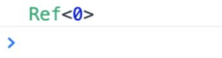

```javascript
createApp(App).mount("#not-exist");
```

当我们创建一个 Vue.js 应用并试图将其挂载到一个不存在的 DOM 节点时，就会收到一条警告信息，如图 2-1 所示。


这条信息告诉我们挂载失败了，并说明了失败的原因：Vue.js 根据我们提供的选择器无法找到相应的 DOM 元素（返回 null）。这条信息让我们能够清晰且快速地定位问题。试想一下，如果 Vue.js 内部不做任何处理，那么我们很可能得到的是 JavaScript 层面的错误信息，例如 Uncaught TypeError: Cannot read property 'xxx' of null，而根据此信息我们很难知道问题出在哪里。

所以在框架设计和开发过程中，提供友好的警告信息至关重要。如果这一点做得不好，那么很可能会经常收到用户的抱怨。始终提供友好的警告信息不仅能够帮助用户快速定位问题，节省用户的时间，还能够让框架收获良好的口碑，让用户认可框架的专业性。

在 Vue.js 的源码中，我们经常能够看到 warn 函数的调用，例如图 2-1 中的信息就是由下面这个 warn 函数调用打印的：

```javascript
warn(
  `Failed to mount app: mount target selector "${container}" returned null.`
);
```

对于 warn 函数来说，由于它需要尽可能提供有用的信息，因此它需要收集当前发生错误的组件栈信息。如果你去看源码，就会发现有些复杂，但其实最终就是调用了 console.warn 函数。

除了提供必要的警告信息外，还有很多其他方面可以作为切入口，进一步提升用户的开发体验。例如，在 Vue.js 3 中，当我们在控制台打印一个 ref 数据时：

```javascript
const count = ref(0);
console.log(count);
```

打开控制台查看输出，结果如图 2-2 所示。


可以发现，打印的数据非常不直观。当然，我们可以选择直接打印 count.value 的值，这样就只会输出 0，非常直观。那么有没有办法在打印 count 的时候让输出的信息更友好呢？当然可以，浏览器允许我们编写自定义的 formatter，从而自定义输出形式。在 Vue.js 3 的源码中，你可以搜索到名为 initCustomFormatter 的函数，该函数就是用来在开发环境下初始化自定义 formatter 的。以 Chrome 为例，我们可以打开 DevTools 的设置，然后勾选“Console”→“Enable customformatters”选项，如图 2-3 所示。


然后刷新浏览器并查看控制台，会发现输出内容变得非常直观，如图 2-4 所示。


